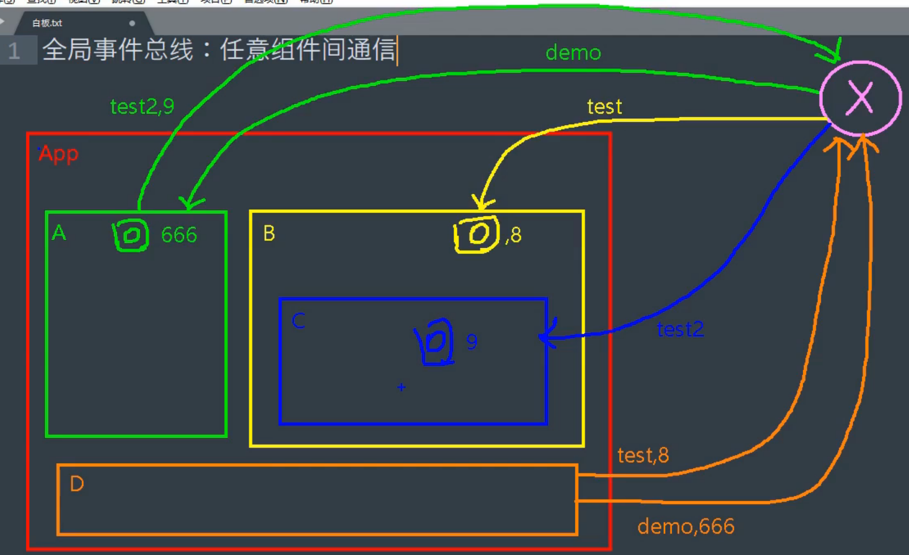
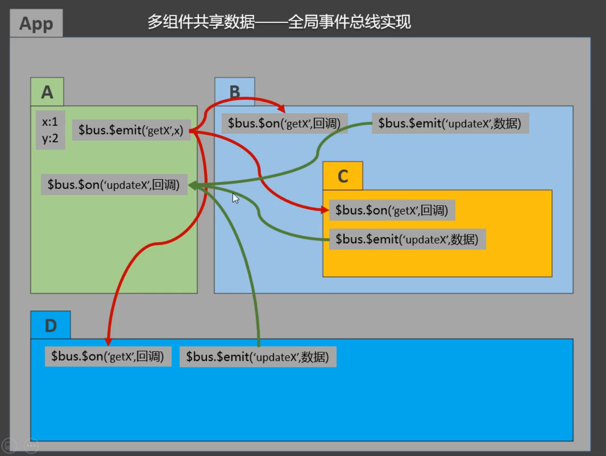
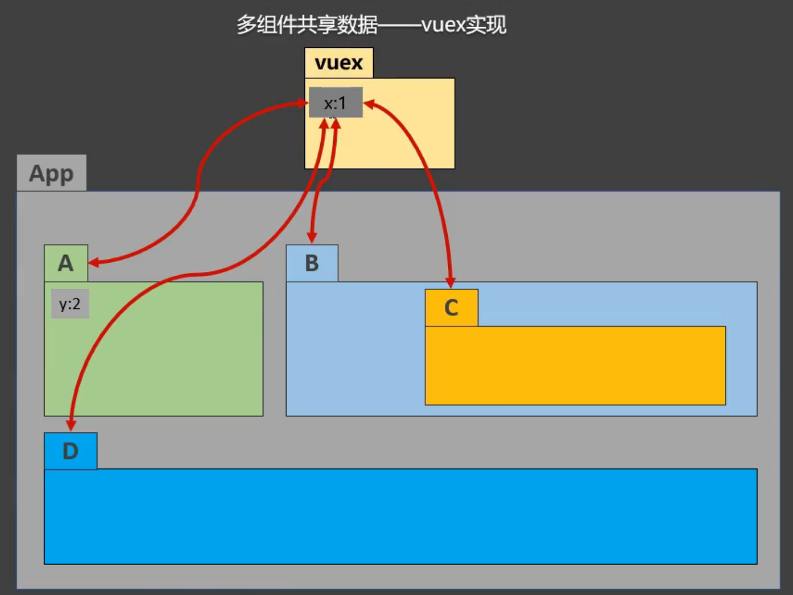
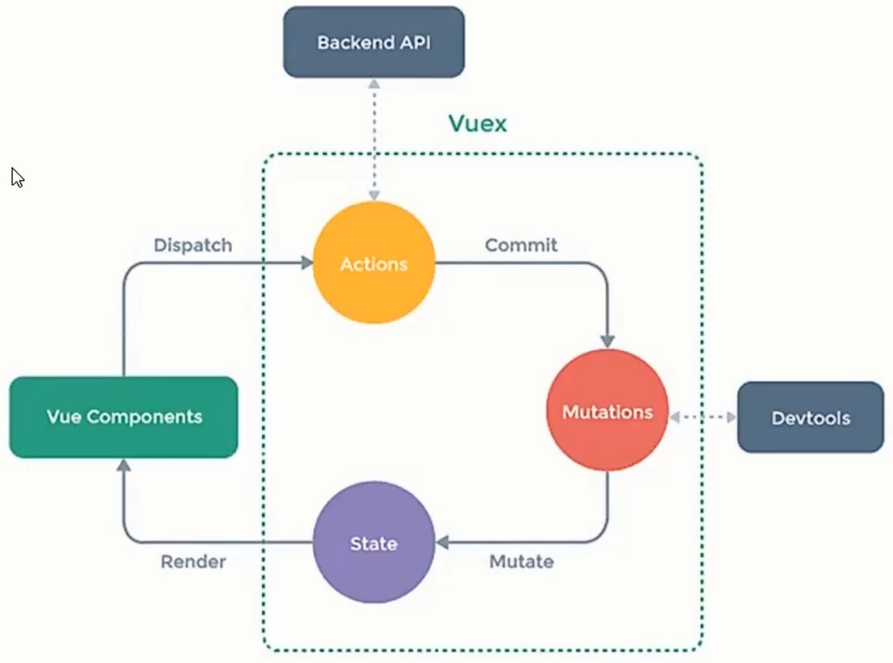
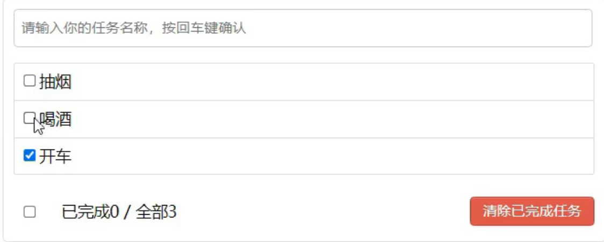

# ref属性 - 操作dom

`作用`：vue并不能满足我的需求时，我需要灵活操作dom，vue允许你添加标签属性然后操作dom，但是总感觉和vue风格不搭，因此提供了ref属性，即id标签属性的替代者。


## 获取dom元素

```vue
<template>
	<div>
		<h1 v-text="msg" ref="title"></h1>
    <!--获取dom元素之标签-->
		<button ref="btn" @click="showDOM">点我输出上方的DOM元素</button>
    <!--获取dom元素之组件，获取组件的元素就是vue实例-->
		<School ref="sch"/>
	</div>
</template>

<script>
	//引入School组件
	import School from './components/School'

	export default {
		name:'App',
		components:{School},
		data() {
			return {
				msg:'欢迎学习Vue！'
			}
		},
		methods: {
			showDOM(){
				console.log(this.$refs.title) //真实DOM元素
				console.log(this.$refs.btn) //真实DOM元素
				console.log(this.$refs.sch) //School组件的实例对象（vc）
			}
		},
	}
</script>
```


# props - 父子组件数据传递

## 基础使用

* 使用方

	```vue
	<template>
		<div>
	    <!--组件传递属性-->
			<Student name="李四" sex="女" :age="18"/>
		</div>
	</template>
	
	<script>
		import Student from './components/Student'
	
		export default {
			name:'App',
			components:{Student}
		}
	</script>
	```

* 提供方

	```vue
	<template>
		<div>
			<h1>{{msg}}</h1>
			<h2>学生姓名：{{name}}</h2>
			<h2>学生性别：{{sex}}</h2>
			<h2>学生年龄：{{age}}</h2>
		</div>
	</template>
	
	<script>
		export default {
			name:'Student',
			data() {
				console.log(this)
				return {
					msg:'我是一个尚硅谷的学生'
				}
			},
			methods: {
			},
			//第一种 ： 简单声明接收
			// props:['name','age','sex'] 
	
			//第二种 ： 接收的同时对数据进行类型限制
			/* props:{
				name:String,
				age:Number,
				sex:String
			} */
	
			//第三种 ： 接收的同时对数据：进行类型限制+默认值的指定+必要性的限制
			props:{
				name:{
					type:String, //name的类型是字符串
					required:true, //name是必要的
				},
				age:{
					type:Number,
					default:99 //默认值
				},
				sex:{
					type:String,
					required:true
				}
			}
		}
	</script>
	```


## 需要改动接收到的数据

> props 是只读的，vue底层会检测你对props的修改，如果进行了修改，就会发出警告，若确实需要修改，赋值一份props数据到data中，修改data中数据

```vue
<template>
	<div>
		<h1>{{msg}}</h1>
		<h2>学生姓名：{{name}}</h2>
		<h2>学生性别：{{sex}}</h2>
		<h2>学生年龄：{{myAge+1}}</h2>
		<button @click="updateAge">尝试修改收到的年龄</button>
	</div>
</template>

<script>
	export default {
		name:'Student',
		data() {
			console.log(this)
			return {
				msg:'我是一个尚硅谷的学生',
        //接收到的数据属性也存放在vue实例中，直接使用this赋值即可
				myAge:this.age
			}
		},
		methods: {
			updateAge(){
				this.myAge++
			}
		},
		//修改接收到的age属性
		props:['name','age','sex'] 
	}
</script>
```


# mixin 混入 - 复用配置

`作用:`如果两个组件中有方法一模一样，那么就可以考虑使用mixin抽取出一个公用的配置，两个组件中引入即可

`演示:`两个组件中方法一模一样

1. 公用配置抽取为js

	```js
	export const hunhe = {
		methods: {
			showName(){
				alert(this.name)
			}
		},
		mounted() {
			console.log('你好啊！')
		},
	}
	export const hunhe2 = {
		data() {
			return {
				x:100,
				y:200
			}
		},
	}
	```

2. 组件1中使用混入的属性和方法

	```vue
	<template>
		<div>
			<h2 @click="showName">学校名称：{{name}}</h2>
			<h2>学校地址：{{address}}</h2>
		</div>
	</template>
	
	<script>
		//引入一个混入
		import {hunhe,hunhe2} from '../mixin'
	
		export default {
			name:'School',
			data() {
				return {
					name:'尚硅谷',
					address:'北京',
					x:666
				}
			},
			mixins:[hunhe,hunhe2],
		}
	</script>
	```

3. 组件2中使用混入的属性和方法

	```vue
	<template>
		<div>
			<h2 @click="showName">学校名称：{{name}}</h2>
			<h2>学校地址：{{address}}</h2>
		</div>
	</template>
	
	<script>
		//引入一个hunhe
		import {hunhe,hunhe2} from '../mixin'
	
		export default {
			name:'School',
			data() {
				return {
					name:'尚硅谷',
					address:'北京',
					x:666
				}
			},
			mixins:[hunhe,hunhe2],
		}
	</script>
	```

	

# 插件

扩展vue功能。


1. 定义插件

	```js
	export default {
		install(Vue,x,y,z){
			console.log(x,y,z)
			//全局过滤器
			Vue.filter('mySlice',function(value){
				return value.slice(0,4)
			})
	
			//定义全局指令
			Vue.directive('fbind',{
				//指令与元素成功绑定时（一上来）
				bind(element,binding){
					element.value = binding.value
				},
				//指令所在元素被插入页面时
				inserted(element,binding){
					element.focus()
				},
				//指令所在的模板被重新解析时
				update(element,binding){
					element.value = binding.value
				}
			})
	
			//定义混入
			Vue.mixin({
				data() {
					return {
						x:100,
						y:200
					}
				},
			})
	
			//给Vue原型上添加一个方法（vm和vc就都能用了）
			Vue.prototype.hello = ()=>{alert('你好啊')}
		}
	}
	```

2. 入口函数中引入并绑定给vue

	```js
	//引入Vue
	import Vue from 'vue'
	//引入App
	import App from './App.vue'
	//引入插件
	import plugins from './plugins'
	//关闭Vue的生产提示
	Vue.config.productionTip = false
	
	//应用（使用）插件
	Vue.use(plugins,1,2,3)
	//创建vm
	new Vue({
		el:'#app',
		render: h => h(App)
	})
	```

3. 测试过滤器和方法

	```vue
	<template>
		<div>
			<h2>学校名称：{{name | mySlice}}</h2>
			<h2>学校地址：{{address}}</h2>
			<button @click="test">点我测试一个hello方法</button>
		</div>
	</template>
	
	<script>
		export default {
			name:'School',
			data() {
				return {
					name:'尚硅谷atguigu',
					address:'北京',
				}
			},
			methods: {
				test(){
					this.hello()
				}
			},
		}
	</script>
	```

	

# scope

`作用:`让样式局部生效，防止全局样式污染。

`用法`: <style scoped>


# 组件自定义事件(子传父)

HTML标签中有很多事件，例如 click、keyup、change等，那如果想要给vue组件中添加自定义事件，怎么弄呢？

`作用`: 实现子组件传递数据给父组件，**第一种实现方式props传递方法（见 TodoList案例），第二种就是自定义组件事件**


## 绑定/解绑自定义事件

```bash
.
|-- App.vue
|-- components
|   |-- School.vue
|   `-- Student.vue
`-- main.js
```

```vue
<template>
	<div class="app">
		<h1>{{msg}}，学生姓名是:{{studentName}}</h1>

		<!-- 通过父组件给子组件传递函数类型的props实现：子给父传递数据 -->
		<School :getSchoolName="getSchoolName"/>

		<!-- 通过父组件给子组件绑定一个自定义事件实现：子给父传递数据（第一种写法，使用@或v-on） -->
		<!-- <Student @atguigu="getStudentName" @demo="m1"/> -->

		<!-- 通过父组件给子组件绑定一个自定义事件实现：子给父传递数据（第二种写法，使用ref） -->
		<Student ref="student" @click.native="show"/>
	</div>
</template>

<script>
	import Student from './components/Student'
	import School from './components/School'

	export default {
		name:'App',
		components:{School,Student},
		data() {
			return {
				msg:'你好啊！',
				studentName:''
			}
		},
		methods: {
			getSchoolName(name){
				console.log('App收到了学校名：',name)
			},
			getStudentName(name,...params){
				console.log('App收到了学生名：',name,params)
				this.studentName = name
			},
			m1(){
				console.log('demo事件被触发了！')
			},
			show(){
				alert(123)
			}
		},
		mounted() {
			this.$refs.student.$on('atguigu',this.getStudentName) //绑定自定义事件
			// this.$refs.student.$once('atguigu',this.getStudentName) //绑定自定义事件（一次性）
		},
	}
</script>

<style scoped>
	.app{
		background-color: gray;
		padding: 5px;
	}
</style>
```

```vue
<template>
	<div class="student">
		<h2>学生姓名：{{name}}</h2>
		<h2>学生性别：{{sex}}</h2>
		<h2>当前求和为：{{number}}</h2>
		<button @click="add">点我number++</button>
		<button @click="sendStudentlName">把学生名给App</button>
		<button @click="unbind">解绑atguigu事件</button>
		<button @click="death">销毁当前Student组件的实例(vc)</button>
	</div>
</template>

<script>
	export default {
		name:'Student',
		data() {
			return {
				name:'张三',
				sex:'男',
				number:0
			}
		},
		methods: {
			add(){
				console.log('add回调被调用了')
				this.number++
			},
			sendStudentlName(){
				//触发Student组件实例身上的atguigu事件
				this.$emit('atguigu',this.name,666,888,900)
				// this.$emit('demo')
				// this.$emit('click')
			},
			unbind(){
				this.$off('atguigu') //解绑一个自定义事件
				// this.$off(['atguigu','demo']) //解绑多个自定义事件
				// this.$off() //解绑所有的自定义事件
			},
			death(){
				this.$destroy() //销毁了当前Student组件的实例，销毁后所有Student实例的自定义事件全都不奏效。
			}
		},
	}
</script>

<style lang="less" scoped>
	.student{
		background-color: pink;
		padding: 5px;
		margin-top: 30px;
	}
</style>
```

```vue
<template>
	<div class="school">
		<h2>学校名称：{{name}}</h2>
		<h2>学校地址：{{address}}</h2>
		<button @click="sendSchoolName">把学校名给App</button>
	</div>
</template>

<script>
	export default {
		name:'School',
		props:['getSchoolName'],
		data() {
			return {
				name:'尚硅谷',
				address:'北京',
			}
		},
		methods: {
			sendSchoolName(){
				this.getSchoolName(this.name)
			}
		},
	}
</script>

<style scoped>
	.school{
		background-color: skyblue;
		padding: 5px;
	}
</style>
```


# 全局事件总线 - 任意组件数据传递



* 组件A要收到组件D的数据
	1. A先在**全局 X** 上绑定一个**事件demo**，并且定义好**回调函数**
	2. D触发绑定在X上的**事件demo**，并传递**参数666**
	3. A定义的回调函数随着demo事件触发而触发，且获得D中数据

* 组件B要收到组件D的数据

	类似上面的


## 实现全局事件总线

### 1、定义全局傀儡X | $bus

`main.js`

```js
//引入Vue
import Vue from 'vue'
//引入App
import App from './App.vue'
//关闭Vue的生产提示
Vue.config.productionTip = false

//创建vm
new Vue({
	el:'#app',
	render: h => h(App),
	beforeCreate() {
		Vue.prototype.$bus = this //安装全局事件总线
	},
})
```

`School.vue 消息消费方`

```vue
<template>
	<div class="school">
		<h2>学校名称：{{name}}</h2>
		<h2>学校地址：{{address}}</h2>
	</div>
</template>

<script>
	export default {
		name:'School',
		data() {
			return {
				name:'尚硅谷',
				address:'北京',
			}
		},
		mounted() {
			// console.log('School',this)
      //绑定事件及回调函数
			this.$bus.$on('hello',(data)=>{
				console.log('我是School组件，收到了数据',data)
			})
		},
		beforeDestroy() {
			this.$bus.$off('hello')
		},
	}
</script>

<style scoped>
	.school{
		background-color: skyblue;
		padding: 5px;
	}
</style>
```

`Student.vue 消息提供方`

```vue
<template>
	<div class="student">
		<h2>学生姓名：{{name}}</h2>
		<h2>学生性别：{{sex}}</h2>
		<button @click="sendStudentName">把学生名给School组件</button>
	</div>
</template>

<script>
	export default {
		name:'Student',
		data() {
			return {
				name:'张三',
				sex:'男',
			}
		},
		mounted() {
			// console.log('Student',this.x)
		},
		methods: {
      //触发消费方绑定的事件并传递数据
			sendStudentName(){
				this.$bus.$emit('hello',this.name)
			}
		},
	}
</script>

<style lang="less" scoped>
	.student{
		background-color: pink;
		padding: 5px;
		margin-top: 30px;
	}
</style>
```


# 消息订阅与发布 - 任意组件数据传递

## 安装消息订阅发布插件

js本身对消息订阅发布不太友好，需要第三方库 pubsub-js 或其他库

```bash
npm install pubsub-js
```


## 使用步骤

### 1、订阅消息

```vue
<template>
	<div class="school">
		<h2>学校名称：{{name}}</h2>
		<h2>学校地址：{{address}}</h2>
	</div>
</template>

<script>
	import pubsub from 'pubsub-js'
	export default {
		name:'School',
		data() {
			return {
				name:'尚硅谷',
				address:'北京',
			}
		},
		mounted() {
      //订阅消息，循环监听
			// console.log('School',this)
			/* this.$bus.$on('hello',(data)=>{
				console.log('我是School组件，收到了数据',data)
			}) */
			this.pubId = pubsub.subscribe('hello',(msgName,data)=>{
				console.log(this)
				// console.log('有人发布了hello消息，hello消息的回调执行了',msgName,data)
			})
		},
    //组件实例销毁时，销毁事件监听
		beforeDestroy() {
			// this.$bus.$off('hello')
			pubsub.unsubscribe(this.pubId)
		},
	}
</script>

<style scoped>
	.school{
		background-color: skyblue;
		padding: 5px;
	}
</style>
```

### 2、发布消息

```vue
<template>
	<div class="student">
		<h2>学生姓名：{{name}}</h2>
		<h2>学生性别：{{sex}}</h2>
		<button @click="sendStudentName">把学生名给School组件</button>
	</div>
</template>

<script>
	import pubsub from 'pubsub-js'
	export default {
		name:'Student',
		data() {
			return {
				name:'张三',
				sex:'男',
			}
		},
		mounted() {
			// console.log('Student',this.x)
		},
		methods: {
			sendStudentName(){
				// this.$bus.$emit('hello',this.name)
				pubsub.publish('hello',666)
			}
		},
	}
</script>

<style lang="less" scoped>
	.student{
		background-color: pink;
		padding: 5px;
		margin-top: 30px;
	}
</style>
```


# vue - 过度动画

我们看到vue中使用v-if或者v-show都没有动画效果，直来直去。如果添加好看的动画效果呢？


## 自己实现

忽略


## 第三方动画库

> 官网 ：[Animate.css | A cross-browser library of CSS animations.](https://animate.style/)

1. 安装

	```bash
	npm install animate.css
	```

2. 使用

	```vue
	<template>
		<div>
			<button @click="isShow = !isShow">显示/隐藏</button>
			<transition-group 
				appear
				name="animate__animated animate__bounce" 
				enter-active-class="animate__swing"//进入动画
				leave-active-class="animate__backOutUp"//离开动画
			>
				<h1 v-show="!isShow" key="1">你好啊！</h1>
				<h1 v-show="isShow" key="2">尚硅谷！</h1>
			</transition-group>
		</div>
	</template>
	
	<script>
		import 'animate.css'
		export default {
			name:'Test',
			data() {
				return {
					isShow:true
				}
			},
		}
	</script>
	
	<style scoped>
		h1{
			background-color: orange;
		}
	</style>
	```

	

# vue代理

略


# axios

见 [第十六节-网络封装](/Volumes/Mac/warehouse/MD-Book/Vue/第十六节-网络封装.md)

# 插槽

`作用:` 组件公用时且需求发生变更时，难免出现v-if这种逻辑。如何解决？组件中不填充具体内容，由组件使用方提供。


## 默认插槽 - 只有一个插槽

```vue
<template>
	<div class="category">
		<h3>{{title}}分类</h3>
		<!-- 定义一个插槽（挖个坑，等着组件的使用者进行填充） -->
		<slot>我是一些默认值，当使用者没有传递具体结构时，我会出现</slot>
	</div>
</template>

<script>
	export default {
		name:'Category',
		props:['title']
	}
</script>

<style scoped>
	.category{
		background-color: skyblue;
		width: 200px;
		height: 300px;
	}
	h3{
		text-align: center;
		background-color: orange;
	}
	video{
		width: 100%;
	}
	img{
		width: 100%;
	}
</style>
```

```vue
<template>
	<div class="container">
		<Category title="美食" >
			
		</Category>

		<Category title="游戏" >
			<ul>
				<li v-for="(g,index) in games" :key="index">{{g}}</li>
			</ul>
		</Category>

		<Category title="电影">
			<video controls src="http://clips.vorwaerts-gmbh.de/big_buck_bunny.mp4"></video>
		</Category>
	</div>
</template>

<script>
	import Category from './components/Category'
	export default {
		name:'App',
		components:{Category},
		data() {
			return {
				foods:['火锅','烧烤','小龙虾','牛排'],
				games:['红色警戒','穿越火线','劲舞团','超级玛丽'],
				films:['《教父》','《拆弹专家》','《你好，李焕英》','《尚硅谷》']
			}
		},
	}
</script>

<style scoped>
	.container{
		display: flex;
		justify-content: space-around;
	}
</style>
```


## 具名插槽 - 多个插槽

```vue
<template>
	<div class="category">
		<h3>{{title}}分类</h3>
		<!-- 定义一个插槽（挖个坑，等着组件的使用者进行填充） -->
		<slot name="center">我是一些默认值，当使用者没有传递具体结构时，我会出现1</slot>
		<slot name="footer">我是一些默认值，当使用者没有传递具体结构时，我会出现2</slot>
	</div>
</template>

<script>
	export default {
		name:'Category',
		props:['title']
	}
</script>

<style scoped>
	.category{
		background-color: skyblue;
		width: 200px;
		height: 300px;
	}
	h3{
		text-align: center;
		background-color: orange;
	}
	video{
		width: 100%;
	}
	img{
		width: 100%;
	}
</style>
```

```vue
<template>
	<div class="container">
		<Category title="美食" >
			
			<a slot="footer" href="http://www.atguigu.com">更多美食</a>
		</Category>

		<Category title="游戏" >
			<ul slot="center">
				<li v-for="(g,index) in games" :key="index">{{g}}</li>
			</ul>
			<div class="foot" slot="footer">
				<a href="http://www.atguigu.com">单机游戏</a>
				<a href="http://www.atguigu.com">网络游戏</a>
			</div>
		</Category>

		<Category title="电影">
			<video slot="center" controls src="http://clips.vorwaerts-gmbh.de/big_buck_bunny.mp4"></video>
			<template v-slot:footer>
				<div class="foot">
					<a href="http://www.atguigu.com">经典</a>
					<a href="http://www.atguigu.com">热门</a>
					<a href="http://www.atguigu.com">推荐</a>
				</div>
				<h4>欢迎前来观影</h4>
			</template>
		</Category>
	</div>
</template>

<script>
	import Category from './components/Category'
	export default {
		name:'App',
		components:{Category},
		data() {
			return {
				foods:['火锅','烧烤','小龙虾','牛排'],
				games:['红色警戒','穿越火线','劲舞团','超级玛丽'],
				films:['《教父》','《拆弹专家》','《你好，李焕英》','《尚硅谷》']
			}
		},
	}
</script>

<style scoped>
	.container,.foot{
		display: flex;
		justify-content: space-around;
	}
	h4{
		text-align: center;
	}
</style>
```


## 作用域插槽

定义插槽组件传递数据给使用方,不用破坏组件提供方结构

```vue
<template>
	<div class="category">
		<h3>{{title}}分类</h3>
		<slot :games="games" msg="hello">我是默认的一些内容</slot>
	</div>
</template>

<script>
	export default {
		name:'Category',
		props:['title'],
		data() {
			return {
				games:['红色警戒','穿越火线','劲舞团','超级玛丽'],
			}
		},
	}
</script>

<style scoped>
	.category{
		background-color: skyblue;
		width: 200px;
		height: 300px;
	}
	h3{
		text-align: center;
		background-color: orange;
	}
	video{
		width: 100%;
	}
	img{
		width: 100%;
	}
</style>
```

```vue
<template>
	<div class="container">

		<Category title="游戏">
			<template scope="atguigu">
				<ul>
					<li v-for="(g,index) in atguigu.games" :key="index">{{g}}</li>
				</ul>
			</template>
		</Category>

		<Category title="游戏">
			<template scope="{games}">
				<ol>
					<li style="color:red" v-for="(g,index) in games" :key="index">{{g}}</li>
				</ol>
			</template>
		</Category>

		<Category title="游戏">
			<template slot-scope="{games}">
				<h4 v-for="(g,index) in games" :key="index">{{g}}</h4>
			</template>
		</Category>

	</div>
</template>

<script>
	import Category from './components/Category'
	export default {
		name:'App',
		components:{Category},
	}
</script>

<style scoped>
	.container,.foot{
		display: flex;
		justify-content: space-around;
	}
	h4{
		text-align: center;
	}
</style>

```


# vuex

`作用`: 任意组件中数据共享我们之前讲过**全局事件总线**，但是如果某一个数据有n多个组件**读和写**，那么最好将这个数据使用**vuex管理**，**vuex**作用类似于 全局事件总线。




## vuex流程图




1. 交由vuex管理的数据以键值对存放在 State 中，其本身也是个对象
2. 组件进行操作时，会调用 Actions，其也是个对象，存放操作函数以及操作内容。
3. 操作后 数据变更工作交给 mutations ，其会对State进行数据变更
4. State、Action、Mutations都依赖与store平台


## 使用流程

1. 安装vuex3

	```bash
	 npm install vuex@3  #这里vue版本为2.如果不指定版本会默认安装vue3对应版本为4的vuex
	```

2. 引入vuex

	```js
	# main.js
	import Vuex from 'vuex'
	
	Vue.use(Vuex)
	```

3. 搭建store平台

	1. src目录下新建store/index.js并写入如下内容

		```js
		//该文件用于创建Vuex中最为核心的store
		import Vue from 'vue'
		//引入Vuex
		import Vuex from 'vuex'
		//应用Vuex插件
		Vue.use(Vuex)
		
		//准备actions——用于响应组件中的动作
		const actions = {
			jia(context,value){
				console.log('actions中的jia被调用了')
				context.commit('JIA',value)
			},
			jian(context,value){
				console.log('actions中的jian被调用了')
				context.commit('JIAN',value)
			}, 
			jiaOdd(context,value){
				console.log('actions中的jiaOdd被调用了')
				if(context.state.sum % 2){
					context.commit('JIA',value)
				}
			},
			jiaWait(context,value){
				console.log('actions中的jiaWait被调用了')
				setTimeout(()=>{
					context.commit('JIA',value)
				},500)
			}
		}
		//准备mutations——用于操作数据（state）
		const mutations = {
			JIA(state,value){
				console.log('mutations中的JIA被调用了')
				state.sum += value
			},
			JIAN(state,value){
				console.log('mutations中的JIAN被调用了')
				state.sum -= value
			}
		}
		//准备state——用于存储数据
		const state = {
			sum:0 //当前的和
		}
		//准备getters——用于将state中的数据进行加工,类似于公共的计算属性
		const getters = {
			bigSum(state){
				return state.sum*10
			}
		}
		
		//创建并暴露store
		export default new Vuex.Store({
			actions,
			mutations,
			state,
			getters
		})
		```

4. 组件中使用vuex

	```vue
	<template>
		<div>
			<h1>当前求和为：{{$store.state.sum}}</h1>
			<h3>当前求和放大10倍为：{{$store.getters.bigSum}}</h3>
			<select v-model.number="n">
				<option value="1">1</option>
				<option value="2">2</option>
				<option value="3">3</option>
			</select>
			<button @click="increment">+</button>
			<button @click="decrement">-</button>
			<button @click="incrementOdd">当前求和为奇数再加</button>
			<button @click="incrementWait">等一等再加</button>
		</div>
	</template>
	
	<script>
		export default {
			name:'Count',
			data() {
				return {
					n:1, //用户选择的数字
				}
			},
			methods: {
				increment(){
					this.$store.commit('JIA',this.n)
				},
				decrement(){
					this.$store.commit('JIAN',this.n)
				},
				incrementOdd(){
					this.$store.dispatch('jiaOdd',this.n)
				},
				incrementWait(){
					this.$store.dispatch('jiaWait',this.n)
				},
			},
			mounted() {
				console.log('Count',this.$store)
			},
		}
	</script>
	
	<style lang="css">
		button{
			margin-left: 5px;
		}
	</style>
	```

	```vue
	<template>
		<div>
			<Count/>
		</div>
	</template>
	
	<script>
		import Count from './components/Count'
		export default {
			name:'App',
			components:{Count},
			mounted() {
				// console.log('App',this)
			},
		}
	</script>
	```

5. Main中引入vuex

	```js
	//引入Vue
	import Vue from 'vue'
	//引入App
	import App from './App.vue'
	//引入插件
	import vueResource from 'vue-resource'
	//引入store
	import store from './store'
	
	//关闭Vue的生产提示
	Vue.config.productionTip = false
	//使用插件
	Vue.use(vueResource)
	
	//创建vm
	new Vue({
		el:'#app',
		render: h => h(App),
		store,
		beforeCreate() {
			Vue.prototype.$bus = this
		}
	})
	```

	

## mapState|mapGetters

我们从state中获取数据，很多的时候都需要再次加工，即使用计算属性。但是如果多次这样获取就会造成重复的代码写了很多遍，如下

```vue
<template>
	<div>
		<h1>当前求和为：{{sum}}</h1>
		<h3>当前求和放大10倍为：{{bigSum}}</h3>
		<h3>我在{{school}}，学习{{subject}}</h3>
		<select v-model.number="n">
			<option value="1">1</option>
			<option value="2">2</option>
			<option value="3">3</option>
		</select>
		<button @click="increment">+</button>
		<button @click="decrement">-</button>
		<button @click="incrementOdd">当前求和为奇数再加</button>
		<button @click="incrementWait">等一等再加</button>
	</div>
</template>

<script>
	import {mapState,mapGetters} from 'vuex'
	export default {
		name:'Count',
		data() {
			return {
				n:1, //用户选择的数字
			}
		},
		computed:{
			//靠程序员自己亲自去写计算属性
			sum(){
				return this.$store.state.sum
			},
			school(){
				return this.$store.state.school
			},
			subject(){
				return this.$store.state.subject
			},
		},
		methods: {
			increment(){
				this.$store.commit('JIA',this.n)
			},
			decrement(){
				this.$store.commit('JIAN',this.n)
			},
			incrementOdd(){
				this.$store.dispatch('jiaOdd',this.n)
			},
			incrementWait(){
				this.$store.dispatch('jiaWait',this.n)
			},
		},
	}
</script>

<style lang="css">
	button{
		margin-left: 5px;
	}
</style>
```

> 如上三个计算属性中都用到了 “return this.$store.state”，vue提供了封装方法，生成如上代码。

```vue
<template>
	<div>
		<h1>当前求和为：{{sum}}</h1>
		<h3>当前求和放大10倍为：{{bigSum}}</h3>
		<h3>我在{{school}}，学习{{subject}}</h3>
		<select v-model.number="n">
			<option value="1">1</option>
			<option value="2">2</option>
			<option value="3">3</option>
		</select>
		<button @click="increment">+</button>
		<button @click="decrement">-</button>
		<button @click="incrementOdd">当前求和为奇数再加</button>
		<button @click="incrementWait">等一等再加</button>
	</div>
</template>

<script>
	import {mapState,mapGetters} from 'vuex'
	export default {
		name:'Count',
		data() {
			return {
				n:1, //用户选择的数字
			}
		},
		computed:{
			//靠程序员自己亲自去写计算属性
			/* sum(){
				return this.$store.state.sum
			},
			school(){
				return this.$store.state.school
			},
			subject(){
				return this.$store.state.subject
			}, */

			//借助mapState生成计算属性，从state中读取数据。（对象写法）
			// ...mapState({he:'sum',xuexiao:'school',xueke:'subject'}),

			//借助mapState生成计算属性，从state中读取数据。（数组写法）
			...mapState(['sum','school','subject']),

			/* ******************************************************************** */

			/* bigSum(){
				return this.$store.getters.bigSum
			}, */

			//借助mapGetters生成计算属性，从getters中读取数据。（对象写法）
			// ...mapGetters({bigSum:'bigSum'})
			
			//借助mapGetters生成计算属性，从getters中读取数据。（数组写法）
			...mapGetters(['bigSum'])

		},
		methods: {
			increment(){
				this.$store.commit('JIA',this.n)
			},
			decrement(){
				this.$store.commit('JIAN',this.n)
			},
			incrementOdd(){
				this.$store.dispatch('jiaOdd',this.n)
			},
			incrementWait(){
				this.$store.dispatch('jiaWait',this.n)
			},
		},
		mounted() {
			const x = mapState({he:'sum',xuexiao:'school',xueke:'subject'})
			console.log(x)
		},
	}
</script>

<style lang="css">
	button{
		margin-left: 5px;
	}
</style>
```


## mapActions|mapMutations

```vue
<template>
	<div>
		<h1>当前求和为：{{sum}}</h1>
		<h3>当前求和放大10倍为：{{bigSum}}</h3>
		<h3>我在{{school}}，学习{{subject}}</h3>
		<select v-model.number="n">
			<option value="1">1</option>
			<option value="2">2</option>
			<option value="3">3</option>
		</select>
		<button @click="increment(n)">+</button>
		<button @click="decrement(n)">-</button>
		<button @click="incrementOdd(n)">当前求和为奇数再加</button>
		<button @click="incrementWait(n)">等一等再加</button>
	</div>
</template>

<script>
	import {mapState,mapGetters,mapMutations,mapActions} from 'vuex'
	export default {
		name:'Count',
		data() {
			return {
				n:1, //用户选择的数字
			}
		},
		computed:{
			//借助mapState生成计算属性，从state中读取数据。（对象写法）
			// ...mapState({he:'sum',xuexiao:'school',xueke:'subject'}),

			//借助mapState生成计算属性，从state中读取数据。（数组写法）
			...mapState(['sum','school','subject']),

			/* ******************************************************************** */

			//借助mapGetters生成计算属性，从getters中读取数据。（对象写法）
			// ...mapGetters({bigSum:'bigSum'})
			
			//借助mapGetters生成计算属性，从getters中读取数据。（数组写法）
			...mapGetters(['bigSum'])

		},
		methods: {
			//程序员亲自写方法
			/* increment(){
				this.$store.commit('JIA',this.n)
			},
			decrement(){
				this.$store.commit('JIAN',this.n)
			}, */

			//借助mapMutations生成对应的方法，方法中会调用commit去联系mutations(对象写法)
			...mapMutations({increment:'JIA',decrement:'JIAN'}),

			//借助mapMutations生成对应的方法，方法中会调用commit去联系mutations(数组写法)
			// ...mapMutations(['JIA','JIAN']),

			/* ************************************************* */

			//程序员亲自写方法
			/* incrementOdd(){
				this.$store.dispatch('jiaOdd',this.n)
			},
			incrementWait(){
				this.$store.dispatch('jiaWait',this.n)
			}, */

			//借助mapActions生成对应的方法，方法中会调用dispatch去联系actions(对象写法)
			...mapActions({incrementOdd:'jiaOdd',incrementWait:'jiaWait'})

			//借助mapActions生成对应的方法，方法中会调用dispatch去联系actions(数组写法)
			// ...mapActions(['jiaOdd','jiaWait'])
		},
		mounted() {
			const x = mapState({he:'sum',xuexiao:'school',xueke:'subject'})
			console.log(x)
		},
	}
</script>

<style lang="css">
	button{
		margin-left: 5px;
	}
</style>
```


# 路由

* 单页面富应用，点击不同的功能跳转到不同的组件且更改浏览器请求地址。

* 路由跳转本质还是利用的浏览器的前进后退以及go。实现原理为使用一个栈存储历史URL，前进就是压栈，后退就是出栈

## 基础使用

1. 安装

	```shell
	npm install vue-router@3  #vue2适配vue-router3版本
	```

2. src下创建router/index.js并写入如下内容

	```js
	// 该文件专门用于创建整个应用的路由器
	import VueRouter from 'vue-router'
	//引入组件
	import About from '../components/About'
	import Home from '../components/Home'
	
	//创建并暴露一个路由器
	export default new VueRouter({
		routes:[
			{
				path:'/about',
				component:About
			},
			{
				path:'/home',
				component:Home
			}
		]
	})
	```

3. main中引入router

	```js
	//引入Vue
	import Vue from 'vue'
	//引入App
	import App from './App.vue'
	//引入VueRouter
	import VueRouter from 'vue-router'
	//引入路由器
	import router from './router'
	
	//关闭Vue的生产提示
	Vue.config.productionTip = false
	//应用插件
	Vue.use(VueRouter)
	
	//创建vm
	new Vue({
		el:'#app',
		render: h => h(App),
		router:router
	})
	```

4. 使用

	```vue
	<template>
	  <div>
	    <div class="row">
	      <div class="col-xs-offset-2 col-xs-8">
	        <div class="page-header"><h2>Vue Router Demo</h2></div>
	      </div>
	    </div>
	    <div class="row">
	      <div class="col-xs-2 col-xs-offset-2">
	        <div class="list-group">
						<!-- 原始html中我们使用a标签实现页面的跳转 -->
	          <!-- <a class="list-group-item active" href="./about.html">About</a> -->
	          <!-- <a class="list-group-item" href="./home.html">Home</a> -->
	
						<!-- Vue中借助router-link标签实现路由的切换 -->
						<router-link class="list-group-item" active-class="active" to="/about">About</router-link>
	          <router-link class="list-group-item" active-class="active" to="/home">Home</router-link>
	        </div>
	      </div>
	      <div class="col-xs-6">
	        <div class="panel">
	          <div class="panel-body">
							<!-- 指定组件的呈现位置 -->
	            <router-view></router-view>
	          </div>
	        </div>
	      </div>
	    </div>
	  </div>
	</template>
	
	<script>
		export default {
			name:'App',
		}
	</script>
	```

	```vue
	<template>
		<h2>我是Home的内容</h2>
	</template>
	
	<script>
		export default {
			name:'Home'
		}
	</script>
	```

	```vue
	<template>
		<h2>我是About的内容</h2>
	</template>
	
	<script>
		export default {
			name:'About'
		}
	</script>
	```

	

## 多级路由

```bash
.
|-- App.vue
|-- components
|   `-- Banner.vue
|-- main.js
|-- pages
|   |-- About.vue
|   |-- Home.vue
|   |-- Message.vue
|   `-- News.vue
`-- router
    `-- index.js
```

> 一般如果需要用到路由跳转的组件放到 **pages目录**下，单独使用的继续放到**components**中


1. 路由index.js中添加子级路由规则

	```js
	// 该文件专门用于创建整个应用的路由器
	import VueRouter from 'vue-router'
	//引入组件
	import About from '../pages/About'
	import Home from '../pages/Home'
	import News from '../pages/News'
	import Message from '../pages/Message'
	
	//创建并暴露一个路由器
	export default new VueRouter({
		routes:[
			{
				path:'/about',
				component:About
			},
			{
				path:'/home',
				component:Home,
				children:[
					{
						path:'news',
						component:News,
					},
					{
						path:'message',
						component:Message,
					}
				]
			}
		]
	})
	```

2. 使用

	```vue
	<template>
		<div>
			<h2>Home组件内容</h2>
			<div>
				<ul class="nav nav-tabs">
					<li>
						<router-link class="list-group-item" active-class="active" to="/home/news">News</router-link>
					</li>
					<li>
						<router-link class="list-group-item" active-class="active" to="/home/message">Message</router-link>
					</li>
				</ul>
				<router-view></router-view>
			</div>
		</div>
	</template>
	
	<script>
		export default {
			name:'Home',
			/* beforeDestroy() {
				console.log('Home组件即将被销毁了')
			}, */
			/* mounted() {
				console.log('Home组件挂载完毕了',this)
				window.homeRoute = this.$route
				window.homeRouter = this.$router
			},  */
		}
	</script>
	```

	

## 路由组件query传参

路由组件跳转的时候如何携带参数呢？query参数，param参数。

```vue
<template>
	<div>
		<ul>
			<li v-for="m in messageList" :key="m.id">
				<!-- 跳转路由并携带query参数，to的字符串写法 -->
				<!-- <router-link :to="`/home/message/detail?id=${m.id}&title=${m.title}`">{{m.title}}</router-link>&nbsp;&nbsp; -->

				<!-- 跳转路由并携带query参数，to的对象写法 -->
				<router-link :to="{
					path:'/home/message/detail',
					query:{
						id:m.id,
						title:m.title
					}
				}">
					{{m.title}}
				</router-link>
			
			</li>
		</ul>
		<hr>
		<router-view></router-view>
	</div>
</template>

<script>
	export default {
		name:'Message',
		data() {
			return {
				messageList:[
					{id:'001',title:'消息001'},
					{id:'002',title:'消息002'},
					{id:'003',title:'消息003'}
				]
			}
		},
	}
</script>
```

```vue
<template>
	<ul>
		<li>消息编号：{{$route.query.id}}</li>
		<li>消息标题：{{$route.query.title}}</li>
	</ul>
</template>

<script>
	export default {
		name:'Detail',
		mounted() {
			console.log(this.$route)
		},
	}
</script>
```

## 路由组件param传参

1. 路由组件命名

	```js
	// 该文件专门用于创建整个应用的路由器
	import VueRouter from 'vue-router'
	//引入组件
	import About from '../pages/About'
	import Home from '../pages/Home'
	import News from '../pages/News'
	import Message from '../pages/Message'
	import Detail from '../pages/Detail'
	
	//创建并暴露一个路由器
	export default new VueRouter({
		routes:[
			{
				name:'guanyu',
				path:'/about',
				component:About
			},
			{
				path:'/home',
				component:Home,
				children:[
					{
						path:'news',
						component:News,
					},
					{
						path:'message',
						component:Message,
						children:[
							{
	              //命名，类似于ID
								name:'xiangqing',
								path:'detail/:id/:title',
								component:Detail,
							}
						]
					}
				]
			}
		]
	})
	```

2. 使用方

	```vue
	<template>
		<div>
			<ul>
				<li v-for="m in messageList" :key="m.id">
					<!-- 跳转路由并携带params参数，to的字符串写法 -->
					<!-- <router-link :to="`/home/message/detail/${m.id}/${m.title}`">{{m.title}}</router-link>&nbsp;&nbsp; -->
	
					<!-- 跳转路由并携带params参数，to的对象写法 -->
					<router-link :to="{
						name:'xiangqing',
						params:{
							id:m.id,
							title:m.title
						}
					}">
						{{m.title}}
					</router-link>
				
				</li>
			</ul>
			<hr>
			<router-view></router-view>
		</div>
	</template>
	
	<script>
		export default {
			name:'Message',
			data() {
				return {
					messageList:[
						{id:'001',title:'消息001'},
						{id:'002',title:'消息002'},
						{id:'003',title:'消息003'}
					]
				}
			},
		}
	</script>
	```

3. 提供方

	```vue
	<template>
		<ul>
			<li>消息编号：{{$route.params.id}}</li>
			<li>消息标题：{{$route.params.title}}</li>
		</ul>
	</template>
	
	<script>
		export default {
			name:'Detail',
			mounted() {
				// console.log(this.$route)
			},
		}
	</script>
	```

	


## 路由中 props - 优化路由传参

`作用：`路由中组件数据传递 不外乎 query 和 params传参，使用时都需要 “$route.params.xxx”，看起来不太没关，有没有类似于 `mapState`和`mapGetters`工具方法。有 ，就是 路由中的 props 。


```js
// 该文件专门用于创建整个应用的路由器
import VueRouter from 'vue-router'
//引入组件
import About from '../pages/About'
import Home from '../pages/Home'
import News from '../pages/News'
import Message from '../pages/Message'
import Detail from '../pages/Detail'

//创建并暴露一个路由器
export default new VueRouter({
	routes:[
		{
			name:'guanyu',
			path:'/about',
			component:About
		},
		{
			path:'/home',
			component:Home,
			children:[
				{
					path:'news',
					component:News,
				},
				{
					path:'message',
					component:Message,
					children:[
						{
							name:'xiangqing',
							path:'detail',
							component:Detail,

							//props的第一种写法，值为对象，该对象中的所有key-value都会以props的形式传给Detail组件。
							// props:{a:1,b:'hello'}

							//props的第二种写法，值为布尔值，若布尔值为真，就会把该路由组件收到的所有params参数，以props的形式传给Detail组件。
							// props:true

							//props的第三种写法，值为函数
							props($route){
								return {
									id:$route.query.id,
									title:$route.query.title,
									a:1,
									b:'hello'
								}
							}

						}
					]
				}
			]
		}
	]
})
```


```vue
<template>
	<div>
		<ul>
			<li v-for="m in messageList" :key="m.id">
				<!-- 跳转路由并携带params参数，to的字符串写法 -->
				<!-- <router-link :to="`/home/message/detail/${m.id}/${m.title}`">{{m.title}}</router-link>&nbsp;&nbsp; -->

				<!-- 跳转路由并携带params参数，to的对象写法 -->
				<router-link :to="{
					name:'xiangqing',
					query:{
						id:m.id,
						title:m.title
					}
				}">
					{{m.title}}
				</router-link>
			
			</li>
		</ul>
		<hr>
		<router-view></router-view>
	</div>
</template>

<script>
	export default {
		name:'Message',
		data() {
			return {
				messageList:[
					{id:'001',title:'消息001'},
					{id:'002',title:'消息002'},
					{id:'003',title:'消息003'}
				]
			}
		},
	}
</script>
```


```vue
<template>
	<ul>
		<li>消息编号：{{id}}</li>
		<li>消息标题：{{title}}</li>
	</ul>
</template>

<script>
	export default {
		name:'Detail',
		props:['id','title'],
		computed: {
			// id(){
			// 	return this.$route.query.id
			// },
			// title(){
			// 	return this.$route.query.title
			// },
		},
		mounted() {
			// console.log(this.$route)
		},
	}
</script>
```


## 编程式路由导航 - 复杂路由跳转

`作用：`以上学的路由跳转都是基于<router-link>，如果有需求：需要3s后进行跳转或者button跳转。就需要用到编程式路由导航。即不借助<router-link>实现路由跳转，让路由跳转更加灵活


1. 跳转到指定路由

	```vue
	<template>
		<div>
			<ul>
				<li v-for="m in messageList" :key="m.id">
					<!-- 跳转路由并携带params参数，to的字符串写法 -->
					<!-- <router-link :to="`/home/message/detail/${m.id}/${m.title}`">{{m.title}}</router-link>&nbsp;&nbsp; -->
	
					<!-- 跳转路由并携带params参数，to的对象写法 -->
					<router-link :to="{
						name:'xiangqing',
						query:{
							id:m.id,
							title:m.title
						}
					}">
						{{m.title}}
					</router-link>
					<button @click="pushShow(m)">push查看</button>
					<button @click="replaceShow(m)">replace查看</button>
				</li>
			</ul>
			<hr>
			<router-view></router-view>
		</div>
	</template>
	
	<script>
		export default {
			name:'Message',
			data() {
				return {
					messageList:[
						{id:'001',title:'消息001'},
						{id:'002',title:'消息002'},
						{id:'003',title:'消息003'}
					]
				}
			},
			methods: {
				pushShow(m){
					this.$router.push({
						name:'xiangqing',
						query:{
							id:m.id,
							title:m.title
						}
					})
				},
				replaceShow(m){
					this.$router.replace({
						name:'xiangqing',
						query:{
							id:m.id,
							title:m.title
						}
					})
				}
			},
		}
	</script>
	```

	```vue
	<template>
		<ul>
			<li>消息编号：{{id}}</li>
			<li>消息标题：{{title}}</li>
		</ul>
	</template>
	
	<script>
		export default {
			name:'Detail',
			props:['id','title'],
			computed: {
				// id(){
				// 	return this.$route.query.id
				// },
				// title(){
				// 	return this.$route.query.title
				// },
			},
			mounted() {
				// console.log(this.$route)
			},
		}
	</script>
	```

2. 前进后退

	```vue
	<template>
		<div class="col-xs-offset-2 col-xs-8">
			<div class="page-header">
				<h2>Vue Router Demo</h2>
				<button @click="back">后退</button>
				<button @click="forward">前进</button>
				<button @click="test">测试一下go</button>
			</div>
		</div>
	</template>
	
	<script>
		export default {
			name:'Banner',
			methods: {
				back(){
					this.$router.back()
					// console.log(this.$router)
				},
				forward(){
					this.$router.forward()
				},
				test(){
					this.$router.go(3)
				}
			},
		}
	</script>
	```

	

```js
// 该文件专门用于创建整个应用的路由器
import VueRouter from 'vue-router'
//引入组件
import About from '../pages/About'
import Home from '../pages/Home'
import News from '../pages/News'
import Message from '../pages/Message'
import Detail from '../pages/Detail'

//创建并暴露一个路由器
export default new VueRouter({
	routes:[
		{
			name:'guanyu',
			path:'/about',
			component:About
		},
		{
			path:'/home',
			component:Home,
			children:[
				{
					path:'news',
					component:News,
				},
				{
					path:'message',
					component:Message,
					children:[
						{
							name:'xiangqing',
							path:'detail',
							component:Detail,

							//props的第一种写法，值为对象，该对象中的所有key-value都会以props的形式传给Detail组件。
							// props:{a:1,b:'hello'}

							//props的第二种写法，值为布尔值，若布尔值为真，就会把该路由组件收到的所有params参数，以props的形式传给Detail组件。
							// props:true

							//props的第三种写法，值为函数
							props($route){
								return {
									id:$route.query.id,
									title:$route.query.title,
									a:1,
									b:'hello'
								}
							}

						}
					]
				}
			]
		}
	]
})
```


## 缓存路由组件

`作用：`路由组件进行切换时，非激活的组件已销毁。而缓存路由组件能做的 让不展示的路由组件保持挂载，不被销毁


```vue
<template>
	<div>
		<h2>Home组件内容</h2>
		<div>
			<ul class="nav nav-tabs">
				<li>
					<router-link class="list-group-item" active-class="active" to="/home/news">News</router-link>
				</li>
				<li>
					<router-link class="list-group-item" active-class="active" to="/home/message">Message</router-link>
				</li>
			</ul>
			<!-- 缓存多个路由组件 -->
			<!-- <keep-alive :include="['News','Message']"> -->
				
			<!-- 缓存一个路由组件 -->
			<keep-alive include="News">
				<router-view></router-view>
			</keep-alive>
		</div>
	</div>
</template>

<script>
	export default {
		name:'Home',
		/* beforeDestroy() {
			console.log('Home组件即将被销毁了')
		}, */
		/* mounted() {
			console.log('Home组件挂载完毕了',this)
			window.homeRoute = this.$route
			window.homeRouter = this.$router
		},  */
	}
</script>
```


## 两个新的生命周期钩子函数

* 激活
* 失活

```js
activated() {
  console.log('News组件被激活了')
  this.timer = setInterval(() => {
    console.log('@')
    this.opacity -= 0.01
    if(this.opacity <= 0) this.opacity = 1
  },16)
},
  deactivated() {
    console.log('News组件失活了')
    clearInterval(this.timer)
  },
```


## 路由守卫 - 全局前置

`作用：`路由跳转前控制路由权限 [添加一个属性用来是否鉴权] 

```js
// 该文件专门用于创建整个应用的路由器
import VueRouter from 'vue-router'
//引入组件
import About from '../pages/About'
import Home from '../pages/Home'
import News from '../pages/News'
import Message from '../pages/Message'
import Detail from '../pages/Detail'

//创建并暴露一个路由器
const router =  new VueRouter({
	routes:[
		{
			name:'guanyu',
			path:'/about',
			component:About,
			meta:{title:'关于'}
		},
		{
			name:'zhuye',
			path:'/home',
			component:Home,
			meta:{title:'主页'},
			children:[
				{
					name:'xinwen',
					path:'news',
					component:News,
					meta:{isAuth:true,title:'新闻'}
				},
				{
					name:'xiaoxi',
					path:'message',
					component:Message,
					meta:{isAuth:true,title:'消息'},
					children:[
						{
							name:'xiangqing',
							path:'detail',
							component:Detail,
							meta:{isAuth:true,title:'详情'},
							props($route){
								return {
									id:$route.query.id,
									title:$route.query.title,
									a:1,
									b:'hello'
								}
							}

						}
					]
				}
			]
		}
	]
})

//全局前置路由守卫————初始化的时候被调用、每次路由切换之前被调用
router.beforeEach((to,from,next)=>{
	console.log('前置路由守卫',to,from)
	if(to.meta.isAuth){ //判断是否需要鉴权
		if(localStorage.getItem('school')==='atguigu'){
			next()
		}else{
			alert('学校名不对，无权限查看！')
		}
	}else{
		next()
	}
})

export default router
```


## 路由守卫 - 全局后置

`作用：`路由跳转后控制路由权限

```js
//全局后置路由守卫————初始化的时候被调用、每次路由切换之后被调用
router.afterEach((to,from)=>{
	console.log('后置路由守卫',to,from)
	document.title = to.meta.title || '硅谷系统'
})
```


## 独享路由守卫

只针对某一个路由进行鉴权

```js
//router/index.js
// 该文件专门用于创建整个应用的路由器
import VueRouter from 'vue-router'
//引入组件
import About from '../pages/About'
import Home from '../pages/Home'
import News from '../pages/News'
import Message from '../pages/Message'
import Detail from '../pages/Detail'

//创建并暴露一个路由器
const router =  new VueRouter({
	routes:[
		{
			name:'guanyu',
			path:'/about',
			component:About,
			meta:{title:'关于'}
		},
		{
			name:'zhuye',
			path:'/home',
			component:Home,
			meta:{title:'主页'},
			children:[
				{
					name:'xinwen',
					path:'news',
					component:News,
					meta:{isAuth:true,title:'新闻'},
					beforeEnter: (to, from, next) => {
						console.log('独享路由守卫',to,from)
						if(to.meta.isAuth){ //判断是否需要鉴权
							if(localStorage.getItem('school')==='atguigu'){
								next()
							}else{
								alert('学校名不对，无权限查看！')
							}
						}else{
							next()
						}
					}
				},
				{
					name:'xiaoxi',
					path:'message',
					component:Message,
					meta:{isAuth:true,title:'消息'},
					children:[
						{
							name:'xiangqing',
							path:'detail',
							component:Detail,
							meta:{isAuth:true,title:'详情'},
							props($route){
								return {
									id:$route.query.id,
									title:$route.query.title,
									a:1,
									b:'hello'
								}
							}

						}
					]
				}
			]
		}
	]
})

export default router
```


## 组件内路由守卫

组件通过 **路由（触发路由规则）** 进入或者离开 触发鉴权,只针对单一组件鉴权，作用类似于 **独享路由守卫**。

区别在于 **独享路由守卫在router/index.js 中添加路由配置，组件内路由守卫在组件内进行配置**

```vue
<template>
	<h2>我是About的内容</h2>
</template>

<script>
	export default {
		name:'About',
		/* beforeDestroy() {
			console.log('About组件即将被销毁了')
		},*/
		/* mounted() {
			console.log('About组件挂载完毕了',this)
			window.aboutRoute = this.$route
			window.aboutRouter = this.$router
		},  */
		mounted() {
			// console.log('%%%',this.$route)
		},

		//通过路由规则，进入该组件时被调用
		beforeRouteEnter (to, from, next) {
			console.log('About--beforeRouteEnter',to,from)
			if(to.meta.isAuth){ //判断是否需要鉴权
				if(localStorage.getItem('school')==='atguigu'){
					next()
				}else{
					alert('学校名不对，无权限查看！')
				}
			}else{
				next()
			}
		},

		//通过路由规则，离开该组件时被调用
		beforeRouteLeave (to, from, next) {
			console.log('About--beforeRouteLeave',to,from)
			next()
		}
	}
</script>
```


## history模式和hash模式

路由器有两种工作模式

* history模式 
	* URL路径中没有 #
	* 兼容性较差
	* 部署到服务器后存在路由请求按照后端资源进行访问，然后404。需要后端进行URL判断或者NGINX。
* hash模式 
	* URL路径中包含 #
	* 兼容性较好
	* vue默认为hash模式


```js
//创建并暴露一个路由器
const router =  new VueRouter({
	mode:'history',
	routes:[
    		{
			name:'guanyu',
			path:'/about',
			component:About,
			meta:{isAuth:true,title:'关于'}
		}
  ]
export default router  
```


# Todo-list案例



## 1、ToDoList 模块拆分

按照功能区分，划分为四个模块

* MyHead : 实现任务添加和检索
* MyFooter : 实现任务完成和全部展示以及清除已完成任务
* MyList : 实现任务列表展示
* MyItem : 任务列表中元素封装一个单独组件


## 2、静态vue实现

```vue
<template>
  <div id="app">
    <div class="todo-container">
      <div class="todo-wrap">
        <MyHeader />
        <MyList />
        <MyFooter />
      </div>
    </div>
  </div>
</template>

<script>
import MyHeader from './components/MyHeader'
import MyList from './components/MyList'
import MyFooter from './components/MyFooter.vue'
export default {
  name: "App",
  components: { MyList, MyFooter, MyHeader },
}
</script>
```

```vue
<template>
  <div class="todo-header">
    <input type="text" placeholder="请输入你的任务名称，按回车键确认"/>
  </div>
</template>

<script>
export default {
  name : "MyHeader"
}
</script>
```

```vue
<template>
  <ul class="todo-main">
    <MyItem/>
  </ul>
  
</template>

<script>
import MyItem from './MyItem'
export default {
  name : "MyList",
  components:{MyItem},
}
</script>
```

```vue
<template>
  <li>
    <label>
      <input type="checkbox" />
      <span>yyyy</span>
    </label>
    <button class="btn btn-danger" style="display:none">删除</button>
  </li>
</template>

<script>
export default {
  name: "MyItem"
}
</script>
```

```vue
<template>
  <div class="todo-footer">
    <label>
      <input type="checkbox" />
    </label>
    <span>
      <span>已完成0</span> / 全部2
    </span>
    <button class="btn btn-danger">清除已完成任务</button>
  </div>
</template>

<script>
export default {
  name: "MyFooter"
}
</script>
```


## 动态vue实现

```vue
<template>
  <div id="app">
    <div class="todo-container">
      <div class="todo-wrap">
        <MyHeader :addTodo="addTodo" />
        <MyList :todos="todos" :deleteTodo="deleteTodo" :changeTodo="changeTodo" />
        <MyFooter :todoTotal="todoTotal" :todoSelected = "todoSelected"/>
      </div>
    </div>
  </div>
</template>

<script>
import MyHeader from './components/MyHeader'
import MyList from './components/MyList'
import MyFooter from './components/MyFooter.vue'
export default {
  name: "App",
  components: { MyList, MyFooter, MyHeader },
  data() {
    return {
      todos: [
        { id: '001', title: '抽烟', done: true },
        { id: '002', title: '喝酒', done: false },
        { id: '003', title: '开车', done: true }
      ],
      todoTotal: 0,
      todoSelected: 0,
    }
  },
  methods: {
    addTodo(todo) {
      this.todos.unshift(todo);
    },
    deleteTodo(id) {
      this.todos = this.todos.filter(todo => todo.id != id)
      this.initSelectTodo()
    },
    changeTodo(id) {
      this.todos.forEach(element => {
        if (element.id == id) {
          element.done = !element.done
        }
      });
      this.initSelectTodo()
    },
    initSelectTodo(){
      this.todoSelected = this.todos.filter(todo => todo.done).length
    }
  },
  watch: {
    todos: {
      immediate: true,
      handler(newVal) {
        this.todoTotal = newVal.length
      }
    }
  },
  mounted() {
    this.initSelectTodo()
  },
}
</script>

<style>
#app {
  font-family: Avenir, Helvetica, Arial, sans-serif;
  -webkit-font-smoothing: antialiased;
  -moz-osx-font-smoothing: grayscale;
  text-align: center;
  color: #2c3e50;
}

#nav {
  padding: 30px;
}

#nav a {
  font-weight: bold;
  color: #2c3e50;
}

#nav a.router-link-exact-active {
  color: #42b983;
}

body {
  background: #fff;
}

.btn {
  display: inline-block;
  padding: 4px 12px;
  margin-bottom: 0;
  font-size: 14px;
  line-height: 20px;
  text-align: center;
  vertical-align: middle;
  cursor: pointer;
  box-shadow: inset 0 1px 0 rgba(255, 255, 255, 0.2), 0 1px 2px rgba(0, 0, 0, 0.05);
  border-radius: 4px;
}

.btn-danger {
  color: #fff;
  background-color: #da4f49;
  border: 1px solid #bd362f;
}

.btn-danger:hover {
  color: #fff;
  background-color: #bd362f;
}

.btn:focus {
  outline: none;
}

.todo-container {
  width: 600px;
  margin: 0 auto;
}

.todo-container .todo-wrap {
  padding: 10px;
  border: 1px solid #ddd;
  border-radius: 5px;
}
</style>
```

```vue
<template>
  <div class="todo-header">
    <input type="text" placeholder="请输入你的任务名称，按回车键确认" v-model="title" @keyup.enter="add" />
  </div>
</template>

<script>
import {nanoid} from 'nanoid'
export default {
  name: "MyHeader",
  data() {
    return {
      title: ''
    }
  },
  methods: {
    add() {
      if (!this.title.trim()) {
        return alert("无效数据")
      }
      //将用户的输入包装成一个todo对象
      const todoObj = { id: nanoid(), title: this.title, done: false }
      //通知App组件去添加一个todo对象
      this.addTodo(todoObj)
      //清空输入
      this.title = ''
    }
  },
  props: ['addTodo']
}
</script>

<style>
.todo-header input {
  width: 560px;
  height: 28px;
  font-size: 14px;
  border: 1px solid #ccc;
  border-radius: 4px;
  padding: 4px 7px;
}

.todo-header input:focus {
  outline: none;
  border-color: rgba(82, 168, 236, 0.8);
  box-shadow: inset 0 1px 1px rgba(0, 0, 0, 0.075), 0 0 8px rgba(82, 168, 236, 0.6);
}
</style>
```

```vue
<template>
  <ul class="todo-main">
    <MyItem v-for="todo in todos" :todo = "todo" :key="todo.id" :deleteTodo = "deleteTodo" :changeTodo = "changeTodo"/>
  </ul>

</template>

<script>
import MyItem from './MyItem'
export default {
  name: "MyList",
  components: { MyItem },
  data() {
    return {
      
    }
  },
  //声明接收App传递过来的数据，其中todos是自己用的，changeTodo和deleteTodo是给子组件MyItem用的
  props : ['todos','deleteTodo','changeTodo'],
}
</script>

<style>
.todo-main {
  margin-left: 0px;
  border: 1px solid #ddd;
  border-radius: 2px;
  padding: 0px;
}

.todo-empty {
  height: 40px;
  line-height: 40px;
  border: 1px solid #ddd;
  border-radius: 2px;
  padding-left: 5px;
  margin-top: 10px;
}
</style>
```

```vue
<template>
  <li @mouseover = "showDelete" @mouseleave="hiddenDelete">
    <label>
      <input type="checkbox" :checked = "todo.done" @change="changeTodoById(todo.id)" />
      <span>{{todo.title}}</span>
    </label>
    <button class="btn btn-danger" v-if="deleteButtonControl" @click="deleteTodoById(todo.id)">删除</button>
  </li>
</template>

<script>
export default {
  name: "MyItem",
  props:['todo','deleteTodo','changeTodo'],
  data() {
    return {
      deleteButtonControl : false,
    }
  },
  methods: {
    showDelete(){
      this.deleteButtonControl = true
    },
    hiddenDelete(){
      this.deleteButtonControl = false
    },
    deleteTodoById(todoId){
      this.deleteTodo(todoId)
    },
    changeTodoById(todoId){
      this.changeTodo(todoId)
    }
  },
}
</script>

<style>
li {
  list-style: none;
  height: 36px;
  line-height: 36px;
  padding: 0 5px;
  border-bottom: 1px solid #ddd;
}

li label {
  float: left;
  cursor: pointer;
}

li label li input {
  vertical-align: middle;
  margin-right: 6px;
  position: relative;
  top: -1px;
}

li button {
  float: right;
  display: none;
  margin-top: 3px;
}

li:before {
  content: initial;
}

li:last-child {
  border-bottom: none;
}
  
li:hover{
  background-color: #ddd;
}  
</style>
```

```vue
<template>
  <div class="todo-footer">
    <label>
      <input type="checkbox" />
    </label>
    <span>
      <span>已完成{{todoSelected}}</span> / 全部{{todoTotal}}
    </span>
    <button class="btn btn-danger">清除已完成任务</button>
  </div>
</template>

<script>
export default {
  name: "MyFooter",
  data() {
    return {
      
    }
  },
  props: ['todoTotal','todoSelected']
}
</script>

<style>
.todo-footer {
  height: 40px;
  line-height: 40px;
  padding-left: 6px;
  margin-top: 5px;
}

.todo-footer label {
  display: inline-block;
  margin-right: 20px;
  cursor: pointer;
}

.todo-footer label input {
  position: relative;
  top: -1px;
  vertical-align: middle;
  margin-right: 5px;
}

.todo-footer button {
  float: right;
  margin-top: 5px;
}
</style>
```


## 子组件传数据到父组件

`父组件`

```vue
<div class="todo-wrap">
  <!--使用props将方法传递给子组件-->
  <MyHeader :addTodo="addTodo" />
</div>
<script>
import MyHeader from './components/MyHeader'
export default {
  name: "App",
  components: { MyHeader },
  data() {
    return {
      todos: [
        { id: '001', title: '抽烟', done: true },
        { id: '002', title: '喝酒', done: false },
        { id: '003', title: '开车', done: true }
      ]
    }
  },
  methods: {
    addTodo(todo) {
      this.todos.unshift(todo);
    },
  }
}
</script>
```

`子组件`

```vue
<template>
  <div class="todo-header">
    <input type="text" placeholder="请输入你的任务名称，按回车键确认" v-model="title" @keyup.enter="add" />
  </div>
</template>

<script>
export default {
  name: "MyHeader",
  data() {
    return {
    
    }
  },
  methods: {
    add() {
      if (!this.title.trim()) {
        return alert("无效数据")
      }
      //将用户的输入包装成一个todo对象
      const todoObj = { id: nanoid(), title: this.title, done: false }
      //通知App组件去添加一个todo对象
      this.addTodo(todoObj)
      //清空输入
      this.title = ''
    }
  },
  props: ['addTodo']
}
```


