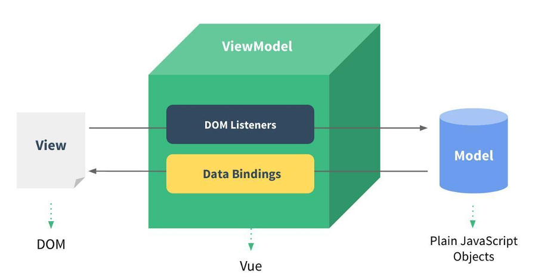

### HelloWorld

```html
<!DOCTYPE html>
<html lang="en">
<head>
    <meta charset="UTF-8">
    <title>Title</title>
</head>
<body>
    <div id="app">{{message}}</div>

    <script src="../js/vue.js"></script>
    <script>
        //const声明常量
        //编程范式:声明式编程
        const app=new Vue({
            el:'#app',//用于挂载要管理的元素
            data:{
                message:'你好啊，vue'
            }
        })
    </script>
</body>
</html>
```

>创建Vue对象的时候，传入了一个options对象：{}

>>{}中包含了el属性：该属性决定了这个Vue对象挂载到哪一个元素上，很明显，我们这里是挂载到了id为app的元素上

>>{}中包含了data属性：该属性中通常会存储一些数据这些数据可以是我们直接定义出来的，比如像上面这样。也可能是来自网络，从服务器加载的。


### Vue列表展示

现在，我们来展示一个更加复杂的数据：数据列表。比如我们现在从服务器请求过来一个列表希望展示到HTML中。
HTML代码中，使用v-for指令。我们再也不需要在JavaScript代码中完成DOM的拼接相关操作了而且，更重要的是，它还是响应式的。也就是说，当我们数组中的数据发生改变时，界面会自动改变。

```HTML
<body>
<div id="app">
    <ul>
        <!--原始js展示-->
        <li>{{movies[0]}}</li>
        <!--vue语法展示-->
        <li v-for="item in movies">{{item}}</li><!--v-for 只针对被vue管理的标签进行处理-->
    </ul>
</div>

<script src="../js/vue.js"></script>
<script>
    //const声明常量
    //编程范式:声明式编程
    const app=new Vue({
        el:'#app',//用于挂载要管理的元素
        data:{
            movies:['星际穿越','大话西游','少年派','盗梦空间']
        }
    })
</script>

</body>
```

### MVVM

<center>
    
    <br>
    <div style="color:orange; border-bottom: 1px solid #d9d9d9;
    display: inline-block;
    color: #999;
    padding: 2px;">MVVM</div>
</center>

以列表展示举例。

1. View依然是dom
2. Model就是我们抽离出来的obj
3. ViewModel就是vue对象


    ViewModel通过dataBindings让obj中的数据实时在DO显示

    ViewModel通过DOM Listener来监听DOM事件。通过Methods中的方法来改变obj中的数据
