### 前后端发展历史

#### <font color=ff00aa>后端路由阶段</font>

早起的网站开发整个HTML页面是由服务器来渲染的。服务器直接生产渲染好对应的HTML页面，返回给客户端进行展示。

==流程：==

1. 一个页面有自己对应的网址, 也就是URL.
2. URL会发送到服务器, 服务器会通过正则对该URL进行匹配, 并且最后交给一个Controller进行处理.
3. Controller进行各种处理, 最终生成HTML或者数据, 返回给前端.
4. 这就完成了一个IO操作.

==缺点：==

1. 前后端都需要后端人员来编写和维护。
2. HTML代码和数据以及对应的逻辑会混在一起。维护困难

#### <font color=ff00aa>前后端分离</font>

随着Ajax的出现，有了前后端分离的开发模式后端只提供API来返回数据, 前端通过Ajax获取数据, 并且可以通过JavaScript将数据渲染到页面中.

==优点：==

1. 这样做最大的优点就是前后端责任的清晰, 后端专注于数据上, 前端专注于交互和可视化上.
2. 并且当移动端(iOS/Android)出现后, 后端不需要进行任何处理, 依然使用之前的一套API即可.
3. 目前很多的网站依然采用这种模式开发.

#### <font color=ff00aa>前端路由阶段(单页面富应用 SPA)</font>

SPA最主要的特点就是在前后端分离的基础上加了一层前端路由.
也就是前端来维护一套路由规则.来达到改变URL，但是页面不进行整体的刷新。

> 即前端首次请求到所有页面数据，并加载所有的组件，类似一个池子，存放了项目所有的组件数据。不同的URL触发不同的组件。这里的URL并不是传统`跳转到后台的URL` 而仅仅是URL改变，并不会走http请求触发后台响应。

### 单页面富应用之URL

要想实现单页面富应用，其基本核心是：修改URL后响应不同的组件而不会走http请求。其有两种方式可实现。

#### window.location的href属性

URL的hash也就是锚点(#), 本质上是改变window.location的href属性.我们可以通过直接赋值location.hash来改变href, 但是页面不发生刷新

<center>
    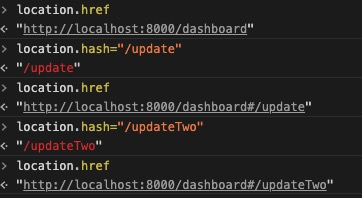
    <br>
    <div style="color:orange; border-bottom: 1px solid #d9d9d9;
    display: inline-block;
    color: #999;
    padding: 2px;">location.href</div>
</center>  

> 该方式修改URL后会生成 ·#·

#### HTML5的history模式：pushState

history接口是HTML5新增的, 它有五种模式改变URL而不刷新页面.


<center>
    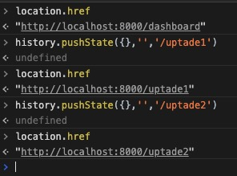
    <br>
    <div style="color:orange; border-bottom: 1px solid #d9d9d9;
    display: inline-block;
    color: #999;
    padding: 2px;">history.pushState</div>
</center>  
> 此方式修改URL后并不会生成 ·#·，看起来干净不少。

#### HTML5的history模式：replaceState


<center>
    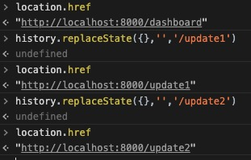
    <br>
    <div style="color:orange; border-bottom: 1px solid #d9d9d9;
    display: inline-block;
    color: #999;
    padding: 2px;">history.replaceState</div>
</center>  

#### HTML5的history模式：go

history.go(n) -- 前进n页
history.go(-n) -- 后退n页


history.back() 等价于 history.go(-1)
history.forward() 则等价于 history.go(1)
不多做介绍了

### vue-router介绍

>vue-router是基于路由和组件的

路由用于设定访问路径, 将路径和组件映射起来.在vue-router的单页面应用中, 页面的路径的改变就是组件的切换.

#### <font color=ff00aa>安装vue-router</font>

    sudo npm install -g vue-router --save

#### <font color=ff00aa>工程中安装vue路由功能</font>

1. ：导入路由对象，并且调用 Vue.use(VueRouter)
2. ：创建路由实例，并且传入路由映射配置
3. ：在Vue实例中挂载创建的路由实例

> 使用vue-router的步骤:

第一步: 创建路由组件
第二步: 配置路由映射: 组件和路径映射关系
第三步: 使用路由: 通过 < router-link>或者事件触发和< router-view>来使用VueRouter


### vue-router使用

#### <font color=ff00aa>1、 初始化项目</font>

    vue create my-project

<center>
    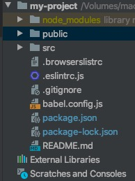
    <br>
    <div style="color:orange; border-bottom: 1px solid #d9d9d9;
    display: inline-block;
    color: #999;
    padding: 2px;">vueCLI4项目结构图</div>
</center>  

#### <font color=ff00aa>2、 创建路由组件</font>

> 在components目录下创建路由组件

```JavaScript
Home.vue

<template>
    <div>
        <h2>我是首页</h2>
        <p>我是首页内容, 哈哈哈</p>
    </div>
</template>

<script>
    export default {
        name: "Home"
    }
</script>

<style scoped>

</style>
```


```JavaScript
About.vue

<template>
  <div>
    <h2>我是关于</h2>
    <p>我是关于内容, 呵呵呵</p>
  </div>
</template>

<script>
  export default {
    name: "About"
  }
</script>

<style scoped>

</style>

```

#### <font color=ff00aa>3、 配置组件和路径的映射关系</font>

> 在src根目录下创建router目录，并在该目录下继续创建index.js路由

```JavaScript
index.js

// 配置路由相关的信息
import VueRouter from 'vue-router'
import Vue from 'vue'

//导入路由组件
import Home from '../components/Home'
import About from '../components/About'


// 1.通过Vue.use(插件), 安装路由插件
Vue.use(VueRouter)

// 2.定义路由，配置组件和路径的映射关系
const routes = [
    {
        // 默认路由
        // redirect重定向 到home
        path: '',
        redirect: '/home'
    },
    {
        path: '/home',
        component: Home
    },
    {
        path: '/about',
        component: About
    }
]
//3. 创建router实例
const router = new VueRouter({
    // 配置路由和组件之间的应用关系
    routes,
    mode: 'history',
    linkActiveClass: 'active'
})

// 4.将router对象导出并传入到vue实例中
export default router
```

#### <font color=ff00aa>4、 使用路由</font>

```JavaScript
App.vue

<template>
  <div id="app">
    
<!--    <router-link to="/home" tag="button" replace active-class="active">首页</router-link>-->
<!--    <router-link to="/about" tag="button" replace active-class="active">关于</router-link>-->
    <!--第一种方式：router-link路由跳转-->
    <router-link to="/home" tag="button" replace>首页</router-link>
    <router-link to="/about" tag="button" replace>关于</router-link>
    <!--第二种方式：代码路由跳转-->
<!--    <button @click="homeClick">首页</button>-->
<!--    <button @click="aboutClick">关于</button>-->
    <!--点击首页或关于子页面(frame)显示位置-->
    <router-view></router-view>
  </div>
</template>

<script>
export default {
  name: 'App',
  methods:{
    homeClick(){
      // 通过代码的方式修改路由 vue-router
      // push => pushState
      // this.$router.push('/home')
      this.$router.replace('/home')
      console.log('homeClick');
    },
    aboutClick() {
      // this.$router.push('/about')
      this.$router.replace('/about')
      console.log('aboutClick');
    }
  }
}
</script>

<style>
  .router-link-active {
    color: #f00;
  }

  .active {
    color: #f00;
  }
</style>

```
<font color=ff00aa>说明:</font>

* < router-link>: 该标签是一个vue-router中已经内置的组件, 它会被渲染成一个<a>标签.

* < router-view>: 该标签会根据当前的路径, 动态渲染出不同的组件.

* 网页的其他内容, 比如顶部的标题/导航, 或者底部的一些版权信息等会和< router-view>处于同一个等级.

* 在路由切换时, 切换的是< router-view>挂载的组件, 其他内容不会发生改变.


<font color=ff00aa>"router-link"属性</font>

1. ":to" 属 性

    相当于a标签中的"herf"属性，后面跟跳转链接所用

        < router-link :to="/home">Home< /router-link>
        <!-- 渲染结果 -->
        < a href="/home">Home< /a>
2. "replace" 属 性

    replace在routre-link标签中添加后，页面切换时不会留下历史记录

        <router-link :to="/home" replace></router-link>

3. "tag" 属 性

    具有tag属性的router-link会被渲染成相应的标签

        <router-link :to="/home" tag="li">Home</router-link>
        <!-- 渲染结果 -->
        <li>Home</li>

    此时页面的li同样会起到a链接跳转的结果，vue会自动为其绑定点击事件，并跳转页面

4. "active-class" 属 性

    这个属性是设置激活链接时class属性，也就是当前页面所有与当前地址所匹配的的链接都会被添加class属性

        <router-link :to="/home" active-class="u-link--Active">Home</router-link>

    active-class属性的默认值是router-link-active,所以如果没有设置，就会被渲染为这个class

    可以在router.js里面设置

        const router = new VueRouter({
          mode: 'hash',
          linkActiveClass: 'u-link--Active', // 这是链接激活时的class
        })

5. "exact" 属 性

    开启router-link的严格模式

        <router-link :to="/" exact>home</router-link>

    上面这个标签如果不加exact属性，则会在vue2.leenty.com/article页面下也会被匹配到，
    这却不是我们的本意,在加了这个属性后就会正确的匹配到vue2.leenty.com下

#### <font color=ff00aa>5、 main.js中配置</font>

```JavaScript
import Vue from 'vue'
import App from './App.vue'
//1. 导入路由js
import router from './router/index'
//如果文件夹下就一个index.js文件则可以使用如下方式导入
// import router from './router'

Vue.config.productionTip = false

new Vue({
  render: h => h(App),
  //2. 添加路由配置
  router,
}).$mount('#app')
```

源码如下<a>https://gitee.com/gadeGG/ProjectCode/tree/master/vue-routeLearn</a>

#### <font color=ff00aa>6、 构建项目</font>

进入到当前项目目录执行

    npm run build

<center>
    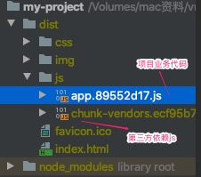
    <br>
    <div style="color:orange; border-bottom: 1px solid #d9d9d9;
    display: inline-block;
    color: #999;
    padding: 2px;">构建项目</div>
</center>     

### 动态路由

#### <font color=ff00aa>1、 新增vue组件</font>


#### <font color=ff00aa>2、router目录中index.js中新增映射关系</font>

```JavaScript
{
    path:'/user/:id',
    component:User
}
```

#### <font color=ff00aa>3、App.vue中新增button</font>

在某些情况下，一个页面的path路径可能是不确定的，比如我们进入用户界面时，希望是如下的路径：

>/user/13465或/user/7895

除了有前面的/user之外，后面还跟上了用户的ID这种path和Component的匹配关系，我们称之为动态路由(也是路由传递数据的一种方式)。


```JavaScript
<router-link to="/user/123" tag="button" replace>用户</router-link>
```

#### <font color=ff00aa>4、获取参数</font>

    {{$route.params.id}}

<center>
    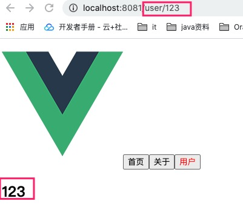
    <br>
    <div style="color:orange; border-bottom: 1px solid #d9d9d9;
    display: inline-block;
    color: #999;
    padding: 2px;">动态路由效果图</div>
</center>  


### 路由懒加载

上面构建项目时讲到，在路由中通常会定义很多不同的页面.这么多页面最后被打包在哪里呢? 一般情况下, 是放在一个app*.js文件中.但是, 页面这么多放在一个app*.js文件中, 必然会造成这个页面非常的大.如果我们一次性从静态资源服务器请求下来这个页面, 可能需要花费一定的时间, 甚至用户的电脑上还出现了短暂空白的情况.

为了解决此问题，路由懒加载应用而生。路由懒加载的主要作用就是将路由对应的组件打包成一个个对应js代码块.只有在这个路由被访问到的时候, 才加载对应的组件

> 方式一: 结合Vue的异步组件和Webpack的代码分析.

    const Home = resolve => { require.ensure(['../components/Home.vue'], () => { resolve(require('../components/Home.vue')) })};


> 方式二: AMD写法

    const About = resolve => require(['../components/About.vue'], resolve);


> 方式三: 在ES6中, 我们可以有更加简单的写法来组织Vue异步组件和Webpack的代码分割.

    const Home = () => import('../components/Home.vue')


<center>
    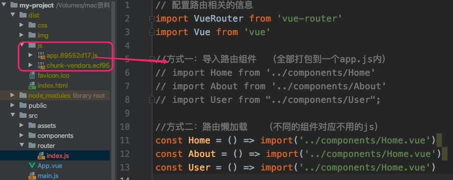
    <br>
    <div style="color:orange; border-bottom: 1px solid #d9d9d9;
    display: inline-block;
    color: #999;
    padding: 2px;">默认打包方式</div>
</center>

<center>
    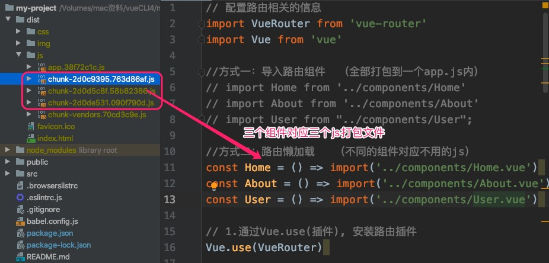
    <br>
    <div style="color:orange; border-bottom: 1px solid #d9d9d9;
    display: inline-block;
    color: #999;
    padding: 2px;">路由懒加载方式</div>
</center>


### 路由嵌套

比如在home页面中, 我们希望通过/home/news和/home/message访问两个不同的组件而不是home组件.即多个路径映射成一个组件

<center>
    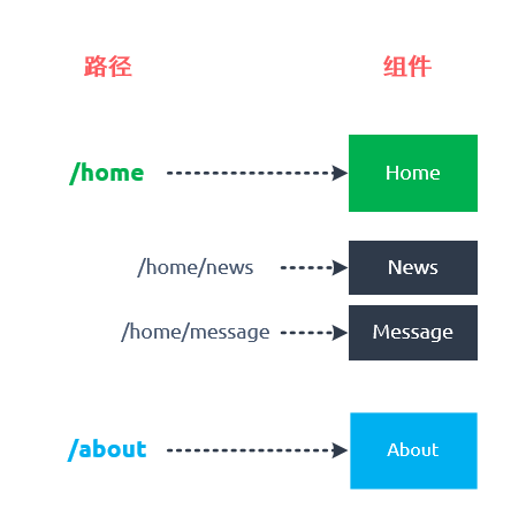
    <br>
    <div style="color:orange; border-bottom: 1px solid #d9d9d9;
    display: inline-block;
    color: #999;
    padding: 2px;">路由嵌套</div>
</center>

创建对应的子组件, 并且在路由映射中配置对应的子路由.
在组件内部使用<router-view>标签.


#### <font color=ff00aa>1、新增news、message组件 </font>

略

#### <font color=ff00aa>2、修改路由映射关系 </font>

懒加载两个vue组件

    const HomeNews = () => import('../components/HomeNews.vue')
    const HomeMessage = () => import('../components/HomeMessage.vue')

在Home路由下新增子组件news和message

```Java
{
    path: '/home',
    component: Home,
    //子组件
    children:[
        {
            path: 'news',// 子路由不需要加'/'
            component: HomeNews,
        },
        {
            path: 'message',
            component: HomeMessage,
        },
        {
            path: '',
            redirect: 'news'
        }
    ]
}
```
#### <font color=ff00aa>3、显示组件 </font>

如果是父组件，定会在App.vue中<router-view></router-view>定义显示位置。但是此次新增的为子组件，因此要在父组件中定义显示位置<router-view></router-view>

```JavaScript
Home.vue

<template>
    <div>
        <h2>我是首页</h2>
        <p>我是首页内容, 哈哈哈</p>

        <router-link to="/home/news" tag="button" replace>新闻</router-link>
        <router-link to="/home/message" tag="button" replace>消息</router-link>


        <router-view></router-view>
    </div>
</template>

<script>
    export default {
        name: "Home"
    }
</script>

<style scoped>

</style>
```

<center>
    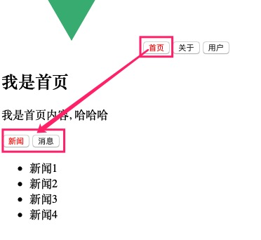
    <br>
    <div style="color:orange; border-bottom: 1px solid #d9d9d9;
    display: inline-block;
    color: #999;
    padding: 2px;">结果验证</div>
</center>


### router-link路由跳转间参数传递

#### <font color=ff00aa>第一种方式 params的类型:</font>

* 配置路由格式: /router/:id
* 传递的方式: 在path后面跟上对应的值
* 传递后形成的路径: /router/123, /router/abc

> 与动态路由一样。

1. 新增组件 TestParams.vue
2. 配置组件路径映射关系

```JavaScript
index.js

const ParamTest = () => import('../components/TestParams.vue')

{
    //第一种方式：params类型
    path:'/testParams/:param1',
    component:ParamTest

}
```
3. 传递参数

```JavaScript
App.vue

<!--之前跳转都是字符串，也可以使对象，但必须使用v-bind-->
<router-link :to={path:'/testParams/参数1'} tag="button" replace>测试组件间参数传递</router-link>
```
4. 接受参数

```JavaScript
TestParams.vue

<template>
    <div>
        本组件用来测试组件间跳转参数传递
        传递过来的参数为 > > {{$route.params.param1}}
    </div>
</template>

<script>
    export default {
        name: "TestParams"
    }
</script>

<style scoped>

</style>
```

<center>
    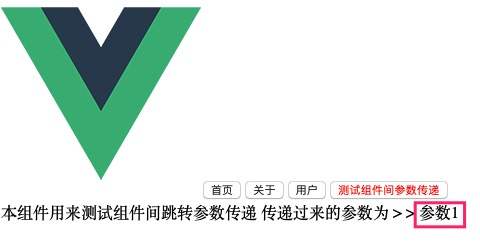
    <br>
    <div style="color:orange; border-bottom: 1px solid #d9d9d9;
    display: inline-block;
    color: #999;
    padding: 2px;">结果验证</div>
</center>

#### <font color=ff00aa>第二种方式 query的类型:</font>

* 配置路由格式: /router, 也就是普通配置
* 传递的方式: 对象中使用query的key作为传递方式
* 传递后形成的路径: /router?id=123, /router?id=abc

1. 新增组件 TestParams.vue
2. 配置组件路径映射关系

```JavaScript
index.js

const ParamTest = () => import('../components/TestParams.vue')

{
      //第一种方式：params类型
      // path:'/testParams/:param1',
      // component:ParamTest
      //第二种方式：query类型
      path:'/testParams',
      component:ParamTest
  }
```
3. 传递参数

```JavaScript
App.vue

<!--之前跳转都是字符串，也可以使对象，但必须使用v-bind-->
<router-link :to="{path:'/testParams',query:{name:'why',age:'45'}}" tag="button" replace>测试组件间参数传递</router-link>
```
4. 接受参数

```JavaScript
TestParams.vue

<template>
    <div>
        本组件用来测试组件间跳转参数传递
        传递过来的参数为 > > {{$route.query}}
        具体信息 > > {{$route.query.name}}   {{$route.query.age}}
    </div>
</template>

<script>
    export default {
        name: "TestParams"
    }
</script>

<style scoped>

</style>
```

<center>
    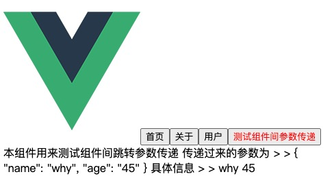
    <br>
    <div style="color:orange; border-bottom: 1px solid #d9d9d9;
    display: inline-block;
    color: #999;
    padding: 2px;">结果验证</div>
</center>

### button路由跳转间参数传递

1. 使用已存在的 `用户`组件 和 `测试组件参数传递` 组件进行测试
2. 配置组件路径映射关系

```JavaScript
index.js

const ParamTest = () => import('../components/TestParams.vue')

{
    path:'/user/:id',
    component:User
},
{
    //第一种方式：params类型
    // path:'/testParams/:param1',
    // component:ParamTest
    //第二种方式：query类型
    path:'/testParams',
    component:ParamTest
}
```
3. 传递参数

```JavaScript
App.vue

<template>
  <div id="app">
    
<!--    <router-link to="/home" tag="button" replace active-class="active">首页</router-link>-->
<!--    <router-link to="/about" tag="button" replace active-class="active">关于</router-link>-->

    <!--第一种方式：router-link路由跳转-->
<!--    <router-link to="/home" tag="button" replace>首页</router-link>-->
<!--    <router-link to="/about" tag="button" replace>关于</router-link>-->
<!--    <router-link to="/user/123" tag="button" replace>用户</router-link>-->
<!--     &lt;!&ndash;之前跳转都是字符串，也可以使对象，但必须使用v-bind   并且对象参数传递并不能传递组件数据&ndash;&gt;-->
<!--    <router-link :to="{path:'/testParams',query:{name:'why',age:'45'}}" tag="button" replace>测试组件间参数传递</router-link>-->

    <!--第二种方式：代码路由跳转-->
    <button @click="homeClick">首页</button>
    <button @click="aboutClick">关于</button>
    <button @click="usermethod" >用户</button>
    <button @click="testParams">测试组件间参数传递</button>

    <!--点击首页或关于子页面(frame)显示位置-->
    <router-view></router-view>
  </div>
</template>

<script>
  //导出App组件
export default {
  name: 'App',
  data(){
    return{
      name:'我叫王老五',
      age:'45'
    }
  },
  methods:{
    homeClick(){
      // 通过代码的方式修改路由 vue-router
      // push => pushState
      // this.$router.push('/home')
      this.$router.replace('/home')
      console.log('homeClick');
    },
    aboutClick() {
      // this.$router.push('/about')
      this.$router.replace('/about')
      console.log('aboutClick');
    },
    usermethod(){
      //params方式和字符串方式
      this.$router.push('/user/'+this.age)
    },
    testParams(){
      //query方式和对象方式
      this.$router.push({
        path:'/testParams',
        query:{
          name:this.name,
          age:this.age
        }
      })
    }
  }
}
</script>

<style>
  .router-link-active {
    color: #f00;
  }

  .active {
    color: #f00;
  }
</style>


```
4. 接受参数

```JavaScript
TestParams.vue

<template>
    <div>
        本组件用来测试组件间跳转参数传递
        传递过来的参数为 > > {{$route.query}}
        具体信息 > > {{$route.query.name}}   {{$route.query.age}}
    </div>
</template>

<script>
    export default {
        name: "TestParams"
    }
</script>

<style scoped>

</style>


user.vue

<template>
    <div>
        <h2>{{$route.params.id}}</h2>
    </div>
</template>

<script>
    export default {
        name: "User"
    }
</script>

<style scoped>

</style>
```

<center>
    
    <br>
    <div style="color:orange; border-bottom: 1px solid #d9d9d9;
    display: inline-block;
    color: #999;
    padding: 2px;">结果验证</div>
</center>


### router-link和button参数传递区别

1. router-link参数传递并不可以携带本vue数据。而button可以通过push方法传递本vue数据。


### $route和$router是有区别的

1. $router为VueRouter实例，想要导航到不同URL，则使用$router.push方法，并且$router代表的当前活跃的路由组件
2. 在button作为路由跳转页面时，需要搭配$router.push方法来跳转URL。并且在路由组件参数传递时也可以使用$router.push方法来传递参数。并且参数可以使本vue数据。
3. $route为当前router跳转对象里面可以获取name、path、query、params等


### 导航守卫

多个路由之间跳转时如果需要触发一些事件，则可以使用导航守卫来进行监听，比如路由跳转前后事件等等。。

>全局前置守卫 -- beforeEach  当一个导航触发时，全局前置守卫按照创建顺序调用

>全局后置守卫 -- afterEach 不需要复写next()方法

>全局解析守卫 -- beforeResolve   这和 router.beforeEach 类似，区别是在导航被确认之前，同时在所有组件内守卫和异步路由组件被解析之后，解析守卫就被调用。

>路由独享守卫 -- beforeEnter 该路由组件独享

> 组件内的守卫
beforeRouteEnter
beforeRouteUpdate (2.2 新增)
beforeRouteLeave

官网：https://router.vuejs.org/zh/guide/advanced/navigation-guards.html#%E8%B7%AF%E7%94%B1%E7%8B%AC%E4%BA%AB%E7%9A%84%E5%AE%88%E5%8D%AB

```JavaScript
TestParams.vue

<script>
    export default {
        name: "TestParams",
        data(){
            return{
                message:'你好啊 用户首页'
            }
        },
        created() {
            console.log("TestParams 组件创建成功 后回调函数");
        },
        mounted() {
            console.log("TestParams 组件挂载到dom 后回调函数");
        },
        updated() {
            console.log("TestParams 组件更新 后回调函数");
        },
        destroyed() {
            console.log("TestParams 组件销毁 后回调函数");
        },
        //一下这两个函数只有该组件保持了keep-alive时，才有效
        activated() {
        },
        deactivated() {
        }
    }
</script>


user.vue

<script>
    export default {
        name: "User",
        data(){
            return{
                message:'你好啊 用户首页'
            }
        },
        created() {
           console.log("user 组件创建成功 后回调函数");
        },
        mounted() {
            console.log("user 组件挂载到dom 后回调函数");
        },
        updated() {
            console.log("user 组件更新 后回调函数");
        },
        destroyed() {
            console.log("user 组件销毁 后回调函数");
        },
        //一下这两个函数只有该组件保持了keep-alive时，才有效
        activated() {
        },
        deactivated() {
        }
    }
</script>
```

<center>
    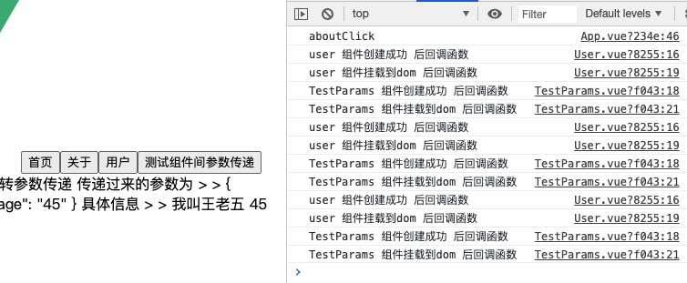
    <br>
    <div style="color:orange; border-bottom: 1px solid #d9d9d9;
    display: inline-block;
    color: #999;
    padding: 2px;">导航守卫效果图</div>
</center>

在index.js中为每个映射关系新增元数据

```JavaScript
{
    path:'/user/:id',
    //元数据
    meta:{
        title:'用户'
    },
    component:User
},

//覆盖全局router的beforeEach方法
router.beforeEach((to,from,next)=>{
    // window.document.title=to.meta.title;
    //因为首页嵌套了多个子组件，title显示undifine
    window.document.title=to.matched[0].meta.title;
    //必须调用next方法 调用该方法后, 才能进入下一个钩子
    next();
})
```
>to: 即将要进入的目标的路由对象.
from: 当前导航即将要离开的路由对象.
next: 调用该方法后, 才能进入下一个钩子.

### keep-alive遇见vue-router

keep-alive 是 Vue 内置的一个组件，可以使被包含的组件保留状态，或避免重新渲染。

在导航守卫章节看到，组件的生命周期方法，当组件进入或离开后会进行一系列的创建初始化操作。如果不适用keep-alive包裹vue-router时，没有点击都会触发组件初始化操作。如果被包裹后则只会进行一次初始化。缓存。

```JavaScript
<!--点击首页或关于子页面(frame)显示位置-->
    <keep-alive>
      <router-view></router-view>
    </keep-alive>
```
