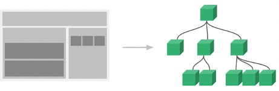
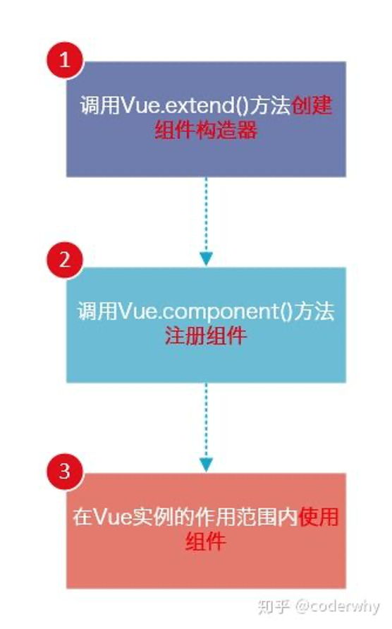

### 组件化开发

组件化是Vue.js中的重要思想它提供了一种抽象，让我们可以开发出一个个独立可复用的小组件来构造我们的应用。任何的应用都会被抽象成一颗组件树。


```Java
Vue.component('cpn', {
    template: '#cpn',//1.模板属性 - 定义HTML结构
    data() {         //2.data属性 - 定义HTML数据  
      return {
        title: 'abc'
      }
    }
  })
```

<center>
    
    <br>
    <div style="color:orange; border-bottom: 1px solid #d9d9d9;
    display: inline-block;
    color: #999;
    padding: 2px;">组件化图 </div>
</center>  

组件化思想的应用：

1. 有了组件化的思想，我们在之后的开发中就要充分的利用它。
2. 尽可能的将页面拆分成一个个小的、可复用的组件。
3. 这样让我们的代码更加方便组织和管理，并且扩展性也更强。

### 组件开发流程

<center>
    
    <br>
    <div style="color:orange; border-bottom: 1px solid #d9d9d9;
    display: inline-block;
    color: #999;
    padding: 2px;">组件开发流程 </div>
</center>


#### <font color=ff00aa>1.Vue.extend()：</font>

调用Vue.extend()创建的是一个组件构造器。
通常在创建组件构造器时，传入template代表我们自定义组件的模板。
该模板就是在使用到组件的地方，要显示的HTML代码。
事实上，这种写法在Vue2.x的文档中几乎已经看不到了，它会直接使用下面我们会讲到的语法糖，但是在很多资料还是会提到这种方式，而且这种方式是学习后面方式的基础。

#### <font color=ff00aa>2.Vue.component()：</font>

调用Vue.component()是将刚才的组件构造器注册为一个组件，并且给它起一个组件的标签名称。所以需要传递两个参数：1、注册组件的标签名 2、组件构造器

组件必须挂载在某个Vue实例下，否则它不会生效。

```Java
<body>

<div id="app">
  <!--3.使用组件-->
  <my-cpn></my-cpn>
  <my-cpn></my-cpn>


  <div>
    <div>
      <my-cpn></my-cpn>
    </div>
  </div>
</div>


<!--必须在vue托管实例下才生效-->
<my-cpn></my-cpn>

<script src="../js/vue.js"></script>
<script>
  // 1.创建组件构造器对象
  const cpnC = Vue.extend({
    template: `
      <div>
        <h2>我是标题</h2>
        <p>我是内容, 哈哈哈哈</p>
        <p>我是内容, 呵呵呵呵</p>
      </div>`
  })

  // 2.注册组件
  Vue.component('my-cpn', cpnC)

  const app = new Vue({
    el: '#app',
    data: {
      message: '你好啊'
    }
  })
</script>

</body>
```

### 全局组件和局部组件

```Java
<body>

<div id="app">
  <cpn></cpn>
  <cpn></cpn>
  <cpn></cpn>
</div>
<!--app2下不能使用cpn组件-->
<div id="app2">
  <cpn></cpn>
</div>

<script src="../js/vue.js"></script>
<script>
  // 1.创建组件构造器
  const cpnC = Vue.extend({
    template: `
      <div>
        <h2>我是标题</h2>
        <p>我是内容,哈哈哈哈啊</p>
      </div>
    `
  })

  // 2.注册组件(全局组件)
  // Vue.component('cpn', cpnC)


  const app = new Vue({
    el: '#app',
    data: {
      message: '你好啊'
    },
    components: {
      // 局部组件
      // 在components中声明组件时，为该vue实例托管HTML下使用
      cpn: cpnC
    }
  })
    // 测试，cpnC在该vue实例下不能使用
  const app2 = new Vue({
    el: '#app2'
  })
</script>

</body>
```

### 父子组件

```Java
<body>

<div id="app">
  <cpn2></cpn2>
  <!--<cpn1></cpn1>-->
</div>

<script src="../js/vue.js"></script>
<script>
  // 1.创建第一个组件构造器(子组件)
  const cpnC1 = Vue.extend({
    template: `
      <div>
        <h2>我是标题1</h2>
        <p>我是内容, 哈哈哈哈</p>
      </div>
    `
  })


  // 2.创建第二个组件构造器(父组件) 父组件中使用components声明
  const cpnC2 = Vue.extend({
    template: `
      <div>
        <h2>我是标题2</h2>
        <p>我是内容, 呵呵呵呵</p>
        <cpn1></cpn1>
      </div>
    `,
    components: {
      cpn1: cpnC1
    }
  })

  // root组件
  const app = new Vue({
    el: '#app',
    data: {
      message: '你好啊'
    },
    components: {
      cpn2: cpnC2
    }
  })
</script>

</body>
```

#### <font color=ff00aa>组件语法糖</font>

```Java
<script>

  // 1.注册全局组件语法糖
  Vue.component('cpn1', {
    template: `
      <div>
        <h2>我是标题1</h2>
        <p>我是内容, 哈哈哈哈</p>
      </div>
    `
  })

  // 2.注册局部组件的语法糖
  const app = new Vue({
    el: '#app',
    data: {
      message: '你好啊'
    },
    components: {
      'cpn2': {
        template: `
          <div>
            <h2>我是标题2</h2>
            <p>我是内容, 呵呵呵</p>
          </div>
    `
      }
    }
  })
</script>
```

#### <font color=ff00aa>组件模板分离写法</font>

如果以后开发中势必会有很多的模板，这样直接会导致js中存在过多的HTML模板代码。因此最好在HTML代码中能够书写模板代码。方别日后的维护。

```Java
<body>

<div id="app">
  <cpn></cpn>
  <cpn></cpn>
  <cpn></cpn>
</div>

<!--方式一：1.script标签, 注意:类型必须是text/x-template-->
<script type="text/x-template" id="cpn1">
<div>
  <h2>我是标题</h2>
  <p>我是内容,哈哈哈</p>
</div>
</script>

<!--方式二：2.template标签-->
<template id="cpn2">
  <div>
    <h2>我是标题</h2>
    <p>我是内容,呵呵呵</p>
  </div>
</template>

<script src="../js/vue.js"></script>
<script>

  // 1.注册一个全局组件
  Vue.component('cpn', {
    template: '#cpn2'
  })

  const app = new Vue({
    el: '#app',
    data: {
      message: '你好啊'
    }
  })
</script>

</body>
```

#### <font color=ff00aa>组件数据存放</font>

组件是一个单独功能模块的封装：这个模块有属于自己的HTML模板，也应该有属性自己的数据data。

> 组件中模板并不可以使用vue实例中的数据。相对于vue实例：组件是个单独的个体。组件的数据和模板都是私有的。类似于Java类。

```Java
<body>

<div id="app">
  <cpn></cpn>
  <cpn></cpn>
  <cpn></cpn>
</div>

<template id="cpn">
  <div>
    <h2>{{title}}  {{name}}</h2>
    <p>我是内容,呵呵呵</p>
  </div>
</template>

<script src="../js/vue.js"></script>
<script>

  // 1.注册一个全局组件
  Vue.component('cpn', {
    template: '#cpn',
    data() {
      return {
        title: 'abc',
        name:'hello'
      }
    }
  })

  const app = new Vue({
    el: '#app',
    data: {
      message: '你好啊',
      // title: '我是标题'
    }
  })
</script>

</body>
```
#### <font color=ff00aa>父子组件通信</font>

上面说过子组件是不能引用父组件或者Vue实例的数据的。但是，在开发中，往往一些数据确实需要从上层传递到下层：

> 比如在一个页面中，我们从服务器请求到了很多的数据。其中一部分数据，并非是我们整个页面的大组件来展示的，而是需要下面的子组件进行展示。这个时候，并不会让子组件再次发送一个网络请求，而是直接让大组件(父组件)将数据传递给小组件(子组件)。

如何进行父子组件间的通信呢？Vue官方提到

1. 通过props向子组件传递数据  : 父传子
2. 通过事件向父组件发送消息    : 子传父

在组件中，使用选项props来声明需要从父级接收到的数据。props的值有两种方式：

方式一：字符串数组，数组中的字符串就是传递时的名称。
方式二：对象，对象可以设置传递时的类型，也可以设置默认值等

```Java
<body>

<div id="app">
  <!--2. 在vue实例或父组件HTML中使用子组件模板并传递数据-->
  <cpn :cmessage="message" :cmovies="movies" :cbooks="books"></cpn>
</div>


<!--3. 在子组件模板中使用vue实例数据-->
<template id="cpn">
  <div>
    <ul>
      <li v-for="item in cmovies">{{item}}</li>
    </ul>
    <h2>{{cmessage}}</h2>
    <h2>{{cbooks.name}}  {{cbooks.price}}</h2>
  </div>
</template>

<script src="../js/vue.js"></script>
<script>
  //父组件请求整个页面需要的网络数据 父传子: props
  const cpn = {
    template: '#cpn',
    //1. 在子组件中声明props属性。
    // props: ['cmovies', 'cmessage'],
    props: {
      // 类型限制
      // cmovies: Array,
      // cmessage: String,

      // 提供一些默认值, 以及必传值
      cmessage: {
        type: String,
        default: 'aaaaaaaa',
        required: true
      },
      // 类型是对象或者数组时, 默认值必须是一个函数
      cmovies: {
        type: Array,
        default() {
          return []
        }
      },
      cbooks: {
        type: Object,
        default:function () {
          return{mess:'hello vue'}
        }
      }
    },
    data() {
      return {}
    },
    methods: {

    }
  }

  const app = new Vue({
    el: '#app',
    data: {
      message: '你好啊',
      movies: ['海王', '海贼王', '海尔兄弟'],
      books:{
        name:'Java从入门到放弃',
        price:'78.5'
      }
    },
    components: {
      cpn
    }
  })
</script>

</body>
```
### 插槽

父组件模板的所有东西都会在父级作用域内编译；子组件模板的所有东西都会在子级作用域内编译。

> 为何使用插槽？

插槽的目的是让我们原来的设备具备更多的扩展性。

> 组件的插槽：


移动开发中，几乎每个页面都有导航栏。导航栏我们必然会封装成一个插件，比如nav-bar组件。一旦有了这个组件，我们就可以在多个页面中复用了。

```Java
<body>

<!--
1.插槽的基本使用 <slot></slot>
2.插槽的默认值 <slot>button</slot>
3.如果有多个值, 同时放入到组件进行替换时, 一起作为替换元素
-->

<div id="app">
  <!-- 2. 组件显示 默认插槽-->
  <cpn></cpn>

  <!--3. 调用插槽时  插入内容代替solt-->
  <cpn><span>哈哈哈</span></cpn>

  <cpn><i>呵呵呵</i></cpn>

  <!--4. 一个插槽对应多个插入内容时，则一块显示-->
  <cpn>
    <i>呵呵呵</i>
    <div>我是div元素</div>
    <p>我是p元素</p>
  </cpn>

  <cpn></cpn>
</div>

<!--1. 在模板中定义插槽 具体内容看调用方如何插入-->
<template id="cpn">
  <div>
    <h2>我是组件</h2>
    <p>我是组件, 哈哈哈</p>
    <slot><button>按钮</button></slot>
    <!--<button>按钮</button>-->
  </div>
</template>

<script src="../js/vue.js"></script>
<script>
  const app = new Vue({
    el: '#app',
    data: {
      message: '你好啊'
    },
    components: {
      cpn: {
        template: '#cpn'
      }
    }
  })
</script>

</body>
```

#### 具名插槽slot

上述讲过，如果单个插槽对应多个插入内容则一起显示，而如果要多个插入内容和多个插槽一一对应则需要使用具名插槽。

> 只要给slot元素一个name属性即可

```Java
<body>

<!--2. -->
<div id="app">
  <cpn><span slot="center">标题</span></cpn>
  <cpn><button slot="left">返回</button></cpn>
</div>

<!--1. name属性-->
<template id="cpn">
  <div>
    <slot name="left"><span>左边</span></slot>
    <slot name="center"><span>中间</span></slot>
    <slot name="right"><span>右边</span></slot>
  </div>
</template>

<script src="../js/vue.js"></script>
<script>
  const app = new Vue({
    el: '#app',
    data: {
      message: '你好啊'
    },
    components: {
      cpn: {
        template: '#cpn'
      }
    }
  })
</script>

</body>
```

#### 作用域插槽

正常插槽使用都是由父组件提供内容插入子组件中。而如果有种情况是：父组件插入的数据是子组件内容又该如何？作用域插槽可以解决此问题。

```Java
<body>

<div id="app">
  <cpn v-show="isShow"></cpn>
  <cpn v-for="item in names"></cpn>
</div>

<template id="cpn">
  <div>
    <h2>我是子组件</h2>
    <p>我是内容, 哈哈哈</p>
    <!--2. 依赖子组件中数据-->
    <button v-show="isShow">按钮</button>
  </div>
</template>

<script src="../js/vue.js"></script>
<script>
  const app = new Vue({
    el: '#app',
    data: {
      message: '你好啊',
      isShow: true
    },
    components: {
      cpn: {
        //1. 子组件中提供数据
        template: '#cpn',
        data() {
          return {
            isShow: false
          }
        }
      },
    }
  })
</script>

</body>
```
