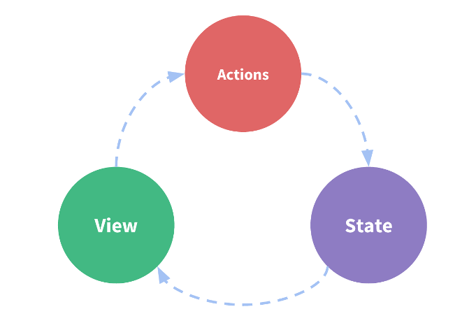
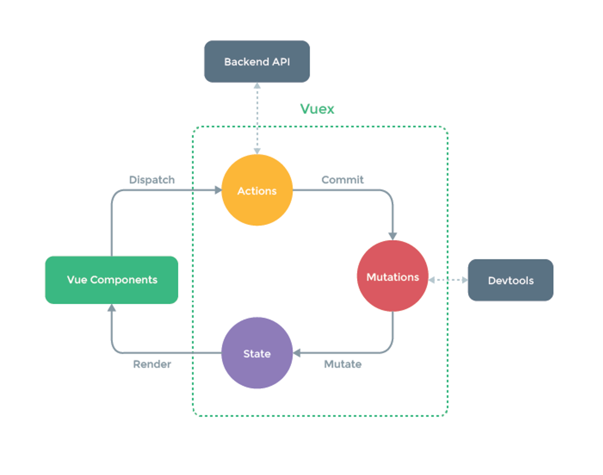

### vuex是什么？

就是一个状态管理器

> 什么是状态管理器呢？

简单讲，就是一个spring中的上下文，可以在各个组件中共享的一些对象。比如用户的登录状态，头像，地理位置等等。

### 没有vuex我们怎么共享数据？

使用父子组件进行数据传递

```JavaScript
### 父组件

<template>
  <div class="home">
    <h1>父组件</h1>
    <h2>{{counter}}</h2>
    
    <!--3.给子组件传递数据-->
    <test :counter="counter"></test>
  </div>
</template>

<script>
// @ is an alias to /src
// import HelloWorld from '@/components/HelloWorld.vue'
//1. 导入test组件
import test from "./test";

export default {
  name: 'Home',
  //2.在父组件中创建子组件
  components: {
    test
  },
  data(){
    return{
      message:'我是Home组件',
      counter:0
    }
  }
}
</script>

```


```JavaScript
### 子组件
<template>
    <div>
        <h1>子组件</h1>
        <h2>{{counter}}</h2>
    </div>
</template>

<script>
    export default {
        name: "test",
        //4. 使用props接受父组件数据
        props:{
            counter:Number
        }
    }
</script>

<style>

</style>
```

### 单界面的状态管理

即在一个组件中进行状态管理。项目开发中很少用到，主要为了更容易理解多界面的状态管理。

<center>
    
    <br>
    <div style="color:orange; border-bottom: 1px solid #d9d9d9;
    display: inline-block;
    color: #999;
    padding: 2px;">单界面状态管理 </div>
</center>

> State：不用多说，就是我们的状态。即存放数据的地方。
View：视图层，可以针对State的变化，显示不同的信息。
Actions：这里的Actions主要是用户的各种操作：点击、输入等等，会导致状态的改变。

```JavaScript
router/index.js

import Vue from 'vue'
import Vuex from 'vuex'
//1. 安装插件
Vue.use(Vuex)

//2. 创建对象
export default new Vuex.Store({
  state: {
    //3.将数据交由store全局共享
    num:'共享数据'
  },
  mutations: {
  },
  actions: {
  },
  modules: {
  }
})

```

```JavaScript
test1.vue

<template>
    <div>
        <h1>子组件</h1>
<!--        4.使用store全局共享数据-->
        <h2>{{$store.state.num}}</h2>
    </div>
</template>

<script>
    export default {
        name: "test",
        //不需要父子数据进行传递
        // //4. 使用props接受父组件数据
        // props:{
        //     counter:Number
        // }
    }
</script>

<style>

</style>
```

```JavaScript
test2.vue

<template>
  <div class="about">
    <h1>This is an about page</h1>
<!--    4.使用store全局共享数据-->
    <h3>{{$store.state.num}}</h3>
  </div>
</template>

```

> 上面讲到共享数据的使用，如何操作他呢？请往下看。

<center>
    
    <br>
    <div style="color:orange; border-bottom: 1px solid #d9d9d9;
    display: inline-block;
    color: #999;
    padding: 2px;">多界面状态管理 </div>
</center>

```JavaScript
test.vue

<template>
  <div class="about">
    <h1>This is an about page</h1>
<!--    4.使用store全局共享数据-->
    <h3>{{$store.state.num}}</h3>
    <button v-on:click="addition"> + </button>
    <button v-on:click="subtraction"> - </button>
  </div>
</template>
<script>
  export default {
    name: "test",
    methods:{
      //5.新增事件方法
      addition(){
        this.$store.commit('increment');//该字符串是$route方法。可以理解为当组件中方法被触发时，则调用$route对象中字符串方法，看图
      },
      subtraction(){
        this.$store.commit('decrement');
      }
    }
  }
</script>

<style>

</style>

```

```JavaScript
router/index.js

import Vue from 'vue'
import Vuex from 'vuex'
//1. 安装插件
Vue.use(Vuex)

//2. 创建对象
export default new Vuex.Store({
  state: {
    //3.将数据交由store全局共享
    num:10
  },
  mutations: {
    //6.定义操作操作共享数据的方法
    increment(state){
      state.num++;
    },
    decrement(state){
      state.num--;
    }
  },
  actions: {

  },
  modules: {
  }
})

```

### State单一状态树

即 一个state中保存所有的共享数据。
