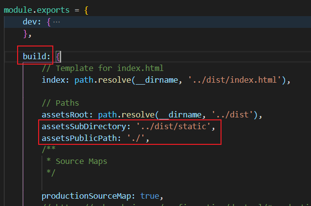
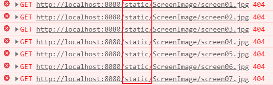

## vue项目打包

*   项目根目录执行

    ```npm
    npm run build  # 项目打包到dist目录中
    ```

*   将dist目录拷贝到`Tomcat/webapps` 内

*   访问 localhost:8080/dist

    *   首页空白以及js、css 访问404

        修改config/index.js如下：`切记是build对象`

        ```javascript
        assetsSubDirectory: '../dist/static',
        assetsPublicPath: './',
        ```

    

    *   element-ui样式显示有问题

        修改build/utils.js 

        ```javascript
        if (options.extract) {
            return ExtractTextPlugin.extract({
                use: loaders,
                publicPath:'../../', # 没有则新增
                fallback: 'vue-style-loader',
        })
        ```

    *   图片显示404

        

        正确路径应该是8080/dist/static/ScreenImage，修改代码图片路径

        *   如果图片引用为 `    `则为

            ```javascript
            
            ```

        *   如果图片引用为 `` 则为

            ```javascript
            './static/ScreenImage/screen01.jpg'
            ```

    *   路由跳转无效

        修改路由index.js

        ```javascript
        const router = new Router({
            // mode: 'history',
            //修改为
            mode: 'hash',
            // base:process.env.BABEL_ENV,
            base: '/dist/',
            routes
        })
        ```

        

参考：

https://blog.csdn.net/csdn_yudong/article/details/84936130