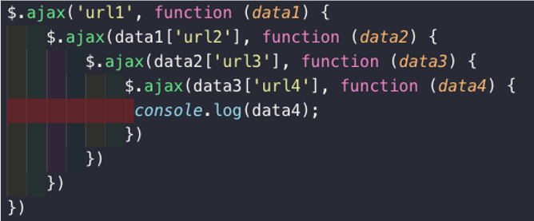

### 是什么？

Promise是异步编程的一种解决方案，一般情况下是有异步操作时,使用Promise对这个异步操作进行封装

### 解决了什么问题?

在开发中我们一般会碰到`回调地狱`需求。如下：
<center>
    
    <br>
    <div style="color:orange; border-bottom: 1px solid #d9d9d9;
    display: inline-block;
    color: #999;
    padding: 2px;">回调地狱 </div>
</center>

> 这种编程结构混乱，如果每个请求回调函数中又存在大量的代码，大括号都分不清了。

而Promise编程则可以链式调用请求并处理结果。并且可以处理多个请求都成功后再执行某些操作。


### 基本使用

```JavaScript
new Promise((resolve, reject) => {
   $ajax({
        url: '',
        success: function () {
            //成功的时候调用resolve
            resolve('Hello World');
        },
        error:function() {
            // 失败的时候调用reject
            reject('error message');
        }
    })
}).then((data) => {
    // 1.100行的处理代码
    console.log(data);
    console.log(data);
    console.log(data);
    console.log(data);
    console.log(data);
}).catch((err) => {
    console.log(err);
})

### 简写

new Promise((resolve, reject) => {
    $ajax({
         url: '',
         success: function () {
             //成功的时候调用resolve
             resolve('Hello World');
         },
         error:function() {
             // 失败的时候调用reject
             reject('error message');
         }
     })
}).then(data => {
    console.log(data);
}, err => {
    console.log(err);
})
```

<font color=ff00aa>解析：</font>

> Promise需要传入一个函数。而该函数需要两个参数
resolve函数 和 reject函数  其中resolve函数是请求成功后的回调，而reject函数是请求失败后的回调。

>then 函数是请求成功后的操作代码。即请求和操作解耦

>catch 是请求失败后的操作代码。

### Promise链式编程

```JavaScript
new Promise((resolve, reject) => {

     // 第一次网络请求的代码
     setTimeout(() => {
       resolve()
     }, 1000)

}).then(() => {
     // 第一次拿到结果的处理代码
     console.log('Hello World');
     console.log('Hello World');
     console.log('Hello World');
     console.log('Hello World');
     console.log('Hello World');
     console.log('Hello World');

     return new Promise((resolve, reject) => {

       // 第二次网络请求的代码
       setTimeout(() => {
         resolve()
       }, 1000)
     })
}).then(() => {

     // 第二次处理的代码
     console.log('Hello Vuejs');
     console.log('Hello Vuejs');
     console.log('Hello Vuejs');
     console.log('Hello Vuejs');
     console.log('Hello Vuejs');
     console.log('Hello Vuejs');

     return new Promise((resolve, reject) => {

       // 第三次网络请求的代码
       setTimeout(() => {
         resolve()
       })
     })
}).then(() => {

     // 第三处理的代码
     console.log('Hello Python');
     console.log('Hello Python');
     console.log('Hello Python');
     console.log('Hello Python');
     console.log('Hello Python');
})

### new Promise(resolve => resolve(结果))简写

new Promise((resolve, reject) => {
    setTimeout(() => {
      resolve('aaa')
    }, 1000)
}).then(res => {
    // 1.自己处理10行代码
    console.log(res, '第一层的10行处理代码');

    // 2.对结果进行第一次处理
    // return Promise.reject('error message')
    throw 'error message'
}).then(res => {
    console.log(res, '第二层的10行处理代码');

    return Promise.resolve(res + '222')
}).then(res => {
    console.log(res, '第三层的10行处理代码');
})


new Promise((resolve, reject) => {
    setTimeout(() => {
      resolve('aaa')
    }, 1000)
}).then(res => {
    // 1.自己处理10行代码
    console.log(res, '第一层的10行处理代码');

    // 2.对结果进行第一次处理
    return res + '111'
}).then(res => {
    console.log(res, '第二层的10行处理代码');

    return res + '222'
}).then(res => {
    console.log(res, '第三层的10行处理代码');
})
 ```


### 多个请求全部成功后执行处理

```JavaScript
原始写法

//请求二一:
  let isResult1 = false
  let isResult2 = false
  $ajax({
    url: '',
    success: function () {
      console.log('结果1');
      isResult1 = true
      handleResult()
    }
  })
// 请求二:
  $ajax({
    url: '',
    success: function () {
      console.log('结果2');
      isResult2 = true
      handleResult()
    }
  })

  function handleResult() {
    if (isResult1 && isResult2) {
      //
    }
  }
```

```JavaScript
Promise.all([
     new Promise((resolve, reject) => {
       $.ajax({
         url: 'url1',
         success: function (data) {
           resolve(data)
         }
       })
     }),
     new Promise((resolve, reject) => {
       $.ajax({
         url: 'url2',
         success: function (data) {
           resolve(data)
         }
       })
     })

 ]).then(results => {
   console.log(results);
 })
```
