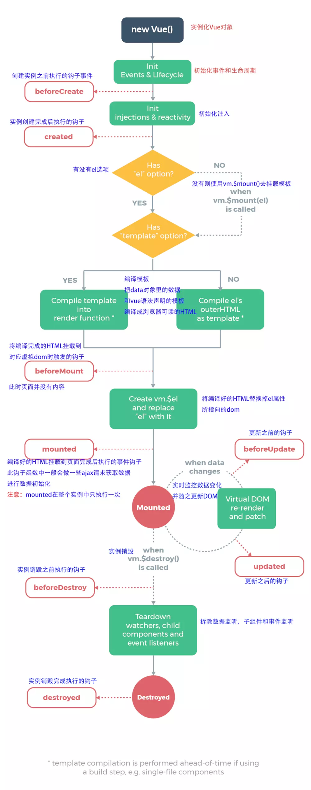
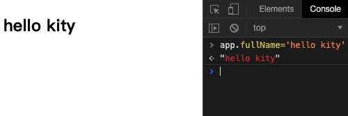
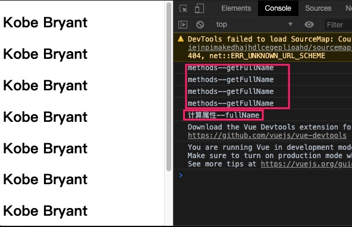
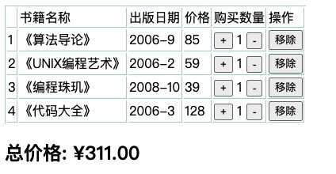

### Vue参数对象options

创建vue对象时传入一个对象，即options。包含如下选项：

* el:
    类型：string | HTMLElement
    作用：决定之后Vue实例会管理哪一个DOM。可以是js或者jquery获取的dom对象。
* data:
    类型：Object | Function （组件当中data必须是一个函数）
    作用：Vue实例对应的数据对象。
* methods:
    类型：{ [key: string]: Function }
    作用：定义属于Vue的一些方法，可以在其他地方调用，也可以在指令中使用。
* filter :
    过滤器
* components：
    组件注册


<center>
    
    <br>
    <div style="color:orange; border-bottom: 1px solid #d9d9d9;
    display: inline-block;
    color: #999;
    padding: 2px;">vue生命周期</div>
</center>    


### 插值操作

#### 1、Mustache语法
将vue对象中data属性的文本数据插入到HTML中

```HTML
<body>
    <div id="app">
        <h2>{{message}}</h2>
        <!--Mustache语法和字符串拼接-->
        <h2>{{message}},李浩楠</h2>
        <!--data变量拼接-->
        <h2>{{firstName + lastName}}</h2>
        <!--data变量和字符串拼接-->
        <h2>{{firstName + ' ' + lastName}}</h2>
        <h2>{{firstName}} {{lastName}}</h2>
        <!--表达式-->
        <h2>{{counter *2}}</h2>
    </div>

    <script src="../js/vue.js"></script>
    <script>
        //const声明常量
        //编程范式:声明式编程
        const app=new Vue({
            el:'#app',//用于挂载要管理的元素
            data:{
                message:'你好啊！',
                firstName:'kobe',
                lastName:'bryant',
                counter:100
            }
        })
    </script>
</body>
```

#### 2、v-once

元素和组件(组件后面才会学习)只渲染一次，不会随着数据的改变而改变。

```HTML
<div id="app">
    <h2>{{message}}</h2>
    <!--只渲染一次，数据修改后不跟随变化-->
    <h2 v-once>{{message}}</h2>
</div>
```

#### 3、v-html

将HTML代码原样输出，并不会html渲染。

```html
<div id="app">
    <h2>{{url}}</h2>
    <!--以HTML解析-->
    <h2 v-html="url"></h2>
</div>
```

```JavaScript
<script>
    //const声明常量
    //编程范式:声明式编程
    const app=new Vue({
        el:'#app',//用于挂载要管理的元素
        data:{
            message:'盗梦空间',
            url:'<a href="http://www.baidu.com">百度一下</a>'
        }
    })
</script>
```
#### 4、v-text

v-text作用和Mustache比较相似：都是用于将数据显示在界面中


#### 5、 v-pre

用于跳过这个元素和它子元素的编译过程，用于显示原本的Mustache语法。即不托管到vue。

```HTML
<div id="app">
    <h2>{{url}}</h2>
    <!--不解析-->
    <h2 v-pre>{{url}}</h2>
</div>
```

#### 6、v-cloak

当网络较慢，网页还在加载 Vue.js ，而导致 Vue 来不及渲染，这时页面就会显示出 Vue 源代码.然后数据加载后，页面显示正确。我们可以使用 v-cloak 指令来解决这一问题。

```HTML
<head>
    <meta charset="UTF-8">
    <title>Title</title>
    <style>
        [v-cloak]{
            display: none;
        }
    </style>
</head>
<body>
    <div id="app" v-cloak>
        <h2>{{url}}</h2>
        <!--不解析-->
        <h2>{{url}}</h2>
    </div>
</body>
```


### 绑定属性

上面的指令主要作用是将vue中数据插入到我们`HTML标签value`中。

如果HTML标签中属性、class、style也需要托管到vue中，则需要通过``绑定属性``来实现

> eg: 比如动态绑定a元素的href属性、动态绑定img元素的src属性

#### 绑定属性
```HTML
<div id="app">
  <!-- 错误的做法: 这里不可以使用mustache语法-->
  <!---->
  <!-- 正确的做法: 使用v-bind指令 -->
  
  <a v-bind:href="aHref">百度一下</a>
  <!--<h2>{{}}</h2>-->

  <!--语法糖的写法-->
  
  <a :href="aHref">百度一下</a>
</div>
```

```JavaScript
<script>
  const app = new Vue({
    el: '#app',
    data: {
      message: '你好啊',
      imgURL: 'https://img11.360buyimg.com/mobilecms/s350x250_jfs/t1/20559/1/1424/73138/5c125595E3cbaa3c8/74fc2f84e53a9c23.jpg!q90!cc_350x250.webp',
      aHref: 'http://www.baidu.com'
    }
  })
</script>
```

#### 绑定class

<font color=ff00aa>``对象语法：``</font>

用法一：直接通过{}绑定一个class类,其后的boolear isActive可控制使用class类与否。为true则使用class类，为false则不适用。

```HTML
<style>
    .active {
      color: red;
    }
</style>
<h2 :class="{'active': isActive}">Hello World</h2>
```

用法二：也可以通过判断，传入多个值

`<h2 :class="{'active': isActive, 'line': isLine}">Hello World</h2>`

用法三：和普通的类同时存在，并不冲突注：如果isActive和isLine都为true，那么会有title/active/line三个类

`<h2 class="title" :class="{'active': isActive, 'line': isLine}">Hello World</h2>`

用法四：如果过于复杂，可以放在一个methods或者computed中
注：classes是一个计算属性

`<h2 class="title" :class="classes">Hello World</h2>`

<font color=ff00aa>``数组语法：``</font>

用法一：直接通过{}绑定一个类
`<h2 :class="['active']">Hello World</h2>`

用法二：也可以传入多个值
`<h2 :class=“[‘active’, 'line']">Hello World</h2>`

用法三：和普通的类同时存在，并不冲突注：会有title/active/line三个类
`<h2 class="title" :class=“[‘active’,'line']">Hello World</h2>`

用法四：如果过于复杂，可以放在一个methods或者computed中注：classes是一个计算属性
`<h2 class="title" :class="classes">Hello World</h2>`

```html
<!DOCTYPE html>
<html lang="en">
<head>
  <meta charset="UTF-8">
  <title>对象语法</title>

  <style>
    .active {
      color: red;
    }
  </style>
</head>
<body>

<div id="app">
  <!--<h2 class="active">{{message}}</h2>-->
  <!--<h2 :class="active">{{message}}</h2>-->

  <!--<h2 v-bind:class="{key1: value1, key2: value2}">{{message}}</h2>-->
  <!--<h2 v-bind:class="{类名1: true, 类名2: boolean}">{{message}}</h2>-->
  <h2 class="title" v-bind:class="{active: isActive, line: isLine}">{{message}}</h2>
  <!--可以调用方法获取返回值-->
  <h2 class="title" v-bind:class="getClasses()">{{message}}</h2>
  <button v-on:click="btnClick">按钮</button>
</div>

<script src="../js/vue.js"></script>
<script>
  const app = new Vue({
    el: '#app',
    data: {
      message: '你好啊',
      isActive: true,
      isLine: true
    },
    methods: {
      btnClick: function () {
        this.isActive = !this.isActive
      },
      getClasses: function () {
        return {active: this.isActive, line: this.isLine}
      }
    }
  })
</script>

</body>
</html>
```

```HTML
<!DOCTYPE html>
<html lang="en">
<head>
  <meta charset="UTF-8">
  <title>数组语法</title>
</head>
<body>

<div id="app">
  <h2 class="title" :class="[active, line]">{{message}}</h2>
  <h2 class="title" :class="getClasses()">{{message}}</h2>
</div>

<script src="../js/vue.js"></script>
<script>
  const app = new Vue({
    el: '#app',
    data: {
      message: '你好啊',
      active: 'aaaaaa',
      line: 'bbbbbbb'
    },
    methods: {
      getClasses: function () {
        return [this.active, this.line]
      }
    }
  })
</script>

</body>
</html>
```

#### 绑定style

可以利用v-bind:style来绑定一些CSS内联样式。

<font color=ff00aa>``对象语法：``</font>

```Java
<!DOCTYPE html>
<html lang="en">
<head>
  <meta charset="UTF-8">
  <title>Title</title>
  <style>
    .title {
      font-size: 50px;
      color: red;
    }
  </style>
</head>
<body>

<div id="app">
  <!--<h2 :style="{key(属性名): value(属性值)}">{{message}}</h2>-->

  <!--'50px'必须加上单引号, 否则是当做一个变量去解析-->
  <!--<h2 :style="{fontSize: '50px'}">{{message}}</h2>-->

  <!--finalSize当成一个变量使用-->
  <!--<h2 :style="{fontSize: finalSize}">{{message}}</h2>-->
  <h2 :style="{fontSize: finalSize + 'px', backgroundColor: finalColor}">{{message}}</h2>
  <h2 :style="getStyles()">{{message}}</h2>
</div>

<script src="../js/vue.js"></script>
<script>
  const app = new Vue({
    el: '#app',
    data: {
      message: '你好啊',
      finalSize: 100,
      finalColor: 'red',
    },
    methods: {
      getStyles: function () {
        return {fontSize: this.finalSize + 'px', backgroundColor: this.finalColor}
      }
    }
  })
</script>

</body>
</html>
```

<font color=ff00aa>``数组语法：``</font>

```Java
<!DOCTYPE html>
<html lang="en">
<head>
  <meta charset="UTF-8">
  <title>Title</title>
</head>
<body>

<div id="app">
  <h2 :style="[baseStyle, baseStyle1]">{{message}}</h2>
</div>

<script src="../js/vue.js"></script>
<script>
  const app = new Vue({
    el: '#app',
    data: {
      message: '你好啊',
      baseStyle: {backgroundColor: 'red'},
      baseStyle1: {fontSize: '100px'},
    }
  })
</script>

</body>
</html>
```

### 计算属性

之前通过Mustache语法可以在dom中插入一些data数据。但是如过需要对data中数据进行一些处理后再进行插入。Mustache语法就不得劲了。这个时候我们可以通过计算属性computed来操作并返回。

对data数据进行操作后插值，通过methods也可以实现。后买讲这两个区别

```Java
<body>

<div id="app">
  <!--没有计算属性我们需要如此操作，再复杂的操作就实现不了了-->
  <h2>{{firstName + ' ' + lastName}}</h2>
  <h2>{{firstName}} {{lastName}}</h2>
  <!--方法-->
  <h2>{{getFullName()}}</h2>
  <!--计算属性-->
  <h2>{{fullName}}</h2>
</div>

<script src="../js/vue.js"></script>
<script>
  const app = new Vue({
    el: '#app',
    data: {
      firstName: 'Lebron',
      lastName: 'James'
    },
    // computed: 计算属性()
    computed: {
      fullName: function () {
        return this.firstName + ' ' + this.lastName
      }
    },
    methods: {
      getFullName() {
        return this.firstName + ' ' + this.lastName
      }
    }
  })
</script>

</body>
```
<font color=ff00aa>``复杂操作(数组迭代以及js高级函数)：``</font>
```Java
<body>

<div id="app">
  <h2>总价格: {{totalPrice}}</h2>
  <h2>总价格: {{totalPrice}}</h2>
  <h2>总价格: {{totalPrice}}</h2>
  <h2>总价格: {{totalPrice}}</h2>

  <h2>总价格: {{getTotalPrice()}}</h2>
  <h2>总价格: {{getTotalPrice()}}</h2>
  <h2>总价格: {{getTotalPrice()}}</h2>
  <h2>总价格: {{getTotalPrice()}}</h2>
</div>

<script src="../js/vue.js"></script>
<script>
  const app = new Vue({
    el: '#app',
    data: {
      books: [
        {id: 110, name: 'Unix编程艺术', price: 119},
        {id: 111, name: '代码大全', price: 105},
        {id: 112, name: '深入理解计算机原理', price: 98},
        {id: 113, name: '现代操作系统', price: 87},
      ]
    },
    methods: {
      getTotalPrice: function () {
        let result = 0
        for (let i=0; i < this.books.length; i++) {
          result += this.books[i].price
        }
        return result
      }
    },
    computed: {
      totalPrice: function () {
        let result = 0
        for (let i=0; i < this.books.length; i++) {
          result += this.books[i].price
        }
        return result

        // for (let i in this.books) {
        //   this.books[i]
        // }
        //
        // for (let book of this.books) {
        //
        // }
      }
    }
  })
</script>

</body>
```
#### <font color=ff00aa>``计算属性中的setter和getter：``</font>

每个计算属性中都包含一个getter和setter，上面的例子中只用到了getter。

```Java
<body>

<div id="app">
  <h2>{{fullName}}</h2>
</div>

<script src="../js/vue.js"></script>
<script>
  const app = new Vue({
    el: '#app',
    data: {
      firstName: 'Kobe',
      lastName: 'Bryant'
    },
    computed: {
      // 计算属性一般是没有set方法, 只读属性.
      fullName: {
        set: function(newValue) {
          // console.log('-----', newValue);
          const names = newValue.split(' ');
          this.firstName = names[0];
          this.lastName = names[1];
        },
        //默认调用即get，可通过app.fullName='你需要修改的参数'
        get: function () {
          return this.firstName + ' ' + this.lastName
        }
      },
    }
  })
</script>

</body>
```
<center>
    
    <br>
    <div style="color:orange; border-bottom: 1px solid #d9d9d9;
    display: inline-block;
    color: #999;
    padding: 2px;">vue计算属性setter</div>
</center>  

#### <font color=ff00aa>``计算属性的缓存：``</font>

计算属性和methods区别

两者都可以实现数据的操作并返回。而计算属性会进行缓存，如果多次使用时，计算属性只会调用一次。

```Java
<body>

<div id="app">
  <!--1.直接拼接: 语法过于繁琐-->
  <h2>{{firstName}} {{lastName}}</h2>

  <!--2.通过定义methods-->
  <h2>{{getFullName()}}</h2>
  <h2>{{getFullName()}}</h2>
  <h2>{{getFullName()}}</h2>
  <h2>{{getFullName()}}</h2>

  <!--3.通过computed-->
  <h2>{{fullName}}</h2>
  <h2>{{fullName}}</h2>
  <h2>{{fullName}}</h2>
  <h2>{{fullName}}</h2>
</div>

<script src="../js/vue.js"></script>
<script>
  // angular -> google
  // TypeScript(microsoft) -> ts(类型检测)
  // flow(facebook) ->
  const app = new Vue({
    el: '#app',
    data: {
      firstName: 'Kobe',
      lastName: 'Bryant'
    },
    methods: {
      getFullName: function () {
        console.log('methods--getFullName');
        return this.firstName + ' ' + this.lastName
      }
    },
    computed: {
      fullName: function () {
        console.log('计算属性--fullName');
        return this.firstName + ' ' + this.lastName
      }
    }
  })

</script>
</body>
```

<center>
    
    <br>
    <div style="color:orange; border-bottom: 1px solid #d9d9d9;
    display: inline-block;
    color: #999;
    padding: 2px;">vue计算属性缓存 </div>
</center>  


### 事件监听

在和页面交互中需要监听用户发生的时间，比如点击、拖拽、键盘事件等等。

#### <font color=ff00aa>``v-on``</font>

```Java
<body>

<div id="app">
  <h2>{{counter}}</h2>
  <!--<button v-on:click="counter++">+</button>-->
  <!--<button v-on:click="counter&#45;&#45;">-</button>-->
  <!--<button v-on:click="increment">+</button>-->
  <!--<button v-on:click="decrement">-</button>-->
  <button @click="increment">+</button>
  <button @click="decrement">-</button>
</div>

<script src="../js/vue.js"></script>
<script>
  const app = new Vue({
    el: '#app',
    data: {
      counter: 0
    },
    methods: {
      increment() {
        this.counter++
      },
      decrement() {
        this.counter--
      }
    }
  })
</script>

</body>
```

#### <font color=ff00aa>``v-on参数``</font>

情况一：如果该方法不需要额外参数，那么方法后的()可以不添加。但是注意：如果方法本身中有一个参数，那么会默认将原生事件event参数传递进去
情况二：如果需要同时传入某个参数，同时需要event时，可以通过$event传入事件。


```HTML
<body>

<div id="app">
  <!--1.事件调用的方法没有参数-->
  <button @click="btn1Click()">按钮1</button>
  <button @click="btn1Click">按钮1</button>

  <!--2.在事件定义时, 写方法时省略了小括号, 但是方法本身是需要一个参数的, 这个时候, Vue会默认将浏览器生产的event事件对象作为参数传入到方法-->
  <!--<button @click="btn2Click(123)">按钮2</button>-->
  <!--<button @click="btn2Click()">按钮2</button>-->
  <button @click="btn2Click">按钮2</button>

  <!--3.方法定义时, 我们需要event对象, 同时又需要其他参数-->
  <!-- 在调用方式, 如何手动的获取到浏览器参数的event对象: $event-->
  <button @click="btn3Click(abc, $event)">按钮3</button>
</div>

<script src="../js/vue.js"></script>
<script>
  const app = new Vue({
    el: '#app',
    data: {
      message: '你好啊',
      abc: 123
    },
    methods: {
      btn1Click() {
        console.log("btn1Click");
      },
      btn2Click(event) {
        console.log('--------', event);
      },
      btn3Click(abc, event) {
        console.log('++++++++', abc, event);
      }
    }
  })
</script>

</body>
```

### 条件判断

#### <font color=ff00aa>``v-if``</font>

```Java
<body>

<div id="app">
  <h2 v-if="isShow">
    <div>abc</div>
    <div>abc</div>
    <div>abc</div>
    <div>abc</div>
    <div>abc</div>
    {{message}}
  </h2>
</div>

<script src="../js/vue.js"></script>
<script>
  const app = new Vue({
    el: '#app',
    data: {
      message: '你好啊',
      isShow: true
    }
  })
</script>

</body>
```

#### <font color=ff00aa>``v-else-if、v-else``</font>
```Java
<div id="app">
  <h2 v-if="score>=90">优秀</h2>
  <h2 v-else-if="score>=80">良好</h2>
  <h2 v-else-if="score>=60">及格</h2>
  <h2 v-else>不及格</h2>

  <h1>{{result}}</h1>
</div>

<script src="../js/vue.js"></script>
<script>
  const app = new Vue({
    el: '#app',
    data: {
      score: 99
    },
    computed: {
      result() {
        let showMessage = '';
        if (this.score >= 90) {
          showMessage = '优秀'
        } else if (this.score >= 80) {
          showMessage = '良好'
        }
        // ...
        return showMessage
      }
    }

```

#### <font color=ff00aa>``v-show``</font>
v-show作用和v-if效果时候一样的。

v-if当条件为false时，压根不会有对应的元素在DOM中。
v-show当条件为false时，仅仅是将元素的display属性设置为none而已。


### 循环遍历

格式如下：item in items的形式。
语法格式：v-for=(item, index) in items

#### <font color=ff00aa>``遍历数组``</font>
```Java
<body>

<div id="app">
  <!--1.在遍历的过程中,没有使用索引值(下标值)-->
  <ul>
    <li v-for="item in names">{{item}}</li>
  </ul>

  <!--2.在遍历的过程中, 获取索引值-->
  <ul>
    <li v-for="(item, index) in names">
      {{index+1}}.{{item}}
    </li>
  </ul>
</div>

<script src="../js/vue.js"></script>
<script>
  const app = new Vue({
    el: '#app',
    data: {
      names: ['why', 'kobe', 'james', 'curry']
    }
  })
</script>

</body>
```
#### <font color=ff00aa>``遍历对象``</font>
```Java
<body>

<div id="app">
  <!--1.在遍历对象的过程中, 如果只是获取一个值, 那么获取到的是value-->
  <ul>
    <li v-for="item in info">{{item}}</li>
  </ul>


  <!--2.获取key和value 格式: (value, key) -->
  <ul>
    <li v-for="(value, key) in info">{{value}}-{{key}}</li>
  </ul>


  <!--3.获取key和value和index 格式: (value, key, index) -->
  <ul>
    <li v-for="(value, key, index) in info">{{value}}-{{key}}-{{index}}</li>
  </ul>
</div>

<script src="../js/vue.js"></script>
<script>
  const app = new Vue({
    el: '#app',
    data: {
      info: {
        name: 'why',
        age: 18,
        height: 1.88
      }
    }
  })
</script>

</body>
```

#### <font color=ff00aa>``组件的key属性``</font>

vue使用虚拟dom来达到实时渲染数据的目的。其中虚拟dom中使用Diff算法，而如果数组数据数据新增时，例如在BC中新增一个F，则Diff算法会把C更新成F，D更新成C，E更新成D，最后再插入F。
而如果给每个节点做一个标识，则相当于内存地址-直接寻址类似。则Diff会直接替换值。效率杠杠的。

```Java
<body>

<div id="app">
  <ul>
    <li v-for="item in letters" :key="item">{{item}}</li>
  </ul>
</div>

<script src="../js/vue.js"></script>
<script>
  const app = new Vue({
    el: '#app',
    data: {
      letters: ['A', 'B', 'C', 'D', 'E']
    }
  })
</script>

</body>
```
#### <font color=ff00aa>`数组中的响应式方法`</font>

```Java
// 1.push方法
this.letters.push('aaa')
this.letters.push('aaaa', 'bbbb', 'cccc')

// 2.pop(): 删除数组中的最后一个元素
this.letters.pop();

// 3.shift(): 删除数组中的第一个元素
this.letters.shift();

// 4.unshift(): 在数组最前面添加元素
this.letters.unshift()
this.letters.unshift('aaa', 'bbb', 'ccc')

// 5.splice作用: 删除元素/插入元素/替换元素
// 删除元素: 第二个参数传入你要删除几个元素(如果没有传,就删除后面所有的元素)
// 替换元素: 第二个参数, 表示我们要替换几个元素, 后面是用于替换前面的元素
// 插入元素: 第二个参数, 传入0, 并且后面跟上要插入的元素
splice(start)
splice(start)
this.letters.splice(1, 3, 'm', 'n', 'l', 'x')
this.letters.splice(1, 0, 'x', 'y', 'z')

// 5.sort()
this.letters.sort()

// 6.reverse()
this.letters.reverse()
```

### 过滤器

Vue.js 允许你自定义过滤器，可被用于一些常见的文本格式化。过滤器可以用在两个地方：双花括号插值和 v-bind 表达式 (后者从 2.1.0+ 开始支持)。

定义过滤器

```Java
filters: {
    showPrice(price) {
        return '¥' + price.toFixed(2)
    }
}
```
使用过滤器

```Java
{{sunPrice | showPrice}}
```

### v-model

表单控件  并且呢之前的Mustache是单向绑定即数据驱动视图。而v-model任意一方数据变化则另一方都会发生变化。

    <input type="text" v-model="message">等同于<input type="text" v-bind:value="message" v-on:input="message = $event.target.value">

```Java
<body>

<div id="app">
  <input type="text" v-model="message">
  {{message}}
</div>

<script src="../js/vue.js"></script>
<script>
  const app = new Vue({
    el: '#app',
    data: {
      message: '你好啊'
    }
  })
</script>

</body>
```    

#### v-model:radio

```Java
<body>

<div id="app">
  <label for="male">
    <input type="radio" id="male" value="男" v-model="sex">男
  </label>
  <label for="female">
    <input type="radio" id="female" value="女" v-model="sex">女
  </label>
  <h2>您选择的性别是: {{sex}}</h2>
</div>

<script src="../js/vue.js"></script>
<script>
  const app = new Vue({
    el: '#app',
    data: {
      message: '你好啊',
      sex: '女'
    }
  })
</script>

</body>
```

#### v-model:checkbox

```java
<body>

<div id="app">
  <!--1.checkbox单选框-->
  <!--<label for="agree">-->
    <!--<input type="checkbox" id="agree" v-model="isAgree">同意协议-->
  <!--</label>-->
  <!--<h2>您选择的是: {{isAgree}}</h2>-->
  <!--<button :disabled="!isAgree">下一步</button>-->

  <!--2.checkbox多选框-->
  <input type="checkbox" value="篮球" v-model="hobbies">篮球
  <input type="checkbox" value="足球" v-model="hobbies">足球
  <input type="checkbox" value="乒乓球" v-model="hobbies">乒乓球
  <input type="checkbox" value="羽毛球" v-model="hobbies">羽毛球
  <h2>您的爱好是: {{hobbies}}</h2>

  <label v-for="item in originHobbies" :for="item">
    <input type="checkbox" :value="item" :id="item" v-model="hobbies">{{item}}
  </label>
</div>

<script src="../js/vue.js"></script>
<script>
  const app = new Vue({
    el: '#app',
    data: {
      message: '你好啊',
      isAgree: false, // 单选框
      hobbies: [], // 多选框,
      originHobbies: ['篮球', '足球', '乒乓球', '羽毛球', '台球', '高尔夫球']
    }
  })
</script>

</body>
```

#### v-model:select

```Java
<body>

<div id="app">
  <!--1.选择一个-->
  <select name="abc" v-model="fruit">
    <option value="苹果">苹果</option>
    <option value="香蕉">香蕉</option>
    <option value="榴莲">榴莲</option>
    <option value="葡萄">葡萄</option>
  </select>
  <h2>您选择的水果是: {{fruit}}</h2>

  <!--2.选择多个-->
  <select name="abc" v-model="fruits" multiple>
    <option value="苹果">苹果</option>
    <option value="香蕉">香蕉</option>
    <option value="榴莲">榴莲</option>
    <option value="葡萄">葡萄</option>
  </select>
  <h2>您选择的水果是: {{fruits}}</h2>
</div>

<script src="../js/vue.js"></script>
<script>
  const app = new Vue({
    el: '#app',
    data: {
      message: '你好啊',
      fruit: '香蕉',
      fruits: []
    }
  })
</script>

</body>
```

### 阶段案例-图书购物车

```Java
<!DOCTYPE html>
<html lang="en" xmlns:v-on="http://www.w3.org/1999/xhtml">
<head>
    <meta charset="UTF-8">
    <title>图书购物车</title>
    <style>
        .vtd{border:solid #add9c0; border-width:0px 1px 1px 0px;}
        .vtable{border:solid #add9c0; border-width:1px 0px 0px 1px;}
    </style>
</head>
<body>
<div id="app">
    <table :class="['vtable']">
        <thead>
            <tr>
                <td :class="['vtd']"></td>
                <td :class="['vtd']">书籍名称</td>
                <td :class="['vtd']">出版日期</td>
                <td :class="['vtd']">价格</td>
                <td :class="['vtd']">购买数量</td>
                <td :class="['vtd']">操作</td>
            </tr>
        </thead>
        <tbody>
            <tr v-for="(item, index) in books" >
                <td :class="['vtd']">{{item.id}}</td>
                <td :class="['vtd']">{{item.name}}</td>
                <td :class="['vtd']">{{item.date}}</td>
                <td :class="['vtd']">{{item.price}}</td>
                <td :class="['vtd']">
                    <button v-on:click="add(index)">+</button>
                      {{item.count}}
                    <button v-on:click="sub(index)">-</button>
                </td>
                <td :class="['vtd']"><button v-on:click="remove(index)">移除</button></td>
            </tr>
        </tbody>

    </table>
    <h2>总价格: {{sunPrice | showPrice}}</h2>
</div>


<script src="../js/vue.js"></script>

<script>
    const app=new Vue({
        el:'#app',
        data: {
            books: [
                {
                    id: 1,
                    name: '《算法导论》',
                    date: '2006-9',
                    price: 85.00,
                    count: 1
                },
                {
                    id: 2,
                    name: '《UNIX编程艺术》',
                    date: '2006-2',
                    price: 59.00,
                    count: 1
                },
                {
                    id: 3,
                    name: '《编程珠玑》',
                    date: '2008-10',
                    price: 39.00,
                    count: 1
                },
                {
                    id: 4,
                    name: '《代码大全》',
                    date: '2006-3',
                    price: 128.00,
                    count: 1
                },
            ]
        },
        methods:{
            add:function (index) {
                if (this.books[index].count>=20) return;
                this.books[index].count++;
            },
            sub:function (index) {
                if (this.books[index].count<=0) return;
                this.books[index].count--;
            },
            remove:function (index) {
                this.books.splice(index,1);
            }
        },
        computed:{
            sunPrice:function () {
                var sunPrice=0;
                this.books.forEach(function (item) {
                    sunPrice=sunPrice+item.price;
                });
                return sunPrice;
            }
        },
        filters: {
            showPrice(price) {
                return '¥' + price.toFixed(2)
            }
        }
    })
</script>

</body>
</html>
```

<center>
    
    <br>
    <div style="color:orange; border-bottom: 1px solid #d9d9d9;
    display: inline-block;
    color: #999;
    padding: 2px;">效果图 </div>
</center>  
