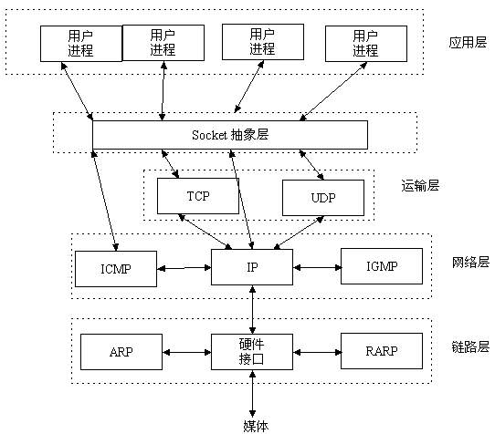
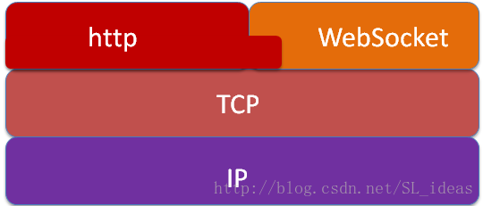

## Socket

### 是什么？

<code>套接字（socket）是通信的基石</code>，是支持TCP/IP协议的网络通信的基本操作单元。它是网络通信过程中端点的抽象表示，包含进行网络通信必须的五种信息：``连接使用的协议``，``本地主机的IP地址``，``本地进程的协议端口``，``远地主机的IP地址``，``远地进程的协议端口``。套接字允许应用程序将I/O插入到网络中，并与网络中的其他应用程序进行通信。

一个Socket是一对IP地址和端口。

Socket可以看成在两个程序进行通讯连接中的一个端点，一个程序将一段信息写入Socket中，该Socket将这段信息发送给另外一个Socket中，使这段信息能传送到其他程序中。

### 作用

应用层通过传输层进行数据通信时，TCP和UDP会遇到同时为多个应用程序进程提供并发服务的问题。 <code>为了区别不同的应用程序进程和连接</code>，许多计算机操作系统为应用程序与TCP／IP协议交互提供了称为套接字(Socket)的接口，区分不同应用程序进程间的网络通信和连接。

### Socket 传输的特点：

   优点

 1)  传输数据为字节级，传输数据可自定义，数据量小（对于手机应用讲：费用低）

 2）传输数据时间短，性能高

 3）适合于客户端和服务器端之间信息实时交互

 4）可以加密,数据安全性强

    Socket 传输方式适合于对传输速度，安全性，实时交互，费用等要求高的应用中，如网络游戏，手机应用，银行内部交互等

   缺点：

1）需对传输的数据进行解析，转化成应用级的数据

2）对开发人员的开发水平要求高

3）相对于Http协议传输，增加了开发量

    基于http协议传输方式适合于对传输速度，安全性 要求不是很高，且需要快速开发的应用。如公司OA系统，互联网服务等。

### 实现原理

### 使用场景

* 浏览器进程与web服务器进程通信(B/S通信)
* QQ好友进程间通信
* 本地进程通信
    * 消息传递（管道、FIFO、消息队列）
    * 同步（互斥量、条件变量、读写锁、文件和写记录锁、信号量）
    * 共享内存（匿名的和具名的）
* 网络上进程通信
    * 使用TCP/IP协议的应用程序通常采用应用编程接口：UNIX  BSD的套接字（socket）
    * 在网络中标识一个进程
        >在本地可以通过进程PID来唯一标识一个进程，但是在网络中这是行不通的。网络层的“ip地址”可以唯一标识网络中的主机，而传输层的“协议+端口”可以唯一标识主机中的应用程序（进程）。这样利用三元组（ip地址，协议，端口）就可以标识网络的进程了。

### 常见的通信协议及区别
* TCP/IP

TCP/IP协议是一个协议簇。里面包括很多协议的。UDP只是其中的一个。之所以命名为TCP/IP协议，因为TCP,IP协议是两个很重要的协议，就用他两命名了。

* tcp和udp

tcp和udp都是传输协议，主要区别是tcp协议连接需要3次握手，断开需要四次握手，是通过流来传输的，就是确定连接后，一直发送信息，传完后断开。udp不需要进行连接，直接把信息封装成多个报文，直接发送。所以udp的速度更快写，但是不保证数据的完整性和数据顺序，（这个是可以在实现时通过验证手段来手动确定完整性）。

* HTTP

http协议是建立在TCP协议之上的一种应用，是Web联网的基础，最显著的特点是客户端发送的每次请求都需要服务器回送响应，在请求结束后，会主动释放连接。从建立连接到关闭连接的过程称为“一次连接”。

* RPC

一种通过网络从远程计算机程序上请求服务，而不需要了解底层网络技术的协议。

* SOCKET

socket并不是一种协议，是在程序员层面上对TCP/IP协议的封装和应用。其实是一个调用接口，方便程序员使用TCP/IP协议栈而已。程序员通过socket来使用tcp/ip协议。但是socket并不是一定要使用tcp/ip协议，Socket编程接口在设计的时候，就希望也能适应其他的网络协议。

### Socket和webSocket区别
当两台主机通信时，必须通过Socket连接，Socket则利用TCP/IP协议建立TCP连接。TCP连接则更依靠于底层的IP协议，IP协议的连接则依赖于链路层等更低层次

Socket是传输控制层接口，WebSocket是应用层协议。

### WebSocket与HTTP的关系

相同点

1. 都是一样基于TCP的，都是可靠性传输协议。
2. 都是应用层协议。

不同点

 1. WebSocket是双向通信协议，模拟Socket协议，可以双向发送或接受信息。HTTP是单向的。
 2. WebSocket是需要浏览器和服务器握手进行建立连接的。而http是浏览器发起向服务器的连接，服务器预先并不知道这个连接。

联系

WebSocket在建立握手时，数据是通过HTTP传输的。但是建立之后，在真正传输时候是不需要HTTP协议的。

### HTML5与WebSocket的关系

WebSocket API 是 HTML5 标准的一部分， 但这并不代表 WebSocket 一定要用在 HTML 中，或者只能在基于浏览器的应用程序中使用。

实际上，许多语言、框架和服务器都提供了 WebSocket 支持，例如：

* 基于 C 的 libwebsocket.org
* 基于 Node.js 的 Socket.io
* 基于 Python 的 ws4py
* 基于 C++ 的 WebSocket++
* Apache 对 WebSocket 的支持： Apache Module mod_proxy_wstunnel
* Nginx 对 WebSockets 的支持： NGINX as a WebSockets Proxy 、 NGINX Announces Support for WebSocket Protocol 、WebSocket proxying
* lighttpd 对 WebSocket 的支持：mod_websocket

### websocket特点以及使用场景
现在急需的需求是能支持客户端和服务器端的双向通信，而且协议的头部又没有HTTP的Header那么大，于是，Websocket就诞生了！

1. 社交聊天

最著名的就是微信，QQ，这一类社交聊天的app。这一类聊天app的特点是低延迟，高即时。即时是这里面要求最高的，如果有一个紧急的事情，通过IM软件通知你，假设网络环境良好的情况下，这条message还无法立即送达到你的客户端上，紧急的事情都结束了，你才收到消息，那么这个软件肯定是失败的。

2. 弹幕

说到这里，大家一定里面想到了A站和B站了。确实，他们的弹幕一直是一种特色。而且弹幕对于一个视频来说，很可能弹幕才是精华。发弹幕需要实时显示，也需要和聊天一样，需要即时。

3. 多玩家游戏

4. 协同编辑

现在很多开源项目都是分散在世界各地的开发者一起协同开发，此时就会用到版本控制系统，比如Git，SVN去合并冲突。但是如果有一份文档，支持多人实时在线协同编辑，那么此时就会用到比如WebSocket了，它可以保证各个编辑者都在编辑同一个文档，此时不需要用到Git，SVN这些版本控制，因为在协同编辑界面就会实时看到对方编辑了什么，谁在修改哪些段落和文字。

5. 股票基金实时报价

金融界瞬息万变——几乎是每毫秒都在变化。如果采用的网络架构无法满足实时性，那么就会给客户带来巨大的损失。几毫秒钱股票开始大跌，几秒以后才刷新数据，一秒钟的时间内，很可能用户就已经损失巨大财产了。

6. 体育实况更新

全世界的球迷，体育爱好者特别多，当然大家在关心自己喜欢的体育活动的时候，比赛实时的赛况是他们最最关心的事情。这类新闻中最好的体验就是利用Websocket达到实时的更新！

7. 视频会议/聊天

视频会议并不能代替和真人相见，但是他能让分布在全球天涯海角的人聚在电脑前一起开会。既能节省大家聚在一起路上花费的时间，讨论聚会地点的纠结，还能随时随地，只要有网络就可以开会。

8. 基于位置的应用

越来越多的开发者借用移动设备的GPS功能来实现他们基于位置的网络应用。如果你一直记录用户的位置(比如运行应用来记录运动轨迹)，你可以收集到更加细致化的数据。

9. 在线教育

在线教育近几年也发展迅速。优点很多，免去了场地的限制，能让名师的资源合理的分配给全国各地想要学习知识的同学手上，Websocket是个不错的选择，可以视频聊天、即时聊天以及其与别人合作一起在网上讨论问题...

10. 智能家居

这也是我一毕业加入的一个伟大的物联网智能家居的公司。考虑到家里的智能设备的状态必须需要实时的展现在手机app客户端上，毫无疑问选择了Websocket。

11. 总结

从上面我列举的这些场景来看，一个共同点就是，高实时性！

### websocket出现背景

在HTTP的时代是无法做到服务器主动向客户端发送消息的，当然也可以使用ajax轮询、long poll 技术造一个服务端给客户端主动push消息的假象。达到实时消息的推送。websocket达到全双工通信

谈到Web实时推送，就不得不说WebSocket。在WebSocket出现之前，很多网站为了实现实时推送技术，通常采用的方案是轮询(Polling)和Comet技术，Comet又可细分为两种实现方式，一种是长轮询机制，一种称为流技术，这两种方式实际上是对轮询技术的改进，这些方案带来很明显的缺点，需要由浏览器对服务器发出HTTP request，大量消耗服务器带宽和资源。面对这种状况，HTML5定义了WebSocket协议，能更好的节省服务器资源和带宽并实现真正意义上的实时推送。WebSocket协议本质上是一个基于TCP的协议，它由通信协议和编程API组成，WebSocket能够在浏览器和服务器之间建立双向连接，以基于事件的方式，赋予浏览器实时通信能力。既然是双向通信，就意味着服务器端和客户端可以同时发送并响应请求，而不再像HTTP的请求和响应。
