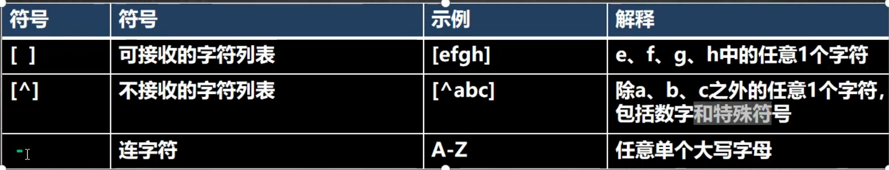
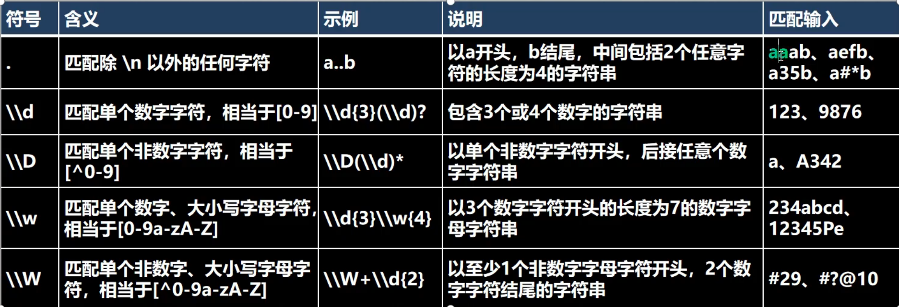
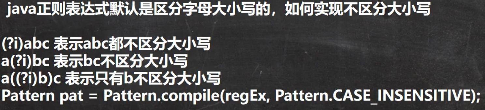
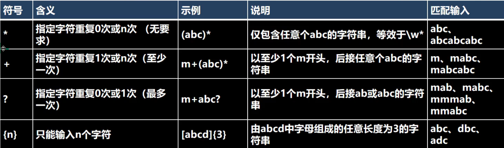
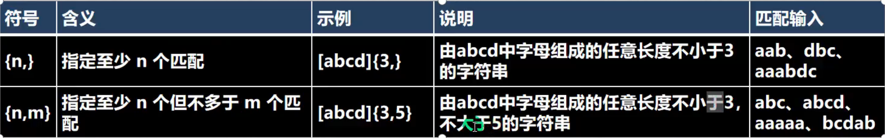
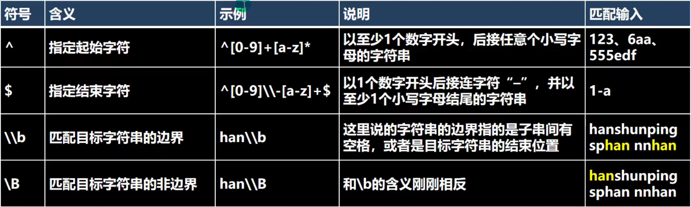
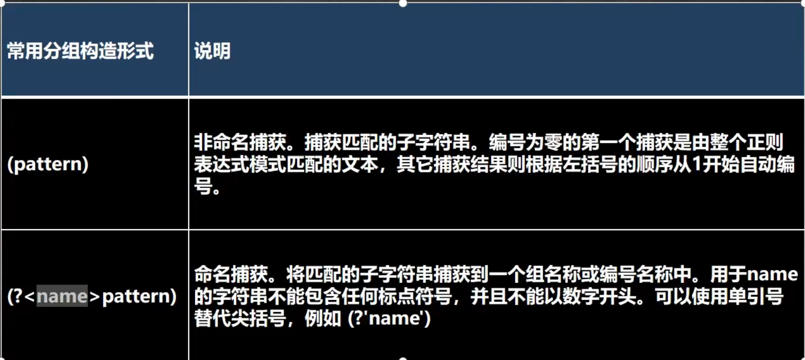
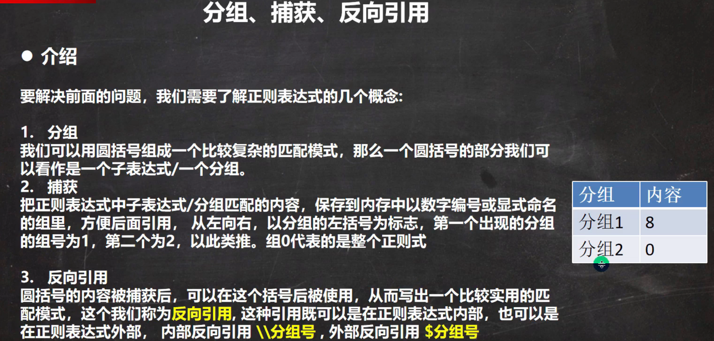

# 表达式语法

## 转义符

在Java检索特殊字符需要用到转义字符，其他语言不需要。

```java
//需要用到转义的字符有
. * + () $ / \ ? [] ^ {} -
```


## 字符匹配符







```java
String content = "aaa12bbb23cc45d68AABBCC";
String regStr = "(?i)bb";
Pattern pattern = Pattern.compile(regStr);
Matcher matcher = pattern.matcher(content);
while (matcher.find()) {
    System.out.println(matcher.group(0));
}

String regStr1 = "bb";
//忽略大小写
Pattern pattern1 = pattern.compile(regStr, Pattern.CASE_INSENSITIVE);
Matcher matcher1 = pattern.matcher(content);
while (matcher1.find()) {
    System.out.println(matcher1.group(0));
}
```


## 选择匹配符

匹配多种情况


```java
String content = "aaa12bbb23cc45d68AABBCC";
String regStr = "[a-z]{2}|[1-9]*";
Pattern pattern = Pattern.compile(regStr,Pattern.CASE_INSENSITIVE);
Matcher matcher = pattern.matcher(content);
while (matcher.find()) {
    System.out.println(matcher.group(0));
}
```


## 限定符

用于指定其前面的字符和组合项连续出现多少次

 


## 定位符

规定要匹配的字符串出现的位置，比如在字符串的开始还是结束的位置。



> 上面的边界指的是


## 分组组合和反向引用符

即对捕获到的字符串进行分组拆分。




```java
String content = "aaaa12bbbb23cccc";
//        String regStr = "[a-z]{4}"; 如果没有进行分组捕获，那么结果就是 aaa/bbb/ccc
String regStr = "(\\D\\D)(\\D\\D)";//使用()表示对【\\D\\D\\D\\D】捕获到的字符串进行拆分分组，分为两组，每组由两个字符组成
Pattern pattern = Pattern.compile(regStr,Pattern.CASE_INSENSITIVE);
Matcher matcher = pattern.matcher(content);
//1. matcher.group(0) 得到匹配到的字符串
//2. matcher.group(1) 得到匹配到的字符串后将其拆分分组，第1个分组内容
//3. matcher.group(2) 得到匹配到的字符串后将其拆分分组，第2个分组内容
while (matcher.find()) {
    System.out.println(matcher.group(0));
    System.out.println(matcher.group(1));
    System.out.println(matcher.group(2));
}

> 结果
aaaa
aa
aa
bbbb
bb
bb
cccc
cc
cc
```

```java
//当然也可以通过分组名获取
String content = "aaaa12bbbb23cccc";
//        String regStr = "[a-z]{4}"; 如果没有进行分组捕获，那么结果就是 aaa/bbb/ccc
String regStr = "(？<nameg1>\\D\\D)(?<nameg2>\\D\\D)";//使用()表示对【\\D\\D\\D\\D】捕获到的字符串进行拆分分组，分为两组，每组由两个字符组成
Pattern pattern = Pattern.compile(regStr,Pattern.CASE_INSENSITIVE);
Matcher matcher = pattern.matcher(content);
//1. matcher.group(0) 得到匹配到的字符串
//2. matcher.group(1) 得到匹配到的字符串后将其拆分分组，第1个分组内容
//3. matcher.group(2) 得到匹配到的字符串后将其拆分分组，第2个分组内容
while (matcher.find()) {
    System.out.println(matcher.group(0));
    System.out.println(matcher.group("nameg1"));
    System.out.println(matcher.group("nameg2"));
}
```


## 正则复杂操作

> 需求：使用正则表达式捕获ABBA这个四字格式的串，使用上面的正则已经无法满足。




`案例`

1. 匹配两个连续的相同数字

	```bash
	（\\d）\\1  
	```

	> (\\\d) 表示任意一个数字
	>
	> \\\1 表示分组1 再引用一次，即两个相同的数字

2. 匹配五个连续相同的数字

	```bash
	(\\d)\\1{4}
	```

3. 匹配四位数字，格式为ABBA

	```bash
	(\\d)(\\d)\\2\\1
	```

4. 商品编号，格式入：12312-333444888。前任意五位数，-后为九位数每三位相同

	```bash
	\\d{5}-(\\d)\\1{2}(\\d)\\2{2}(\\d)\\3{2}
	```

	```java
	String content = "12312-333444888abc12312-333444888abcab165d45-15645645165";
	String regStr = "\\d{5}-(\\d)\\1{2}(\\d)\\2{2}(\\d)\\3{2}";
	Pattern pattern = Pattern.compile(regStr,Pattern.CASE_INSENSITIVE);
	Matcher matcher = pattern.matcher(content);
	while (matcher.find()) {
	    System.out.println(matcher.group(0));
	}
	```

	


