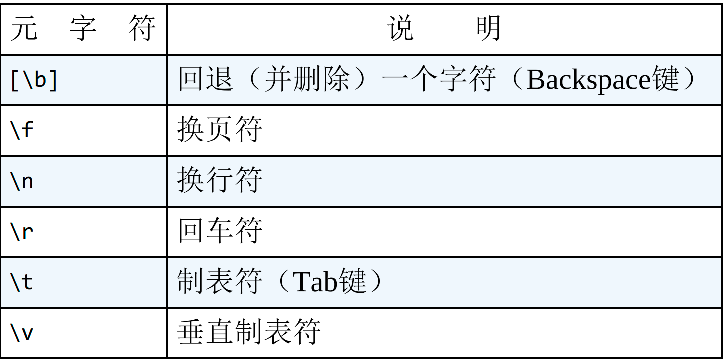
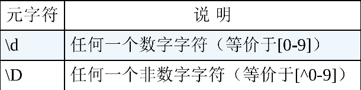
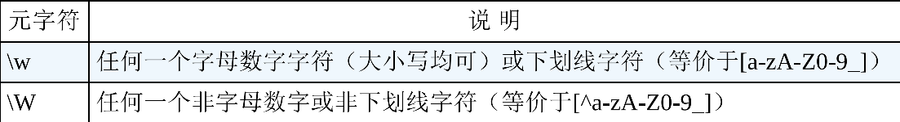
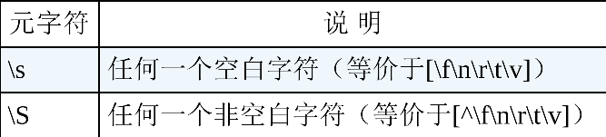
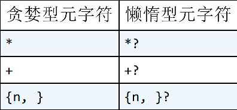

#  正则用途

1. 搜索|替换文件中指定内容
2. 内容格式校验


# 特殊字符

正则中特殊字符有 

<code>. * + () $ / \ ? [] ^ {} -</code>

> 如需用到上面特殊字符需要转义，例如匹配文本中的？，则可以使用 \?


# 匹配单个字符

## 匹配纯文本

> 功能等同于 CTRL+F

```python
import re

text = 'Hello, my name is Ben. Please visit \nmy website at http://www.forta.com/.'

regObj = re.compile(r'my', re.I)
res = regObj.findall(text)
print(res)
>> ['my', 'my']
```


## 匹配任意字符

> 正则表达式中使用“.”（英文 点）来表示任意字符

`模式`

==.==

```python
text = 'sales1.xls\norders3.xls\nsales2.xls\nsales3.xls\napac1.xls\neurope2.xls\nna1.xls\nna2.xls\nsa1.xls'

regObj = re.compile(r'.a.', re.I)
res = regObj.findall(text)
print(res)
>> ['sal', 'sal', 'sal', 'pac', 'na1', 'na2', 'sa1']
```


# 匹配一组字符

## 匹配多个字符中某一个

`需求:`

文本中包含 ca1,na1,sa1。我们想要检索出 ca1和na1且不包含sa1。

`解析`

如果使用 .a. 则会全部匹配出来。正则中提供了范围匹配，格式为 ==[xx,xx,xx]==（可以省略逗号）,意思为匹配中括号中内容任意字符，可以看成是 . 的缩小版

`模式`

==[xx,xx,xx] 或 [xxxxxxx]==


```python
import re

text = 'ca1.xlsx\nna1.xlsx\nsa1.xlsx'

regObj = re.compile(r'[c,n]a.', re.I)
res = regObj.findall(text)
print(res)
>> ['ca1', 'na1']
```


## 取非匹配

`需求`

检索文本中 以不是a开头后跟ngle的单词。

`分析`

如果我们继续使用[]来范围匹配我们需要这样写[b-z0-9A-Z等其他特殊字符]

`模式`

==[^xxx]==

```python
import re

text = 'ca1.xlsx\nna1.xlsx\nsa1.xlsx\nma1.xlsx'

regObj = re.compile(r'[^s^m]a.', re.I)
res = regObj.findall(text)
print(res)
>> ['ca1', 'na1']
```

```python
import re

text = 'ca1.xlsx\nba1.xlsx\nsa1.xlsx\nma1.xlsx'

regObj = re.compile(r'[^m-s]a.', re.I)
res = regObj.findall(text)
print(res)
>> ['ca1', 'ba1']
```


# 元字符

## 空白元字符




## 数字元字符




## 字母数字元字符




## 空白字符与非空白字符元字符




# 重复匹配

## 重复匹配类别

* 至少匹配一个或多个

	> +

* 匹配0个或多个

	> *

* 匹配0个或1个

	> ？

	

```python
import re

text = 'Send personal email to ben@forta.com or\nben.forta@forta.com. For questions about a\nbook use support@forta.com. If your message\nis urgent try ben@urgent.forta.com. Feel\nfree to send unsolicited spam@forta.cm email to\nspam@forta.cn (wouldn’t it be nice if\nit were that simple, huh?).'

# 邮件格式:  字母或数字或.（但是开头字符不能是.）@com或者cn
regObj = re.compile(r"[\w]+[\w.]*@[\w]+\.(?:com|cn){1}", re.I)
res = regObj.findall(text)
print(res)
>> ['ben@forta.com', 'ben.forta@forta.com', 'support@forta.com', 'spam@forta.cn']
```


## 重复匹配次数

* 指定次数

	> {x}   重复x次

* 指定范围次数

	> {n,m}  重复n-m次

* 至少重复次数

	> {n,}  至少重复n次


## 过度匹配

`案例`

```python
import re

text = 'This offer is not available to customers\nliving in <B>AK</B> and <B>HI</B>.'

# 匹配<B></B>中内容
regObj = re.compile(r"<[Bb]>.*</[Bb]>", re.I)
res = regObj.findall(text)
print(res)
>> ['<B>AK</B> and <B>HI</B>']
```

> 我们预期是\<B>AK</B> 和 \<B>HI</B>，但是却返回了\<B>AK</B> and \<B>HI</B> ,

`分析`

由于 ***** 和 **+**都是贪婪型元字符，它们在进行匹配时的行为模式是多多益善而不是适可而止的。 它们会尽可能地从一段文本的开头一直匹配到这段文本的末尾， 而不是从这段文本的开头匹配到碰到第一个匹配时为止。

`解决`

在某些特定场景下不需要==贪婪型==匹配则可以使用==懒惰型==匹配




```python
import re

text = 'This offer is not available to customers\nliving in <B>AK</B> and <B>HI</B>.'

# 匹配<B></B>中内容
regObj = re.compile(r"<[Bb]>.*?</[Bb]>", re.I)
res = regObj.findall(text)
print(res)
>> ['<B>AK</B>', '<B>HI</B>']
```


# 位置匹配

## 作用

位置匹配用来解决在什么地方进行字符串匹配操作的问题。


## 痛点

```python
import re

text = 'The cat scattered his food all over the room.'

# 匹配cat单词用来替换dog
regObj = re.compile(r"cat", re.I)
res = regObj.findall(text)
print(res)
>> ['cat', 'cat']
```

> 我们想要的是匹配整个cat单词进而替换dog，类似于软件中CTRL+H匹配勾选了 《完整单词匹配》


## 单词边界

第一种边界（也是最常用的边界） 是由限定符\b指定的单词边界。 顾名思义， \b用来匹配一个单词的开始或结尾。

```python
import re

text = 'The cat scattered his food all over the room.'

# 匹配cat单词用来替换dog
regObj = re.compile(r'\bcat\b', re.A)
res = regObj.findall(text)
print(res)
```


# <font color=ff00aa>子表达式 | 组 </font>

## 痛点

> 在正则中使用 ==+？.{n.m}==这种重复模式时，针对的是前一个字符，例如abcd+ 表名我要匹配abc开头后跟一个或多个d。

> 我现在有个需求，匹配abcd作为一个整体出现1次或多次。如何实现呢？子表达式

> 我还有个需求，我要匹配指定标签中内容而不包含标签本身

## 使用场景

### 当做模式来使用

`格式`

==(子表达式|组)==

> :red_circle: 被中括号括起来的都是一个组

```bash
<[hH]([1-6])>(.*?)</[hH]\1>
#其中出现了两个组，第一个组是[1-6],第二个组是.*?
```


```python
import re

text = 'Hello, my name is Ben&nbsp;Forta, and I am\nthe author of books on SQL, ColdFusion, WAP,\nWindows&nbsp;&nbsp;2000, and other subjects.'

# 子表达式&nbsp;作为整体匹配至少出现2次
regObj = re.compile(r'(?:&nbsp;){2,}', re.I)
res = regObj.findall(text)
print(res)
>> ['&nbsp;&nbsp;']
```

```python
import re

text = 'hello, my name is BenhelloForta, and I am\nthe author of books on SQL, ColdFusion, WAP,\nWindowshellohello2000, and other subjects.'
# 子表达式hello作为整体匹配出现1次
regObj = re.compile(r'(?:hello){1}.{1}', re.I)
res = regObj.findall(text)
print(res)
```

> <font color=ff00aa size=4>所有的编程语言中正则表达式使用了()则会被视为**匹配边界**即视为一个group，导致匹配不符合预期，因此添加 ?: 申明不是一个group</font>


### 利用组来简化表达式

```python
import re

text = 'Pinging hog.forta.com [12.159.46.200]\nwith 32 bytes of data:'
# 匹配IP地址
regObj = re.compile(r'\d{1,3}\.\d{1,3}\.\d{1,3}\.\d{1,3}', re.I)
res = regObj.findall(text)
print(res)
>> ['12.159.46.200']
```

> 正则表达式中\d{1,3}\\.重复出现了三次,可以使用**组**进行简化

```python
regObj = re.compile(r'(\d{1,3}\.){3}\d{1,3}', re.I)
```


### 利用组获取指定组元素

> 如何获取指定标签元素中内容而不包含标签元素本身呢？

```java
        //获取标题名称
        String content = "<BODY>\n<H1>Welcome to my Homepage</H1>\nContent is divided into two sections:<BR>\n<H2>ColdFusion</H2>\nInformation about Macromedia ColdFusion.\n<H2>Wireless</H2>\nInformation about Bluetooth, 802.11, and more.\n<H2>This is not valid HTML</H3>\n</BODY>";
        Pattern compile = Pattern.compile("<[hH]([1-6])>(.*?)</[hH]\\1>");
        Matcher matcher = compile.matcher(content);
        while (matcher.find()){
            System.out.println(matcher.group(0));
          	//<H1>Welcome to my Homepage</H1>
						//<H2>ColdFusion</H2>
						//<H2>Wireless</H2>
            System.out.println(matcher.group(1));
          	//1
						//2
						//2
            System.out.println(matcher.group(2));
          	//Welcome to my Homepage
						//ColdFusion
						//Wireless
        }
```


### 组嵌套

```bash
.*?(<(html>)(.*)</\2).*
```

- group 1: `(<(html>)(.*)</\2)`
- group 2: `(html>)`
- group 3: `(.*)`


# 回溯引用

## 痛点

查找出HTML页面中所有标题<H1>到<H6>

```bash
<[hH][1-6]>.*?</[hH][1-6]>
```

使用 懒惰型 正常情况下可以顺利文档中标题，但是如果HTML文档中出现了标题标签不匹配或者嵌套的情况，如下：这种情况也会匹配到。

```html
<h1></h3>
```


## 回溯引用匹配

`格式`

```bash
[ ]+(\w+)[ ]+\1
```

> 匹配空格，匹配一个或多个字母数字并使用()标记，匹配空格，再次匹配一个或多个字母数字。如果有多个()则排序\1,\2,\3。。。

```Java
// Python真恶心，死活没弄出来，改Java
        String content = "<BODY>\n<H1>Welcome to my Homepage</H1>\nContent is divided into two sections:<BR>\n<H2>ColdFusion</H2>\nInformation about Macromedia ColdFusion.\n<H2>Wireless</H2>\nInformation about Bluetooth, 802.11, and more.\n<H2>This is not valid HTML</H3>\n</BODY>";
        Pattern compile = Pattern.compile("<[hH]([1-6])>.*?</[hH]\\1>");
        Matcher matcher = compile.matcher(content);
        while (matcher.find()){
            System.out.println(matcher.group());
        }
```

> :warning:回溯引用只能用于 **子表达式** 


# 前后查找

## 痛点

我需要查找HTML文本中的所有标题（不包含标题标签在内），此时有些机灵鬼就会想，可以先匹配出来然后进行字符串替换。可以是可以，但是不够美妙。


## 作用

类似于字符串拆分，我需要根据":"进行分割字符串为数组，针对数组元素进行正则匹配


## 局限

常见的语言都支持**向前查找**，但是并不是所有的语言都支持**向后查找**。

* Java、 .NET、 PHP和Perl都支持向后查找（但有一些限制） 
* JavaScript和ColdFusion不支持向后查找。


## 向前查找

> 类似于 根据":"等指定字符 进行分割字符串为数组，并对第一个数组元素进行正则匹配。本质就是一个子表达式

`格式`

```bash
(?=分隔符)   #使用子表达式 包含?= 后跟分隔符
```

```python
import re

text = 'http://www.forta.com/\nhttps://mail.forta.com/\nftp://ftp.forta.com/'

# 获取协议名
regObj = re.compile(r".+(?=:)", re.I)
res = regObj.findall(text)
print(res)
```


# 向前查找和组匹配 区别

> 根据上面所学，我们知道 向前查找和组匹配都拥有对匹配到的内容截取的特性，那它们有什么区别呢？

* 向前查找 偏向于针对某个**匹配结果** 进行分组并返回
* 组匹配 偏向于针对匹配结果进行 分组 然后获取指定组内容，更加的灵活，也更偏向于split

使用这两种方式实现获取 协议名 的操作

```java
//向前查找
@Test
    public void test03(){
        //获取协议
        String content = "http://www.forta.com/\nhttps://mail.forta.com/\nftp://ftp.forta.com/";
        Pattern compile = Pattern.compile("[a-zA-Z]+(?=:)");
        Matcher matcher = compile.matcher(content);
        while (matcher.find()){
            System.out.println(matcher.group(0));
        }
    }
```

```java
@Test
    public void test03(){
        //获取协议
        String content = "http://www.forta.com/\nhttps://mail.forta.com/\nftp://ftp.forta.com/";
        Pattern compile = Pattern.compile("([a-zA-Z]+):{1}");
        Matcher matcher = compile.matcher(content);
        while (matcher.find()){
            System.out.println(matcher.group(0));
            System.out.println(matcher.group(1));
        }
    }
```


# 练习网站

[RegexOne - Learn Regular Expressions - Lesson 1: An Introduction, and the ABCs](https://regexone.com/problem/)