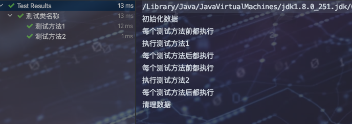
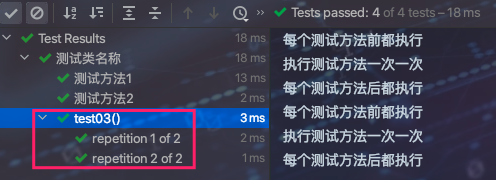
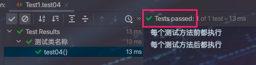
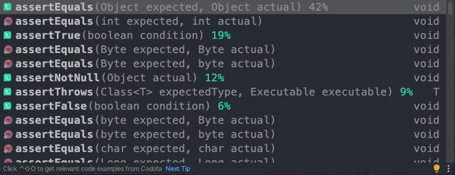
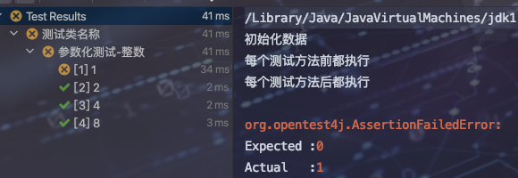

## 是什么

1. 以前在单体项目中，前后端一起搞，接口写完后直接使用界面调试，所见即所得，即使写单元测试也是在类中添加main函数进行测试。
2. 随着时间推移，前后端分离、并且代码质量要求越来越高、流程越来越规范，要求我们必须写完接口进行单元测试，以获得更高的代码质量。并且我们再也不能像之前那样类中写个main函数，因此出现了测试框架，提供了更加强大的IOC和AOP功能，使得测试代码完全解耦、并且有效管理代码测试覆盖率。


## Junit5

### 1、常用注解

* @Test

	表示方法是一种测试方法。与 JUnit 4 的@Test 注解不同，此注释不会声明任何属性

* @DisplayName

	为测试类或者测试方法自定义一个名称

* @Tag

	用于在类或方法级别声明用于过滤测试的标记

* @BeforeAll

	表示方法在所有测试方法之前运行，注意使用该注解的方法必须返回 void、访问级别不允许为 private，且必须声明为静态 (static) 方法，且只执行一次

* @AfterAll

	表示方法在所有测试方法之后运行，而且该注解的使用限制与 @BeforeAll 一致

* @BeforeEach

	表示方法在每个测试方法运行前都会运行

* @AfterEach

	表示方法在每个测试方法运行之后都会运行

* @Disabled

	用于禁用测试类或测试方法

* @Timeout

	表示测试方法运行如果超过了指定时间将会返回错误

* @ExtendWith

	用于注册自定义扩展，该注解可以继承

* @ParameterizedTest

	表示方法是参数化测试

* @RepeatedTest

	表示方法是重复测试


### 2、Java测试

* 简单使用

	```java
	@DisplayName("测试类名称")
	public class Test1 {
	
	    @BeforeAll
	    public static void init() {
	        System.out.println("初始化数据");
	    }
	
	    @BeforeEach
	    public void BeforeEach() {
	        System.out.println("每个测试方法前都执行");
	    }
	
	    @AfterEach
	    public void AfterEach() {
	        System.out.println("每个测试方法后都执行");
	    }
	
	
	    @AfterAll
	    public static void cleanup() {
	        System.out.println("清理数据");
	    }
	
	    @Test
	    @DisplayName("测试方法1")
	    public void test01() {
	        System.out.println("执行测试方法1");
	    }
	
	    @Test
	    @DisplayName("测试方法2")
	    public void test02() {
	        System.out.println("执行测试方法2");
	    }
	}
	```

	

* 重复测试

	```java
	@RepeatedTest(2)
	public void test03(){
	  System.out.println("执行测试方法一次一次");
	}
	```

	

* 组合测试

	```java
	@Test
	@DisplayName("组合测试")
	public void test07() {
	  assertAll("test",
	            () -> assertEquals(8, 5+3),
	            () -> assertEquals(5, 2+3)
	           );
	}
	```

	

### 3、断言

> 类似于Java中断言，用以提供执行方法是否能够达到预期值

* 基本使用

	```java
	@Test
	public void test04(){
	  int a = 1+2;
	  Assertions.assertEquals(3, a);
	}
	```

	

	

* 断言-超时

	```java
	@Test
	public void test04(){
	  Assertions.assertTimeout(Duration.of(3, ChronoUnit.SECONDS),()->{
	    Thread.sleep(2000);
	  });
	}
	```

* 断言-异常

	```java
	//有异常则通过
	@Test
	@DisplayName("异常断言")
	public void test05(){
	  Assertions.assertThrows(RuntimeException.class, ()->{
	    throw new RuntimeException();
	  });
	}
	```


### 4、参数化测试

> 提供多组数据源进行测试，防止一个参数对应一个测试用例。@ParameterizedTest

* 基本数据源测试

	> 支持基本数据类型作为参数进行测试  @ValueSource

	```java
	@ParameterizedTest 
	@ValueSource(ints = {1, 2, 4, 8})
	@DisplayName("参数化测试-整数")
	public void test06(int num) {
	  Assertions.assertEquals(0, num % 2);
	}
	```

	

* CSV数据源测试

	```java
	@ParameterizedTest
	@CsvSource({"1,One", "2,Two", "3,Three"})
	void testDataFromCsv(long id, String name) {
	  System.out.printf("id: %d, name: %s", id, name);
	}
	```

* 其他数据源

	* @EnumSource   Enum 枚举类型
	* @MethodSource   指定一个返回的 Stream / Array / 可迭代对象 的方法作为数据源
	* @ArgumentSource   通过实现 ArgumentsProvider 接口的参数类来作为数据源


### 5、按条件执行

* 自定义测试方法的执行顺序

	```java
	@TestMethodOrder(MethodOrderer.OrderAnnotation.class)  //todo 1.添加注解
	public class Test2 {
	    @Test
	    @Order(3)//todo 2.值越小越优先被执行
	    public void test03(){
	        System.out.println("执行---3");
	    }
	
	    @Test
	    @Order(2)
	    public void test02(){
	        System.out.println("执行---2");
	    }
	
	    @Test
	    @Order(1)
	    public void test01(){
	        System.out.println("执行---1");
	    }
	}
	```

* 按操作系统设置条件

	```java
	@TestMethodOrder(MethodOrderer.OrderAnnotation.class)
	public class Test2 {
	    @Test
	    @Order(3)
	    @EnabledOnOs({OS.WINDOWS,OS.LINUX})//操作系统是其中的一个就会被执行
	    public void test03(){
	        System.out.println("执行---3");
	    }
	
	    @Test
	    @Order(2)
	    @EnabledOnOs({OS.WINDOWS,OS.LINUX})//操作系统是其中的一个就不会被执行
	    public void test02(){
	        System.out.println("执行---2");
	    }
	}
	```

* 按JAVA环境设置条件

	* 注解EnabledOnJre指定多个JRE版本，只有当前JRE是其中的一个，测试方法才会执行；
	* 注解DisabledOnJre指定多个JRE版本，只要当前JRE是其中的一个，测试方法就不会执行；
	* 注解EnabledForJreRange指定JRE版本的范围，只有当前JRE在此范围内，测试方法才会执行；
	* 注解DisabledForJreRange指定JRE版本的范围，只要当前JRE在此范围内，测试方法就不会执行；

	```java
	@Test
	@Order(4)
	@EnabledOnJre({JRE.JAVA_9, JRE.JAVA_11})
	@DisplayName("Java环境：只有JAVA9和11版本才会执行")
	void onlyJava9And11Test() {
	  assertEquals(2, Math.addExact(1, 1));
	}
	
	@Test
	@Order(5)
	@DisabledOnJre({JRE.JAVA_9})
	@DisplayName("Java环境：JAVA9不执行")
	void withoutJava9Test() {
	  assertEquals(2, Math.addExact(1, 1));
	}
	
	@Test
	@Order(6)
	@EnabledForJreRange(min=JRE.JAVA_8, max=JRE.JAVA_11)
	@DisplayName("Java环境：从JAVA8到1之间的版本都会执行")
	void fromJava8To11Test() {
	  assertEquals(2, Math.addExact(1, 1));
	}
	
	```

* 按系统属性设置条件

	```java
	@Test
	@Order(7)
	@EnabledIfSystemProperty(named = "os.arch", matches = ".*64.*")
	@DisplayName("系统属性：64位操作系统才会执行")
	void only64BitArch() {
	  assertEquals(2, Math.addExact(1, 1));
	}
	
	@Test
	@Order(8)
	@DisabledIfSystemProperty(named = "java.vm.name", matches = ".*HotSpot.*")
	@DisplayName("系统属性：HotSpot不会执行")
	void withOutHotSpotTest() {
	  assertEquals(2, Math.addExact(1, 1));
	}
	```

* 按环境变量设置条件

* 自定义条件


## Mock

`测试桩`

​	只模拟被测试对象的返回即可

`mock`

* 对于前端来说，mock指的是mock server，模拟服务端返回的接口数据，用于前端开发接口联调

* 对于后端来说，有一些第三方接口或者其他微服务模块以及数据库数据都可以使用Mock进行模拟


### 1、使用Mock进行单元测试


