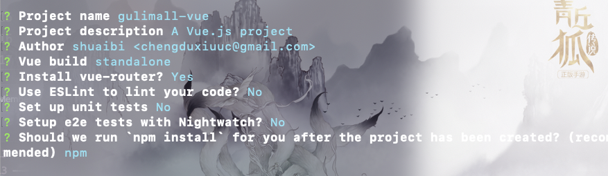
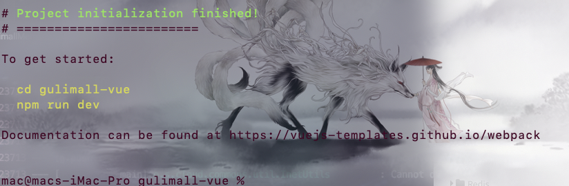
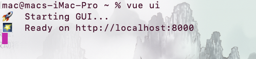
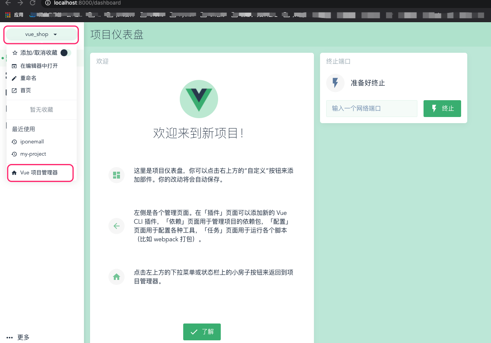
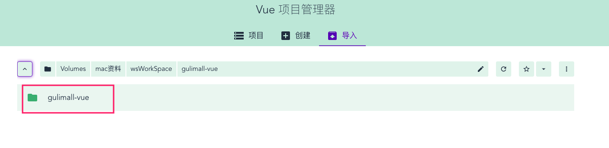
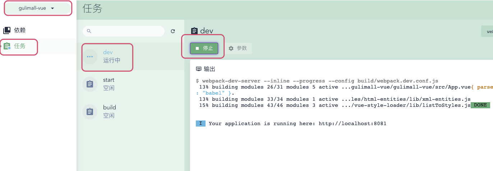

## 全局安装 webpack 

`用于打包`

 ```bash
npm install webpack -g
 ```


## 全局安装cli-init

`Vue脚手架 快速搭建Vue项目 `

```bash
npm install -g @vue/cli-init
```


## 初始化Vue项目

1. 新建项目文件 ==gulimall-vue==

2. 进入项目文件 

	```bash
	vue init webpack gulimall-vue
	```

	

	

3. 进入项目 

	```bash
	npm run dev
	```

	或者使用vue 提供的可视化界面管理项目

	```bash
	vue ui
	```

	* 打开可视化界面

		

	* 首页，添加新项目

		

	* 找到新建项目

		

	* 启动项目

		

## 整合 Element-ui

* 当前项目安装 Element-ui 

	```bash
	npm install element-ui --save
	```

* 引用以及使用

	```vue
	# main.js
	import 'element-ui/lib/theme-chalk/index.css'
	import ElementUI from 'element-ui'
	
	Vue.use(ElementUI)
	```

	