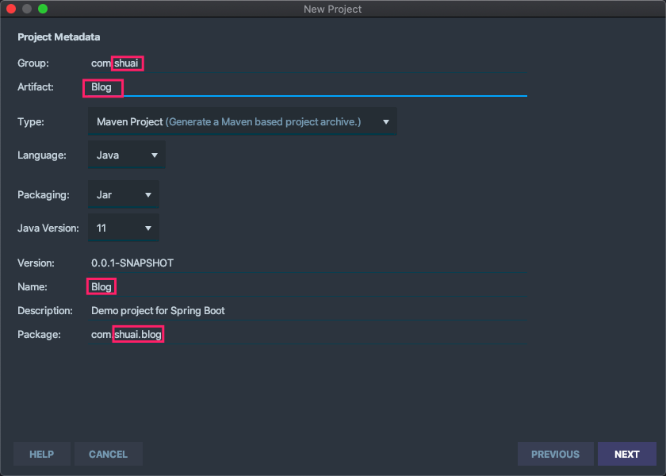
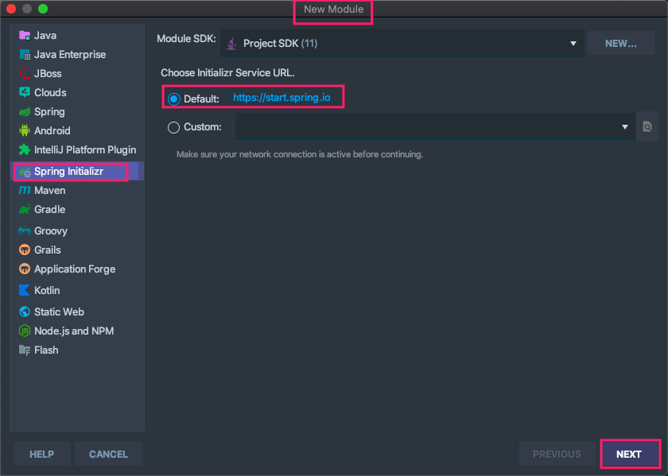
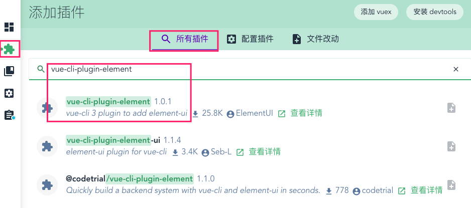

# 后台Spring boot多模块搭建

> 项目一般拆分成多个模块，由不同的项目组异步推进，如果每个模块都使用版本不一的第三方依赖模块，那么整个项目都难以维护，甚至奔溃。<font color=ff00ff>因此使用Maven多模块通过管理项目的多个模块依赖包版本等事项。</font>

### 背景：项目依赖关系


### 第一步 ：创建Spring boot项目，并删除src目录。




### 第二步：修改packing为pom

```properties
<packaging>pom</packaging>
```

### 第三步：新增Maven子模块common

 


### 第四步：修改pom文件下挂到父项目

```properties
<parent>
		<groupId>com.shuai</groupId>
		<artifactId>parent</artifactId>
		<version>0.0.1-SNAPSHOT</version>
		<relativePath>../pom.xml</relativePath> <!-- lookup parent from repository -->
</parent>
```

### 第五步：删除子模块中依赖和打包插件以及groupId

> 父模块中的打包插件也要删除掉，只保留启动模块的打包插件即可

具体pom文件如下：

```properties
<modelVersion>4.0.0</modelVersion>
	<parent>
		<groupId>com.shuai</groupId>
		<artifactId>parent</artifactId>
		<version>0.0.1-SNAPSHOT</version>
		<relativePath>../pom.xml</relativePath> <!-- lookup parent from repository -->
	</parent>
	<artifactId>common</artifactId>
	<version>0.0.1-SNAPSHOT</version>
	<name>common</name>
	<description>Demo project for Spring Boot</description>

	<properties>
		<java.version>11</java.version>
	</properties>

	<dependencies>
	</dependencies>

<!--删除子模块的打包插件-->
<!--	<build>-->
<!--		<plugins>-->
<!--			<plugin>-->
<!--				<groupId>org.springframework.boot</groupId>-->
<!--				<artifactId>spring-boot-maven-plugin</artifactId>-->
<!--			</plugin>-->
<!--		</plugins>-->
<!--	</build>-->
```

### 第六步：删除其他模块的启动文件以及resources目录下所有文件，并添加其他项目的依赖

在dependencies标签内添加如下依赖：

```properties
<dependencies>
		<dependency>
			<groupId>com.shuai</groupId>
			<artifactId>utils</artifactId>
			<version>0.0.1-SNAPSHOT</version>
			<scope>compile</scope>
		</dependency>
</dependencies>
```

### 第七步：新增utils模块

> 步骤与新增common一样。具体包括第三步到第六步，utils模块不依赖其他模块，因此只需要删除依赖而不需要添加其他依赖模块。

### 第八步：新增web模块

> web模块较特殊，其他非web模块都删除了启动文件，因此需要web模块来启动整个spring boot项目。
>
> 此模块保存启动文件和resources目录以及依赖。最后添加所有模块的依赖。

具体pom文件如下：

```properties
    <parent>
        <groupId>org.springframework.boot</groupId>
        <artifactId>spring-boot-starter-parent</artifactId>
        <version>2.3.2.RELEASE</version>
        <relativePath/> <!-- lookup parent from repository -->
    </parent>
    <groupId>com.shuai</groupId>
    <artifactId>web</artifactId>
    <version>0.0.1-SNAPSHOT</version>
    <name>web</name>
    <description>Demo project for Spring Boot</description>

    <properties>
        <java.version>11</java.version>
    </properties>

    <dependencies>
        <!--添加其他依赖模块-->
        <dependency>
            <groupId>com.shuai</groupId>
            <artifactId>utils</artifactId>
            <version>0.0.1-SNAPSHOT</version>
            <scope>compile</scope>
        </dependency>
        <dependency>
            <groupId>com.shuai</groupId>
            <artifactId>common</artifactId>
            <version>0.0.1-SNAPSHOT</version>
            <scope>compile</scope>
        </dependency>
        <dependency>
            <groupId>org.springframework.boot</groupId>
            <artifactId>spring-boot-starter-web</artifactId>
        </dependency>

        <dependency>
            <groupId>org.springframework.boot</groupId>
            <artifactId>spring-boot-starter-test</artifactId>
            <scope>test</scope>
            <exclusions>
                <exclusion>
                    <groupId>org.junit.vintage</groupId>
                    <artifactId>junit-vintage-engine</artifactId>
                </exclusion>
            </exclusions>
        </dependency>
    </dependencies>

    <build>
        <plugins>
            <plugin>
                <groupId>org.springframework.boot</groupId>
                <artifactId>spring-boot-maven-plugin</artifactId>
            </plugin>
        </plugins>
    </build>
```

### 第九步：为父模块pom文件新增其余模块所有依赖

```properties
<modules>
  <module>utils</module>
  <module>common</module>
  <module>web</module>
</modules>
```

### 第十步：测试

> 在utils模块中新增Utils类

```java
package com.shuai.utils;

/**
 * TODO:<p>  <p/>
 *
 * @package: com.shuai.utils
 * @Author mac
 * @Date 2020/8/7 10:17 下午
 * @Version V1.0
 **/
public class Utils {
    static String[] sexs="男,女".split(",");
    public static int numAddNum(int num){
        return num+18;
    }
    public static String getRandomSex(){
        return sexs[(int)(Math.random()*2)];
    }
}
```

> common模块中新增Studet类,并调用Utils类中方法

```java
package com.shuai.common.entiy;

import com.shuai.utils.Utils;

/**
 * TODO:<p>  <p/>
 *
 * @package: com.shuai.web.entiy
 * @Author mac
 * @Date 2020/8/7 9:58 下午
 * @Version V1.0
 **/
public class Student {
    private String name;
    private int age;
    private String sex;

    public String getName() {
        return name;
    }

    public void setName(String name) {
        this.name = name;
    }

    public int getAge() {
        return age;
    }

    public void setAge(int age) {
        this.age = Utils.numAddNum(age);
    }

    public String getSex() {
        return sex;
    }

    public void setSex(String sex) {
        this.sex = sex;
    }

    public Student(String name, int age, String sex) {
        this.name = name;
        this.age = Utils.numAddNum(age);
        this.sex = sex;
    }

    @Override
    public String toString() {
        return "Student{" +
                "name='" + name + '\'' +
                ", age=" + age +
                ", sex='" + sex + '\'' +
                '}';
    }
}
```

> 在web模块中新增controller类，并调用utils模块中Utils类、调用common模块Student类

```java
package com.shuai.web;

import com.shuai.common.entiy.Student;
import com.shuai.utils.Utils;
import org.springframework.stereotype.Controller;
import org.springframework.web.bind.annotation.RequestMapping;
import org.springframework.web.bind.annotation.ResponseBody;
import java.util.HashMap;
import java.util.Map;

/**
 * TODO:<p>  <p/>
 *
 * @package: com.shuai.web
 * @Author mac
 * @Date 2020/8/7 9:54 下午
 * @Version V1.0
 **/
@Controller
public class demoController {

    @ResponseBody
    @RequestMapping("/hello")
    public Map<String, String> hello(){
        Map map=new HashMap();
        for (int i=0;i<5;i++){
            Student student=new Student("name"+i, i,Utils.getRandomSex());
            map.put(String.valueOf(i), student.toString());
        }
        return map;
    }
}
```

> 启动


# 前台Vue项目搭建

### 1、使用vue-cli4脚手架搭建

```###vue
vue create blog-vue  按需引入插件:例如vuex 、router等等
```

### 2、优化项目目录


### 3、项目提交Git

### 4、引入element-ui插件

项目初始化后依赖以及插件(安装插件失败，恢复项目时用)





> 安装依赖的时候注意是否当前项目。。。