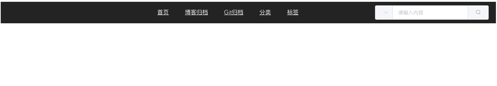
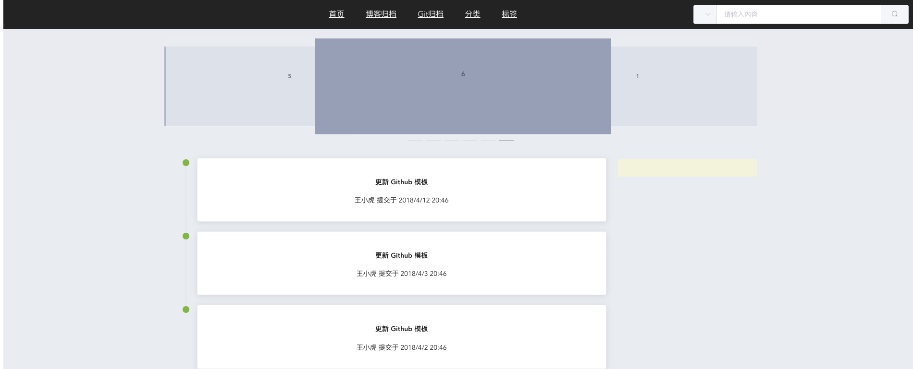

> 本想着在该项目的基础上再弄免登陆对外显示的页面，但是会破坏项目结构，因此决定使用jeecg-cloud搭建的前台项目(就是需要登录的项目)作为自己后端博客发布以及编辑。重新搭建一个前端项目来进行博客页面的显示。

## 前端项目搭建

* 可使用vue-ui可视化搭建也可使用命令`vue init`来创建

* 安装element-ui

	`npm install element-ui --save`

* 引入element-ui

	```javascript
	//引入element-ui
	import Element from 'element-ui'
	//全局使用
	Vue.use(Element)
	```

* 安装axios

	`npm install axios --save`

* 引入axios

	```javascript
	//引入axios
	import axios from 'axios'
	//使用axios
	Vue.prototype.$axios=axios
	```


## 添加Component

1. Home
2. BlogList
3. BlogDetail

## 调整路由

```JavaScript
import Vue from 'vue'
import Router from 'vue-router'
import Home from '../views/Home'
import BlogList from '../views/BlogList'
import BlogDetail from '../views/BlogDetail'

Vue.use(Router)
const routes= [
  {
    path: '/',
    name: 'Home',
    component: Home
  },
  {
    path: '/blog/list',
    name: 'BlogList',
    component: BlogList
  },
  {
    path: '/blog/detail/:blogId',
    name: 'BlogDetail',
    component: BlogDetail
  }
]

const router=new Router({
  mode: 'history',
  base:process.env.BABEL_ENV,
  routes
})
export default router
```

## Home页面搭建

1. 菜单栏和搜索框

	```
	<template>
	  <div>
	    <el-container style="">
	      <el-header style="background: #333333;">
	        <el-row :gutter="24" style="height: 50px;">
	          <el-col :span="4"><div class="grid-content bg-purple" ></div></el-col>
	          <el-col :span="14"><div class="grid-content bg-purple" >
	            <a href="#" style="margin-right: 20px;margin-left: 20px;color: #f9fafc">首页</a>
	            <a href="#" style="margin-right: 20px;margin-left: 20px;color: #f9fafc">博客归档</a>
	            <a href="#" style="margin-right: 20px;margin-left: 20px;color: #f9fafc">Git归档</a>
	            <a href="#" style="margin-right: 20px;margin-left: 20px;color: #f9fafc">分类</a>
	            <a href="#" style="margin-right: 20px;margin-left: 20px;color: #f9fafc">标签</a>
	          </div></el-col>
	          <el-col :span="6"><div class="grid-content bg-purple" >
	            <div style="margin-top: 15px;margin-top:0px">
	              <el-input placeholder="请输入内容" v-model="input3" class="input-with-select">
	                <el-select v-model="select" slot="prepend" placeholder="请选择">
	                  <el-option label="餐厅名" value="1"></el-option>
	                  <el-option label="订单号" value="2"></el-option>
	                  <el-option label="用户电话" value="3"></el-option>
	                </el-select>
	                <el-button slot="append" icon="el-icon-search"></el-button>
	              </el-input>
	            </div>
	          </div></el-col>
	        </el-row>
	      </el-header>
	      <el-main>
	        <BlogList></BlogList>
	      </el-main>
	    </el-container>
	  </div>
	</template>
	
	<script>
	  export default {
	        name: "Home",
	        data() {
	          return {
	            input3:'',
	            select:'',
	          };
	        },
	    }
	</script>
	
	<style scoped>
	  @import '../assets/Home.css';
	</style>
	```



2. 主体内容 引入BlogList.vue

	```javascript
	import BlogList from './BlogList.vue'
	  export default {
	     components: {BlogList},
	  }
	```

3. BlogList.vue

	```javascript
	<template>
	  <div>
	    <el-row :gutter="24">
	      <el-col :span="4"><div class="grid-content bg-purple"></div></el-col>
	      <el-col :span="16"><div class="grid-content bg-purple">
	        <el-carousel :interval="4000" type="card" height="200px">
	          <el-carousel-item v-for="item in 6" :key="item">
	            <h3 class="medium">{{ item }}</h3>
	          </el-carousel-item>
	        </el-carousel>
	      </div></el-col>
	      <el-col :span="4"><div class="grid-content bg-purple"></div></el-col>
	    </el-row>
	    <el-row :gutter="24">
	      <el-col :span="4"><div class="grid-content bg-purple"></div></el-col>
	      <el-col :span="16"><div class="grid-content bg-purple">
	        <el-row :gutter="24">
	          <el-col :span="18"><div class="grid-content bg-purple">
	            <el-timeline>
	              <el-timeline-item timestamp="2018/4/12" placement="top" :hide-timestamp="true" type="success" size="large">
	                <el-card>
	                  <h4>更新 Github 模板</h4>
	                  <p>王小虎 提交于 2018/4/12 20:46</p>
	                </el-card>
	              </el-timeline-item>
	              <el-timeline-item timestamp="2018/4/3" placement="top" :hide-timestamp="true" type="success" size="large">
	                <el-card>
	                  <h4>更新 Github 模板</h4>
	                  <p>王小虎 提交于 2018/4/3 20:46</p>
	                </el-card>
	              </el-timeline-item>
	              <el-timeline-item timestamp="2018/4/2" placement="top" :hide-timestamp="true" type="success" size="large" >
	                <el-card>
	                  <h4>更新 Github 模板</h4>
	                  <p>王小虎 提交于 2018/4/2 20:46</p>
	                </el-card>
	              </el-timeline-item>
	            </el-timeline>
	          </div></el-col>
	          <el-col :span="6"><div class="grid-content bg-purple" style="background: beige"></div></el-col>
	        </el-row>
	      </div></el-col>
	      <el-col :span="4"><div class="grid-content bg-purple"></div></el-col>
	    </el-row>
	  </div>
	</template>
	
	<script>
	    export default {
	        name: "BlogList",
	    }
	</script>
	
	<style scoped>
	  @import "../assets/BlogList.css";
	
	</style>
	```

	> 其中css都是从官方文档拔下来的。需要的可以去下载




> ·首页大体框架已搭建好，下面就将按功能分章节来总结。