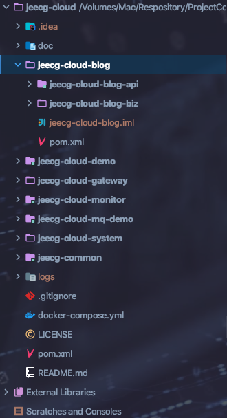
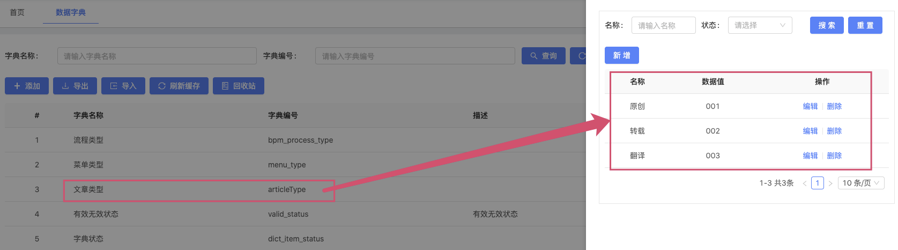
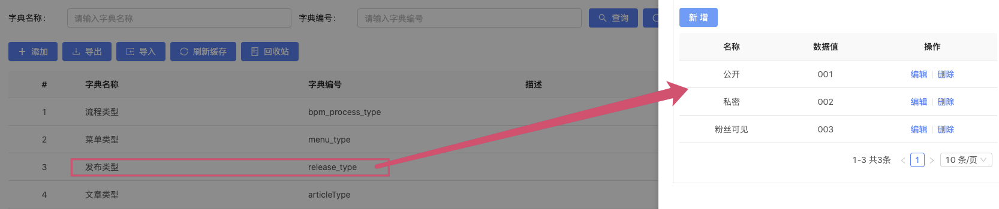
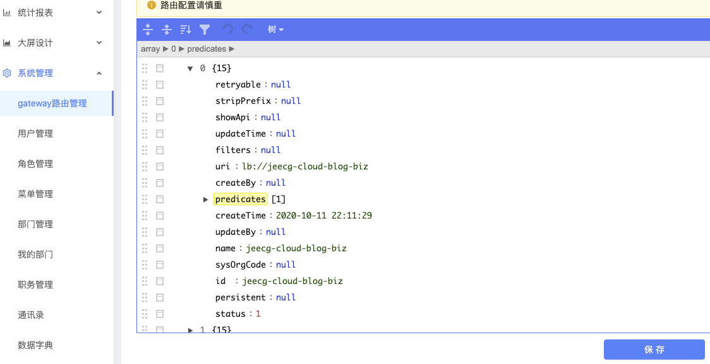
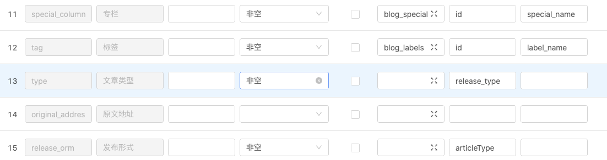
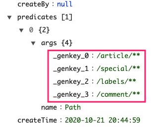
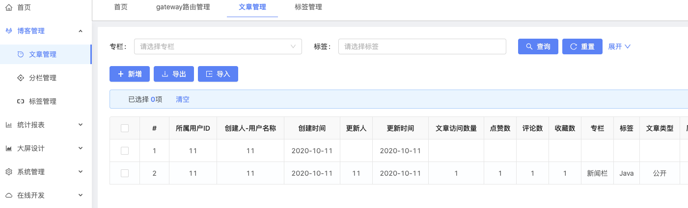
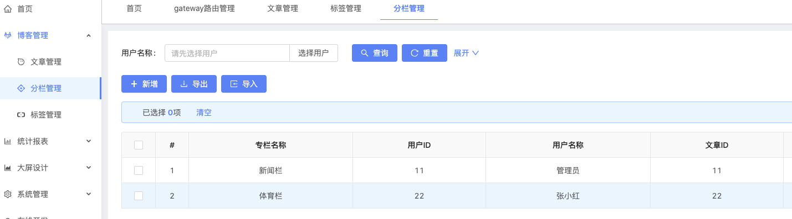
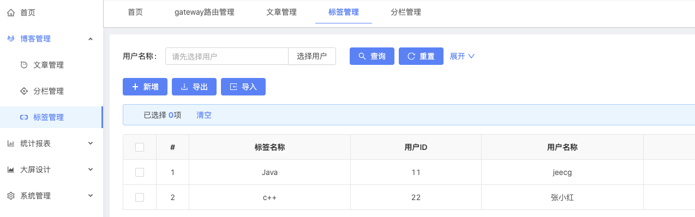
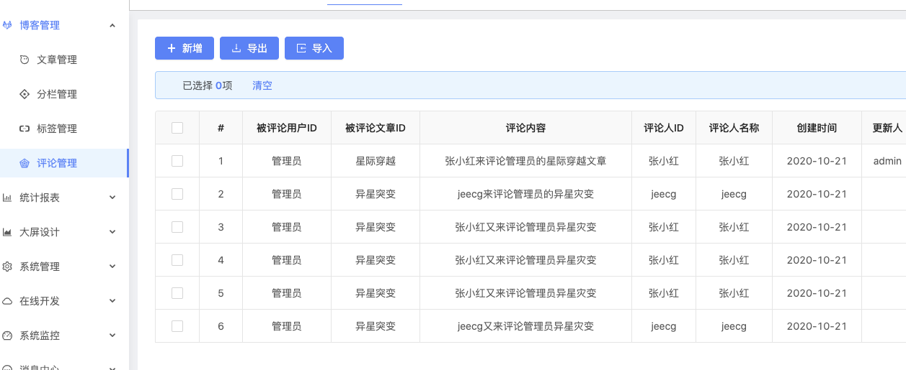

## 初衷

Java开发也有一年多了，平时工作之余学了很多技术，由于工作中并不能完完全全的进行实践。因此萌生了自己开发一个项目来给自己现阶段做一个总结。做什么好呢？博客系统吧，据说博客系统是每个开发人员必备的技能点😺。

## 达到什么效果

既然下定做一件事，那就要给这件事确立一个目标或者是要达到什么效果。

思来想去：

* 静态博客和动态博客？

	静态博客相对于简单。并且并不能很好的锻炼Java技术。

* 个人博客和博客网站？

	个人博客给自己使用，对于用户群体数据量以及并发量并不如博客网站来的猛烈。虽然博客网站也不见得有几个用户使用。但是、聊胜于无嘛，有了这个出发点以后我们开发完网站后对此进行模拟测试。

## 技术栈

`开发平台：`jeecg-cloud

   * 开发环境
	- 语言：Java 8
	- IDE(JAVA)： IDEA / Eclipse安装lombok插件
	- IDE(前端)： WebStorm 或者 IDEA
	- 依赖管理：Maven
	- 数据库：MySQL5.7+ & Oracle 11g & Sqlserver2017
	- 缓存：Redis
* 后端
	* 基础框架：Spring Boot 2.1.3.RELEASE \ Spring Cloud Alibaba 2.1.0.RELEASE
	* 持久层框架：Mybatis-plus_3.1.2
	* 安全框架：Apache Shiro 1.4.0，Jwt_3.7.0
	* 微服务技术：Spring Cloud Alibaba、Nacos、Gateway、Sentinel、Skywarking
	* 数据库连接池：阿里巴巴Druid 1.1.10
	* 缓存框架：redis
	* 日志打印：logback
	* 其他：fastjson，poi，Swagger-ui，quartz, lombok（简化代码）等。
* 前端
	* [Vue 2.6.10](https://cn.vuejs.org/),[Vuex](https://vuex.vuejs.org/zh/),[Vue Router](https://router.vuejs.org/zh/)
	* [Axios](https://github.com/axios/axios)
	* [ant-design-vue](https://vuecomponent.github.io/ant-design-vue/docs/vue/introduce-cn/)
	* [webpack](https://www.webpackjs.com/),[yarn](https://yarnpkg.com/zh-Hans/)
	* [vue-cropper](https://github.com/xyxiao001/vue-cropper) - 头像裁剪组件
	* [@antv/g2](https://antv.alipay.com/zh-cn/index.html) - Alipay AntV 数据可视化图表
	* [Viser-vue](https://viserjs.github.io/docs.html#/viser/guide/installation) - antv/g2 封装实现
	* eslint，[@vue/cli 3.2.1](https://cli.vuejs.org/zh/guide)
	* vue-print-nb - 打印

## 后端项目部署

1. 克隆 jeecg-cloud ： https://gitee.com/jeecg/jeecg-cloud.git

2. 创建Maven模块jeecg-cloud-blog及其两个子模块。具体规范可移至http://doc.cloud.jeecg.com/1737170

3. 表设计

  * 文章表
  * 专栏表
  * 标签表
  * 评论表
  * 文章类型数据字典
  * 文章发布形式数据字典

  

  ​		

  

  

4. 在线代码生成文章、标签、分栏、品论

	`为博客模块添加路由规则`:

	

	* 文章

		* 字段关联

			

		* 路径映射至网关

			

	* 标签分栏评论类似

	* 效果如下图

		

		

		
		
		

​						

