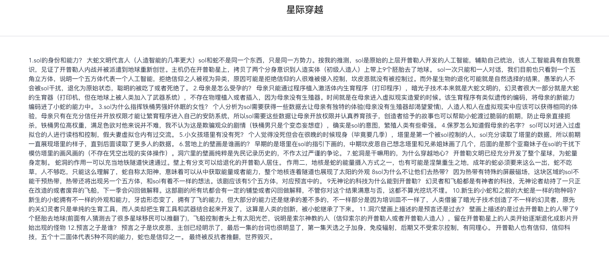

 ## 博客列表跳转博客详情

1. ~~安装 mavon-editor~~

	> npm install mavon-editor --save

2. ~~注册~~

	```javascript
	// 引入mavon-editor
	import mavonEditor from 'mavon-editor'
	import 'mavon-editor/dist/css/index.css'
	Vue.use(mavonEditor)
	```

3. ~~安装解析md文档插件~~

	> npm install markdown-it --save
	>
	> npm install github-markdown-css

4. 以上都不要安装，因为在后台vue中发布文章有md和HTML两种格式内容

5. BlogDetail.vue

	```JavaScript
	<template>
	  <div>
	    <el-container>
	      <el-header><h2 style="margin-top:10px ">{{ blog.title }}</h2></el-header>
	      <el-divider></el-divider>
	      <el-main>
	        <el-row :gutter="24">
	          <el-col :span="4"><div class="grid-content bg-purple"></div></el-col>
	          <el-col :span="16"><div class="grid-content bg-purple">
	            <div v-html="blog.content" style="text-align: left"/>
	          </div></el-col>
	          <el-col :span="4"><div class="grid-content bg-purple"></div></el-col>
	        </el-row>
	      </el-main>
	    </el-container>
	  </div>
	</template>
	
	<script>
	    import {getAction} from "../api/manage";
	
	    export default {
	      name: "BlogDetail",
	      data(){
	        return{
	          url:{
	            queryById: '/article/blogArticle/queryById',
	          },
	          blog:{
	            title:'',
	            content:''
	          }
	        }
	      },
	      created() {
	        this.getArticleById(this.$route.params.blogId);
	      },
	      methods: {
	        getArticleById(articleId) {
	          console.log(articleId);
	          getAction(this.url.queryById, {id: articleId})
	            .then((res) => {
	              console.log(res)
	              if (res.data.success) {
	                this.blog.title = res.data.result.title;
	                this.blog.content = res.data.result.htmlContent;
	              }
	            })
	            .catch((e) => {
	              this.$message({
	                message: '刷新失败 !',
	                type: 'warning'
	              });
	              console.log('刷新失败', e)
	            })
	        },
	      },
	    }
	</script>
	
	<style scoped>
	  .el-row {
	    margin-bottom: 20px;
	  &:last-child {
	     margin-bottom: 0;
	   }
	  }
	  .el-col {
	    border-radius: 4px;
	  }
	  .bg-purple-dark {
	    background: #99a9bf;
	  }
	  .bg-purple {
	    /*background: #d3dce6;*/
	  }
	  .bg-purple-light {
	    background: #e5e9f2;
	  }
	  .grid-content {
	    border-radius: 4px;
	    min-height: 36px;
	  }
	  .row-bg {
	    padding: 10px 0;
	    background-color: #f9fafc;
	  }
	</style>
	```

