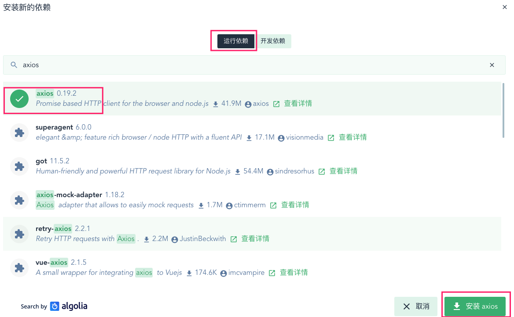
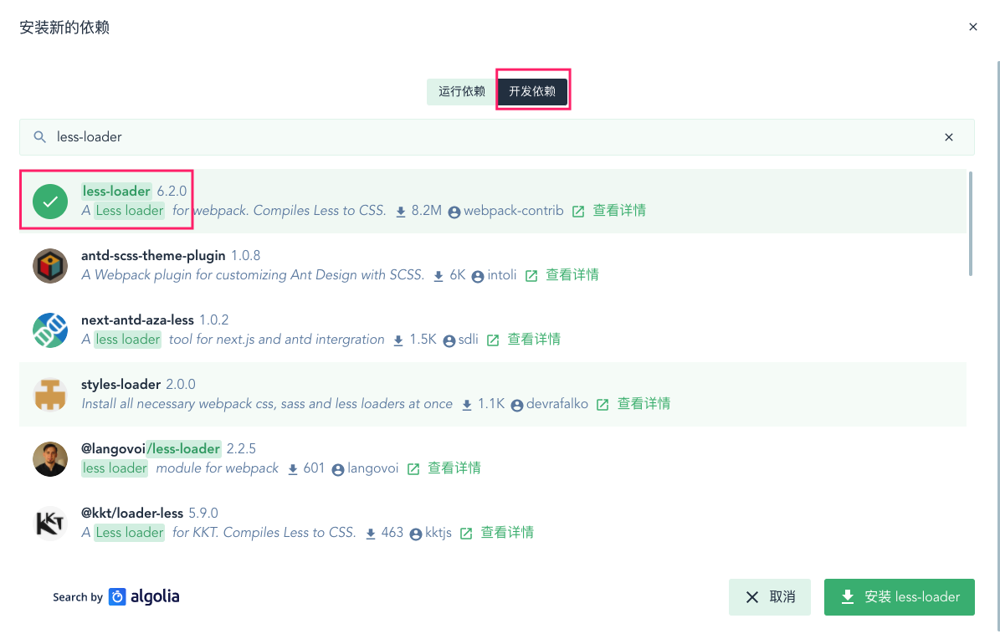

# login模块开发

### 1、Git新建login分支

```bash
git checkout -b login
```

### 2、前端开发

#### ① 安装axios依赖



#### ②图标库替换

element-UI组件库中图标太少且单一，使用阿里图标库代替。

> 下载地址：https://download.csdn.net/download/sinat_37064286/12702599

> 使用规则在下载压缩包中demo_fontclass.html文件。

#### ③ 使用网络封装axios

> 由于在使用vue create初始化项目时就以选定axios因此直接使用即可，否则就在vue ui可视化中添加运行依赖axios即可。

在main.js中引入阿里图标、自定义全局样式以及axios(网络框架类似于ajax，稍后使用自定义网络封装axios请求，正好使用ES6中提供的Promise类封装网络请求)。

```javascript
// 导入字体图标
import './assets/fonts/iconfont.css'
// 导入全局样式表
import './assets/css/global.css'
import axios from 'axios'
// 配置请求的跟路径
axios.defaults.baseURL = 'http://127.0.0.1:8888/api/private/v1/'
Vue.prototype.$http = axios
```

#### ④ element-ui引入Button, Form, FormItem, Input, Message, Row, Col, Tooltip, Link

```javascript
import Vue from 'vue'
import { Button, Form, FormItem, Input, Message, Row, Col, Tooltip, Link } from 'element-ui'

Vue.use(Button)
Vue.use(Form)
Vue.use(FormItem)
Vue.use(Input)
Vue.use(Row)
Vue.use(Col)
Vue.use(Tooltip)
Vue.use(Link)
Vue.prototype.$message = Message

```

#### ⑤Login组件

```vue
<template>
    <div class="login_container">
        <div class="login_box">
            <!-- 头像区域 -->
            <div class="avatar_box">
                
            </div>
            <!-- 登录表单区域 -->
            <el-form ref="loginFormRef" :model="loginForm" :rules="loginFormRules" label-width="0px" class="login_form">
                <!-- 用户名 -->
                <el-form-item prop="username">
                    <el-input v-model="loginForm.username" prefix-icon="iconfont icon-user"></el-input>
                </el-form-item>
                <!-- 密码 -->
                <el-form-item prop="password">
                    <el-input v-model="loginForm.password" prefix-icon="iconfont icon-3702mima" type="password"></el-input>
                </el-form-item>
                <!--访客登录-->
                <el-link type="success">访客登录</el-link>
                    <!-- 按钮区域 -->
                <el-form-item class="btns">
                    <el-button type="primary" @click="login">登录</el-button>
                    <el-button type="info" @click="resetLoginForm">重置</el-button>
                </el-form-item>
            </el-form>
        </div>
    </div>
</template>

<script>
    export default {
        data() {
            return {
                // 这是登录表单的数据绑定对象
                loginForm: {
                    username: 'admin',
                    password: '123456'
                },
                // 这是表单的验证规则对象
                loginFormRules: {
                    // 验证用户名是否合法
                    username: [
                        { required: true, message: '请输入登录名称', trigger: 'blur' },
                        { min: 3, max: 10, message: '长度在 3 到 10 个字符', trigger: 'blur' }
                    ],
                    // 验证密码是否合法
                    password: [
                        { required: true, message: '请输入登录密码', trigger: 'blur' },
                        { min: 6, max: 15, message: '长度在 6 到 15 个字符', trigger: 'blur' }
                    ]
                },
                visitorUrl:'../../assets/login.png',
            }
        },
        methods: {
            // 点击重置按钮，重置登录表单
            resetLoginForm() {
                // console.log(this);
                this.$refs.loginFormRef.resetFields()
            },
            login() {
                this.$refs.loginFormRef.validate(async valid => {
                    if (!valid) return
                    const { data: res } = await this.$http.post('login', this.loginForm)
                    if (res.meta.status !== 200) return this.$message.error('登录失败！')
                    this.$message.success('登录成功')
                    // 2. 通过编程式导航跳转到后台主页，路由地址是 /home
                    this.$router.push('/home')
                })
            }
        }
    }
</script>

<style lang="less" scoped>
    .login_container {
        background-color: #2b4b6b;
        height: 100%;
    }

    .login_box {
        width: 450px;
        height: 300px;
        background-color: #fff;
        border-radius: 3px;
        position: absolute;
        left: 50%;
        top: 50%;
        transform: translate(-50%, -50%);

        .avatar_box {
            height: 130px;
            width: 130px;
            border: 1px solid #eee;
            border-radius: 50%;
            padding: 10px;
            box-shadow: 0 0 10px #ddd;
            position: absolute;
            left: 50%;
            transform: translate(-50%, -50%);
            background-color: #fff;
            img {
                width: 100%;
                height: 100%;
                border-radius: 50%;
                background-color: #eee;
            }
        }
    }

    .login_form {
        position: absolute;
        bottom: 0;
        width: 100%;
        padding: 0 20px;
        box-sizing: border-box;
    }

    .btns {
        display: flex;
        justify-content: flex-end;
    }
</style>

```

#### ⑥ 路由新增login映射

```javascript
import Vue from 'vue'
import VueRouter from 'vue-router'
import Login from "../views/login/Login";
import Home from "../views/login/Home";


Vue.use(VueRouter)

  const routes = [
  {
    path: '/',
    redirect: '/login'
  },
  {
    path: '/login',
    name: 'About',
    component: Login
  },
  {
    path: '/home',
    component: Home
  }
]

const router = new VueRouter({
  mode: 'history',
  base: process.env.BASE_URL,
  routes
})

export default router
```


> 启动项目报错 ： Failed to resolve loader: less-loader You may need to install it.  安装less-loader即可

  

### 3、Spring boot新建login模块

#### ① 集成Lombok

> ```xml
> <!--父模块版本管理-->
> <properties>
>   <java.version>11</java.version>
>   <lombok-version>1.16.10</lombok-version>
> </properties>
> <!--父模块依赖-子模块选择继承-->
> <dependencyManagement>
>   <dependencies>
>     <!-- https://mvnrepository.com/artifact/org.projectlombok/lombok -->
>     <dependency>
>       <groupId>org.projectlombok</groupId>
>       <artifactId>lombok</artifactId>
>       <version>${lombok.version}</version>
>     </dependency>
>   </dependencies>
> </dependencyManagement>
> <!--不需要管理依赖 全部无条件继承-->
> <dependencies>
>   <dependency>
>     <groupId>org.springframework.boot</groupId>
>     <artifactId>spring-boot-starter-web</artifactId>
>   </dependency>
> 
>   <dependency>
>     <groupId>org.springframework.boot</groupId>
>     <artifactId>spring-boot-starter-test</artifactId>
>     <scope>test</scope>
>     <exclusions>
>       <exclusion>
>         <groupId>org.junit.vintage</groupId>
>         <artifactId>junit-vintage-engine</artifactId>
>       </exclusion>
>     </exclusions>
>   </dependency>
> </dependencies>
> ```

#### ② login模块选择继承lombok

```xml
<!--选择继承-->
<dependency>
    <groupId>org.projectlombok</groupId>
    <artifactId>lombok</artifactId>
</dependency>
```

#### ③ 集成jpa以及MySQL

```
<!--login模块和common模块添加-->
<!--JPA Spring Data JPA是更大的Spring Data系列的一部分，可以轻松实现基于JPA的存储库-->
<dependency>
    <groupId>org.springframework.boot</groupId>
    <artifactId>spring-boot-starter-data-jpa</artifactId>
</dependency>

<!--MySQL-->
<dependency>
    <groupId>mysql</groupId>
    <artifactId>mysql-connector-java</artifactId>
    <scope>runtime</scope>
</dependency>
```

#### ④父模块和login模块添加依赖 <第一章有介绍>

#### ⑤common模块新增User实体类以及jpa-user接口

```java
@Data
@Entity
public class User {
    @Id
    @GeneratedValue(strategy = GenerationType.AUTO)
    private String name;
    private String password;
    private java.util.Date updateTime;
}
```

```java
public interface UserRepository extends JpaRepository<User,String> {
}
```

#### ⑥ login模块中新增UserController

```java
@RestController
@RequestMapping("/login")
public class LoginController {
    @Autowired
    private UserRepository userRepository;
    @GetMapping(value = "/getUser")
    public void findAll(){
        System.out.println(userRepository.findAll());
    }

}
```


<font color=red>web模块中访问login模块controller失败404</font>