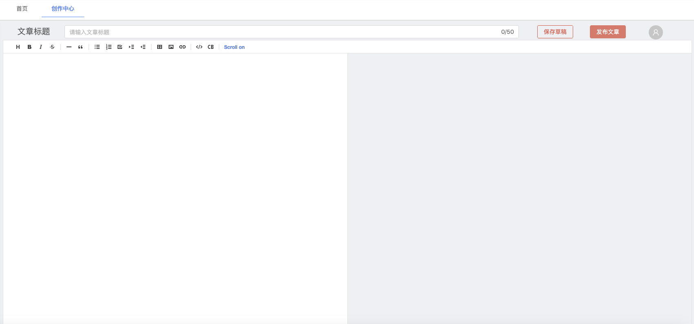
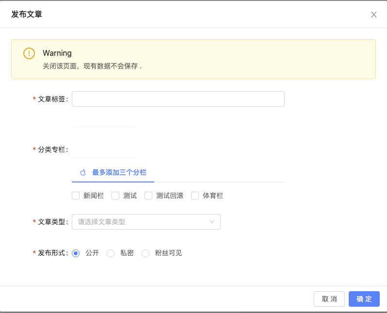

## 效果图






## 前台代码

```vue
<template>
<div>
  <a-row type="flex">
    <!-- <p>文章标题 </p> -->
    <a-col :flex="1" style="height: 36px; text-align: center">
      <p style="font-size: 20px; height: 36px">文章标题</p>
    </a-col>
    <a-col :flex="13" style="height: 36px">
      <a-input placeholder="请输入文章标题" v-model="article.title" @change="controlLen" :suffix="article.titleNum" />
    </a-col>
    <a-col :flex="1" style="height: 36px">
      <a-button type="danger" ghost style="left: 45px" @click="saveManually">保存草稿</a-button>
    </a-col>
    <a-col :flex="1" style="height: 36px">
      <a-button type="danger" style="left: 15px" @click="() => (modal.visible = true)">发布文章</a-button>
      <a-modal :visible.sync="modal.visible" :width="800" :title="modal.title" :fullscreen.sync="modal.fullscreen" :switchFullscreen="modal.switchFullscreen" @ok="handleOk" @cancel="handleCancel">
        <a-form-model ref="ruleForm" :model="modal" :label-col="modal.labelCol" :wrapper-col="modal.wrapperCol">
          <a-alert message="Warning" description="关闭该页面，现有数据不会保存 ." type="warning" show-icon /></br>
          <a-form-model-item label="文章标签" prop="labels" required>
            <j-select-multiple v-model="modal.selectLabels" :options="modal.allLabels.options" />
            <a-popover placement="bottomLeft" trigger="click" v-model="modal.labelVisible">
              <template slot="content">
                <a-input placeholder="回车即可添加" style="width: 400px" @pressEnter="addLabels" v-model="modal.addLabelsInput" />
              </template>
              <template slot="title">
                <span>最多添加5个标签</span>
              </template>
              <a-button type="dashed" ghost icon="plus-square"> 添加文章标签 </a-button>
            </a-popover>
          </a-form-model-item>

          <a-form-model-item label="分类专栏" prop="special" required>
            <a-popover placement="bottomLeft" trigger="click" v-model="modal.specialVisible">
              <template slot="content">
                <a-input placeholder="回车即可添加" style="width: 400px" @pressEnter="addSpecial" v-model="modal.addSpecialInput" />
              </template>
              <template slot="title">
                <span>添加分栏</span>
              </template>
              <a-button type="dashed" ghost icon="plus-square"> 新建分类专栏 </a-button>
            </a-popover>

            <a-tabs default-active-key="1">
              <a-tab-pane key="1">
                <span slot="tab">
                  <a-icon type="apple" />
                  最多添加三个分栏
                </span>
                <a-checkbox-group :options="modal.allSpecial.options" @change="SpecialOnChange" />
              </a-tab-pane>
            </a-tabs>
          </a-form-model-item>
          <a-form-model-item label="文章类型" required>
<!--            <j-dict-select-tag v-model="modal.articleType" dictCode="articleType" placeholder="请选择文章类型">-->
<!--            </j-dict-select-tag>-->
            <a-cascader style="width: 70%;" :options="modal.articleTypes" v-model="modal.articleType" @change="articleTypeChange" placeholder="请选择文章类型" />
            <a-input placeholder="请输入转载文章URL地址" v-model="article.ReprintURL" allow-clear :style="{ 'display': article.ReprintUrlVariable}" />
          </a-form-model-item>
          <a-form-model-item label="发布形式" required>
            <a-radio-group name="发布形式" :default-value="1" v-model="modal.releaseType">
              <a-radio :value="1"> 公开 </a-radio>
              <a-radio :value="2"> 私密 </a-radio>
              <a-radio :value="3"> 粉丝可见 </a-radio>
            </a-radio-group>
          </a-form-model-item>
        </a-form-model>
      </a-modal>
    </a-col>
    <a-col :flex="1" style="height: 36px">
      <a-avatar style="backgroundcolor: #87d068" icon="user" :size="35" />
    </a-col>
  </a-row>
  <a-form-item style="min-height: 100%">
    <j-markdown-editor v-model="article.content" :style="{ height: '800px' }"></j-markdown-editor>
  </a-form-item>
</div>
</template>

<script>
import {
  putAction,
  getAction,
  httpAction
} from '@/api/manage'
import JMarkdownEditor from '@/components/jeecg/JMarkdownEditor/index'
import JSelectMultiUser from '@/components/jeecgbiz/JSelectMultiUser'
import JSelectMultiple from '@/components/jeecg/JSelectMultiple'
//新增标签和分栏
const newAddLabels = []
const newAddSpecial = []

export default {
  name: 'BlogSpecialColumnList',
  components: {
    JMarkdownEditor,
    JSelectMultiUser,
    JSelectMultiple,
  },
  data() {
    return {
      description: '创作中心',
      url: {
        listAllLabels: '/labels/blogLabels/listAll',
        listAllSpecial: '/special/blogSpecialColumn/listAll',
        articleAdd: "/article/blogArticle/addAll",
        groupAriticleType: "/article/blogArticle/groupAriticleType",
      },
      article: {
        content: '',
        title: '',
        titleNum: '0/50',
        ReprintUrlVariable: 'none',
        ReprintURL:'',
      },
      modal: {
        title: '发布文章',
        visible: false,
        labelVisible: false,
        specialVisible: false,
        addLabelsInput: '',
        addSpecialInput: '',
        fullscreen: false,
        switchFullscreen: true,
        articleType: undefined,
        releaseType: 1,
        allLabels: {
          options: [], //所有数据
        },
        selectLabels: '', //选择标签数据
        allSpecial: {
          options: [], //所有数据
        },
        selectSpecial: '', //选择分栏数据
        articleTypes:[],
        labelCol: {
          span: 4,
        },
        wrapperCol: {
          span: 14,
        },
      },
    }
  },
  computed: {},
  created() {
    this.dataInit();
    this.initArticle()
    this.saveDraft()
    this.getLabels()
    this.getSpecials()
    this.getArticleType()
  },
  destroyed() {
    window.clearInterval(this.timer);
    this.$message.success("组件销毁时使用")
  },
  methods: {
    //计算标题长度
    controlLen(e) {
      const {
        value
      } = e.target
      this.article.title = value
      this.article.titleNum = value.length + '/50'
      if (value.length > 50) {
        this.$message.warning('标题长度超过50 ！')
      }
    },
    //定时保存文章草稿
    saveDraft() {
      if (!window.localStorage) {
        this.$message.warning('浏览器不支持localstorage,文章并不能使用草稿！')
        return false
      } else {
        this.timer = setInterval(() => {
          var tempArticle = {
            title: this.article.title,
            content: this.article.content,
          }
          console.log('开始定时...每过10秒执行一次', tempArticle.title, tempArticle.content)
          localStorage.setItem('tempArticle', JSON.stringify(tempArticle))
          this.$message.success('文章已保存草稿 ！')
        }, 10000)
      }
    },
    //手动保存草稿
    saveManually() {

      if (!window.localStorage) {
        this.$message.warning('浏览器不支持localstorage,文章并不能使用草稿！')
        return false
      } else {
        if (
          (this.article.title == null || this.article.title == '' || this.article.title == 'undefined') &&
          (this.article.content == null || this.article.content == '' || this.article.content == 'undefined')
        ) {
          this.$message.warning('草稿中没有数据！')
          return false
        } else {
          var tempArticle = {
            title: this.article.title,
            content: this.article.content,
          }
          localStorage.setItem('tempArticle', JSON.stringify(tempArticle))
          this.$message.success('文章已保存草稿 ！')
        }
      }
    },
    // 从localStorage获取缓冲文章
    initArticle() {
      var article = localStorage.getItem('tempArticle')
      console.log('获取到缓冲文章 ', article)
      if (null!==article){

        this.article.title = JSON.parse(article).title
        this.article.content = JSON.parse(article).content
        this.article.titleNum = this.article.title.length + '/50'

      }
    },
    //获取文章分标签
    getLabels(param) {
      getAction(this.url.listAllLabels, param)
        .then((res) => {
          if (res.success) {
            console.log('获取所有标签数据有：', res)
            res.result.forEach((item, i) => {
              this.modal.allLabels.options.push({
                label: item.labelName,
                value: item.labelName,
              })
            })
          }
        })
        .catch((e) => {
          this.$message.warn('标签刷新失败')
          console.log('标签刷新失败', e)
        })
    },
    //添加标签
    addLabels(event) {
      const {
        value
      } = event.target
      let flag = true
      this.modal.allLabels.options.forEach((x) => {
        if (x.value == value) {
          this.$message.error('已存标签！')
          flag = false
        }
      })
      if (!flag) {
        this.modal.labelVisible = true
        this.modal.addLabelsInput = ''
        return false
      }
      this.modal.allLabels.options.push({
        label: value,
        value: value,
      })
      this.modal.labelVisible = true
      this.modal.addLabelsInput = ''
      newAddLabels.push(value)
      this.$message.success('添加分栏成功 ！')
      console.log('新增标签有 ：', newAddLabels)
    },
    //获取分栏数据
    getSpecials(param) {
      getAction(this.url.listAllSpecial, param)
        .then((res) => {
          if (res.success) {
            console.log('获取所有分栏数据有：', res)
            res.result.forEach((item, i) => {
              this.modal.allSpecial.options.push({
                label: item.specialName,
                value: item.specialName,
              })
            })
          }
        })
        .catch((e) => {
          this.$message.warn('分栏刷新失败')
          console.log('分栏刷新失败', e)
        })
    },
    //添加分栏
    addSpecial(event) {
      const {
        value
      } = event.target
      let flag = true
      this.modal.allSpecial.options.forEach((x) => {
        if (x.label == value) {
          this.$message.error('已存在分栏！')
          flag = false
        }
      })
      if (!flag) {
        this.modal.specialVisible = true
        this.modal.addSpecialInput = ''
        return false
      }
      this.modal.allSpecial.options.push({
        label: value,
        value: value,
      })
      this.modal.specialVisible = true
      this.modal.addSpecialInput = ''
      newAddSpecial.push(value)
      this.$message.success('添加分栏成功 !')
      console.log('新增分栏有 ：', newAddSpecial)
    },
    //获取文章类型
    getArticleType(param){
      getAction(this.url.groupAriticleType, param)
        .then((res) => {
          if (res.success) {
            console.log('获取文章分类数据有：', res)
            if (res.result.length>0){
              res.result.forEach((item, i) => {
                this.modal.articleTypes.push({
                  label: item.text,
                  value: item.value,
                })
              })
            }
          }
        })
        .catch((e) => {
          this.$message.warn('分栏刷新失败')
          console.log('分栏刷新失败', e)
        })
    },
    //分栏选择
    SpecialOnChange(checkedValues) {
      this.modal.selectSpecial = checkedValues
      console.log('分栏选择有 ：', this.modal.selectSpecial)
      console.log('标签选择有 ：', this.modal.selectLabels)
    },
    handleOk(e) {
      if (!this.check()) return false
      //获取下发的数据
      let articleData = {
        //文章标题
        title: this.article.title,
        //文章内容
        content: this.article.content,
        //选中文章标签
        selectLabels: this.modal.selectLabels,
        //新增文章标签
        newAddLabels: newAddLabels,
        //选中文章分栏
        selectSpecials: this.modal.selectSpecial,
        //新增文章分栏
        newAddSpecials: newAddSpecial,
        //文章类型
        articleType: this.modal.articleType,
        //发布形式
        releaseType: this.modal.releaseType,
        //转载地址
        reprintURL: this.article.ReprintURL,
      }
      this.confirmLoading = false
      this.modal.visible = false
      // this.$message.success("")
      console.log(JSON.stringify(articleData));
      httpAction(this.url.articleAdd, articleData, 'post').then((res) => {
        console.log("保存成功后数据》",res)
        if (res.success) {
          this.$message.success(res.message);
          // this.$emit('ok');
          this.dataInit();
          //todo 保存文章成功后删除localStorage草稿
          localStorage.removeItem('tempArticle')
        } else {
          this.$message.warning(res.message);
        }
      })
    },
    handleCancel(e) {
      this.modal.visible = false
    },
    check() {
      if (this.article.title == null || this.article.title == undefined || this.article.title == '') {
        this.$message.error('请输入文章标题 ！')
        return false
      }
      if (this.article.content == null || this.article.content == undefined || this.article.content == '') {
        this.$message.error('请输入文章内容 ！')
        return false
      }
      if (this.modal.selectLabels == null || this.modal.selectLabels == undefined || this.modal.selectLabels == '') {
        this.$message.error('请选择文章标签 ！')
        return false
      }
      if (
        this.modal.selectSpecial == null ||
        this.modal.selectSpecial == undefined ||
        this.modal.selectSpecial == ''
      ) {
        this.$message.error('请选择文章栏目 ！')
        return false
      }
      if (this.modal.articleType == null || this.modal.articleType == undefined || this.modal.articleType == '') {
        this.$message.error('请选择文章类型 ！')
        return false
      }
      console.log(this.modal.releaseType)
      if (this.modal.releaseType == null || this.modal.releaseType == undefined || this.modal.releaseType == '') {
        this.$message.error('请选择文章发布形式 ！')
        return false
      }
      return true;
    },
    dataInit(){
      newAddLabels.length=0;
      newAddSpecial.length=0;
      this.article.content='';
      this.article.title='';
      this.article.titleNum='0/50';
      this.modal.selectLabels='';
      this.modal.selectSpecial='';
      this.modal.allLabels.options.length=0;
      this.modal.allSpecial.options.length=0;
    },
    articleTypeChange(event){
      if ("002"==event){
        this.article.ReprintUrlVariable='';
      }else{
        this.article.ReprintUrlVariable='none';
      }
    },
  },
}
</script>

<style>
.ant-layout-footer {
  height: 0px;
  width: 0px;
}
</style>

```

## 后台代码

### 获取文章标签

```java
@AutoLog(value = "blog_labels-获取所有标签数据")
@ApiOperation(value="blog_labels-获取所有标签数据", notes="blog_labels-获取所有标签数据")
@GetMapping(value = "/listAll")
public Result<?> listAll() {
 return Result.ok(blogLabelsService.list());
}
```

### 获取文章分栏

```java
@AutoLog(value = "blog_special_column-全部查询")
@ApiOperation(value="blog_special_column-全部查询", notes="blog_special_column-全部查询")
@GetMapping(value = "/listAll")
public Result<?> listAll(BlogSpecialColumn blogSpecialColumn,HttpServletRequest req) {

 return Result.ok(blogSpecialColumnService.list(null));
}
```

### 新增文章

```java
     @AutoLog(value = "blog_article-添加所有信息")
    @ApiOperation(value="blog_article-添加所有信息", notes="文章标签以及分栏统统添加。一条文章记录包含多个标签和分栏中间同，隔开。新增的标签和分栏依次入库")
    @PostMapping(value = "/addAll")
    @Transactional(rollbackFor = Exception.class)//事务
    public Result<?> addAll(@RequestBody Map<String, Object> map) {
//     blogArticleService.save(blogArticle);
       for (Map.Entry<String, Object> entry : map.entrySet()) {
          System.out.println(entry.getKey()+">>>>"+entry.getValue());
       }
       BlogArticle blogArticle=new BlogArticle();
       String articleId=UUIDGenerator.generate();
       blogArticle.setId(articleId);
       blogArticle.setTitle(map.get("title").toString());
       blogArticle.setContent(map.get("content").toString());
       blogArticle.setVisits("0");
       blogArticle.setNumLikes("0");
       blogArticle.setNumComments("0");
       blogArticle.setNumCollections("0");
       blogArticle.setSpecialColumn(map.get("selectSpecials").toString().replace("[", "").replace("]", ""));
       blogArticle.setTag(map.get("selectLabels").toString().replace("[", "").replace("]", ""));

       String type = sysBaseRemoteApi.queryDictTextByKey("articleType", map.get("articleType").toString().replace("[", "").replace("]", ""));
       blogArticle.setType(type);
       //todo 前台是否转载 是则前台添加URL地址
       blogArticle.setOriginalAddress("");
       //todo 转成数据字典
       String s = sysBaseRemoteApi.queryDictTextByKey("release_type", "00"+map.get("releaseType").toString());
       blogArticle.setReleaseOrm(sysBaseRemoteApi.queryDictTextByKey("release_type", "00"+map.get("releaseType").toString()));
       LoginUser sysUser = (LoginUser) SecurityUtils.getSubject().getPrincipal();
       blogArticle.setUserId(sysUser.getId());
       blogArticle.setCreateBy(sysUser.getRealname());

       //todo 保存标签
       boolean labelFlag=true;
       List<BlogLabels> labelsList=new LinkedList<>();
       String newLabels=map.get("newAddLabels").toString().replace("[", "").replace("]", "");
       for (String labelName : newLabels.split(",")) {
          BlogLabels blogLabel=new BlogLabels();
          blogLabel.setLabelName(labelName);
          blogLabel.setUserId(sysUser.getId());
          blogLabel.setUserName(sysUser.getRealname());
          blogLabel.setArticleId(articleId);
          blogLabel.setArticleName(blogArticle.getTitle());
          blogLabel.setCreateBy(sysUser.getRealname());
          labelsList.add(blogLabel);
       }
       if (!labelsList.isEmpty() && StringUtils.isNotEmpty(newLabels)) labelFlag=labelsService.saveBatch(labelsList);

       //todo 保存分栏
       boolean specialFlag=true;
       List<BlogSpecialColumn> specialColumnList = new LinkedList<>();
       String newSpecials=map.get("newAddSpecials").toString().replace("[", "").replace("]", "");
       for (String specialName : newSpecials.split(",")) {
          BlogSpecialColumn specialColumn=new BlogSpecialColumn();
          specialColumn.setSpecialName(specialName);
          specialColumn.setUserId(sysUser.getId());
          specialColumn.setUserName(sysUser.getRealname());
          specialColumn.setArticleId(articleId);
          specialColumn.setArticleTitle(blogArticle.getTitle());
          blogArticle.setCreateBy(sysUser.getRealname());
          specialColumnList.add(specialColumn);
       }
       if (!specialColumnList.isEmpty() && StringUtils.isNotEmpty(newSpecials)) specialFlag=specialColumnService.saveBatch(specialColumnList);

       if(blogArticleService.save(blogArticle) && labelFlag && specialFlag) return Result.ok("添加成功！");
       return Result.error("添加失败！");
    }
```

### 获取文章分类类型

```java
@AutoLog(value = "blog_article-获取文章类型分类")
@ApiOperation(value="blog_article-获取文章类型分类", notes="blog_article-获取文章类型分类")
@GetMapping(value = "/groupAriticleType")
public Result<?> groupAriticleType() {
 List<DictModel> articleTypeList = sysBaseRemoteApi.queryDictItemsByCode("articleType");
 return Result.ok(articleTypeList);
}
```


### 新增数据校验

在每个实体类字段上添加校验即可。

```java
/**所属用户ID*/
   @NotEmpty(message = "所属用户ID不能为空")
@Excel(name = "所属用户ID", width = 15)
   @ApiModelProperty(value = "所属用户ID")
   private String userId;
```