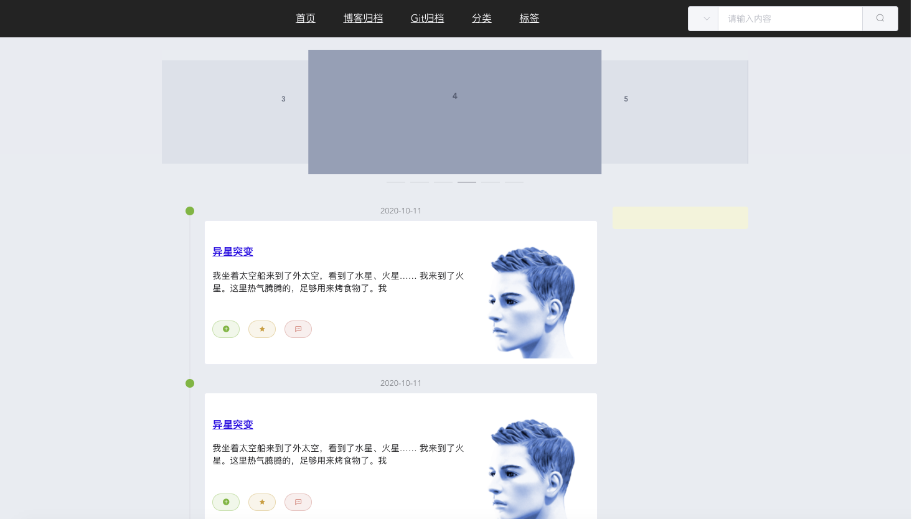
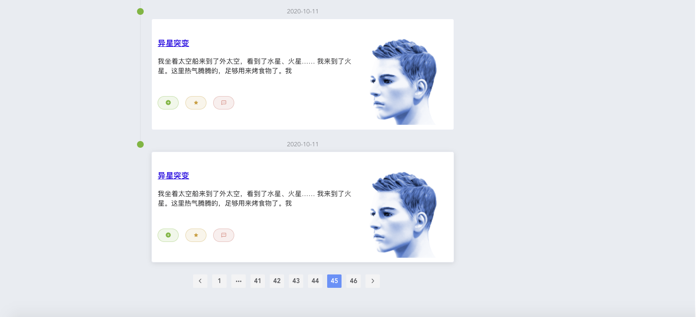
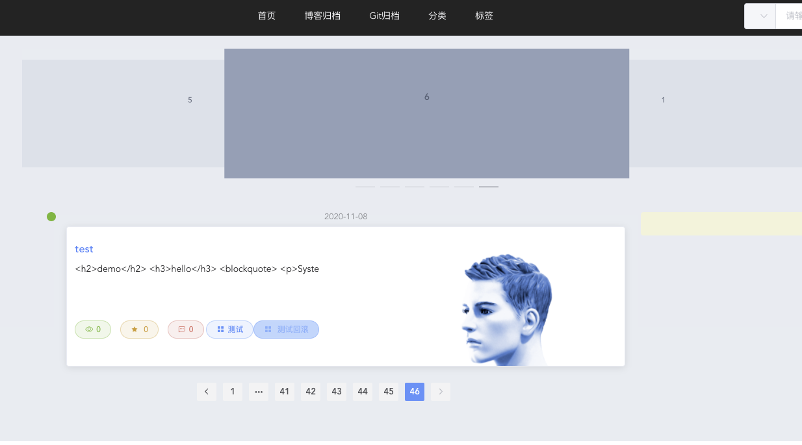

## 文章列表显示

1. 封装axios请求 ==manage.js==

	```javascript
	// 导入axios
	import axios from 'axios';
	// 进行一些全局配置
	// 公共路由(网络请求地址)
	axios.defaults.baseURL = 'http://127.0.0.1:9999/';
	// 请求响应超时时间
	axios.defaults.timeout = 9000;
	
	//post
	export function postAction(url,parameter) {
	  return axios({
	    url: url,
	    method:'post' ,
	    data: parameter
	  })
	}
	
	//post method= {post | put}
	export function httpAction(url,parameter,method) {
	  return axios({
	    url: url,
	    method:method ,
	    data: parameter
	  })
	}
	
	//put
	export function putAction(url,parameter) {
	  return axios({
	    url: url,
	    method:'put',
	    data: parameter
	  })
	}
	
	//get
	export function getAction(url,parameter) {
	  return axios({
	    url: url,
	    method: 'get',
	    params: parameter
	  })
	}
	
	//deleteAction
	export function deleteAction(url,parameter) {
	  return axios({
	    url: url,
	    method: 'delete',
	    params: parameter
	  })
	}
	```

2. 在后台项目中`jeecg-cloud-system`微服务中的ShiroConfig.java中加入

	```java
	//外部访问请求路径排除
	filterChainDefinitionMap.put("/article/blogArticle/listAll", "anon");
	filterChainDefinitionMap.put("/article/blogArticle/list", "anon");
	```
	
3. BlogList.vue文章列表显示

  ```javascript
  <template>
    <div>
      <!--  轮播图  -->
      <el-row :gutter="24">
        <el-col :span="4"><div class="grid-content bg-purple"></div></el-col>
        <el-col :span="16"><div class="grid-content bg-purple">
          <el-carousel :interval="4000" type="card" height="200px">
            <el-carousel-item v-for="item in 6" :key="item">
              <h3 class="medium">{{ item }}</h3>
            </el-carousel-item>
          </el-carousel>
        </div></el-col>
        <el-col :span="4"><div class="grid-content bg-purple"></div></el-col>
      </el-row>
      <!--  文章内容  -->
      <el-row :gutter="24">
        <el-col :span="4"><div class="grid-content bg-purple"></div></el-col>
        <el-col :span="16"><div class="grid-content bg-purple">
          <el-row :gutter="24">
            <el-col :span="18"><div class="grid-content bg-purple">
              <!-- 文章列表 -->
              <el-timeline >
                <el-timeline-item :timestamp="item.createTime" placement="top" type="success" size="large" v-for="item in articles">
                  <el-card shadow="hover" style="padding: 2px">
                    <el-row :gutter="20">
                      <el-col :span="16" style="padding-right: 0px;padding-left: 0px;text-align: justify"><div class="grid-content bg-purple" style="position:relative;height: 150px">
                        <h3 style="text-align:left">
                          <router-link :to="{name:'BlogDetail',params:{blogId:item.id}}">
                            {{ item.title }}
                          </router-link>
                        </h3>
                        <p style="display: inline;">{{ item.description }}</p>
                        <div class="bottom clearfix" style="position:absolute;bottom:0">
                          <el-button type="success" plain size="mini" round icon="el-icon-circle-plus"></el-button>
                          <el-button type="warning" plain size="mini" round icon="el-icon-star-on"></el-button>
                          <el-button type="danger" plain size="mini" round icon="el-icon-chat-dot-square"></el-button>
                        </div>
                      </div></el-col>
  
                      <el-col :span="8"><div class="grid-content bg-purple" style="width:200px;height:150px;">
                        <el-image :src="item.avatar"></el-image>
                      </div></el-col>
                    </el-row>
                  </el-card>
                </el-timeline-item>
              </el-timeline>
              <!-- 分页 -->
              <el-pagination
                background
                layout="prev, pager, next"
                :total="total"
                class="myPage"
                :current-page="currentPage"
                :page-size="pageSize"
                @current-change=getArticles>
              </el-pagination>
            </div></el-col>
            <el-col :span="6"><div class="grid-content bg-purple" style="background: beige"></div></el-col>
          </el-row>
        </div></el-col>
        <el-col :span="4"><div class="grid-content bg-purple"></div></el-col>
      </el-row>
    </div>
  </template>
  
  <script>
  import {getAction} from '../api/manage'
  export default {
      name: "BlogList",
      data() {
        return {
          url: {
            articleListAll: '/article/blogArticle/listAll',
            articleList: '/article/blogArticle/list',
          },
          articles: [],
          currentPage:1,
          total:0,
          pageSize:5,
        }
      },
      created() {
        this.getArticles(1);
      },
      methods: {
        getArticles(pageNo) {
          this.articles=[];
          getAction(this.url.articleList, {pageNo:pageNo,pageSize:this.pageSize})
            .then((res) => {
              console.log(res)
              if (res.data.success) {
                // this.articles=res.data.result.records;
                this.total=res.data.result.total;
                this.currentPage=res.data.result.current;
                this.pageSize=res.data.result.size;
                res.data.result.records.forEach((item, i) => {
                  this.articles.push({
                    id: item.id,
                    title: item.title,
                    avatar: 'https://zos.alipayobjects.com/rmsportal/ODTLcjxAfvqbxHnVXCYX.png',
                    description: item.htmlContent.substring(0, 50),
                    htmlContent: item.htmlContent,
                    mdContent: item.mdContent,
                    createTime:item.createTime,
                    collection: item.numCollections,
                    star: item.numLikes,
                    message: item.numComments,
                  })
                })
              }
            })
            .catch((e) => {
              this.$message({
                message: '刷新失败 !',
                type: 'warning'
              });
              console.log('刷新失败', e)
            })
        },
      }
  }
  </script>
  
  <style scoped>
    @import "../assets/BlogList.css";
    .myPage{
      margin: 0 auto;
      text-align: center;
    }
  </style>
  
  ```







3. 整合 ant-design-vue

	* > npm install ant-design-vue --save

	* > npm install babel-plugin-import --save

	* main.js中加入如下代码

		```JavaScript
		//按需引入ant-design-vue
		import { Table,Tag } from "ant-design-vue";
		import 'ant-design-vue/lib/table/style/css'
		import 'ant-design-vue/lib/tag/style/css'
		// Vue.component(Table.name, Table)
		// Vue.component(Tag.name, Tag)
		Vue.use(Tag)
		Vue.use(Table)
		```

	* 在vue页面中使用即可。

4. 修改文章==观看数==、==点赞数==、==评论数==以及==分栏==

	```JavaScript
	<div class="bottom clearfix" style="position:absolute;bottom:0">
	  <el-button type="success" plain size="mini" round
	             icon="el-icon-view">{{ item.collection }}</el-button>
	  <el-button type="warning" plain size="mini" round icon="el-icon-star-on">
	    {{ item.star }}
	  </el-button>
	  <el-button type="danger" plain size="mini" round
	             icon="el-icon-chat-dot-square">{{ item.message }}</el-button>
	  <div v-for="column in columnCom(item.column)" style="display: inline-block;">
	    <el-button type="primary" plain size="mini" round
	          icon="el-icon-menu">{{ column }}</el-button>
	  </div>
	</div>
	```

	```JavaScript
	computed: {
	  columnCom: function () {
	    return function (columns) {
	      if (columns) return columns.split(",");
	    }
	  },
	},
	```



