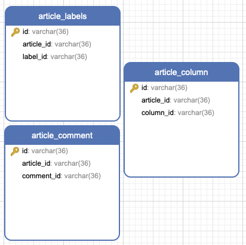
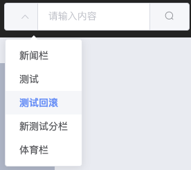

## 文章列表显示

1. 封装axios请求 ==manage.js==

	```javascript
	// 导入axios
	import axios from 'axios';
	// 进行一些全局配置
	// 公共路由(网络请求地址)
	axios.defaults.baseURL = 'http://127.0.0.1:9999/';
	// 请求响应超时时间
	axios.defaults.timeout = 9000;
	
	//post
	export function postAction(url,parameter) {
	  return axios({
	    url: url,
	    method:'post' ,
	    data: parameter
	  })
	}
	
	//post method= {post | put}
	export function httpAction(url,parameter,method) {
	  return axios({
	    url: url,
	    method:method ,
	    data: parameter
	  })
	}
	
	//put
	export function putAction(url,parameter) {
	  return axios({
	    url: url,
	    method:'put',
	    data: parameter
	  })
	}
	
	//get
	export function getAction(url,parameter) {
	  return axios({
	    url: url,
	    method: 'get',
	    params: parameter
	  })
	}
	
	//deleteAction
	export function deleteAction(url,parameter) {
	  return axios({
	    url: url,
	    method: 'delete',
	    params: parameter
	  })
	}
	```

2. 在后台项目中`jeecg-cloud-system`微服务中的ShiroConfig.java中加入

	```java
	//外部访问请求路径排除
	filterChainDefinitionMap.put("/article/blogArticle/listAll", "anon");
	filterChainDefinitionMap.put("/article/blogArticle/list", "anon");
	```
	
3. BlogList.vue文章列表显示

  ```javascript
  <template>
    <div>
      <!--  轮播图  -->
      <el-row :gutter="24">
        <el-col :span="4"><div class="grid-content bg-purple"></div></el-col>
        <el-col :span="16"><div class="grid-content bg-purple">
          <el-carousel :interval="4000" type="card" height="200px">
            <el-carousel-item v-for="item in 6" :key="item">
              <h3 class="medium">{{ item }}</h3>
            </el-carousel-item>
          </el-carousel>
        </div></el-col>
        <el-col :span="4"><div class="grid-content bg-purple"></div></el-col>
      </el-row>
      <!--  文章内容  -->
      <el-row :gutter="24">
        <el-col :span="4"><div class="grid-content bg-purple"></div></el-col>
        <el-col :span="16"><div class="grid-content bg-purple">
          <el-row :gutter="24">
            <el-col :span="18"><div class="grid-content bg-purple">
              <!-- 文章列表 -->
              <el-timeline >
                <el-timeline-item :timestamp="item.createTime" placement="top" type="success" size="large" v-for="item in articles">
                  <el-card shadow="hover" style="padding: 2px">
                    <el-row :gutter="20">
                      <el-col :span="16" style="padding-right: 0px;padding-left: 0px;text-align: justify"><div class="grid-content bg-purple" style="position:relative;height: 150px">
                        <h3 style="text-align:left">
                          <router-link :to="{name:'BlogDetail',params:{blogId:item.id}}">
                            {{ item.title }}
                          </router-link>
                        </h3>
                        <p style="display: inline;">{{ item.description }}</p>
                        <div class="bottom clearfix" style="position:absolute;bottom:0">
                          <el-button type="success" plain size="mini" round icon="el-icon-circle-plus"></el-button>
                          <el-button type="warning" plain size="mini" round icon="el-icon-star-on"></el-button>
                          <el-button type="danger" plain size="mini" round icon="el-icon-chat-dot-square"></el-button>
                        </div>
                      </div></el-col>
  
                      <el-col :span="8"><div class="grid-content bg-purple" style="width:200px;height:150px;">
                        <el-image :src="item.avatar"></el-image>
                      </div></el-col>
                    </el-row>
                  </el-card>
                </el-timeline-item>
              </el-timeline>
              <!-- 分页 -->
              <el-pagination
                background
                layout="prev, pager, next"
                :total="total"
                class="myPage"
                :current-page="currentPage"
                :page-size="pageSize"
                @current-change=getArticles>
              </el-pagination>
            </div></el-col>
            <el-col :span="6"><div class="grid-content bg-purple" style="background: beige"></div></el-col>
          </el-row>
        </div></el-col>
        <el-col :span="4"><div class="grid-content bg-purple"></div></el-col>
      </el-row>
    </div>
  </template>
  
  <script>
  import {getAction} from '../api/manage'
  export default {
      name: "BlogList",
      data() {
        return {
          url: {
            articleListAll: '/article/blogArticle/listAll',
            articleList: '/article/blogArticle/list',
          },
          articles: [],
          currentPage:1,
          total:0,
          pageSize:5,
        }
      },
      created() {
        this.getArticles(1);
      },
      methods: {
        getArticles(pageNo) {
          this.articles=[];
          getAction(this.url.articleList, {pageNo:pageNo,pageSize:this.pageSize})
            .then((res) => {
              console.log(res)
              if (res.data.success) {
                // this.articles=res.data.result.records;
                this.total=res.data.result.total;
                this.currentPage=res.data.result.current;
                this.pageSize=res.data.result.size;
                res.data.result.records.forEach((item, i) => {
                  this.articles.push({
                    id: item.id,
                    title: item.title,
                    avatar: 'https://zos.alipayobjects.com/rmsportal/ODTLcjxAfvqbxHnVXCYX.png',
                    description: item.htmlContent.substring(0, 50),
                    htmlContent: item.htmlContent,
                    mdContent: item.mdContent,
                    createTime:item.createTime,
                    collection: item.numCollections,
                    star: item.numLikes,
                    message: item.numComments,
                  })
                })
              }
            })
            .catch((e) => {
              this.$message({
                message: '刷新失败 !',
                type: 'warning'
              });
              console.log('刷新失败', e)
            })
        },
      }
  }
  </script>
  
  <style scoped>
    @import "../assets/BlogList.css";
    .myPage{
      margin: 0 auto;
      text-align: center;
    }
  </style>
  
  ```


3. 整合 ant-design-vue

	* > npm install ant-design-vue --save

	* > npm install babel-plugin-import --save

	* main.js中加入如下代码

		```JavaScript
		//按需引入ant-design-vue
		import { Table,Tag } from "ant-design-vue";
		import 'ant-design-vue/lib/table/style/css'
		import 'ant-design-vue/lib/tag/style/css'
		// Vue.component(Table.name, Table)
		// Vue.component(Tag.name, Tag)
		Vue.use(Tag)
		Vue.use(Table)
		```

	* 在vue页面中使用即可。

4. 修改文章==观看数==、==点赞数==、==评论数==以及==分栏==

	```JavaScript
	<div class="bottom clearfix" style="position:absolute;bottom:0">
	  <el-button type="success" plain size="mini" round
	             icon="el-icon-view">{{ item.collection }}</el-button>
	  <el-button type="warning" plain size="mini" round icon="el-icon-star-on">
	    {{ item.star }}
	  </el-button>
	  <el-button type="danger" plain size="mini" round
	             icon="el-icon-chat-dot-square">{{ item.message }}</el-button>
	  <div v-for="column in columnCom(item.column)" style="display: inline-block;">
	    <el-button type="primary" plain size="mini" round
	          icon="el-icon-menu">{{ column }}</el-button>
	  </div>
	</div>
	```

	```JavaScript
	computed: {
	  columnCom: function () {
	    return function (columns) {
	      if (columns) return columns.split(",");
	    }
	  },
	},
	```


## BLOG微服务整合JPA

> 我是想着在BLOG微服务中加入jpa，但是有一些common 实体类需要放入到common-core微服务中。

1. ==blog微服务==和==common-core==导入依赖

	```xml
	<!-- 实现对数据库连接池的自动化配置 -->
	<!-- 实际上 spring-boot-starter-data-jpa 已经包括 spring-boot-starter-jdbc -->
	<dependency>
	    <groupId>org.springframework.boot</groupId>
	    <artifactId>spring-boot-starter-jdbc</artifactId>
	</dependency>
	<dependency> <!-- 本示例，我们使用 MySQL -->
	    <groupId>mysql</groupId>
	    <artifactId>mysql-connector-java</artifactId>
	</dependency>
	
	<!-- 实现对 Spring Data JPA 的自动化配置 -->
	<dependency>
	    <groupId>org.springframework.boot</groupId>
	    <artifactId>spring-boot-starter-data-jpa</artifactId>
	</dependency>
	```

2. 创建自定义Repository

3. 创建实体类

	* 实体类必须有`@Entity`注解 否则启动报：

		> Caused by: org.springframework.beans.factory.NoSuchBeanDefinitionException: No qualifying bean of type 'org.jeecg.modules.blog.jpa.ArticleColumnRepository' available: expected at least 1 bean which qualifies as autowire cand

	* 实体类必须有`@Id`注解 否则启动报：

		> Caused by: org.hibernate.AnnotationException: No identifier specified for entity

4. 使用即可

	```java
	@Autowired
	ColumnRepository columnRepository;
	```

## 搜索功能以及轮播图

1. 新建==文章-分栏==、==文章-评论==、==文章-标签==关联表

	

2. 分别创建实体类

	```java
	@Entity
	@Data
	@TableName("article_labels")
	@Accessors(chain = true)
	@EqualsAndHashCode(callSuper = false)
	@ApiModel(value="article_label对象", description="article_label")
	public class ArticleLabels {
	    private static final long serialVersionUID=1L;
	    @Id
	    @GeneratedValue(generator="system_uuid")
	    @GenericGenerator(name="system_uuid",strategy="uuid")
	    @Column(name = "id", unique = true, nullable = false, length = 36)
	//    @TableId(type = IdType.ID_WORKER_STR)
	    @ApiModelProperty(value = "id")
	    private String id;
	
	    @Excel(name = "articleId", width = 15)
	    @ApiModelProperty(value = "articleId")
	    private String articleId;
	    @Excel(name = "labelId", width = 15)
	    @ApiModelProperty(value = "labelId")
	    private String labelId;
	}
	```


3. 分别创建Repository

	```java
	public interface ArticleColumnRepository extends CrudRepository<ArticleColumn,String> {
	  
	}
	```

4. BlogArticleController.java中对添加博客功能修改(jpa)

	```java
	@Autowired
	ArticleColumnRepository articleColumnRepository;
	@Autowired
	ArticleLabelRepository articleLabelRepository;
	
	
	@AutoLog(value = "blog_article-添加所有信息")
	@ApiOperation(value="blog_article-添加所有信息", notes="文章标签以及分栏统统添加。一条文章记录包含多个标签和分栏中间同，隔开。新增的标签和分栏依次入库")
	@PostMapping(value = "/addAll")
	@Transactional(rollbackFor = Exception.class)//事务
	public Result<?> addAll(@RequestBody Map<String, Object> map) {
	//		 blogArticleService.save(blogArticle);
			 for (Map.Entry<String, Object> entry : map.entrySet()) {
				 System.out.println(entry.getKey()+">>>>"+entry.getValue());
			 }
			 BlogArticle blogArticle=new BlogArticle();
			 String articleId=UUIDGenerator.generate();
			 blogArticle.setId(articleId).setTitle(map.get("title").toString()).setHtmlContent(map.get("htmlContent").toString())
			 				.setMdContent(map.get("mdContent").toString()).setVisits("0").setNumLikes("0").setNumComments("0")
					 		.setNumCollections("0").setSpecialColumn(map.get("selectSpecials").toString().replace("[", "").replace("]", ""))
					 		.setTag(map.get("selectLabels").toString().replace("[", "").replace("]", ""))
						 	.setOriginalAddress(map.get("reprintURL").toString());
	
			 String type = sysBaseRemoteApi.queryDictTextByKey("articleType", map.get("articleType").toString().replace("[", "").replace("]", ""));
			 blogArticle.setType(type);
			 //todo 转成数据字典
			 String s = sysBaseRemoteApi.queryDictTextByKey("release_type", "00"+map.get("releaseType").toString());
			 blogArticle.setReleaseOrm(sysBaseRemoteApi.queryDictTextByKey("release_type", "00"+map.get("releaseType").toString()));
			 LoginUser sysUser = (LoginUser) SecurityUtils.getSubject().getPrincipal();
			 blogArticle.setUserId(sysUser.getId()).setCreateBy(sysUser.getRealname());
	
			 //todo 保存标签
			 boolean labelFlag=true;
			 List<BlogLabels> labelsList=new LinkedList<>();
			 String newLabels=map.get("newAddLabels").toString().replace("[", "").replace("]", "");
			 for (String labelName : newLabels.split(",")) {
				 BlogLabels blogLabel=new BlogLabels();
				 blogLabel.setLabelName(labelName).setUserId(sysUser.getId()).setUserName(sysUser.getRealname()).setCreateBy(sysUser.getRealname());
				 labelsList.add(blogLabel);
			 }
			 if (!labelsList.isEmpty() && StringUtils.isNotEmpty(newLabels)) labelFlag=labelsService.saveBatch(labelsList);
	
			 //todo 保存分栏
			 boolean specialFlag=true;
			 List<BlogSpecialColumn> specialColumnList = new LinkedList<>();
			 String newSpecials=map.get("newAddSpecials").toString().replace("[", "").replace("]", "");
			 for (String specialName : newSpecials.split(",")) {
				 BlogSpecialColumn specialColumn=new BlogSpecialColumn();
				 specialColumn.setSpecialName(specialName).setUserId(sysUser.getId()).setUserName(sysUser.getRealname())
				 				.setCreateBy(sysUser.getRealname());
				 specialColumnList.add(specialColumn);
			 }
			 if (!specialColumnList.isEmpty() && StringUtils.isNotEmpty(newSpecials)) specialFlag=specialColumnService.saveBatch(specialColumnList);
	
			 //todo 保存博客-分栏、博客-标签
			 String selectSpecials=map.get("selectSpecials").toString().replace("[", "").replace("]", "");
			 String selectLabels=map.get("selectLabels").toString().replace("[", "").replace("]", "");
			 for (String special : selectSpecials.split(",")) {
				 ArticleColumn articleColumn=new ArticleColumn();
				 QueryWrapper<BlogSpecialColumn> queryWrapper=new QueryWrapper<>();
				 QueryWrapper<BlogSpecialColumn> wrapper= queryWrapper.eq("special_name", special.trim());
				 BlogSpecialColumn specialColumn = specialColumnService.getOne(wrapper);
				 articleColumn.setArticleId(articleId).setColumnId(specialColumn.getId());
				 articleColumnRepository.save(articleColumn);
			 }
			 for (String label : selectLabels.split(",")) {
				 ArticleLabels articleLabels=new ArticleLabels();
				 QueryWrapper<BlogLabels> queryWrapper=new QueryWrapper<>();
				 QueryWrapper<BlogLabels> wrapper= queryWrapper.eq("label_name", label.trim());
				 BlogLabels blogLabels = labelsService.getOne(wrapper);
				 articleLabels.setArticleId(articleId).setLabelId(blogLabels.getId());
				 articleLabelRepository.save(articleLabels);
			 }
	
			 if(blogArticleService.save(blogArticle) && labelFlag && specialFlag) return Result.ok("添加成功！");
			 return Result.error("添加失败！");
	}
	```

5. 同样删除博客功能也需要修改(jpa)

	> Spring boot Jpa 本身提供的方法只有简单的crud。因此可以根据Jpa提供的==根据方法名==、==根据注解==来进行查询。下面两个关联表(article-column和article-labels)查询通过==根据方法名==来查询

	* ArticleColumnRepository.java添加如下方法

		```java
		List<ArticleColumn> findArticleColumnByArticleId(String articleId);
		```

	* ArticleLabelRepository.java添加如下方法

		```java
		List<ArticleLabels> findArticleLabelsByArticleId(String articleId);
		```

	* BlogArticleController.java中删除博客方法修改

		```java
		@AutoLog(value = "blog_article-通过id删除")
		@ApiOperation(value="blog_article-通过id删除", notes="blog_article-通过id删除")
		@DeleteMapping(value = "/delete")
		public Result<?> delete(@RequestParam(name="id",required=true) String id) {
		   blogArticleService.removeById(id);
		   //删除关联表信息 标签、分栏
		   List<ArticleColumn> articleColumnList = articleColumnRepository.findArticleColumnByArticleId(id);
		   articleColumnRepository.deleteAll(articleColumnList);
		   List<ArticleLabels> articleLabelsList = articleLabelRepository.findArticleLabelsByArticleId(id);
		   articleLabelRepository.deleteAll(articleLabelsList);
		   return Result.ok("删除成功!");
		}
		```

6. 前端搜索下拉列表修改为分栏数据

	Home.vue

	```JavaScript
	<el-input placeholder="请输入内容" v-model="searchArticle" class="input-with-select">
	    <el-select v-model="selectColumn" slot="prepend" placeholder="请选择" @change="columnChange">
	      <div v-for="item in specialColumns">
	        <el-option :label="item.name" :value="item.id"></el-option>
	  		</div>
	  </el-select>
	<el-button slot="append" icon="el-icon-search"></el-button>
	</el-input>
	
	import {getAction} from "../api/manage";
	data() {
	  return {
	    url:{
	      columnAll:'/special/blogSpecialColumn/listAll',
	    },
	    specialColumns: [],
	    searchArticle:'',
	    selectColumn:'',
	  };
	},
	created() {
	  this.getArticleColumn();
	},
	methods: {
	    getArticleColumn() {
	      getAction(this.url.columnAll)
	        .then((res) => {
	        console.log(res)
	        if (res.data.success) {
	          res.data.result.forEach((item, i) => {
	            this.specialColumns.push({
	              name:item.specialName,
	              id:item.id,
	            })
	          })
	        }
	      })
	        .catch((e) => {
	        this.$message({
	          message: '刷新失败 !',
	          type: 'warning'
	        });
	        console.log('刷新失败', e)
	      })
	    },
	},
	```

	

7. 分栏数据修改后文章列表也要进行相应的修改

	`后端处理`

	* ArticleColumnRepository.java中添加如下方法

		```java
		List<ArticleColumn> findArticleColumnsByColumnId(String columnId);
		```

	* BlogSpecialColumnController.java中添加

		```java
		@Autowired
		ArticleColumnRepository articleColumnRepository;
		@Autowired
		private IBlogArticleService blogArticleService;
		@AutoLog(value = "blog_special_column-获取专栏下所有文章")
		@ApiOperation(value="blog_special_column-获取专栏下所有文章", notes="blog_special_column-获取专栏下所有文章")
		@GetMapping(value = "/columnArticleData")
		public Result<?> columnArticleData(@RequestParam(name="column",required=true) String columnId){
		  List<ArticleColumn> articleColumnList = articleColumnRepository.findArticleColumnsByColumnId(columnId);
		  List<String> articleIdList = articleColumnList.stream().map(e -> e.getArticleId()).collect(Collectors.toList());
		  Collection<BlogArticle> blogArticleList = blogArticleService.listByIds(articleIdList);
		
		  return Result.ok(blogArticleList);
		}
		```

	* ShiroConfig.java中ShiroFilterFactoryBean方法中添加

		```java
		filterChainDefinitionMap.put("/special/blogSpecialColumn/columnArticleData", "anon");
		```

	`前端处理`

	* Home.vue中添加方法

		```JavaScript
		data() {
		  return {
		    url:{
		      columnAll:'/special/blogSpecialColumn/listAll',
		      columnArticleData:'/special/blogSpecialColumn/columnArticleData',
		    },
		    specialColumns: [],
		    searchArticle:'',
		    selectColumn:'',
		  };
		},
		columnChange(){
		  console.log(this.selectColumn)
		  getAction(this.url.columnArticleData,{column:this.selectColumn})
		    .then((res) => {
		    console.log("分栏下博客数据",res)
		    if (res.data.success) {
		      res.data.result.forEach((item, i) => {
		        this.specialColumns.push({
		          name:item.specialName,
		          id:item.id,
		        })
		      })
		    }
		  })
		    .catch((e) => {
		    this.$message({
		      message: '分栏下博客数据刷新失败 !',
		      type: 'warning'
		    });
		    console.log('分栏下博客数据刷新失败', e)
		  })
		}
		```

	