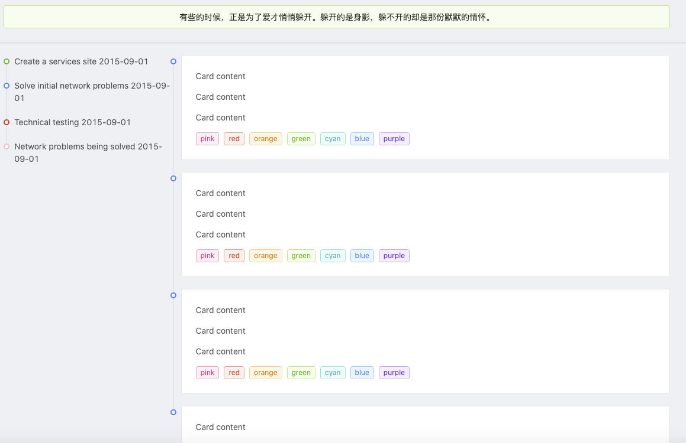
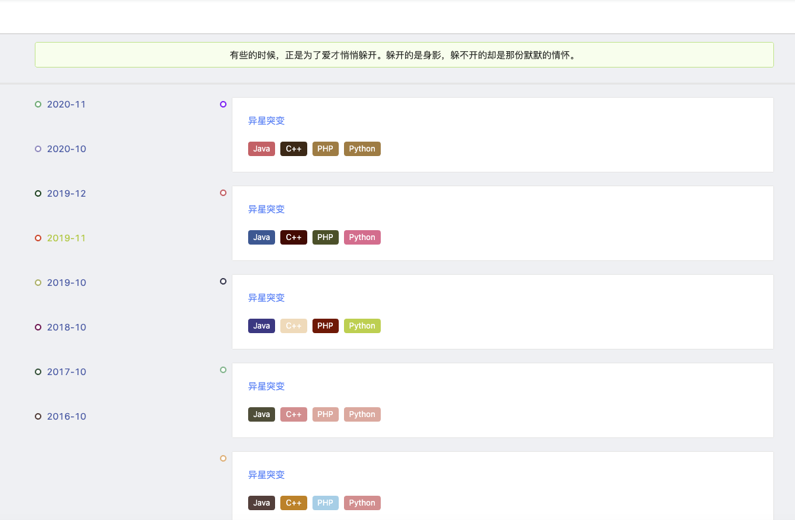
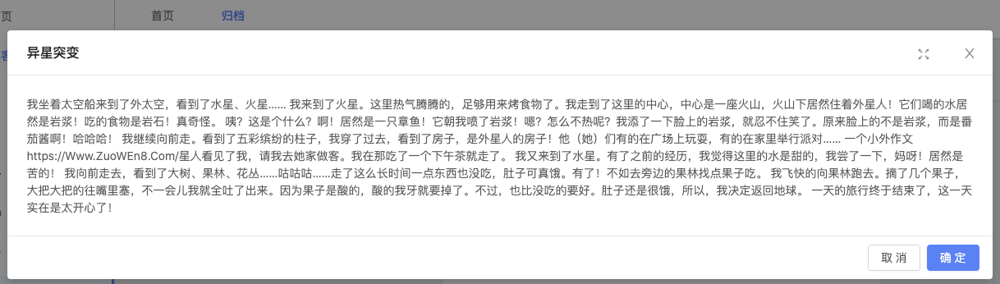

> 归档管理分为博客归档(按时间线分类博客)和Git提交归档(如果能实现的话)

1. 新建分支 ==file==

2. 前台骨架搭建

	```html
	<template>
	  <div>
	    <a-row type="flex">
	      <a-col :span="4">
	
	      </a-col>
	      <a-col :span="16">
	        <a-alert message="有些的时候，正是为了爱才悄悄躲开。躲开的是身影，躲不开的却是那份默默的情怀。" type="success" style="text-align:center"/>
	      </a-col>
	      <a-col :span="4" >
	
	      </a-col>
	    </a-row>
	    <a-divider style="height: 3px" />
	    <a-row type="flex">
	      <a-col :span="4">
	
	      </a-col>
	      <a-col :span="4">
	        <a-timeline>
	          <a-timeline-item color="green">Create a services site 2015-09-01</a-timeline-item>
	          <a-timeline-item color="blue">Solve initial network problems 2015-09-01</a-timeline-item>
	          <a-timeline-item color="red">
	            Technical testing 2015-09-01
	          </a-timeline-item>
	          <a-timeline-item color="pink">Network problems being solved 2015-09-01</a-timeline-item>
	        </a-timeline>
	      </a-col>
	      <a-col :span="12">
	        <a-timeline>
	          <a-timeline-item>
	            <a-card>
	              <p>Card content</p>
	              <p>Card content</p>
	              <p>Card content</p>
	              <a-tag color="pink">
	                pink
	              </a-tag>
	              <a-tag color="red">
	                red
	              </a-tag>
	              <a-tag color="orange">
	                orange
	              </a-tag>
	              <a-tag color="green">
	                green
	              </a-tag>
	              <a-tag color="cyan">
	                cyan
	              </a-tag>
	              <a-tag color="blue">
	                blue
	              </a-tag>
	              <a-tag color="purple">
	                purple
	              </a-tag>
	            </a-card>
	          </a-timeline-item>
	          <a-timeline-item>
	            <a-card>
	              <p>Card content</p>
	              <p>Card content</p>
	              <p>Card content</p>
	              <a-tag color="pink">
	                pink
	              </a-tag>
	              <a-tag color="red">
	                red
	              </a-tag>
	              <a-tag color="orange">
	                orange
	              </a-tag>
	              <a-tag color="green">
	                green
	              </a-tag>
	              <a-tag color="cyan">
	                cyan
	              </a-tag>
	              <a-tag color="blue">
	                blue
	              </a-tag>
	              <a-tag color="purple">
	                purple
	              </a-tag>
	            </a-card>
	          </a-timeline-item>
	          <a-timeline-item>
	            <a-card>
	              <p>Card content</p>
	              <p>Card content</p>
	              <p>Card content</p>
	              <a-tag color="pink">
	                pink
	              </a-tag>
	              <a-tag color="red">
	                red
	              </a-tag>
	              <a-tag color="orange">
	                orange
	              </a-tag>
	              <a-tag color="green">
	                green
	              </a-tag>
	              <a-tag color="cyan">
	                cyan
	              </a-tag>
	              <a-tag color="blue">
	                blue
	              </a-tag>
	              <a-tag color="purple">
	                purple
	              </a-tag>
	            </a-card>
	          </a-timeline-item>
	          <a-timeline-item>
	            <a-card>
	              <p>Card content</p>
	              <p>Card content</p>
	              <p>Card content</p>
	              <a-tag color="pink">
	                pink
	              </a-tag>
	              <a-tag color="red">
	                red
	              </a-tag>
	              <a-tag color="orange">
	                orange
	              </a-tag>
	              <a-tag color="green">
	                green
	              </a-tag>
	              <a-tag color="cyan">
	                cyan
	              </a-tag>
	              <a-tag color="blue">
	                blue
	              </a-tag>
	              <a-tag color="purple">
	                purple
	              </a-tag>
	            </a-card>
	          </a-timeline-item>
	        </a-timeline>
	      </a-col>
	      <a-col :span="4">
	
	      </a-col>
	    </a-row>
	  </div>
	</template>
	```

3. 效果图

	
	
4. 左侧修改为文章发布时间线，中间改为时间线对应的所有文章，并随机生成标签颜色和时间线颜色

	* 前端代码

		```vue
		<template>
		  <div>
		    <a-row type="flex">
		      <a-col :span="4">
		
		      </a-col>
		      <a-col :span="16">
		        <a-alert message="有些的时候，正是为了爱才悄悄躲开。躲开的是身影，躲不开的却是那份默默的情怀。" type="success" style="text-align:center"/>
		      </a-col>
		      <a-col :span="4" >
		
		      </a-col>
		    </a-row>
		    <a-divider style="height: 3px" />
		    <a-row type="flex">
		      <a-col :span="4">
		
		      </a-col>
		      <a-col :span="4">
		        <a-timeline v-for="time in yearMonth">
		          <a-timeline-item @click="selectByMonth(time)" :color="randomColor()" onmouseover="this.style.color='#b2d235'" onmouseout="this.style.color='#426ab3'">{{ time.time }}</a-timeline-item>
		        </a-timeline>
		      </a-col>
		      <a-col :span="12">
		        <a-timeline v-for="article in articles">
		          <a-timeline-item :color="randomColor()">
		            <a-card>
		              <a onmouseover="this.style.color='#b2d235'" onmouseout="this.style.color='#426ab3'">{{ article.title}}</a>
		              <br></br>
		              <a-tag :color="randomColor()" v-for="tag in getTagByArticle(article.tag)">
		                {{ tag }}
		              </a-tag>
		            </a-card>
		          </a-timeline-item>
		        </a-timeline>
		      </a-col>
		      <a-col :span="4">
		
		      </a-col>
		    </a-row>
		  </div>
		</template>
		
		<script>
		import {
		  putAction,
		  getAction,
		  httpAction,
		  postAction,
		} from '@/api/manage'
		
		const colorMap = new Map([
		  [0, 'f7acbc'],
		  [1, 'ef5b9c'],
		  [2, 'f05b72'],
		  [3, 'f8aba6'],
		  [4, 'f58f98'],
		  [5, 'bd6758'],
		  [6, '660066'],
		  [7, '660000'],
		  [8, '6600FF'],
		  [9, '666633'],
		  [10, '990066'],
		  [11, '9900FF'],
		  [12, '996633'],
		  [13, '990000'],
		  [14, '9966FF'],
		  [15, '9999CC'],
		  [16, 'FF3333'],
		  [17, 'FF6699'],
		  [18, 'FF66FF'],
		  [19, 'FFFF99'],
		  [20, '680000'],
		  [21, '686868'],
		  [22, '7fb80e'],
		
		  [23, 'bed742'],
		  [24, 'b7ba6b'],
		  [25, '769149'],
		  [26, '6d8346'],
		  [27, 'cde6c7'],
		  [28, '1d953f'],
		  [29, '77ac98'],
		  [30, '007d65'],
		  [31, '45b97c'],
		  [32, '225a1f'],
		  [33, '2b6447'],
		  [34, '005831'],
		  [35, '006c54'],
		  [36, '274d3d'],
		  [37, '65c294'],
		  [38, '00ae9d'],
		  [39, '90d7ec'],
		  [40, '2468a2'],
		  [41, '1b315e'],
		  [42, 'decb00'],
		  [43, '596032'],
		  [44, '5f5d46'],
		  [45, 'ffd400'],
		  [46, 'b69968'],
		  [47, '6d5826'],
		  [48, 'ba8448'],
		  [49, 'e0861a'],
		  [50, 'c88400'],
		  [51, 'fab27b'],
		  [52, 'f47920'],
		  [53, 'fedcbd'],
		  [54, 'f36c21'],
		  [55, 'b7704f'],
		  [56, 'c99979'],
		  [57, '444693'],
		  [58, '2b4490'],
		  [59, '224b8f'],
		  [60, '46485f'],
		  [61, '6a6da9'],
		  [62, '494e8f'],
		  [63, '9b95c9'],
		  [64, '6950a1'],
		  [65, '594c6d'],
		  [66, '6f599c'],
		  [67, '401c44'],
		  [68, 'c77eb5'],
		  [69, 'f173ac'],
		  [70, '4f5555'],
		  [71, '563624'],
		  [72, '6c4c49'],
		  [73, '3c3645'],
		]);
		export default {
		  name: 'BlogArticleList',
		  components: {
		
		  },
		  data() {
		    return {
		      description: '博客归档',
		      articles: [],
		      yearMonth: [],
		      url: {
		        groupByMonth: '/article/blogArticle/groupByMonth',
		        seleteByMonth: '/article/blogArticle/seleteByMonth',
		      },
		
		    }
		  },
		  computed: {
		    getTagByArticle: function () {
		      return function (tag) {
		        return tag.split(",");
		      }
		    },
		  },
		  created() {
		    this.groupByMonth();
		  },
		  methods: {
		     groupByMonth(param){
		       getAction(this.url.groupByMonth, param)
		         .then((res) => {
		           if (res.success) {
		             res.result.forEach((item, i) => {
		               this.yearMonth.push({
		                 time: item.yearTime,
		               })
		             })
		             console.log("分组：",this.yearMonth);
		             this.selectByMonth(this.yearMonth[0]);
		           }
		         })
		         .catch((e) => {
		           this.$message.warn('刷新失败')
		           console.log('刷新失败', e)
		         })
		     },
		     selectByMonth(yearMonth){
		       this.articles=[];
		       let param ={
		         createTime : yearMonth.time,
		       }
		       postAction(this.url.seleteByMonth,param).then(res=>{
		         console.log("获取该月份文章",yearMonth.time,res);
		         res.result.forEach((item, i) => {
		           this.articles.push({
		             id: item.id,
		             title: item.title,
		             description: item.htmlContent.substring(0, 50),
		             tag: item.tag,
		             htmlContent: item.htmlContent,
		             mdContent: item.mdContent,
		             collection: item.numCollections,
		             star: item.numLikes,
		             message: item.numComments,
		           })
		         })
		         if(res.success){
		           this.$message.success(res.message)
		         }else{
		           this.$message.error(res.message)
		         }
		       })
		     },
		      randomColor() {
		        return "#"+colorMap.get(Math.round(Math.random()*73));
		      },
		  }
		}
		</script>
		<style scoped>
		@import '~@assets/less/common.less';
		.skeleton-demo {
		  border: 1px solid #f4f4f4;
		}
		#components-badge-demo-dot .anticon-notification {
		  width: 16px;
		  height: 16px;
		  line-height: 16px;
		  font-size: 16px;
		}
		
		</style>
		```


	* 后台代码

		```java
		/**
		 * 按照 日期"年 月" 进行文章分组
		 *
		 * @return
		 */
		@AutoLog(value = "blog_article-按照 日期 年 月 进行文章分组")
		@ApiOperation(value="blog_article-按照 日期 年 月 进行文章分组", notes="blog_article-按照 日期年 月 进行文章分组")
		@GetMapping(value = "/groupByMonth")
		public Result<?> groupAriticleByYearMonth(){
		 List<Map<String, Object>> list = blogArticleService.groupAriticleByYearMonth();
		 return Result.ok(list);
		}
		/**
		 * 按照 日期"年 月" 查询文章
		 *
		 * @return
		 */
		@AutoLog(value = "blog_article- 按照 日期\"年 月\" 查询文章")
		@ApiOperation(value="blog_article- 按照 日期\"年 月\" 查询文章", notes="blog_article- 按照 日期\"年 月\" 查询文章")
		@PostMapping(value = "/seleteByMonth")
		public Result<?> selectAriticleByYearMonth(@RequestBody JSONObject jsonObject){
		 System.out.println(jsonObject.getStr("createTime"));
		 List<BlogArticle> list = blogArticleService.selectAriticleByYearMonth(jsonObject.getStr("createTime"));
		 return Result.ok(list);
		}
		```

5. 最后效果图

	

6. 新增点击标题显示文章信息。

	* 添加模态框

		```vue
		<!--文章查看-->
		<j-modal
		  :visible.sync="articleView.visible"
		  :width="1200"
		  :title="articleView.title"
		  :fullscreen.sync="articleView.fullscreen"
		  :switchFullscreen="articleView.switchFullscreen"
		>
		  <div v-html="articleView.htmlContent"></div>
		</j-modal>
		```

	* 为模态框添加 ` data ` 数据

		```vue
		articleView :{
		  id: '',
		  title: '',
		  visible: false,
		  fullscreen: true,
		  switchFullscreen: true,
		  htmlContent: '',
		},
		```

	* 给文章标题添加点击事件

		```JavaScript
		@click="showArticle(article)"
		```

	* 增加修改模态框数据的方法

		```JavaScript
		showArticle(param){
		   // console.log(param);
		   this.articleView.id=param.id;
		   this.articleView.visible=true;
		   this.articleView.fullscreen=true;
		   this.articleView.switchFullscreen=true;
		   this.articleView.title=param.title;
		   this.articleView.htmlContent=param.htmlContent;
		 },
		```

7. 最终效果点击如下

	

	> 自此 文章归档功能已实现完毕

8. 还有 file 分支提交。

	> 具体可参考 Git > Git操作 > 分支操作.md