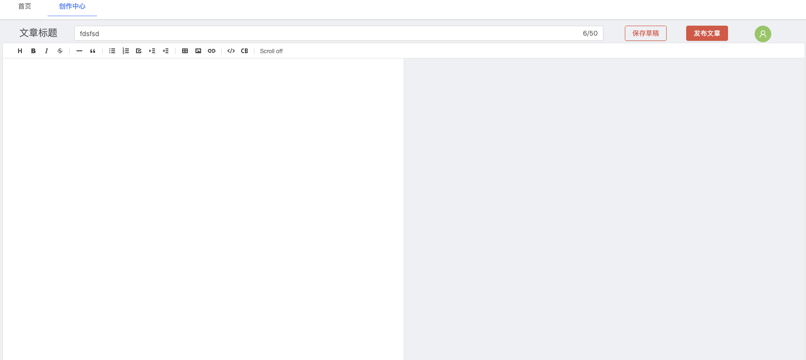

## 博客管理前台搭建

### 第一步、前后台整体框架布局

1. 前台页面布局

	```vue
	<template>
	  <div>
	    <a-row>
	      <a-col :span="1"></a-col>
	      <a-col :span="4">
	        <!-- 辅助信息面板 -->
	        <div style="background: #ececec; padding: 3px">
	            <a-row :gutter="24">
	              <a-col :span="24" v-for="(item,index) in information">
	                <a-card :title="item.title" :bordered="false" :hoverable="true" :headStyle="{background: '#FFC0CB'}">
	                  <!-- 卡片内容 -->
	                  <div v-if="index==0" v-for="context in item.context">
	                    <li style="display:inline"><a>{{ context.title }}</a></li>&ensp;<a-icon type="eye" theme="twoTone" two-tone-color="#eb2f96" style="display:inline"/>&ensp;<p style="display:inline">{{ context.star }}</p></br>
	                  </div>
	
	                  <div v-if="index==1" v-for="special in item.context" style="width:100%">
	                      <a-row type="flex">
	                        <a-col flex="auto"><a><li >{{ special.specialsName }}</li></a></a-col>
	                         <a-col flex="10px"><p>{{ special.articlesNum }}</p></a-col>
	                      </a-row>
	                  </div>
	
	                  <div v-if="index==2" v-for="comment in item.context">
	                    <a><li >{{ comment.title }}</li></a>
	                    <li >
	                      <p style="display:inline">{{ comment.commentUser }}</p>&ensp;
	                      <a-badge dot>
	                        <a-icon type="notification" />
	                      </a-badge>&ensp;
	                      <p style="display:inline">{{ comment.context }}</p>
	                    </li>
	                  </div>
	
	                  <div v-if="index==3">
	                    <div  v-for="context in item.context">
	                      <a><li style=" height: 30px;">{{ context.title }}</li></a>
	                    </div>
	                    <a-divider />
	                    <div v-for="info in groupArticle">
	                      <a-row>
	                        <a-col :span="18">
	                          <a>{{ info.time }}年</a>
	                        </a-col>
	                        <a-col :span="6">
	                          <a>{{ info.articles }}篇</a>
	                        </a-col>
	                      </a-row>
	                    </div>
	                  </div>
	                </a-card>
	              </a-col>
	            </a-row>
	          </div>
	      </a-col>
	      <a-col :span="1"></a-col>
	      <a-col :span="16">
	        <!-- 文章列表 -->
	        <div style="background-color: #f4f4f4; padding: 3px">
	          <a-list item-layout="vertical" size="large" :data-source="articles" :pagination="pagination"> 
	            <a-list-item slot="renderItem" key="item.title" slot-scope="item">
	              <template slot="actions">
	                <span :key="collection.type">
	                  <a-icon :type="collection.type" style="margin-right: 8px" />
	                  {{ item.collection }}
	                </span>
	              </template>
	              <template slot="actions">
	                <span :key="star.type">
	                  <a-icon :type="star.type" style="margin-right: 8px" />
	                  {{ item.star }}
	                </span>
	              </template>
	              <template slot="actions">
	                <span :key="message.type">
	                  <a-icon :type="message.type" style="margin-right: 8px" />
	                  {{ item.message }}
	                </span>
	              </template>
	              
	              <a-skeleton :loading="false" :active="true" :avatar="true">
	                <a-list-item-meta :description="item.description">
	                  <a slot="title" :href="item.href">{{ item.title }}</a>
	                  <a-avatar slot="avatar" :src="item.avatar" />
	                </a-list-item-meta>
	                {{ item.content }}
	              </a-skeleton>
	            </a-list-item>
	          </a-list>
	        </div>
	      </a-col>
	      <a-col :span="2"></a-col>
	    </a-row>
	  </div>
	</template>
	
	<script>
	const listData = []
	import { putAction, getAction } from '@/api/manage'
	export default {
	  name: 'BlogArticleList',
	  data() {
	    return {
	      description: 'blog_article管理页面',
	      articles: [],
	      groupArticle: [],
	      listData,
	      collection: { type: 'star-o', text: '0' },
	      star: { type: 'like-o', text: '0' },
	      message: { type: 'message', text: '0' },
	      information: [
	        {
	          title: '热门文章',
	          context: [],
	        },
	        {
	          title: '分类专栏',
	          context: [],
	        },
	        {
	          title: '最新评论',
	          context: [],
	        },
	        {
	          title: '最新文章',
	          context: [],
	        },
	      ],
	      url: {
	        blogArticlelist: '/article/blogArticle/list',
	        blogArticlelistAll: '/article/blogArticle/listAll',
	        blogSpecialListAll: '/special/blogSpecialColumn/listAll',
	
	        //统计专栏下文章数量
	        specialArticleCount: '/special/blogSpecialColumn/countArticle',
	        //文章按 日期 年 分类
	        groupArticleByYear: '/article/blogArticle/groupByYear',
	        //获取最新评论top5
	        commentTop5: '/comment/blogComment/listTop5',
	        delete: '/article/blogArticle/delete',
	        deleteBatch: '/article/blogArticle/deleteBatch',
	        exportXlsUrl: '/article/blogArticle/exportXls',
	        importExcelUrl: 'article/blogArticle/importExcel',
	      },
	      pagination: {
	        onChange: (page) => {
	          console.log(page)
	        },
	        pageSize: 10,
	      },
	    }
	  },
	  computed: {
	    importExcelUrl: function () {
	      return `${window._CONFIG['domianURL']}/${this.url.importExcelUrl}`
	    },
	  },
	  created() {
	    // this.$message.warning('请选择一条记录！');
	    this.getArticles()
	    this.getSpecials()
	    this.getcommentsTop5()
	    this.groupArticleByYear()
	  },
	  methods: {
	    //所有文章内容获取（param有内容则查询该用户下的所有文章）
	    getArticles(param) {
	      getAction(this.url.blogArticlelistAll, param)
	        .then((res) => {
	          if (res.success) {
	            res.result.forEach((item, i) => {
	              this.articles.push({
	                href: 'localhost:3000/user/login',
	                title: item.title,
	                avatar: 'https://zos.alipayobjects.com/rmsportal/ODTLcjxAfvqbxHnVXCYX.png',
	                description: item.content.substring(0, 15),
	                content: item.content.substring(0, 100),
	                collection: item.numCollections,
	                star: item.numLikes,
	                message: item.numComments,
	              })
	            })
	            this.hotArticles(res.result)
	            this.newTop5Articles(res.result)
	          }
	        })
	        .catch((e) => {
	          this.$message.warn('刷新失败')
	          console.log('刷新失败', e)
	        })
	    },
	    //热门文章数据获取
	    hotArticles(object) {
	      if (object.length > 5) {
	        object.sort(function (a, b) {
	          return b.numLikes - a.numLikes
	        })
	        const [first, second, thrid, four, five] = object
	        this.information[0].context.push({
	          title: first.title,
	          star: first.numLikes,
	        })
	        this.information[0].context.push({
	          title: second.title,
	          star: second.numLikes,
	        })
	        this.information[0].context.push({
	          title: thrid.title,
	          star: thrid.numLikes,
	        })
	        this.information[0].context.push({
	          title: four.title,
	          star: four.numLikes,
	        })
	        this.information[0].context.push({
	          title: five.title,
	          star: five.numLikes,
	        })
	      } else {
	        res.result.forEach((item) => {
	          this.information[0].context.push({
	            title: item.title,
	            star: item.numLikes,
	          })
	        })
	      }
	    },
	    //获取所有专栏param有内容则查询该用户下的所有专栏）
	    getSpecials(param) {
	      // Promise.all([
	      //     getAction('this.url.blogSpecialListAll', param),
	      //     getAction('this.url.specialArticleCount', item.articleId),
	
	      //   ]).then((res) => {
	
	      //   }).catch((e) => {
	
	      //   }).finally(() => {
	
	      //   })
	      getAction(this.url.blogSpecialListAll, param)
	        .then((res) => {
	          if (res.success) {
	            //第一次请求处理
	            res.result.forEach((item, i) => {
	              //成功后第二次请求
	              console.log('成功后第二次请求 ！', item.articleId)
	              getAction(this.url.specialArticleCount, { userId: item.userId, articleId: item.articleId }).then(
	                (res) => {
	                  if (res.success) {
	                    //数据处理
	                    this.information[1].context.push({
	                      specialsName: item.specialName,
	                      articlesNum: res.result,
	                    })
	                  }
	                }
	              )
	            })
	          }
	        })
	        .catch((e) => {
	          this.$message.warn('刷新失败')
	          console.log('刷新失败', e)
	        })
	    },
	    //获取最新评论top5
	    getcommentsTop5(param) {
	      getAction(this.url.commentTop5, param)
	        .then((res) => {
	          if (res.success) {
	            res.result.forEach((item, i) => {
	              this.information[2].context.push({
	                title: item.articleTitle,
	                commentUser: item.commentUserId,
	                context: item.context,
	              })
	            })
	          }
	        })
	        .catch((e) => {
	          this.$message.warn('刷新失败')
	          console.log('刷新失败', e)
	        })
	    },
	    //最新文章top5
	    newTop5Articles(object) {
	      if (object.length > 5) {
	        object.sort((a, b) => {
	          let t1 = new Date(Date.parse(a.createTime.replace(/-/g, '/')))
	          let t2 = new Date(Date.parse(b.createTime.replace(/-/g, '/')))
	          return t2.getTime() - t1.getTime()
	        })
	        const [first, second, thrid, four, five] = object
	        this.information[3].context.push({
	          title: first.title,
	        })
	        this.information[3].context.push({
	          title: second.title,
	        })
	        this.information[3].context.push({
	          title: thrid.title,
	        })
	        this.information[3].context.push({
	          title: four.title,
	        })
	        this.information[3].context.push({
	          title: five.title,
	        })
	      } else {
	        res.result.forEach((item) => {
	          this.information[3].context.push({
	            title: item.title,
	          })
	        })
	      }
	    },
	    //文章按 日期 年 分类
	    groupArticleByYear(param) {
	      getAction(this.url.groupArticleByYear, param)
	        .then((res) => {
	          console.log(res)
	          if (res.success) {
	            res.result.forEach((item, i) => {
	              this.groupArticle.push({
	                time: item.yearTime,
	                articles: item.articleNum,
	              })
	            })
	          }
	        })
	        .catch((e) => {
	          this.$message.warn('刷新失败')
	          console.log('刷新失败', e)
	        })
	    },
	  },
	}
	</script>
	<style scoped>
	@import '~@assets/less/common.less';
	.skeleton-demo {
	  border: 1px solid #f4f4f4;
	}
	#components-badge-demo-dot .anticon-notification {
	  width: 16px;
	  height: 16px;
	  line-height: 16px;
	  font-size: 16px;
	}
	</style>
	```

2. 后台项目

	```java
	@AutoLog(value = "blog_article-全部查询")
	@ApiOperation(value="blog_article-全部查询", notes="blog_article-全部查询")
	@GetMapping(value = "/listAll")
	public Result<?> ListAll(BlogArticle blogArticle, HttpServletRequest req) {
	  List<BlogArticle> blogArticles = blogArticleService.list();
	  return Result.ok(blogArticles);
	}
	```

	```java
	@AutoLog(value = "blog_special_column-全部查询")
	@ApiOperation(value="blog_special_column-全部查询", notes="blog_special_column-全部查询")
	@GetMapping(value = "/listAll")
	public Result<?> listAll(BlogSpecialColumn blogSpecialColumn,HttpServletRequest req) {
	
	 return Result.ok(blogSpecialColumnService.list(null));
	}
	```

	```java
	@AutoLog(value = "blog_special_column-统计专栏下文章数量")
	@ApiOperation(value="blog_special_column-统计专栏下文章数量", notes="blog_special_column-统计专栏下文章数量")
	@GetMapping(value = "/countArticle")
	public Result<?> countArticle(BlogSpecialColumn blogSpecialColumn,HttpServletRequest req) {
	 BlogSpecialColumn specialColumn=new BlogSpecialColumn();
	 specialColumn.setArticleId(blogSpecialColumn.getArticleId());
	 QueryWrapper<BlogSpecialColumn> queryWrapper=new QueryWrapper(specialColumn);
	 int count = blogSpecialColumnService.count(queryWrapper);
	 return Result.ok(count);
	}
	```

	```java
	//java
	@AutoLog(value = "blog_article-按照 日期\"年\" 进行文章分组")
	@ApiOperation(value="blog_article-按照 日期\"年\" 进行文章分组", notes="blog_article-按照 日期\"年\" 进行文章分组")
	@GetMapping(value = "/groupByYear")
	public Result<?> groupAriticleByYear() {
	 //SELECT DATE_FORMAT( create_time, '%Y' ) AS gjtime ,COUNT(1) AS gjsum FROM blog_article GROUP BY gjtime ORDER BY MAX(create_time) DESC
	 List<Map<String, Object>> list = blogArticleService.groupAriticleByYear();
	 return Result.ok(list);
	}
	//xml
	<select id="groupAriticleByYear" resultType="java.util.HashMap">
			SELECT DATE_FORMAT( create_time, '%Y' ) AS yearTime ,COUNT(1) AS articleNum FROM 				blog_article GROUP BY yearTime ORDER BY MAX(create_time) DESC
	</select>
	//mapper
	public List<Map<String, Object>> groupAriticleByYear();
	//server
	List<Map<String, Object>> groupAriticleByYear();
	//impl
	@Autowired
	BlogArticleMapper blogArticleMapper;
	@Override
	public List<Map<String, Object>> groupAriticleByYear() {
	  return blogArticleMapper.groupAriticleByYear();
	}
	```

	```java
	@AutoLog(value = "blog_comment-最新评论前五")
	@ApiOperation(value="blog_comment-最新评论前五", notes="blog_comment-最新评论前五")
	@GetMapping(value = "/listTop5")
	public Result<?> listTop5() {
	    //select * from audio order by id desc LIMIT 5
	    QueryWrapper<BlogComment> queryWrapper=new QueryWrapper<>();
	 QueryWrapper<BlogComment> wrapper = queryWrapper.orderByDesc("create_time").last("limit 5");
	 List<BlogComment> blogComments = blogCommentService.list(wrapper);
	 return Result.ok(blogComments);
	}
	```

	

3. 效果图

	

	

	

> 目前只是页面弄出来了，但是并无链接点击后的页面。下一步就是将博客管理页面中所有可点击的选项进一步开发。

### 第二步、新增 写博客

1. 整合markdown编辑器构建写博客页面

	

2. 标题实时显示

	```vue
	<a-input placeholder="请输入文章标题" @change="controlLen" :suffix="titleNum"/>
	```

	```vue
	controlLen(e){
	      const { value } = e.target;
	      this.titleNum=value.length+'/50';
	      if(value.length > 50){
	          this.$message.warning("标题长度超过50 ！");
	      }
	    }
	```

3. 定时保存文章草稿

	```vue
	 created() {
	    this.initArticle()
	    this.saveDraft()
	  },
	  methods: {
	    //定时保存文章草稿
	    saveDraft() {
	      if (!window.localStorage) {
	        this.$message.warning('浏览器不支持localstorage,文章并不能使用草稿！')
	        return false
	      } else {
	        this.timer = setInterval(() => {
	        var article = {
	          title: this.title,
	          content: this.content,
	        }
	        console.log('开始定时...每过一秒执行一次', article.title, article.content)
	        localStorage.setItem('tempArticle', JSON.stringify(article))
	        this.$message.success('文章已保存草稿 ！')
	      }, 10000)
	      }
	    },
	    // 从localStorage获取缓冲文章
	    initArticle() {
	      var article = localStorage.getItem('tempArticle');
	      console.log('获取到缓冲文章 ', article);
	      this.title = JSON.parse(article).title;
	      this.content = JSON.parse(article).content;
	    },
	    //保存文章
	    saveArticle() {
	
	
	
	
	      //todo 保存文章成功后删除localStorage草稿
	      localStorage.removeItem("tempArticle");
	    },
	  },
	```

	​	


### 第三步、博客页面添加点击链接