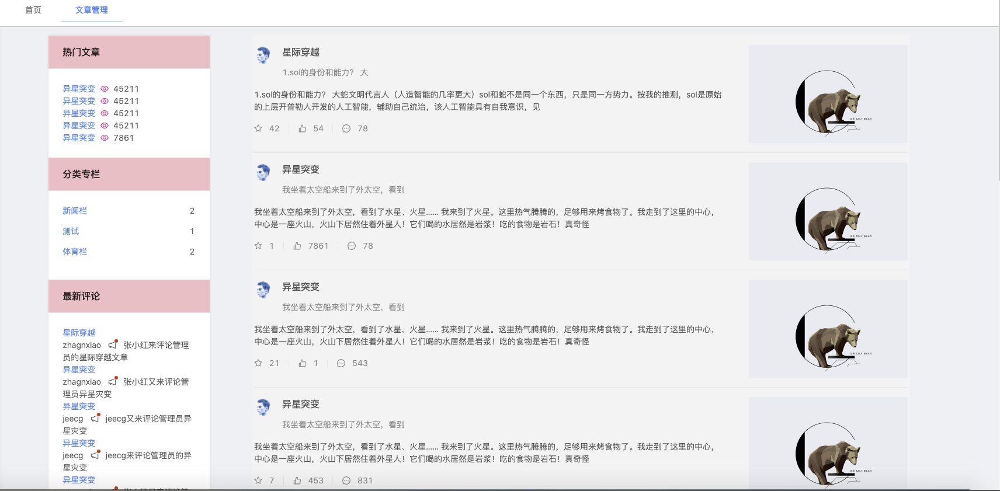
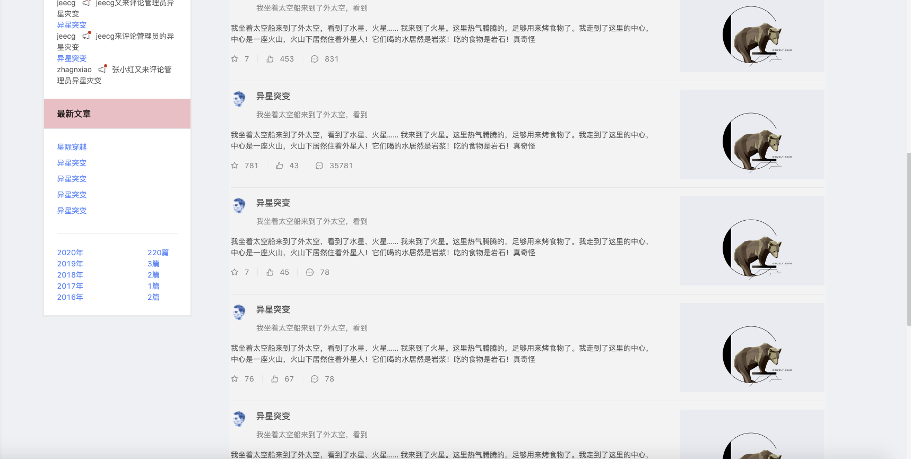
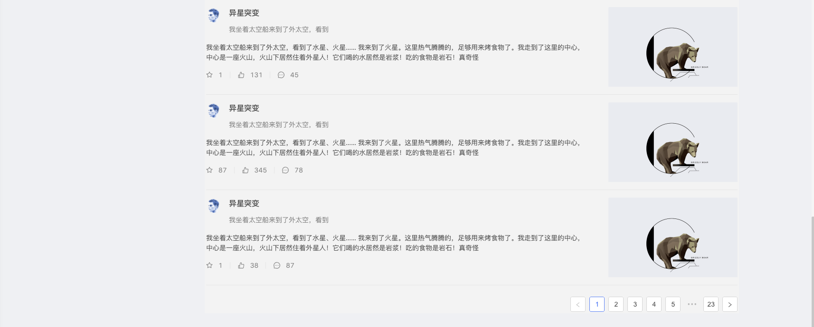
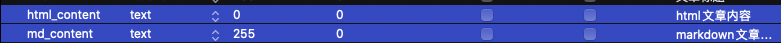

## 博客管理前台搭建

### 第一步、前后台整体框架布局

1. 前台页面布局

	```vue
	<template>
	  <div>
	    <a-row>
	      <a-col :span="1"></a-col>
	      <a-col :span="4">
	        <!-- 辅助信息面板 -->
	        <div style="background: #ececec; padding: 3px">
	            <a-row :gutter="24">
	              <a-col :span="24" v-for="(item,index) in information">
	                <a-card :title="item.title" :bordered="false" :hoverable="true" :headStyle="{background: '#FFC0CB'}">
	                  <!-- 卡片内容 -->
	                  <div v-if="index==0" v-for="context in item.context">
	                    <li style="display:inline"><a>{{ context.title }}</a></li>&ensp;<a-icon type="eye" theme="twoTone" two-tone-color="#eb2f96" style="display:inline"/>&ensp;<p style="display:inline">{{ context.star }}</p></br>
	                  </div>
	
	                  <div v-if="index==1" v-for="special in item.context" style="width:100%">
	                      <a-row type="flex">
	                        <a-col flex="auto"><a><li >{{ special.specialsName }}</li></a></a-col>
	                         <a-col flex="10px"><p>{{ special.articlesNum }}</p></a-col>
	                      </a-row>
	                  </div>
	
	                  <div v-if="index==2" v-for="comment in item.context">
	                    <a><li >{{ comment.title }}</li></a>
	                    <li >
	                      <p style="display:inline">{{ comment.commentUser }}</p>&ensp;
	                      <a-badge dot>
	                        <a-icon type="notification" />
	                      </a-badge>&ensp;
	                      <p style="display:inline">{{ comment.context }}</p>
	                    </li>
	                  </div>
	
	                  <div v-if="index==3">
	                    <div  v-for="context in item.context">
	                      <a><li style=" height: 30px;">{{ context.title }}</li></a>
	                    </div>
	                    <a-divider />
	                    <div v-for="info in groupArticle">
	                      <a-row>
	                        <a-col :span="18">
	                          <a>{{ info.time }}年</a>
	                        </a-col>
	                        <a-col :span="6">
	                          <a>{{ info.articles }}篇</a>
	                        </a-col>
	                      </a-row>
	                    </div>
	                  </div>
	                </a-card>
	              </a-col>
	            </a-row>
	          </div>
	      </a-col>
	      <a-col :span="1"></a-col>
	      <a-col :span="16">
	        <!-- 文章列表 -->
	        <div style="background-color: #f4f4f4; padding: 3px">
	          <a-list item-layout="vertical" size="large" :data-source="articles" :pagination="pagination"> 
	            <a-list-item slot="renderItem" key="item.title" slot-scope="item">
	              <template slot="actions">
	                <span :key="collection.type">
	                  <a-icon :type="collection.type" style="margin-right: 8px" />
	                  {{ item.collection }}
	                </span>
	              </template>
	              <template slot="actions">
	                <span :key="star.type">
	                  <a-icon :type="star.type" style="margin-right: 8px" />
	                  {{ item.star }}
	                </span>
	              </template>
	              <template slot="actions">
	                <span :key="message.type">
	                  <a-icon :type="message.type" style="margin-right: 8px" />
	                  {{ item.message }}
	                </span>
	              </template>
	              
	              <a-skeleton :loading="false" :active="true" :avatar="true">
	                <a-list-item-meta :description="item.description">
	                  <a slot="title" :href="item.href">{{ item.title }}</a>
	                  <a-avatar slot="avatar" :src="item.avatar" />
	                </a-list-item-meta>
	                {{ item.content }}
	              </a-skeleton>
	            </a-list-item>
	          </a-list>
	        </div>
	      </a-col>
	      <a-col :span="2"></a-col>
	    </a-row>
	  </div>
	</template>
	
	<script>
	const listData = []
	import { putAction, getAction } from '@/api/manage'
	export default {
	  name: 'BlogArticleList',
	  data() {
	    return {
	      description: 'blog_article管理页面',
	      articles: [],
	      groupArticle: [],
	      listData,
	      collection: { type: 'star-o', text: '0' },
	      star: { type: 'like-o', text: '0' },
	      message: { type: 'message', text: '0' },
	      information: [
	        {
	          title: '热门文章',
	          context: [],
	        },
	        {
	          title: '分类专栏',
	          context: [],
	        },
	        {
	          title: '最新评论',
	          context: [],
	        },
	        {
	          title: '最新文章',
	          context: [],
	        },
	      ],
	      url: {
	        blogArticlelist: '/article/blogArticle/list',
	        blogArticlelistAll: '/article/blogArticle/listAll',
	        blogSpecialListAll: '/special/blogSpecialColumn/listAll',
	
	        //统计专栏下文章数量
	        specialArticleCount: '/special/blogSpecialColumn/countArticle',
	        //文章按 日期 年 分类
	        groupArticleByYear: '/article/blogArticle/groupByYear',
	        //获取最新评论top5
	        commentTop5: '/comment/blogComment/listTop5',
	        delete: '/article/blogArticle/delete',
	        deleteBatch: '/article/blogArticle/deleteBatch',
	        exportXlsUrl: '/article/blogArticle/exportXls',
	        importExcelUrl: 'article/blogArticle/importExcel',
	      },
	      pagination: {
	        onChange: (page) => {
	          console.log(page)
	        },
	        pageSize: 10,
	      },
	    }
	  },
	  computed: {
	    importExcelUrl: function () {
	      return `${window._CONFIG['domianURL']}/${this.url.importExcelUrl}`
	    },
	  },
	  created() {
	    // this.$message.warning('请选择一条记录！');
	    this.getArticles()
	    this.getSpecials()
	    this.getcommentsTop5()
	    this.groupArticleByYear()
	  },
	  methods: {
	    //所有文章内容获取（param有内容则查询该用户下的所有文章）
	    getArticles(param) {
	      getAction(this.url.blogArticlelistAll, param)
	        .then((res) => {
	          if (res.success) {
	            res.result.forEach((item, i) => {
	              this.articles.push({
	                href: 'localhost:3000/user/login',
	                title: item.title,
	                avatar: 'https://zos.alipayobjects.com/rmsportal/ODTLcjxAfvqbxHnVXCYX.png',
	                description: item.content.substring(0, 15),
	                content: item.content.substring(0, 100),
	                collection: item.numCollections,
	                star: item.numLikes,
	                message: item.numComments,
	              })
	            })
	            this.hotArticles(res.result)
	            this.newTop5Articles(res.result)
	          }
	        })
	        .catch((e) => {
	          this.$message.warn('刷新失败')
	          console.log('刷新失败', e)
	        })
	    },
	    //热门文章数据获取
	    hotArticles(object) {
	      if (object.length > 5) {
	        object.sort(function (a, b) {
	          return b.numLikes - a.numLikes
	        })
	        const [first, second, thrid, four, five] = object
	        this.information[0].context.push({
	          title: first.title,
	          star: first.numLikes,
	        })
	        this.information[0].context.push({
	          title: second.title,
	          star: second.numLikes,
	        })
	        this.information[0].context.push({
	          title: thrid.title,
	          star: thrid.numLikes,
	        })
	        this.information[0].context.push({
	          title: four.title,
	          star: four.numLikes,
	        })
	        this.information[0].context.push({
	          title: five.title,
	          star: five.numLikes,
	        })
	      } else {
	        res.result.forEach((item) => {
	          this.information[0].context.push({
	            title: item.title,
	            star: item.numLikes,
	          })
	        })
	      }
	    },
	    //获取所有专栏param有内容则查询该用户下的所有专栏）
	    getSpecials(param) {
	      // Promise.all([
	      //     getAction('this.url.blogSpecialListAll', param),
	      //     getAction('this.url.specialArticleCount', item.articleId),
	
	      //   ]).then((res) => {
	
	      //   }).catch((e) => {
	
	      //   }).finally(() => {
	
	      //   })
	      getAction(this.url.blogSpecialListAll, param)
	        .then((res) => {
	          if (res.success) {
	            //第一次请求处理
	            res.result.forEach((item, i) => {
	              //成功后第二次请求
	              console.log('成功后第二次请求 ！', item.articleId)
	              getAction(this.url.specialArticleCount, { userId: item.userId, articleId: item.articleId }).then(
	                (res) => {
	                  if (res.success) {
	                    //数据处理
	                    this.information[1].context.push({
	                      specialsName: item.specialName,
	                      articlesNum: res.result,
	                    })
	                  }
	                }
	              )
	            })
	          }
	        })
	        .catch((e) => {
	          this.$message.warn('刷新失败')
	          console.log('刷新失败', e)
	        })
	    },
	    //获取最新评论top5
	    getcommentsTop5(param) {
	      getAction(this.url.commentTop5, param)
	        .then((res) => {
	          if (res.success) {
	            res.result.forEach((item, i) => {
	              this.information[2].context.push({
	                title: item.articleTitle,
	                commentUser: item.commentUserId,
	                context: item.context,
	              })
	            })
	          }
	        })
	        .catch((e) => {
	          this.$message.warn('刷新失败')
	          console.log('刷新失败', e)
	        })
	    },
	    //最新文章top5
	    newTop5Articles(object) {
	      if (object.length > 5) {
	        object.sort((a, b) => {
	          let t1 = new Date(Date.parse(a.createTime.replace(/-/g, '/')))
	          let t2 = new Date(Date.parse(b.createTime.replace(/-/g, '/')))
	          return t2.getTime() - t1.getTime()
	        })
	        const [first, second, thrid, four, five] = object
	        this.information[3].context.push({
	          title: first.title,
	        })
	        this.information[3].context.push({
	          title: second.title,
	        })
	        this.information[3].context.push({
	          title: thrid.title,
	        })
	        this.information[3].context.push({
	          title: four.title,
	        })
	        this.information[3].context.push({
	          title: five.title,
	        })
	      } else {
	        res.result.forEach((item) => {
	          this.information[3].context.push({
	            title: item.title,
	          })
	        })
	      }
	    },
	    //文章按 日期 年 分类
	    groupArticleByYear(param) {
	      getAction(this.url.groupArticleByYear, param)
	        .then((res) => {
	          console.log(res)
	          if (res.success) {
	            res.result.forEach((item, i) => {
	              this.groupArticle.push({
	                time: item.yearTime,
	                articles: item.articleNum,
	              })
	            })
	          }
	        })
	        .catch((e) => {
	          this.$message.warn('刷新失败')
	          console.log('刷新失败', e)
	        })
	    },
	  },
	}
	</script>
	<style scoped>
	@import '~@assets/less/common.less';
	.skeleton-demo {
	  border: 1px solid #f4f4f4;
	}
	#components-badge-demo-dot .anticon-notification {
	  width: 16px;
	  height: 16px;
	  line-height: 16px;
	  font-size: 16px;
	}
	</style>
	```

2. 后台项目

	```java
	@AutoLog(value = "blog_article-全部查询")
	@ApiOperation(value="blog_article-全部查询", notes="blog_article-全部查询")
	@GetMapping(value = "/listAll")
	public Result<?> ListAll(BlogArticle blogArticle, HttpServletRequest req) {
	  List<BlogArticle> blogArticles = blogArticleService.list();
	  return Result.ok(blogArticles);
	}
	```

	```java
	@AutoLog(value = "blog_special_column-全部查询")
	@ApiOperation(value="blog_special_column-全部查询", notes="blog_special_column-全部查询")
	@GetMapping(value = "/listAll")
	public Result<?> listAll(BlogSpecialColumn blogSpecialColumn,HttpServletRequest req) {
	
	 return Result.ok(blogSpecialColumnService.list(null));
	}
	```

	```java
	@AutoLog(value = "blog_special_column-统计专栏下文章数量")
	@ApiOperation(value="blog_special_column-统计专栏下文章数量", notes="blog_special_column-统计专栏下文章数量")
	@GetMapping(value = "/countArticle")
	public Result<?> countArticle(BlogSpecialColumn blogSpecialColumn,HttpServletRequest req) {
	 BlogSpecialColumn specialColumn=new BlogSpecialColumn();
	 specialColumn.setArticleId(blogSpecialColumn.getArticleId());
	 QueryWrapper<BlogSpecialColumn> queryWrapper=new QueryWrapper(specialColumn);
	 int count = blogSpecialColumnService.count(queryWrapper);
	 return Result.ok(count);
	}
	```

	```java
	//java
	@AutoLog(value = "blog_article-按照 日期\"年\" 进行文章分组")
	@ApiOperation(value="blog_article-按照 日期\"年\" 进行文章分组", notes="blog_article-按照 日期\"年\" 进行文章分组")
	@GetMapping(value = "/groupByYear")
	public Result<?> groupAriticleByYear() {
	 //SELECT DATE_FORMAT( create_time, '%Y' ) AS gjtime ,COUNT(1) AS gjsum FROM blog_article GROUP BY gjtime ORDER BY MAX(create_time) DESC
	 List<Map<String, Object>> list = blogArticleService.groupAriticleByYear();
	 return Result.ok(list);
	}
	//xml
	<select id="groupAriticleByYear" resultType="java.util.HashMap">
			SELECT DATE_FORMAT( create_time, '%Y' ) AS yearTime ,COUNT(1) AS articleNum FROM 				blog_article GROUP BY yearTime ORDER BY MAX(create_time) DESC
	</select>
	//mapper
	public List<Map<String, Object>> groupAriticleByYear();
	//server
	List<Map<String, Object>> groupAriticleByYear();
	//impl
	@Autowired
	BlogArticleMapper blogArticleMapper;
	@Override
	public List<Map<String, Object>> groupAriticleByYear() {
	  return blogArticleMapper.groupAriticleByYear();
	}
	```

	```java
	@AutoLog(value = "blog_comment-最新评论前五")
	@ApiOperation(value="blog_comment-最新评论前五", notes="blog_comment-最新评论前五")
	@GetMapping(value = "/listTop5")
	public Result<?> listTop5() {
	    //select * from audio order by id desc LIMIT 5
	    QueryWrapper<BlogComment> queryWrapper=new QueryWrapper<>();
	 QueryWrapper<BlogComment> wrapper = queryWrapper.orderByDesc("create_time").last("limit 5");
	 List<BlogComment> blogComments = blogCommentService.list(wrapper);
	 return Result.ok(blogComments);
	}
	```

	

3. 效果图

	

	

	

> 目前只是页面弄出来了，但是并无链接点击后的页面。下一步就是将博客管理页面中所有可点击的选项进一步开发。

### 新增编辑和删除功能

#### 调整之前代码

> <font color=ff00aa>注意：</font> 之前在第五章保存文章时，直接使用的的源数据(markdown数据)。在文章显示时造成一定的局限性，因此将之前的content字段细分为htmlContent(展示数据)和mdContent(源数据)。修改如下：

1. 文章  表字段修改

	

2. 前台修改

	在CreativeCenter.vue中的handleOk方法中修改如下：

	```javascript
	//文章内容
	htmlContent: this.$refs.childMarkdown.getHtml(),
	mdContent: this.$refs.childMarkdown.getMarkdown(),
	```

	静态代码添加ref属性

	```html
	<j-markdown-editor ref="childMarkdown" v-model="article.content" height="800px"></j-markdown-editor>
	```

3. 后台修改

	```java
	blogArticle.setHtmlContent(map.get("htmlContent").toString());
	blogArticle.setMdContent(map.get("mdContent").toString());
	```

	

#### 新增全局异常捕获

jeecg-boot框架已提供。可以参考下：

```java
public class JeecgBootException extends RuntimeException {
   private static final long serialVersionUID = 1L;

   public JeecgBootException(String message){
      super(message);
   }
   
   public JeecgBootException(Throwable cause)
   {
      super(cause);
   }
   
   public JeecgBootException(String message,Throwable cause)
   {
      super(message,cause);
   }
}
```

```java
/**
 * 异常处理器
 * 
 * @Author scott
 * @Date 2019
 */
@RestControllerAdvice 
@Slf4j
public class JeecgBootExceptionHandler {

   /**
    * 处理自定义异常
    */
   @ExceptionHandler(JeecgBootException.class)
   public Result<?> handleRRException(JeecgBootException e){
      log.error(e.getMessage(), e);
      return Result.error(e.getMessage());
   }

   @ExceptionHandler(NoHandlerFoundException.class)
   public Result<?> handlerNoFoundException(Exception e) {
      log.error(e.getMessage(), e);
      return Result.error(404, "路径不存在，请检查路径是否正确");
   }

   @ExceptionHandler(DuplicateKeyException.class)
   public Result<?> handleDuplicateKeyException(DuplicateKeyException e){
      log.error(e.getMessage(), e);
      return Result.error("数据库中已存在该记录");
   }

   @ExceptionHandler({UnauthorizedException.class, AuthorizationException.class})
   public Result<?> handleAuthorizationException(AuthorizationException e){
      log.error(e.getMessage(), e);
      return Result.noauth("没有权限，请联系管理员授权");
   }

   @ExceptionHandler(Exception.class)
   public Result<?> handleException(Exception e){
      log.error(e.getMessage(), e);
      return Result.error("操作失败，"+e.getMessage());
   }
   
   /**
    * @Author 政辉
    * @param e
    * @return
    */
   @ExceptionHandler(HttpRequestMethodNotSupportedException.class)
   public Result<?> HttpRequestMethodNotSupportedException(HttpRequestMethodNotSupportedException e){
      StringBuffer sb = new StringBuffer();
      sb.append("不支持");
      sb.append(e.getMethod());
      sb.append("请求方法，");
      sb.append("支持以下");
      String [] methods = e.getSupportedMethods();
      if(methods!=null){
         for(String str:methods){
            sb.append(str);
            sb.append("、");
         }
      }
      log.error(sb.toString(), e);
      //return Result.error("没有权限，请联系管理员授权");
      return Result.error(405,sb.toString());
   }
   
    /** 
     * spring默认上传大小100MB 超出大小捕获异常MaxUploadSizeExceededException 
     */
    @ExceptionHandler(MaxUploadSizeExceededException.class)
    public Result<?> handleMaxUploadSizeExceededException(MaxUploadSizeExceededException e) {
       log.error(e.getMessage(), e);
        return Result.error("文件大小超出10MB限制, 请压缩或降低文件质量! ");
    }

    @ExceptionHandler(DataIntegrityViolationException.class)
    public Result<?> handleDataIntegrityViolationException(DataIntegrityViolationException e) {
       log.error(e.getMessage(), e);
        return Result.error("字段太长,超出数据库字段的长度");
    }

    @ExceptionHandler(PoolException.class)
    public Result<?> handlePoolException(PoolException e) {
       log.error(e.getMessage(), e);
        return Result.error("Redis 连接异常!");
    }

}
```

#### 点击查看文章

```JavaScript
<template>
  <div>
    <a-row>
      <a-col :span="1"></a-col>
      <a-col :span="4">
        <!-- 辅助信息面板 -->
        <div style="background: #ececec; padding: 3px">
            <a-row :gutter="24">
              <a-col :span="24" v-for="(item,index) in information">
                <a-card :title="item.title" :bordered="false" :hoverable="true" :headStyle="{background: '#FFC0CB'}">
                  <!-- 卡片内容 -->
                  <div v-if="index==0" v-for="context in item.context">
                    <li style="display:inline"><a>{{ context.title }}</a></li>&ensp;<a-icon type="eye" theme="twoTone" two-tone-color="#eb2f96" style="display:inline"/>&ensp;<p style="display:inline">{{ context.star }}</p></br>
                  </div>

                  <div v-if="index==1" v-for="special in item.context" style="width:100%">
                      <a-row type="flex">
                        <a-col flex="auto"><a><li >{{ special.specialsName }}</li></a></a-col>
                         <a-col flex="10px"><p>{{ special.articlesNum }}</p></a-col>
                      </a-row>
                  </div>

                  <div v-if="index==2" v-for="comment in item.context">
                    <a><li >{{ comment.title }}</li></a>
                    <li >
                      <p style="display:inline">{{ comment.commentUser }}</p>&ensp;
                      <a-badge dot>
                        <a-icon type="notification" />
                      </a-badge>&ensp;
                      <p style="display:inline">{{ comment.context }}</p>
                    </li>
                  </div>

                  <div v-if="index==3">
                    <div  v-for="context in item.context">
                      <a><li style=" height: 30px;">{{ context.title }}</li></a>
                    </div>
                    <a-divider />
                    <div v-for="info in groupArticle">
                      <a-row>
                        <a-col :span="18">
                          <a>{{ info.time }}年</a>
                        </a-col>
                        <a-col :span="6">
                          <a>{{ info.articles }}篇</a>
                        </a-col>
                      </a-row>
                    </div>
                  </div>
                </a-card>
              </a-col>
            </a-row>
          </div>
      </a-col>
      <a-col :span="1"></a-col>
      <a-col :span="16">
        <!-- 文章列表 -->
        <div style="background-color: #f4f4f4; padding: 3px">
          <a-list item-layout="vertical" size="large" :data-source="articles" :pagination="pagination">
            <a-list-item slot="renderItem" key="item.title" slot-scope="item">
              <template slot="actions">
                <span :key="collection.type">
                  <a-icon :type="collection.type" style="margin-right: 8px" />
                  {{ item.collection }}
                </span>
              </template>
              <template slot="actions">
                <span :key="star.type">
                  <a-icon :type="star.type" style="margin-right: 8px" />
                  {{ item.star }}
                </span>
              </template>
              <template slot="actions">
                <span :key="message.type">
                  <a-icon :type="message.type" style="margin-right: 8px" />
                  {{ item.message }}
                </span>
              </template>
              
              <a-skeleton :loading="false" :active="true" :avatar="true">
                <a-list-item-meta :description="item.description">
                  <a slot="title" @click="clickArticle(item)">{{ item.title }}</a>
                  <a-avatar slot="avatar" :src="item.avatar" />
                </a-list-item-meta>
                <j-ellipsis :value="item.htmlContent" :length="100"/>
              </a-skeleton>
            </a-list-item>
          </a-list>
        <!--文章编辑-->
          <j-modal
            :visible.sync="articleEdit.visible"
            :width="1200"
            :title="articleEdit.title"
            :fullscreen.sync="articleEdit.fullscreen"
            :switchFullscreen="articleEdit.switchFullscreen"
          >
<!--            <template>-->
<!--              <j-markdown-editor v-model="articleEdit.content" :style="{ height: '800px' }"></j-markdown-editor>-->
<!--            </template>-->
<!--            {{ articleEdit.htmlContent }}-->
            <div v-html="articleEdit.htmlContent"></div>
          </j-modal>
        </div>
      </a-col>
      <a-col :span="2"></a-col>
    </a-row>
  </div>
</template>

<script>

import JEllipsis from '@/components/jeecg/JEllipsis'
import JMarkdownEditor from '@/components/jeecg/JMarkdownEditor/index'

import { putAction, getAction } from '@/api/manage'
export default {
  name: 'BlogArticleList',
  components: {
    JEllipsis,
    JMarkdownEditor,
  },
  data() {
    return {
      description: 'blog_article管理页面',
      articles: [],
      groupArticle: [],
      collection: { type: 'star-o', text: '0' },
      star: { type: 'like-o', text: '0' },
      message: { type: 'message', text: '0' },
      information: [
        {
          title: '热门文章',
          context: [],
        },
        {
          title: '分类专栏',
          context: [],
        },
        {
          title: '最新评论',
          context: [],
        },
        {
          title: '最新文章',
          context: [],
        },
      ],
      url: {
        blogArticlelist: '/article/blogArticle/list',
        blogArticlelistAll: '/article/blogArticle/listAll',
        blogSpecialListAll: '/special/blogSpecialColumn/listAll',

        //统计专栏下文章数量
        specialArticleCount: '/special/blogSpecialColumn/countArticle',
        //文章按 日期 年 分类
        groupArticleByYear: '/article/blogArticle/groupByYear',
        //获取最新评论top5
        commentTop5: '/comment/blogComment/listTop5',
        delete: '/article/blogArticle/delete',
        deleteBatch: '/article/blogArticle/deleteBatch',
        exportXlsUrl: '/article/blogArticle/exportXls',
        importExcelUrl: 'article/blogArticle/importExcel',
      },
      pagination: {
        onChange: (page) => {
          console.log(page)
        },
        pageSize: 10,
      },
      articleEdit :{
        title: '',
        visible: false,
        fullscreen: true,
        switchFullscreen: true,
        htmlContent: '',
        mdContent: '',
      }
    }
  },
  computed: {
    importExcelUrl: function () {
      return `${window._CONFIG['domianURL']}/${this.url.importExcelUrl}`
    },
  },
  created() {
    this.getArticles()
    this.getSpecials()
    this.getcommentsTop5()
    this.groupArticleByYear()
  },
  methods: {
    //所有文章内容获取（param有内容则查询该用户下的所有文章）
    getArticles(param) {
      getAction(this.url.blogArticlelistAll, param)
        .then((res) => {
          if (res.success) {
            res.result.forEach((item, i) => {
              if(item.title=="标题"){
                console.log(item);
              }
              this.articles.push({
                href: 'localhost:3000/user/login',
                title: item.title,
                avatar: 'https://zos.alipayobjects.com/rmsportal/ODTLcjxAfvqbxHnVXCYX.png',
                description: item.htmlContent.substring(0, 50),
                htmlContent: item.htmlContent,
                mdContent: item.mdContent,
                collection: item.numCollections,
                star: item.numLikes,
                message: item.numComments,
              })
            })
            this.hotArticles(res.result)
            this.newTop5Articles(res.result)
          }
        })
        .catch((e) => {
          this.$message.warn('刷新失败')
          console.log('刷新失败', e)
        })
    },
    //热门文章数据获取
    hotArticles(object) {
      if (object.length > 5) {
        object.sort(function (a, b) {
          return b.numLikes - a.numLikes
        })
        const [first, second, thrid, four, five] = object
        this.information[0].context.push({
          title: first.title,
          star: first.numLikes,
        })
        this.information[0].context.push({
          title: second.title,
          star: second.numLikes,
        })
        this.information[0].context.push({
          title: thrid.title,
          star: thrid.numLikes,
        })
        this.information[0].context.push({
          title: four.title,
          star: four.numLikes,
        })
        this.information[0].context.push({
          title: five.title,
          star: five.numLikes,
        })
      } else {
        res.result.forEach((item) => {
          this.information[0].context.push({
            title: item.title,
            star: item.numLikes,
          })
        })
      }
    },
    //获取所有专栏param有内容则查询该用户下的所有专栏）
    getSpecials(param) {
      // Promise.all([
      //     getAction('this.url.blogSpecialListAll', param),
      //     getAction('this.url.specialArticleCount', item.articleId),

      //   ]).then((res) => {

      //   }).catch((e) => {

      //   }).finally(() => {

      //   })
      getAction(this.url.blogSpecialListAll, param)
        .then((res) => {
          if (res.success) {
            //第一次请求处理
            res.result.forEach((item, i) => {
              //成功后第二次请求
              console.log('成功后第二次请求 ！', item.articleId)
              getAction(this.url.specialArticleCount, { userId: item.userId, articleId: item.articleId }).then(
                (res) => {
                  if (res.success) {
                    //数据处理
                    this.information[1].context.push({
                      specialsName: item.specialName,
                      articlesNum: res.result,
                    })
                  }
                }
              )
            })
          }
        })
        .catch((e) => {
          this.$message.warn('刷新失败')
          console.log('刷新失败', e)
        })
    },
    //获取最新评论top5
    getcommentsTop5(param) {
      getAction(this.url.commentTop5, param)
        .then((res) => {
          if (res.success) {
            res.result.forEach((item, i) => {
              this.information[2].context.push({
                title: item.articleTitle,
                commentUser: item.commentUserId,
                context: item.context,
              })
            })
          }
        })
        .catch((e) => {
          this.$message.warn('刷新失败')
          console.log('刷新失败', e)
        })
    },
    //最新文章top5
    newTop5Articles(object) {
      if (object.length > 5) {
        object.sort((a, b) => {
          let t1 = new Date(Date.parse(a.createTime.replace(/-/g, '/')))
          let t2 = new Date(Date.parse(b.createTime.replace(/-/g, '/')))
          return t2.getTime() - t1.getTime()
        })
        const [first, second, thrid, four, five] = object
        this.information[3].context.push({
          title: first.title,
        })
        this.information[3].context.push({
          title: second.title,
        })
        this.information[3].context.push({
          title: thrid.title,
        })
        this.information[3].context.push({
          title: four.title,
        })
        this.information[3].context.push({
          title: five.title,
        })
      } else {
        res.result.forEach((item) => {
          this.information[3].context.push({
            title: item.title,
          })
        })
      }
    },
    //文章按 日期 年 分类
    groupArticleByYear(param) {
      getAction(this.url.groupArticleByYear, param)
        .then((res) => {
          console.log(res)
          if (res.success) {
            res.result.forEach((item, i) => {
              this.groupArticle.push({
                time: item.yearTime,
                articles: item.articleNum,
              })
            })
          }
        })
        .catch((e) => {
          this.$message.warn('刷新失败')
          console.log('刷新失败', e)
        })
    },
    clickArticle(param){
      // console.log(param);
      this.articleEdit.visible=true;
      this.articleEdit.fullscreen=true;
      this.articleEdit.switchFullscreen=true;
      this.articleEdit.title=param.title;
      this.articleEdit.htmlContent=param.htmlContent;
      this.articleEdit.mdContent=param.mdContent;
    },
  },
}
</script>
<style scoped>
@import '~@assets/less/common.less';
.skeleton-demo {
  border: 1px solid #f4f4f4;
}
#components-badge-demo-dot .anticon-notification {
  width: 16px;
  height: 16px;
  line-height: 16px;
  font-size: 16px;
}
</style>
```

#### 文章列表默认按创建时间排序

```java
@AutoLog(value = "blog_article-全部查询")
@ApiOperation(value="blog_article-全部查询", notes="blog_article-全部查询")
@GetMapping(value = "/listAll")
public Result<?> ListAll(BlogArticle blogArticle, HttpServletRequest req) {
 QueryWrapper<BlogArticle> queryWrapper=new QueryWrapper<>();
 QueryWrapper<BlogArticle> wrapper = queryWrapper.orderByDesc("create_time");
 List<BlogArticle> blogArticles = blogArticleService.list(wrapper);
 return Result.ok(blogArticles);
}
```

#### 编辑和删除

1. 来个插槽

	```JavaScript
	<a-tag color="green" slot="actions" @click="editArticle(item)">编辑</a-tag>
	<a-tag color="cyan" slot="actions" @click="deleteArticle(item.id)">删除</a-tag>
	```

2. 来个文章编辑弹框

	```JavaScript
	<!--文章编辑-->
	<j-modal
	  :visible.sync="articleEdit.visible"
	  :width="1200"
	  :title="articleEdit.title"
	  :fullscreen.sync="articleEdit.fullscreen"
	  :switchFullscreen="articleEdit.switchFullscreen"
	  @ok="handleOk"
	  @cancel="handleCancel"
	>
	  <j-markdown-editor ref="childMarkdown" v-model="articleEdit.mdContent" height="800px"></j-markdown-editor>
	</j-modal>
	```

3. data数据以及URL地址

	```JavaScript
	articleEdit :{
	  id: '',
	  title: '',
	  visible: false,
	  fullscreen: true,
	  switchFullscreen: true,
	  htmlContent: '',
	  mdContent: '',
	}
	articleEdit: "/article/blogArticle/edit",
	articleDeleteById: "/article/blogArticle/delete",
	```

4. 方法

	```JavaScript
	editArticle(param){
	  this.articleEdit.id=param.id;
	  this.articleEdit.visible=true;
	  this.articleEdit.fullscreen=true;
	  this.articleEdit.switchFullscreen=true;
	  this.articleEdit.title=param.title;
	  this.articleEdit.htmlContent=param.htmlContent;
	  this.articleEdit.mdContent=param.mdContent;
	},
	deleteArticle(id){
	  console.log(id)
	  let articleData = {
	    id: id,
	  }
	  deleteAction(this.url.articleDeleteById, articleData).then((res) => {
	    if (res.success) {
	      this.$message.success(res.message);
	      this.getArticles();
	    } else {
	      this.$message.warning(res.message);
	    }
	  })
	},
	handleOk() {
	  if (!this.articleEdit.mdContent) return false
	  //获取下发的数据
	  let articleData = {
	    id: this.articleEdit.id,
	    mdContent: this.articleEdit.mdContent,
	    htmlContent: this.$refs.childMarkdown.getHtml(),
	  }
	  httpAction(this.url.articleEdit, articleData, 'put').then((res) => {
	    console.log("保存成功后数据》",res)
	    if (res.success) {
	      this.$message.success(res.message);
	      this.getArticles();
	    } else {
	      this.$message.warning(res.message);
	    }
	  })
	
	},
	handleCancel() {
	  this.articleEdit.visible = false
	},
	```

5. 后台代码

	* 编辑

		```java
		@AutoLog(value = "blog_article-编辑")
		@ApiOperation(value="blog_article-编辑", notes="blog_article-编辑")
		@PutMapping(value = "/edit")
		public Result<?> edit(@RequestBody BlogArticle blogArticle) {
		   blogArticleService.updateById(blogArticle);
		   return Result.ok("编辑成功!");
		}
		```

	* 删除

		```java
		@AutoLog(value = "blog_article-通过id删除")
		@ApiOperation(value="blog_article-通过id删除", notes="blog_article-通过id删除")
		@DeleteMapping(value = "/delete")
		public Result<?> delete(@RequestParam(name="id",required=true) String id) {
		   blogArticleService.removeById(id);
		   return Result.ok("删除成功!");
		}
		```

6. 前台全部vue

	```JavaScript
	<template>
	  <div>
	    <a-row>
	      <a-col :span="1"></a-col>
	      <a-col :span="4">
	        <!-- 辅助信息面板 -->
	        <div style="background: #ececec; padding: 3px">
	            <a-row :gutter="24">
	              <a-col :span="24" v-for="(item,index) in information">
	                <a-card :title="item.title" :bordered="false" :hoverable="true" :headStyle="{background: '#FFC0CB'}">
	                  <!-- 卡片内容 -->
	                  <div v-if="index==0" v-for="context in item.context">
	                    <li style="display:inline"><a>{{ context.title }}</a></li>&ensp;<a-icon type="eye" theme="twoTone" two-tone-color="#eb2f96" style="display:inline"/>&ensp;<p style="display:inline">{{ context.star }}</p></br>
	                  </div>
	
	                  <div v-if="index==1" v-for="special in item.context" style="width:100%">
	                      <a-row type="flex">
	                        <a-col flex="auto"><a><li >{{ special.specialsName }}</li></a></a-col>
	                         <a-col flex="10px"><p>{{ special.articlesNum }}</p></a-col>
	                      </a-row>
	                  </div>
	
	                  <div v-if="index==2" v-for="comment in item.context">
	                    <a><li >{{ comment.title }}</li></a>
	                    <li >
	                      <p style="display:inline">{{ comment.commentUser }}</p>&ensp;
	                      <a-badge dot>
	                        <a-icon type="notification" />
	                      </a-badge>&ensp;
	                      <p style="display:inline">{{ comment.context }}</p>
	                    </li>
	                  </div>
	
	                  <div v-if="index==3">
	                    <div  v-for="context in item.context">
	                      <a><li style=" height: 30px;">{{ context.title }}</li></a>
	                    </div>
	                    <a-divider />
	                    <div v-for="info in groupArticle">
	                      <a-row>
	                        <a-col :span="18">
	                          <a>{{ info.time }}年</a>
	                        </a-col>
	                        <a-col :span="6">
	                          <a>{{ info.articles }}篇</a>
	                        </a-col>
	                      </a-row>
	                    </div>
	                  </div>
	                </a-card>
	              </a-col>
	            </a-row>
	          </div>
	      </a-col>
	      <a-col :span="1"></a-col>
	      <a-col :span="16">
	        <!-- 文章列表 -->
	        <div style="background-color: #f4f4f4; padding: 3px">
	          <a-list item-layout="vertical" size="large" :data-source="articles" :pagination="pagination">
	            <a-list-item slot="renderItem" key="item.title" slot-scope="item">
	              <template slot="actions">
	                <span :key="collection.type">
	                  <a-icon :type="collection.type" style="margin-right: 8px" />
	                  {{ item.collection }}
	                </span>
	              </template>
	              <template slot="actions">
	                <span :key="star.type">
	                  <a-icon :type="star.type" style="margin-right: 8px" />
	                  {{ item.star }}
	                </span>
	              </template>
	              <template slot="actions">
	                <span :key="message.type">
	                  <a-icon :type="message.type" style="margin-right: 8px" />
	                  {{ item.message }}
	                </span>
	              </template>
	              
	              <a-skeleton :loading="false" :active="true" :avatar="true">
	                <a-list-item-meta :description="item.description">
	                  <a slot="title" @click="clickArticle(item)">{{ item.title }}</a>
	                  <a-avatar slot="avatar" :src="item.avatar" />
	                </a-list-item-meta>
	                <j-ellipsis :value="item.htmlContent" :length="100"/>
	              </a-skeleton>
	              <a-tag color="green" slot="actions" @click="editArticle(item)">编辑</a-tag>
	              <a-tag color="cyan" slot="actions" @click="deleteArticle(item.id)">删除</a-tag>
	            </a-list-item>
	          </a-list>
	        <!--文章查看-->
	          <j-modal
	            :visible.sync="articleView.visible"
	            :width="1200"
	            :title="articleView.title"
	            :fullscreen.sync="articleView.fullscreen"
	            :switchFullscreen="articleView.switchFullscreen"
	          >
	            <div v-html="articleView.htmlContent"></div>
	          </j-modal>
	          <!--文章编辑-->
	          <j-modal
	            :visible.sync="articleEdit.visible"
	            :width="1200"
	            :title="articleEdit.title"
	            :fullscreen.sync="articleEdit.fullscreen"
	            :switchFullscreen="articleEdit.switchFullscreen"
	            @ok="handleOk"
	            @cancel="handleCancel"
	          >
	            <j-markdown-editor ref="childMarkdown" v-model="articleEdit.mdContent" height="800px"></j-markdown-editor>
	          </j-modal>
	        </div>
	      </a-col>
	      <a-col :span="2"></a-col>
	    </a-row>
	  </div>
	</template>
	
	<script>
	
	import JEllipsis from '@/components/jeecg/JEllipsis'
	import JMarkdownEditor from '@/components/jeecg/JMarkdownEditor/index'
	
	import {
	  putAction,
	  getAction,
	  httpAction,
	  deleteAction,
	} from '@/api/manage'
	export default {
	  name: 'BlogArticleList',
	  components: {
	    JEllipsis,
	    JMarkdownEditor,
	  },
	  data() {
	    return {
	      description: 'blog_article管理页面',
	      articles: [],
	      groupArticle: [],
	      collection: { type: 'star-o', text: '0' },
	      star: { type: 'like-o', text: '0' },
	      message: { type: 'message', text: '0' },
	      information: [
	        {
	          title: '热门文章',
	          context: [],
	        },
	        {
	          title: '分类专栏',
	          context: [],
	        },
	        {
	          title: '最新评论',
	          context: [],
	        },
	        {
	          title: '最新文章',
	          context: [],
	        },
	      ],
	      url: {
	        blogArticlelist: '/article/blogArticle/list',
	        articleEdit: "/article/blogArticle/edit",
	        articleDeleteById: "/article/blogArticle/delete",
	        blogArticlelistAll: '/article/blogArticle/listAll',
	        blogSpecialListAll: '/special/blogSpecialColumn/listAll',
	
	        //统计专栏下文章数量
	        specialArticleCount: '/special/blogSpecialColumn/countArticle',
	        //文章按 日期 年 分类
	        groupArticleByYear: '/article/blogArticle/groupByYear',
	        //获取最新评论top5
	        commentTop5: '/comment/blogComment/listTop5',
	        delete: '/article/blogArticle/delete',
	        deleteBatch: '/article/blogArticle/deleteBatch',
	        exportXlsUrl: '/article/blogArticle/exportXls',
	        importExcelUrl: 'article/blogArticle/importExcel',
	      },
	      pagination: {
	        onChange: (page) => {
	          console.log(page)
	        },
	        pageSize: 10,
	      },
	      articleView :{
	        id: '',
	        title: '',
	        visible: false,
	        fullscreen: true,
	        switchFullscreen: true,
	        htmlContent: '',
	      },
	      articleEdit :{
	        id: '',
	        title: '',
	        visible: false,
	        fullscreen: true,
	        switchFullscreen: true,
	        htmlContent: '',
	        mdContent: '',
	      }
	    }
	  },
	  computed: {
	    importExcelUrl: function () {
	      return `${window._CONFIG['domianURL']}/${this.url.importExcelUrl}`
	    },
	  },
	  created() {
	    this.getArticles()
	    this.getSpecials()
	    this.getcommentsTop5()
	    this.groupArticleByYear()
	  },
	  methods: {
	    //所有文章内容获取（param有内容则查询该用户下的所有文章）
	    getArticles(param) {
	      this.articles=[];
	      getAction(this.url.blogArticlelistAll, param)
	        .then((res) => {
	          if (res.success) {
	            res.result.forEach((item, i) => {
	              this.articles.push({
	                id: item.id,
	                href: 'localhost:3000/user/login',
	                title: item.title,
	                avatar: 'https://zos.alipayobjects.com/rmsportal/ODTLcjxAfvqbxHnVXCYX.png',
	                description: item.htmlContent.substring(0, 50),
	                htmlContent: item.htmlContent,
	                mdContent: item.mdContent,
	                collection: item.numCollections,
	                star: item.numLikes,
	                message: item.numComments,
	              })
	            })
	            this.hotArticles(res.result)
	            this.newTop5Articles(res.result)
	          }
	        })
	        .catch((e) => {
	          this.$message.warn('刷新失败')
	          console.log('刷新失败', e)
	        })
	    },
	    //热门文章数据获取
	    hotArticles(object) {
	      if (object.length > 5) {
	        object.sort(function (a, b) {
	          return b.numLikes - a.numLikes
	        })
	        const [first, second, thrid, four, five] = object
	        this.information[0].context.push({
	          title: first.title,
	          star: first.numLikes,
	        })
	        this.information[0].context.push({
	          title: second.title,
	          star: second.numLikes,
	        })
	        this.information[0].context.push({
	          title: thrid.title,
	          star: thrid.numLikes,
	        })
	        this.information[0].context.push({
	          title: four.title,
	          star: four.numLikes,
	        })
	        this.information[0].context.push({
	          title: five.title,
	          star: five.numLikes,
	        })
	      } else {
	        res.result.forEach((item) => {
	          this.information[0].context.push({
	            title: item.title,
	            star: item.numLikes,
	          })
	        })
	      }
	    },
	    //获取所有专栏param有内容则查询该用户下的所有专栏）
	    getSpecials(param) {
	      // Promise.all([
	      //     getAction('this.url.blogSpecialListAll', param),
	      //     getAction('this.url.specialArticleCount', item.articleId),
	
	      //   ]).then((res) => {
	
	      //   }).catch((e) => {
	
	      //   }).finally(() => {
	
	      //   })
	      getAction(this.url.blogSpecialListAll, param)
	        .then((res) => {
	          if (res.success) {
	            //第一次请求处理
	            res.result.forEach((item, i) => {
	              //成功后第二次请求
	              console.log('成功后第二次请求 ！', item.articleId)
	              getAction(this.url.specialArticleCount, { userId: item.userId, articleId: item.articleId }).then(
	                (res) => {
	                  if (res.success) {
	                    //数据处理
	                    this.information[1].context.push({
	                      specialsName: item.specialName,
	                      articlesNum: res.result,
	                    })
	                  }
	                }
	              )
	            })
	          }
	        })
	        .catch((e) => {
	          this.$message.warn('刷新失败')
	          console.log('刷新失败', e)
	        })
	    },
	    //获取最新评论top5
	    getcommentsTop5(param) {
	      getAction(this.url.commentTop5, param)
	        .then((res) => {
	          if (res.success) {
	            res.result.forEach((item, i) => {
	              this.information[2].context.push({
	                title: item.articleTitle,
	                commentUser: item.commentUserId,
	                context: item.context,
	              })
	            })
	          }
	        })
	        .catch((e) => {
	          this.$message.warn('刷新失败')
	          console.log('刷新失败', e)
	        })
	    },
	    //最新文章top5
	    newTop5Articles(object) {
	      if (object.length > 5) {
	        object.sort((a, b) => {
	          let t1 = new Date(Date.parse(a.createTime.replace(/-/g, '/')))
	          let t2 = new Date(Date.parse(b.createTime.replace(/-/g, '/')))
	          return t2.getTime() - t1.getTime()
	        })
	        const [first, second, thrid, four, five] = object
	        this.information[3].context.push({
	          title: first.title,
	        })
	        this.information[3].context.push({
	          title: second.title,
	        })
	        this.information[3].context.push({
	          title: thrid.title,
	        })
	        this.information[3].context.push({
	          title: four.title,
	        })
	        this.information[3].context.push({
	          title: five.title,
	        })
	      } else {
	        res.result.forEach((item) => {
	          this.information[3].context.push({
	            title: item.title,
	          })
	        })
	      }
	    },
	    //文章按 日期 年 分类
	    groupArticleByYear(param) {
	      getAction(this.url.groupArticleByYear, param)
	        .then((res) => {
	          console.log(res)
	          if (res.success) {
	            res.result.forEach((item, i) => {
	              this.groupArticle.push({
	                time: item.yearTime,
	                articles: item.articleNum,
	              })
	            })
	          }
	        })
	        .catch((e) => {
	          this.$message.warn('刷新失败')
	          console.log('刷新失败', e)
	        })
	    },
	    clickArticle(param){
	      // console.log(param);
	      this.articleView.id=param.id;
	      this.articleView.visible=true;
	      this.articleView.fullscreen=true;
	      this.articleView.switchFullscreen=true;
	      this.articleView.title=param.title;
	      this.articleView.htmlContent=param.htmlContent;
	    },
	    editArticle(param){
	      this.articleEdit.id=param.id;
	      this.articleEdit.visible=true;
	      this.articleEdit.fullscreen=true;
	      this.articleEdit.switchFullscreen=true;
	      this.articleEdit.title=param.title;
	      this.articleEdit.htmlContent=param.htmlContent;
	      this.articleEdit.mdContent=param.mdContent;
	    },
	    deleteArticle(id){
	      console.log(id)
	      let articleData = {
	        id: id,
	      }
	      deleteAction(this.url.articleDeleteById, articleData).then((res) => {
	        if (res.success) {
	          this.$message.success(res.message);
	          this.getArticles();
	        } else {
	          this.$message.warning(res.message);
	        }
	      })
	    },
	    handleOk() {
	      if (!this.articleEdit.mdContent) return false
	      //获取下发的数据
	      let articleData = {
	        id: this.articleEdit.id,
	        mdContent: this.articleEdit.mdContent,
	        htmlContent: this.$refs.childMarkdown.getHtml(),
	      }
	      httpAction(this.url.articleEdit, articleData, 'put').then((res) => {
	        console.log("保存成功后数据》",res)
	        if (res.success) {
	          this.$message.success(res.message);
	          this.getArticles();
	        } else {
	          this.$message.warning(res.message);
	        }
	      })
	
	    },
	    handleCancel() {
	      this.articleEdit.visible = false
	    },
	  }
	}
	</script>
	<style scoped>
	@import '~@assets/less/common.less';
	.skeleton-demo {
	  border: 1px solid #f4f4f4;
	}
	#components-badge-demo-dot .anticon-notification {
	  width: 16px;
	  height: 16px;
	  line-height: 16px;
	  font-size: 16px;
	}
	</style>
	```