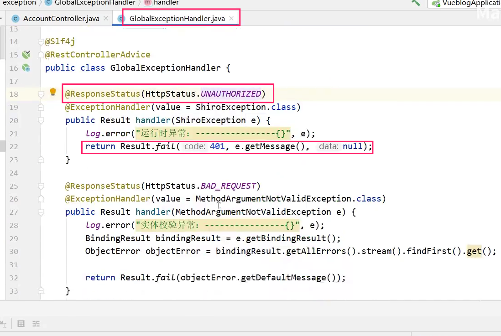

1. 文章数据库设计

	先设计成将文章内容字段设计成text

	* 优化1

		像csdn一样存入HTML  其中图片为存为标签形式。

	* 挑战1

		存在大量的文章数据。数据检索以及加载问题。

		-- 使用NoSQL和MySql

		

2. 多用户管理设计

	管理员和其他用户展现

3. 百万用户登录使用进行测试

4. token弄懂超时退出，单点登录弄懂

5. 网关跨域问题。

6. docker发布、docker私有仓库

7. 全局日志@AutoLog(value = "blog_comment-最新评论前五")、日志文件HTML等

8. 全局异常、事务等使用人人从0开始搭建彻底理解其原理

	

9. 单点登录token

10. 参数校验保证入库数据正确性

11. 结合哔哩哔哩markehub的视频结合jeecg-boot以及遇到源码和spring-boot-demo

12. 链路追踪、日志、监控

13. 微信发给电脑中七个开源项目以及下面文章界学习的重点。包括鉴权等等。。

14. 面试架构以及Java高级在百度云盘

## 知识点学习

1. 文章数据库设计

	先设计成将文章内容字段设计成text

	* 优化1

		像csdn一样存入HTML  其中图片为存为标签形式。

	* 挑战1

		存在大量的文章数据。数据检索以及加载问题。

		-- 使用NoSQL和MySql

		

2. 多用户管理设计

	管理员和其他用户展现

3. 百万用户登录使用进行测试

4. token弄懂超时退出，单点登录弄懂

5. 网关跨域问题。

6. docker发布、docker私有仓库

7. 全局日志@AutoLog(value = "blog_comment-最新评论前五")、日志文件HTML等

8. 全局异常、事务等使用人人从0开始搭建彻底理解其原理

9. 单点登录token

10. 参数校验保证入库数据正确性

11. 链路追踪、日志、监控

12. 微信发给电脑中七个开源项目以及下面文章介绍学习的重点。包括鉴权等等。。

## 练习

1. 结合哔哩哔哩markehub的视频结合jeecg-boot以及遇到源码和spring-boot-demo
2. 博客项目

## 面试相关

百度云网盘已下载到本地包括Java架构专题、Java核心知识点专题、简历