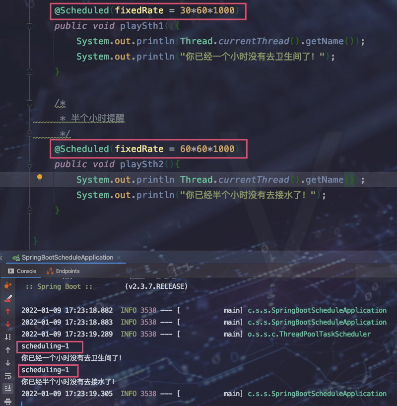
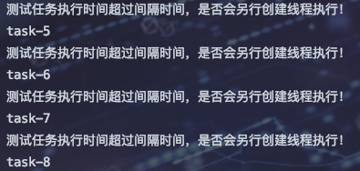
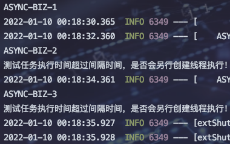
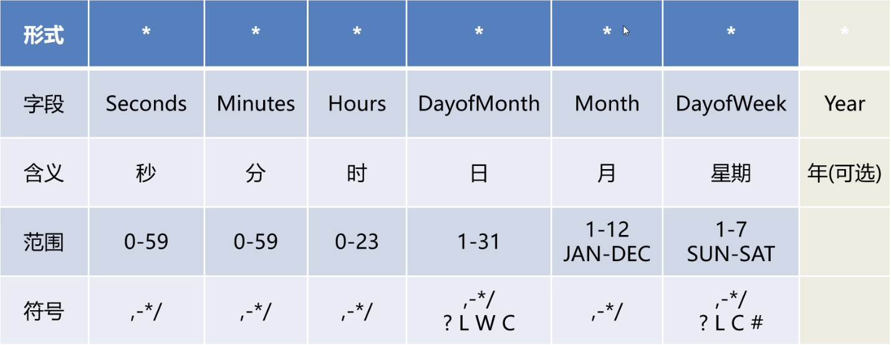
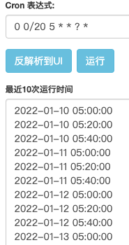
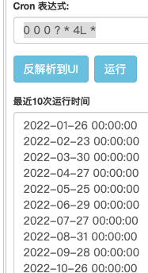
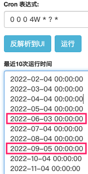

# 种类

## Time和TimerTask

> 详情见 MD-Book/Java高级/Java多线程/额外篇-TimerTask和Time.md


## ScheduledExecutorService 之 scheduleAtFixedRate

> 相较于 Time ScheduledExecutorService不仅支持灵活的设定轮询次数、间隔时间、延时时间等，还支持在线程池中执行

```java
ScheduledExecutorService service = Executors.newSingleThreadScheduledExecutor();
        service.scheduleAtFixedRate(()->{
            System.out.println("定时任务执行。。。");
        }, 1, 2, TimeUnit.SECONDS);
```


## Spring Task


### 使用流程

1. 启动类开启定时器

	```java
	@EnableScheduling
	```

2. 注解使用

	```java
	    /*
	     * 一个小时提醒
	     */
	    @Scheduled(fixedRate = 30*60*1000)
	    public void playSth1(){
	        System.out.println("你已经一个小时没有去卫生间了！");
	    }
	
	    /*
	     * 半个小时提醒
	     */
	    @Scheduled(fixedRate = 60*60*1000)
	    public void playSth2(){
	        System.out.println("你已经半个小时没有去接水了！");
	    }
	```


### @Scheduled 讲解

* Cron ：cron表达式**spring中不支持`年`域设置。专有符号中除? 其余都不支持**

* zone ：时区，接收一个`java.util.TimeZone#ID`。`cron表达式`会基于该时区解析。默认是一个空字符串，即取服务器所在地的时区。比如我们一般使用的时区`Asia/Shanghai`。该字段我们一般留空。

* fixedDelay ：时间间隔 单位ms，从上次任务执行结束后多长时间再执行。

	```java
	@Scheduled(fixedDelay = 5000) //上一次执行完毕时间点之后5秒再执行
	```

* fixedRate : 时间间隔，单位ms。从上次任务开始执行多长时间后再执行

* initialDelay : 第一次延时多久后执行


### fixedDelay和fixedRate

固定5s执行： 

* fixedRate 是按照任务开始时间进行计算，如果上一个任务1:05开始执行，那么下一个任务必定是1:10开始执行

* fixedDelay 是按照任务结束时间进行计算，如果上一个任务1:05开始执行，1:08执行完毕，那么下一次任务则1:13开始执行

> :hamster:注意：fixedRate如果某个任务执行时间超过时间间隔后，以后的时间间隔会越来越不准，相对而言fixedDelay是最简单的。


### 任务丢失

主要发生在 fixedRate 中，上面也讨论过，如果任务执行时间大于间隔时间，那么就会造成任务堆积，如果任务一直堆积下去，那么本该在某个时间执行的任务结果推迟执行，看起来就像是**任务丢失一样**


#### 造成原因

1. 任务执行时间无法预期
2. 单线程执行任务



> 两个任务都是使用的同一个线程去执行

#### 问题解决

* 异步执行任务【存在多次线程创建和销毁】
* 异步执行+线程池


##### 异步任务流程

1. 主启动类开启异步 @EnableAsync

2. @Scheduled 同时添加@Async

	```java
	@EnableAsync
	@SpringBootApplication
	@EnableScheduling
	public class SpringBootScheduleApplication {
	
	    public static void main(String[] args) {
	        SpringApplication.run(SpringBootScheduleApplication.class, args);
	    }
	    @Async
	    @Scheduled(fixedRate = 30*60*1000)
	    public void playSth1(){
	        System.out.println(Thread.currentThread().getName());
	        System.out.println("你已经一个小时没有去卫生间了！");
	    }
	    @Async
	    @Scheduled(fixedRate = 60*60*1000)
	    public void playSth2(){
	        System.out.println(Thread.currentThread().getName());
	        System.out.println("你已经半个小时没有去接水了！");
	    }
	```

	

	> 可以看到是多个线程在执行，针对于同一个@Scheduled 如果执行时间超过间隔时间也会立即开启一个线程去执行。

	```java
	    @Async
	    @Scheduled(fixedRate = 2*1000)
	    public void playSth3() throws InterruptedException {
	        System.out.println(Thread.currentThread().getName());
	        Thread.sleep(3000);
	        System.out.println("测试任务执行时间超过间隔时间，是否会另行创建线程执行！");
	    }
	```

	

	> 存在创建销毁线程性能问题。使用线程池解决


##### 异步任务+线程池(@Async+AsyncThreadPoolExecutor)

1. application.yml

```java
# 自定义异步任务线程池
async-pool:
  # 核心线程池大小
  core-pool-size: 20
  # 最大线程数大小
  maximum-pool-size: 40
  # 活跃时间：秒
  keep-alive-seconds: 300
  # 线程等待队列大小
  queue-capacity: 50
  # 自定义线程名称前缀
  thread-name-prefix: ASYNC-BIZ-
  # 设置终止等待时间：秒
  await-termination-time: 60
  # 线程结束前，是否等待线程队列中的任务执行完成
  wait-tasks-complete: true
```

2. 配置类

	```java
	@Configuration
	@ConfigurationProperties(prefix = "async-pool")
	@Data
	public class AsyncPoolConfig {
	    /** 核心线程池大小*/
	    private int corePoolSize = 10;
	
	    /** 最大线程数大小*/
	    private int maximumPoolSize = 20;
	
	    /** 活跃时间：秒*/
	    private int keepAliveSeconds = 60;
	
	    /** 线程等待队列大小*/
	    private int queueCapacity = 30;
	
	    /** 自定义线程名称前缀*/
	    private String threadNamePrefix = "ASYNC-";
	
	    /** 设置终止等待时间：秒*/
	    private int awaitTerminationTime = 30;
	
	    /** 线程结束前，是否等待线程队列中的任务执行完成*/
	    private boolean waitTasksComplete = true;
	}
	```

3. 自定义异步任务线程池

	```java
	@Configuration
	@Slf4j
	public class AsyncThreadPoolExecutor {
	
	    @Resource
	    private AsyncPoolConfig poolConfig;
	
	    @Bean
	    public Executor asyncExecutor() {
	        // 1. 实例化异步任务线程池
	        ThreadPoolTaskExecutor executor = new ThreadPoolTaskExecutor();
	        // 2. 设置核心线程池大小
	        executor.setCorePoolSize(poolConfig.getCorePoolSize());
	        // 3. 设置最大线程数
	        executor.setMaxPoolSize(poolConfig.getMaximumPoolSize());
	        // 4. 设置线程等待队列大小
	        executor.setQueueCapacity(poolConfig.getQueueCapacity());
	        // 5. 设置活跃时间：秒
	        executor.setKeepAliveSeconds(poolConfig.getKeepAliveSeconds());
	        // 6. 设置线程名字前缀
	        executor.setThreadNamePrefix(poolConfig.getThreadNamePrefix());
	        // setRejectedExecutionHandler：当线程池已经达到 max size 的时候，如何处理新任务
	        // AbortPolicy          默认的拒绝策略，会 throw RejectedExecutionException 拒绝
	        // CallerRunsPolicy     提交任务的主线程自己去执行该任务
	        // DiscardOldestPolicy  丢弃最老的任务，其实就是把最早进入工作队列的任务丢弃，然后把新任务加入到工作队列
	        // DiscardPolicy        相当大胆的策略，直接丢弃任务，没有任何异常抛出
	        executor.setRejectedExecutionHandler(new ThreadPoolExecutor.CallerRunsPolicy());
	        // 7. 设置等待终止时间：秒
	        executor.setAwaitTerminationSeconds(poolConfig.getAwaitTerminationTime());
	        // 8. 进程结束前，等待线程队列中的任务执行完成
	        executor.setWaitForTasksToCompleteOnShutdown(poolConfig.isWaitTasksComplete());
	        // 9. 手动初始化线程池
	        executor.initialize();
	        log.info("------>== @Async 业务处理线程配置成功，核心线程池：[{}]，最大线程池：[{}]，队列容量：[{}]，线程名称前缀：[{}] ==<------",poolConfig.getCorePoolSize(), poolConfig.getMaximumPoolSize(), poolConfig.getQueueCapacity(), poolConfig.getThreadNamePrefix());
	        return executor;
	    }
	
	    @Bean
	    public AsyncUncaughtExceptionHandler getAsyncUncaughtExceptionHandler() {
	        return (throwable, method, objects) -> {
	            log.error("@Async 业务 ----> 异常精简信息：[{}]，异常Throwable：{}", throwable.getMessage(), throwable);
	            log.error("@Async 业务 ----> 触发异常的方法名称：{}", method.getName());
	        };
	    }
	}
	```

4. @Async 使用自定义线程池

	```java
	//    @Async(value = "自定义ThreadPoolTaskExecutor的 Bean 的方法名")
	    @Async(value = "asyncExecutor")
	    @Scheduled(fixedRate = 2*1000)
	    public void playSth3() throws InterruptedException {
	        log.info("线程池为: {} ",Thread.currentThread().getName());
	        System.out.println(Thread.currentThread().getName());
	        Thread.sleep(3000);
	        System.out.println("测试任务执行时间超过间隔时间，是否会另行创建线程执行！");
	    }
	```

5. 


##### 异步任务+线程池(@Async+AsyncThreadPoolExecutor) 进一步优化 ThreadPoolTaskScheduler 自动配置


## Corn表达式



* corn表达式由七个部分组成，每个部分由空格分隔
* spring 支持六个，没有最后的Year
* 星期天 周日为1 周六为7
* 星期天和日会冲突，可以使用? 进行处理，表示不作限制


### 通用符号

* , : 表示列出枚举值，例如分钟上使用5，20 。表示时间在5分钟和20分钟时触发事件
* \- : 表示范围，例如分钟上使用5-20.表示时间在5到20时每分钟都会触发事件
* \* : 表示匹配该域任意值，例如分钟上使用* 表示每分钟都触发事件 

* / : 表示起始时间开始触发，然后每隔固定时间触发一次，例如小时上使用5，分钟上使用0/20，表示到了5小时触发，然后每隔20分钟触发，即5时触发、5-20、5-40触发。

	`注意：`如果使用固定值为起始时间，则超过固定值后不会触发。例如上面的只会触发5-20、5-40。如果继续那么就是6小时了，因此不会触发。

	


### 专有符号

* ? : 表示不作限制，只能用到`日`和`星期`两个域，由于这两个会互斥，需要对其一进行设置。

* L : 表示最后，只能用在`日`和`星期`两个域，表示最后一天或者最后一个星期。

	* 【0 0 0 L * ? * 】表示 每个月的最后一天触发

	* 【0 0 0 ? * 4L *】表示每月最后一个星期3进行触发。星期按周日开始算。

		

* W : 表示有效工作日(周一到周五，不区分节假日)，只能用在`日`域，系统将在离指定日期最近的有效工作日触发。例如【0 0 0 4W * ? *】表示每月4号的最近有效工作日触发，除了6月份和9月份，其他月份4号刚好都是在工作日，6月份4号为周六因此最近是周五为3号。9月份4号为周日最近是周一为5号。

	

* LW : 这两个符号可以连用，表示在某个月最后一个工作日

* \# : 用以确定每个月第几个星期几，只能出现在`星期`域，例如4#2 表示第二个星期三

* C : 只能用在`日`和`星期`两个域，需要关联日历，如果没关联可以忽略

> <font color=ff00aa>专有符号中，只有? 在Spring中支持，其他的都不支持</font>