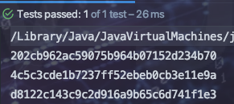

## 原始存储

刚开始我们将用户名和密码以明文方式存储到数据库。

> 如果我们数据库被攻破，则危已

## 加密存储

加密的方式有很多算法，例如雪花、md5等等。这里一MD5举例。

密码经过MD5加密算法得到16进制32位字符串存储在数据库。

> 如果数据库被攻破。被不法分子拿到密码的MD5字符串。这个时候如果你的密码很常见比如123456.则不发分子可以利用md5的`签名特性`利用穷举算法来获取你的原始密码数据。

## 复杂加密存储

`md5+salt `

即 将用户输入的密码生成md5   `拼接 `  一个随机生成的字符串生成md5，然后拼接在一起存储到数据库。当然拼接的方式又业务需求来决定。

> 这种方式需要在存储密码的时候将随机字符串也存储到数据库。这样也不能做到百分之百安全，如果数据库被攻破，密码和随机字符串的md5都被获取到，则不够安全了。但是我们可以利用业务将密码和随机字符串拼接的方式（例如将随机字符串拼接在密码中间形成最后的密匙）。并且如果你的密码并不是常见的密码，穷举网站也没有任何办法。

## Shiro中md5+salt+哈希散列

利用Shiro中提供的工具类，可以将md5+salt处理后的结果进行hash打散重排列。

```java
//使用md5
Md5Hash md5Hash=new Md5Hash("123");//使用md5加密必须使用构造方法
System.out.println(md5Hash.toHex());
//使用md5+salt处理
Md5Hash md5Hash1=new Md5Hash("123","OI&*5kjo");
System.out.println(md5Hash1.toHex());
//使用md5+salt+hash散列
Md5Hash md5Hash2=new Md5Hash("123","OI&*5kjo",1024);//1024为打散重排次数，次数越多越安全
System.out.println(md5Hash2.toHex());
```



## MD5主要功能

* 加密

	无论什么文件都会生成一个16进制32位字符串

* 签名

	无论什么文件只要内容相同则md5生成的结果始终一致。`可用于比较两个文件是否一样`
	
	

