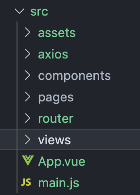

# 前端搭建

1. 初始化项目

	```vue
	vue create send-order-to-service
	```

2. 浏览器自启动

	```js
	#package.json
	"serve": "vue-cli-service serve --open",
	```

3. 关闭eslint

	```js
	#新建vue.config.js
	module.exports = {
	  //关闭eslint
	  lintOnSave: false
	}
	```

4. 整理数据和目录

	

5. 整合 vue-router@3

  ```bash
  npm install vue-router@3
  ```

  ```js
  import Vue from 'vue'
  import VueRouter from 'vue-router'
  
  Vue.use(VueRouter)
  
  const routes = [
      
  ]
  
  const router = new VueRouter({
      routes
  })
  
  export default router
  ```

5. 整合element-ui

	```vue
	npm i element-ui
	npm install babel-plugin-component -D
	```

	在 babel.config.js 写入如下内容

	```js
	module.exports = {
	  presets: [
	    '@vue/cli-plugin-babel/preset',
	    ["@babel/preset-env", { "modules": false }]
	  ],
	  "plugins": [
	    [
	      "component",
	      {
	        "libraryName": "element-ui",
	        "styleLibraryName": "theme-chalk"
	      }
	    ]
	  ]
	}
	```
	
	按需引入组件
	
	```js
	#main.js
	import { Button, Select } from 'element-ui'
	
	Vue.component(Button.name, Button)
	Vue.component(Select.name, Select)
	```


6. 整合axios

	```vue
	npm install axios
	```

	```js
	#src/axios/index.js
	import axios from 'axios'
	
	export function request(config) {
	
	    //1. 创建axios实例
	    const instance =axios.create({
	        baseURL:'http://localhost:8080/send-order-to-service',
	        timeout:5000
	    })
	
	    // 使用request拦截器
	    instance.interceptors.request.use(config => {
	        console.log('来到了request - success中');
	        return config;
	    }, error => {
	        console.log('来到了request - failure中');
	        return error
	    })
	
	    // 使用response拦截器
	    instance.interceptors.response.use(config => {
	        console.log('来到了response - success中');
	        return config;
	    }, error => {
	        console.log('来到了response - failure中');
	        return error
	    })
	
	    return instance(config)
	}
	```
	
	

# 接口定义

[API-sendMsgToService-API Studio（API管理）-办公自动化-Eolink APIKit](https://work-automate.w.eolink.com/home/api_studio/inside/api/list?projectHashKey=8s4Kk6ib9328d1cc293fea418c9b782b389e1a110f8e02f&spaceKey=work-automate)

 

