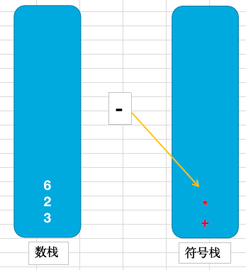

## 分类

### 线性结构

* 顺序存储

	数组、队列

* 链式存储

	链表、栈


### 非线性结构


> 二维数组，多维数组图，树，广义表


## 稀疏数组

`场景`

实现棋盘功能通常使用二维数组保存数据，且棋盘类游戏有个很明显的特点，有效数据较少。如果我们每次请求全量下发二维数组数据，一来浪费带宽二来性能得不到充分的释放。

因此需要==压缩处理==。而`稀疏数组`便是压缩方案的落地。


`需求`

1. 二维数组转稀疏数组
2. 稀疏数组还原二维数组


`原理`

* 二维数组转稀疏数组
	1. 初始化==x行y列==的二维稀疏数组。x等于有效数据的个数 + 1，y等于3
	2. 第0行记录数据为 ：二维数组行数，二维数组列数，有效数据个数
	3. 之后的行存储有效数据的 x坐标，y坐标，有效值
* 稀疏数组还原二维数组
	1. 读取稀疏数组0行记录
	2. 根据第0行记录第一列和第二列作为行数和列数，创建二维数组
	3. 读取稀疏数组之后的行，将第三列的值塞入到第一列和第二列的二维数组下标中

`实现`

```java
    //二维数组转稀疏数组
    public void transverter() {
        //定义有效数字
        int vaildNum = 1;
        int array[][] = {
                {0,0,0,0,0,0,0,0,0,0},
                {0,0,0,0,0,0,0,0,0,0},
                {0,0,0,0,0,0,0,0,0,0},
                {0,0,0,0,0,0,0,0,0,1},
                {0,0,0,0,0,0,0,0,0,1},
                {0,0,0,0,0,0,0,0,0,1},
                {0,0,0,0,0,0,0,0,0,1},
                {0,0,0,0,0,0,0,0,0,0},
                {0,0,0,0,0,0,0,0,0,0},
                {0,0,0,0,0,0,0,0,0,0}};
        //有效数据个数，即为1的数据
        int count = 0;
        //二维数组行数
        int x = 0;
        //二维数组列数
        int y = 0;
        for (int[] ints : array) {
            x = array.length;
            for (int anInt : ints) {
                y = ints.length;
                if (anInt == vaildNum) {
                    count += 1;
                }
            }
        }
        System.out.println("有效数据个数"+count);
        System.out.println("x:"+x);
        System.out.println("y:"+y);

        //初始化稀疏数组
        int[][] sparse = new int[count + 1][3];
        //设置二维数组行列数信息
        sparse[0][0] = x;
        sparse[0][1] = y;
        sparse[0][2] = count;

        int num = 1;
        for (int i = 0; i < array.length; i++) {
            for (int i1 = 0; i1 < array[i].length; i1++) {
                if (array[i][i1] == vaildNum) {
                    sparse[num][0] = i;
                    sparse[num][1] = i1;
                    sparse[num][2] = array[i][i1];
                    num++;
                }
            }
        }

        System.out.println("======== 稀疏二维数组 ==========");
        System.out.println("行号  列号  值");
        for (int[] ints : sparse) {
            for (int anInt : ints) {
                System.out.print(anInt + "    ");
            }
            System.out.println();
        }
    }
```

```java
    //稀疏数组还原二维数组
    public void restore() {
        int[][] transverter = transverter();

        int[] zeroRow = transverter[0];
        int x = zeroRow[0];
        int y = zeroRow[1];

        System.out.println("二维数组行数 ："+x + "。 列数 ：" +y);

        int[][] array = new int[x][y];
        for (int i = 0; i < array.length; i++) {
            for (int i1 = 0; i1 < array[i].length; i1++) {
                for (int i2 = 1; i2 < transverter.length; i2++) {
                    if (i == transverter[i2][0] && i1 == transverter[i2][1]) {
                        System.out.print(transverter[i2][0]);
                        System.out.print(transverter[i2][1]);
                        System.out.println();
                        array[i][i1] = transverter[i2][2];
                        break;
                    } else {
                        array[i][i1] = 0;
                    }
                }
            }

        }

        System.out.println("======== 二维数组 ==========");
        for (int[] ints : array) {
            for (int anInt : ints) {
                System.out.print(anInt + "  ");
            }
            System.out.println();
        }

    }
```


## 队列

`使用场景`

需要排队处理，且遵循==先入先出==的原则。


`原理`

使用<font size=4 color=ff00aa>数组</font>存储数据，新增首尾索引并尊崇 ==队首索引为出队，队尾索引为入队==

* add
	1. 创建数组，初始首尾索引相同为-1。
	2. 判断是否队满，队尾索引加一，并添加元素
* Out
	1. 判断队列是否为空，根据【队首索引 + 1】获取数组元素并移除元素
	2. 所有元素向前移动一位，并设置队尾元素为null
	3. 队尾索引减一

`实现`

```java
class MyQueue{
    private Object[] content;
    //队首
    private int queueHead;
    //队尾
    private int queueTail;

    //队列容量
    private int maxSize;

    public MyQueue(int maxSize){
        queueHead = queueTail = -1;
        this.maxSize = maxSize;
        content = new Object[maxSize];
    }

    //入队
    public void add(Object object){
        if (isFull()){
            throw new RuntimeException("队列已满 ！！");
        }

        backMove();
        content[queueTail] = object;
    }

    //出队
    public Object out() {
        if (isEmpty()) {
            throw new RuntimeException("队列无数据 ！！");
        }

        Object ele = content[queueHead + 1];
        move();
        fontMove();
        return ele;
    }

    //获取队列所有数据
    public Object[] show(){
        if (isEmpty()) {
            throw new RuntimeException("队列无数据 ！！");
        }

        return this.content;
    }

    public boolean isEmpty() {
        return queueHead == queueTail;
    }

    public boolean isFull() {
        return queueTail == maxSize;
    }

    //队列队尾索引后移+
    private void backMove() {
        queueTail ++;
    }

    //队列队尾索引前移
    private void fontMove() {
        queueTail --;
    }

    //数组中元素整体向前移动一位
    private void move(){
        for (int i = 0; i < queueTail; i++) {
            content[i] = content[i+1];
        }
        content[queueTail] = null;
    }
}
```


## 循环队列

`需求`

普通队列出队需要前移所有元素，如果队列容量很大的场景下，会造成性能的浪费

`是什么`
首尾相连的队列。入队使用tail索引加一，出队使用head加一，对于出队的空间可重复使用。

`原理`

> 已知背景：(1) head和tail索引一直增加。(2) 循环队列head和tail不得使用普通队列的默认值-1，涉及到如何判满了的情况

* 如何判空

	Head == tail

* 如何判满,有如下方案 

	1. head=tail=-1 且 tail == maxSize                                        >  不行，因为tail递增且循环执行，势必会大于maxSize
	2. head=tail=-1 且 tail  %  maxSize == 0                                >  不行，已出队位置可以继续塞数据
	3. head=tail=-1 且 tail  %  maxSize ==（ head + 1）               >  不行，如果tail转到第二圈，此时head = 2，tail=10。
	4. head=tail=-1 且 （tail + 1）  %  maxSize == head               >  不行，如果head等于-1，则条件不成立。
	5. 因此 **head=tail=0  且 （tail + 1）  %  maxSize == head** ，即head和tail初始相等，之后始终差一个格子，**即存放的数据容量不能大于等于maxSize**。
	
* add

	1. Head = tail = 0
	2. 判断是否满，数组[tail]赋值
	3. Tail = (tail + 1)%maxSize : 因为head和tail=0，tail必须加一，否则等式不成立
	
* pop

	1. Head = tail = 0
	2. 判断是否空，数组[head]取值
	3. Head = (head + 1)%maxSize

`实现`

```java
class MyCycleQueue{
    private Object[] content;

    private int head;
    private int  tail;
    private int maxSize;

    public MyCycleQueue(int maxSize){
        this.maxSize = maxSize;
        head = 0;
        tail = 0;
        content = new Object[maxSize];
    }

    public void add(Object obj) {
        if (isFull()){
            throw new RuntimeException("队列已满 ！！");
        }
        content[tail] = obj;
        tail = (tail+1)%maxSize;
    }

    public Object pop(){
        if (isEmpty()) {
            throw new RuntimeException("队列无数据 ！！");
        }
        Object o = content[head];
        head = (head + 1) % maxSize;
        return o;
    }

    public boolean isEmpty() {
        return head == tail;
    }

    public boolean isFull() {
        return (tail+1)%maxSize == head;
    }
}
```


## 链表

链表是有序的列表，内存中存储结构为【data域】【指针域】。

data域存放数据内容，指针域存放下个关联节点的地址，因此链表和队列以及数组在于是否顺序存储

### 无排序单链表


`原理`

* 存储结构

	节点对象，包含data属性和next属性

* 添加节点

	1. 初始化头结点|尾节点，刚开始头结点=尾节点
	2. 找到尾节点并设置指针next指向添加的节点

* 删除节点
	1. 找到删除节点的上节点并设置next为删除节点的下个节点

* 遍历节点
	1. 找到头节点依次迭代next直至next=null

`实现`

```java
public class SingleList {

    public static void main(String[] args) {
        SingleList singleList = new SingleList();
        singleList.show();
        singleList.add(new MyNode(1));
        singleList.add(new MyNode(2));
        singleList.show();
        singleList.remove(new MyNode(1));
        singleList.remove(new MyNode(2));
        singleList.show();
        singleList.remove(new MyNode(2));
        singleList.remove(new MyNode(1));
        singleList.show();
    }


    /**
     * 头节点
     */
    private MyNode root = new MyNode(null);

    public void add(MyNode node) {
        //找到尾节点
        MyNode tail = root;
        while (tail.next != null) {
            tail = tail.next;
        }
        //新增的节点下挂在尾节点
        tail.setNext(node);
    }


    public void remove(MyNode node) {
        //上节点:判断next是否等于给定节点
        //下节点:找到给定节点获取next
        MyNode tmp = root;
        while (true) {
            if (null == tmp.next) {
                throw new RuntimeException("无节点可删除");
            }
            //找到上节点
            if (tmp.next.equals(node)) {
                //设置上节点next为下节点地址
                tmp.setNext(tmp.next.next);
                break;
            }
            tmp = tmp.next;
        }
    }

    public void show(){
        MyNode tmp = root;
        while (true){
            if (!tmp.equals(root)) {
                System.out.println(tmp.data);
            }
            if (tmp.next==null){
                break;
            }
            tmp = tmp.next;
        }
    }


    static class MyNode{
        private Object data;
        private MyNode next;

        public void setData(Object data) {
            this.data = data;
        }

        public void setNext(MyNode next) {
            this.next = next;
        }

        public MyNode(Object obj) {
            this.data = obj;
        }

        @Override
        public boolean equals(Object o) {
            if (this == o) {
                return true;
            }
            if (o == null || getClass() != o.getClass()) {
                return false;
            }
            MyNode myNode = (MyNode) o;
            return data.equals(myNode.data);
        }

        @Override
        public int hashCode() {
            return Objects.hash(data);
        }
    }
}
```


### 有排序单链表

`原理`

* add

	1. 从根节点遍历，遍历每个元素的下一个节点序号是否大于插入的节点
	2. 如果有满足条件的节点则将该节点next设置为插入节点，插入节点的next设置为该节点的下一个节点
	3. 如果没有满足条件的节点则将插入节点放置在最后

* remove

	和无序单链表一毛一样


`代码`

```java
public class SingleListBySort {
    private MyNode root = new MyNode(null,-1);
    
    public void add(MyNode node){

        MyNode tmp = root;
        boolean exist = false;
        //判断是否存在符合条件的节点
        while (true) {
            if (Objects.isNull(tmp.next)) { //根节点直接插入到最后
                break;
            }
            if (tmp.next.no == node.no){
                throw new RuntimeException(node.no + " ：节点已经存在");
            }
            if (tmp.next.no > node.no) {
                exist = true;
                break;
            }
            tmp = tmp.next;
        }


        if (exist) {
            //存在符合条件节点，插入到中间
            node.next = tmp.next;
            tmp.next = node;
        } else {
            //不存在则插入到最后
            tmp.next = node;
        }

    }

    public void remove(SingleList.MyNode node) {
        //上节点:判断next是否等于给定节点
        //下节点:找到给定节点获取next
        MyNode tmp = root;
        while (true) {
            if (null == tmp.next) {
                throw new RuntimeException("无节点可删除");
            }
            //找到上节点
            if (tmp.next.equals(node)) {
                //设置上节点next为下节点地址
                tmp.next = tmp.next.next;
                break;
            }
            tmp = tmp.next;
        }
    }

    public void show(){
        MyNode tmp = root;
        while (true){
            if (!tmp.equals(root)) {
                System.out.println(tmp.data);
            }
            if (tmp.next==null){
                break;
            }
            tmp = tmp.next;
        }
    }


    static class MyNode {
        private int no;
        private Object data;
        private MyNode next;

        public MyNode() {
        }

        public MyNode(Object obj, int no) {
            this.data = obj;
            this.no = no;
        }
    }


    public static void main(String[] args) {
        MyNode list1 = new MyNode(1, 1);
        MyNode list2 = new MyNode(2, 2);
        MyNode list3 = new MyNode(3, 3);
        MyNode list4 = new MyNode(4, 4);
        MyNode list5 = new MyNode(5, 5);


        SingleListBySort listBySort = new SingleListBySort();
        listBySort.add(list5);
        listBySort.add(list2);
        listBySort.show();
        listBySort.add(list1);
        listBySort.add(list4);
        listBySort.add(list3);
        listBySort.show();
    }
}
```


### 双向链表

* 较单向链表，其查找方向是双向的，既可以从前也可以从后查找
* 较单向链表，其可以自己删除自己，即单向链表需要找到删除目标节点的上一个节点然后删除目标节点，而双向链表可以找到自身然后进行删除。


`原理`

* 新增

	新建根节点，添加节点如果为空则设置root节点的next为当前节点，当前节点的pre为root节点。

	如果节点不为空则根据root节点找到最后一个节点设置next为当前节点，当前节点的pre为最后一个节点。

* 删除

	找到目标节点，设置目标节点的上个节点的next为下个节点，设置目标节点的下个节点的pre为上个节点


`代码`

```java
public class DoubleLinkList {

    private MyNode root;

    DoubleLinkList() {
        root = new MyNode();
    }


    public void add(Object obj){
        MyNode node = new MyNode(obj);

        if (Objects.isNull(root.next)) {
            root.next = node;
            node.pre = root;
        } else {
            //遍历找到尾节点
            MyNode tailNode = findTailNode();
            tailNode.next = node;
            node.pre = tailNode;
        }
    }


    public void echo() {
        MyNode temp = root;
        while (true) {
            if (!Objects.isNull(temp.context)) {
                System.out.println("节点为 : " + temp.context);
            }
            if (Objects.isNull(temp.next)) {
                break;
            }
            temp = temp.next;
        }

    }

    public void delete(Object obj){
        MyNode targetNode = findTargetNode(new MyNode(obj));
        targetNode.pre.next = targetNode.next;
        targetNode.next.pre = targetNode.pre;
    }


    private MyNode findTailNode() {
        MyNode temp = root;
        while (true){
            if (Objects.isNull(temp.next)) {
                break;
            }
            temp = temp.next;
        }

        return temp;
    }

    public MyNode findTargetNode(MyNode node) {
        MyNode temp = root;
        while (true){
            if (Objects.isNull(temp.next)) {
                break;
            }
            if (Objects.equals(node.context, temp.context)) {
                break;
            }
            temp = temp.next;
        }

        if (Objects.isNull(temp.context)) {
            throw new RuntimeException("无此节点！");
        }
        return temp;
    }

    class MyNode{
        private Object context;
        private MyNode pre;
        private MyNode next;

        public MyNode() {
        }

        public MyNode(Object obj) {
            context = obj;
        }

    }
}


class Test {
    public static void main(String[] args) {
        DoubleLinkList doubleLinkList = new DoubleLinkList();
        doubleLinkList.add("aaa");
        doubleLinkList.add("bbb");
        doubleLinkList.add("ccc");
        doubleLinkList.add("ddd");
        doubleLinkList.delete("bbb");
        doubleLinkList.delete("ccc");
        doubleLinkList.echo();
    }
}
```


### 单向环形链表

`原理`

* 新增
	1. 初始化一个current节点，一个root节点且自循环(next指向自己)，current节点赋值为root节点。
	2. 设置current节点的next为新增节点，且新增节点的next设置为root节点。
	3. 设置current节点赋值为新增节点，以此类推
* 删除
	1. 初始化一个current节点，一个root节点且自循环(next指向自己)，current节点赋值为root节点。
	2. 根据root节点遍历到目标节点的pre节点，设置pre节点的next为目标节点的下个节点，目标节点的下个节点的pre设置为目标节点的上个节点【和单链表删除一样】

`代码`

```java
public class CyclicSingleLinked {
    private MyNode root = new MyNode(null);
    private MyNode current = new MyNode(null);

    public CyclicSingleLinked (){
        root.setNext(root);
        current = root;
    }

    public void add(Object str) {
        MyNode node = new MyNode(str);
        add(node);
    }

    public void remove(Object str) {
        MyNode node = new MyNode(str);
        remove(node);
    }

    private void add(MyNode node){
        current.setNext(node);
        node.setNext(root);
        current = node;
    }

    private void remove(MyNode node) {
        MyNode targetNode = findTargetPreNode(node);
        targetNode.setNext(targetNode.getNext().getNext());
    }
    
    public void echo() {
        MyNode temp = root.getNext();
        while (true) {
            if (!Objects.isNull(temp.getContext())) {
                System.out.println("节点为 : " + temp.getContext());
            }

            if (temp.getNext() == root) {
                break;
            }
            temp = temp.getNext();
        }
    }


    private MyNode findTargetPreNode(MyNode node) {
        MyNode tmp = root;
        while (true) {
            if (tmp.getNext() == root) {
                break;
            }

            if (tmp.getNext().getContext() == node.getContext()) {
                break;
            }

            tmp = tmp.getNext();
        }
        return tmp;
    }

}

class MyNode {
    private Object context;
    private MyNode next;

    public MyNode(Object context) {
        this.context = context;
    }

    public void setContext(Object context) {
        this.context = context;
    }

    public void setNext(MyNode next) {
        this.next = next;
    }

    public MyNode getNext() {
        return next;
    }

    public Object getContext() {
        return context;
    }
}

class TestIt{
    public static void main(String[] args) {
        CyclicSingleLinked cyclicSingleLinked = new CyclicSingleLinked();
        cyclicSingleLinked.add(1);
        cyclicSingleLinked.add(2);
        cyclicSingleLinked.add(3);
        cyclicSingleLinked.add(4);
        cyclicSingleLinked.echo();
        System.out.println("===========");
        cyclicSingleLinked.remove(2);
        cyclicSingleLinked.remove(3);
        cyclicSingleLinked.echo();
        System.out.println("===========");
        cyclicSingleLinked.remove(1);
        cyclicSingleLinked.echo();
        System.out.println("===========");
        cyclicSingleLinked.remove(4);
        cyclicSingleLinked.echo();
    }
}
```


`问题`

约瑟夫问题 ：

设编号为1，2，… n的n个人围坐一圈，约定编号为k（1<=k<=n）的人从1开始报数，数到m 的那个人出列，它的下一位又从1开始报数，数到m的那个人又出列，依次类推，直到所有人出列为止，由此产生一个出队编号的序列。

思路 ： 

1. 创建指定num的环形链表
2. 给定数字m，从root的next节点开始数，到m的节点进行删除，直到全部删除


`代码`

```java
public class CyclicSingleLinked_Josephu {
    private MyNode root = new MyNode(null);
    private MyNode current = new MyNode(null);

    public CyclicSingleLinked_Josephu (){
        root.setNext(root);
        current = root;
    }

    public void createNumLink(int num) {
        for (int i = 1; i < num + 1; i++) {
            add(i);
        }
    }

    public void add(Object str) {
        MyNode node = new MyNode(str);
        add(node);
    }

    public void remove(Object str) {
        MyNode node = new MyNode(str);
        remove(node);
    }

    private void add(MyNode node){
        current.setNext(node);
        node.setNext(root);
        current = node;
    }

    private void remove(MyNode node) {
        MyNode targetNode = findTargetPreNode(node);
        targetNode.setNext(targetNode.getNext().getNext());
    }
    
    public void echo() {
        MyNode temp = root.getNext();
        while (true) {
            if (!Objects.isNull(temp.getContext())) {
                System.out.println("节点为 : " + temp.getContext());
            }

            if (temp.getNext() == root) {
                break;
            }
            temp = temp.getNext();
        }
    }


    private MyNode findTargetPreNode(MyNode node) {
        MyNode tmp = root;
        while (true) {
            if (tmp.getNext() == root) {
                break;
            }

            if (tmp.getNext().getContext() == node.getContext()) {
                break;
            }

            tmp = tmp.getNext();
        }
        return tmp;
    }

    public void deleteByNum(int m) {
        //记录删除节点的下个节点：方便下次节点计数，初次为root的next
        MyNode pointer = root.getNext();

        while (true) {
            //每 m 次循环到的节点进行删除
            for (int j = 0; j < m; j++) {
                //如果为root节点则跳到下一个节点
                if (pointer == root) {
                    j--;
                    pointer = pointer.getNext();
                    continue;
                }
                if (j == m - 1){
                    //删除
                    System.out.println("出队 ---  " + pointer.getContext());
                    remove(pointer);
                    pointer = pointer.getNext();
                    break;
                }
                pointer = pointer.getNext();
            }
            //如果根节点自循环则表示已无节点
            if (root.getNext() == root) {
                break;
            }
        }
    }

}


class TestJosephu{
    public static void main(String[] args) {
        int m = 3;
        CyclicSingleLinked_Josephu cyclicSingleLinked = new CyclicSingleLinked_Josephu();
        cyclicSingleLinked.createNumLink(7);
        cyclicSingleLinked.echo();
        System.out.println("===========");
        cyclicSingleLinked.deleteByNum(m);
    }
}
```


## 栈

* 先进后出
* pop、push

`原理`

* push

	初始化一个数组，栈顶指针= -1

	压入数组，索引位置为栈顶指针

* pop

	根据栈顶指针从数组中获取元素

	赋值栈顶指针对应的数据为null

	栈顶指针--

`代码`

```java
public class MyStack {
    private Object[] elements;
    private int maxSize;
    private int point;

    public MyStack(int maxSize){
        this.maxSize = maxSize;
        point = -1;
        elements = new Object[this.maxSize];
    }

    public void push(Object obj) {
        elements[++point] = obj;
        if (elements.length > this.maxSize) {
            throw new RuntimeException("超过最大数据容量");
        }
    }

    public Object pop() {
        if (point < 0) {
            throw new RuntimeException("无数据");
        }
        Object element = elements[point];
        elements[point--] = null;
        return element;
    }

      //获取栈顶元素但不删除
    public Object get() {
        if (point < 0) {
            return null;
        }
        return elements[point];
    }
  
    public int size() {
        return point + 1;
    }
  
    static class Test{
        public static void main(String[] args) {
            MyStack myStack = new MyStack(500);
            myStack.push(111);
            myStack.push("111");
            myStack.push(true);
            myStack.push("cccc");
            System.out.println(myStack.pop());
            System.out.println(myStack.pop());
            System.out.println(myStack.pop());
            System.out.println(myStack.pop());
            System.out.println(myStack.pop());
        }
    }
}
```


### 栈实现计算器

`规律`

计算器给定表达式3+2*6-2，其计算规律为

1. 从左往右计算
2. 计算3+2前和下个操作符[*]的优先级比较，如果下个操作符优先级高则先进行计算下个优先级对应的表达式，后将结果值与前一个操作符构成表达式


`原理`

> 用数栈和符号栈模拟表达式，从左至右扫描，已入栈操作符模拟后者操作符，待入栈操作符模拟前者操作符。

1. 初始化两个栈，一个用来存储操作数，一个用来存储操作符，*优先级对应2，/优先级对应2，+优先级对应1，-优先级对应1。
2. 表达式从左往右分析，碰到数字则入操作数栈，符号则入操作符栈。
3. 入操作符栈前判断，如果为空则直接入栈，如果栈中有值则判断：
	1. 如果待入栈操作符 **大于等于** 栈中操作符则，先从操作数栈中push两个元素，与操作符栈中栈顶元素作为表达式计算，计算结果值入操作数栈
	2. 如果小于则入栈
4. 当表达式解析完毕，顺序从数栈pop两个元素和符号栈pop一个元素做表达式计算，结果入到数栈，再次执行第四步，直到数栈中只剩一个值，该值为最终结果。

`案例`

3+2*6-2

1. 3 入数栈，+ 入符号栈

2. 2 入数栈，* 入符号栈，

	

3. 6入数栈，- 小于 * ，则先计算栈顶 * 和 数栈中2/6计算结果为12入数栈

	

4. 依次计算，数栈出连个元素2 和 12，符号站出 -，得表达式12 - 2 = 10 入数栈

5. 再次推出两个元素10 和 3 ，符号栈出 + ，的表达式10 + 3 =13 入数栈


`代码`

```java
public class Counter {
    private MyStack numStack;
    private MyStack optStack;
    private Map<OptEnum, BiFunction> optMap = new HashMap<>();
    private List<Object> expression;

    public Counter(List<Object> expression) {
        numStack = new MyStack(20);
        optStack = new MyStack(20);
        optMap.put(OptEnum.ADD, (x, y) -> OptService.add(Integer.parseInt(x.toString()), Integer.parseInt(y.toString())));
        optMap.put(OptEnum.SUB, (x, y) -> OptService.sub(Integer.parseInt(x.toString()), Integer.parseInt(y.toString())));
        optMap.put(OptEnum.MUTIPLICATION, (x, y) -> OptService.muti(Integer.parseInt(x.toString()), Integer.parseInt(y.toString())));
        optMap.put(OptEnum.DIVISION, (x, y) -> OptService.division(Integer.parseInt(x.toString()), Integer.parseInt(y.toString())));

        this.expression = expression;
    }

    //解析入栈
    public Counter parse () {
        for (Object o : expression) {
            if (o instanceof Integer) {
                numStack.push(Integer.parseInt(o.toString()));
            }

            if (o instanceof String) {
                //判断栈顶操作符和次操作符优先级
                OptEnum optEnum = OptEnum.reversal(optStack.get());
                if (Objects.nonNull(optEnum) && Objects.requireNonNull(OptEnum.reversal(o)).getLevel() <= optEnum.getLevel()) {
                    //如果栈顶元素大于入栈元素，则优先计算栈中表达式
                    //从数栈中推出两个元素，与符号栈中栈顶元素组表达式，将得到的结果push到数栈中
                    //符号栈中元素重新入栈
                    Object num1 = numStack.pop();
                    Object num2 = numStack.pop();
                    int res = (int)optMap.get(optEnum).apply(num1, num2);
                    numStack.push(res);
                    optStack.pop();
                    optStack.push(o);
                } else {
                    optStack.push(o);
                }
            }
        }
        return this;
    }

    //解析栈中数据得到最终计算结果
    public int calculate() {
        int size = optStack.size();
        for (int i = 0; i < size; i++) {
            OptEnum optEnum = OptEnum.reversal(optStack.pop());
            if (Objects.nonNull(optEnum)) {
                Object num1 = numStack.pop();
                Object num2 = numStack.pop();
                int res = (int)optMap.get(optEnum).apply(num1, num2);
                numStack.push(res);
            }
        }
        return Integer.parseInt(numStack.pop().toString());
    }


    public static void main(String[] args) {
        List<Object> list = Arrays.asList(3, "+", 2, "*", 6, "-", 2);
        for (Object o : list) {
            System.out.print(o + " ");
        }
        System.out.println( " 最终结果为 ： " + new Counter(list).parse().calculate());

        List<Object> list1 = Arrays.asList(70, "+", 2, "*", 6, "-", 4);
        for (Object o : list1) {
            System.out.print(o + " ");
        }
        System.out.println( " 最终结果为 ： " + new Counter(list1).parse().calculate());

        List<Object> list2 = Arrays.asList(7, "*", 2, "*", 2, "-", 5, "+", 1, "-", 5, "+", 3, "-", 4);
        for (Object o : list2) {
            System.out.print(o + " ");
        }
        System.out.println( " 最终结果为 ： " + new Counter(list2).parse().calculate());
    }


}

enum OptEnum {
    //加
    ADD("+", 1),
    SUB("-", 1),
    MUTIPLICATION("*", 2),
    DIVISION("/", 2);


    private final String des;
    private final int level;

    OptEnum(String des, int level) {
        this.des = des;
        this.level = level;
    }

    public static OptEnum reversal(Object des){
        if (Objects.isNull(des)) {
            return null;
        }
        return Arrays.stream(OptEnum.values())
                .filter(ele -> ele.des.equals(des.toString()))
                .findAny()
                .get();
    }

    public String getDes() {
        return des;
    }

    public int getLevel() {
        return level;
    }
}


class OptService{
    public static int add(int a, int b) {
        return a + b;
    }
    public static int sub(int a, int b) {
        return b - a;
    }
    public static int muti(int a, int b) {
        return a * b;
    }
    public static int division(int a, int b) {
        return b / a;
    }
}
```

