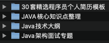
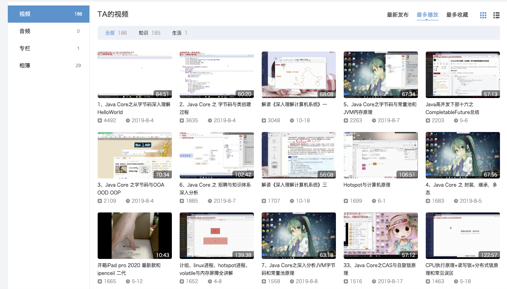

# 已学完知识点整理

## Web开发

### 开发工具

* 热部署
	* 笔记地址：MD-Book/SpringBoot/开发工具/Spring Boot热部署入门.md
* Lombok
	* 笔记地址：MD-Book/SpringBoot/开发工具/Spring Boot消除冗余代码Lombok入门.md
* Hutool
	* 仓库地址 ：https://gitee.com/loolly/hutool
	* 文档：https://www.hutool.cn/docs/#/
* Jeecg
	* 仓库地址：https://gitee.com/jeecg

### 数据库访问

* JdbcTemplate

* Spring Data Jpa

* MyBatis

* MyBatisPlus

	

### API开发

* RESTful API

* Swagger接口文档

### RPC开发

### 缓存

* 进程内缓存
* EhCache
* Redis

### 事务管理

### 日志管理

* log4j

### 定时与异步任务

### 邮件

### 监控管理

### 安全控制

*  Shiro
	* 视频地址 ： https://www.bilibili.com/video/BV1uz4y197Zm?p=2
	* 资料地址 ： /Volumes/Mac/学习视频/Shiro/shiro实战教程资料/
	* 练习代码 ：
	* 笔记         ： /Volumes/Mac/Respository/MD-Book/Shiro 

### 配置中心

### 注册中心

### 持续交付

### 服务器容错

### 链路追踪

## Java SE

# 项目梳理

## gulimall商城

`学习视频`

* 基础篇 https://www.bilibili.com/video/BV1np4y1C7Yf

* 高级篇 https://www.bilibili.com/video/BV18a4y1L7nv
* 集群片 https://www.bilibili.com/video/BV18a4y1L7nv

`电脑资料`

* 后端代码 ：/Volumes/Mac/IdeaWorkSpace/gulimall
* 前端代码：/Volumes/mac/wsWorkSpace/renren-fast-vue
* 下载资料：/Volumes/Mac/学习视频/谷粒商城全三章/docs/代码/

* nacos 地址：/Users/mac/Downloads/nacos/bin	
* 项目架构图：/Volumes/mac/学习视频/谷粒商城全三章/docs/谷粒商城分布式基础图.pdf

``

``

``

``

## 自己博客项目研发

* 前端：/Volumes/Mac/Respository/ProjectCode/ant-design-vue-jeecg

* 后端：/Volumes/Mac/Respository/ProjectCode/jeecg-cloud/

* nacos地址： /Users/mac/Downloads/nacos1/bin

# 查找知识点梳理

## SpringBoot

`练习代码`：用来学习并实践的代码

* /Volumes/Mac/Respository/ProjectCode/SpringBootLearn

`学习博客`：用来反复阅读学习的博客

* 程序猿DD  http://blog.didispace.com/Spring-Boot%E5%9F%BA%E7%A1%80%E6%95%99%E7%A8%8B/?utm_term=yudaoyuanma
* 芋道源码博客  http://www.iocoder.cn/      
* 芋道源码仓库    https://gitee.com/zhijiantianya/SpringBoot-Labs?_from=gitee_search
* Guide  https://snailclimb.gitee.io/springboot-guide/#/
* 方志朋  https://www.fangzhipeng.com/spring-boot.html

`实战Demo`：用来集成其他技术的demo

* https://github.com/xkcoding/spring-boot-demo

## SpringCloud

`练习代码`：用来学习并实践的代码

* /Volumes/Mac/Respository/ProjectCode/SpringCloudLearn

`学习博客`：用来反复阅读学习的博客

* 程序猿DD  http://blog.didispace.com/spring-cloud-learning/
* 方志朋  https://www.fangzhipeng.com/spring-cloud.html

`实战Demo`：用来集成其他技术的demo

* https://github.com/macrozheng/springcloud-learning

## SpringCloudAlibaba

`练习代码`：用来学习并实践的代码

* /Volumes/Mac/IdeaWorkSpace/gulimall

`学习播客`：用来反复阅读学习的博客

* 方志朋  https://www.fangzhipeng.com/spring-cloud.html

# 面试宝典

`本地资料`

* /Volumes/Mac/学习视频/Java面试专题和简历

	

``

``

# 小结

> 哔哩哔哩 尚硅谷中包含很多基础视频 https://space.bilibili.com/302417610/favlist

> Java 高级串讲 
>
> 1. https://space.bilibili.com/232459430/video

