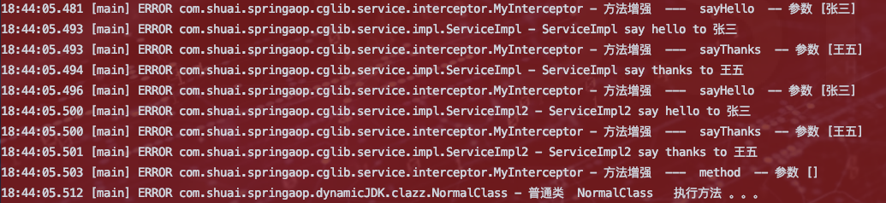

## 为什么出现代理

比如：有一个类，功能是出售房子。如果我们想要在出售方子前加一些验证：校验买方信息的真实性。

*   我们最容易想到的就是在出售房子方法中硬编码加入校验功能。但是这样的话就违背了单一性原则和开闭原则。
*   我们使用工具类或者父类封装校验方法，但是如果通过工具类则会污染业务代码，如果是通过类继承，则会影响其他父类的继承。

>   因此使用代理类，在代理函数前进行校验。总之，一句话，代理能够进行方法增强、访问控制，也是切面编程的实现原理。

```java
/*
 * @Author No1.shuai
 * @Description //TODO 代理出现原因
 * @Date 17:26 17:26
 **/
@Slf4j
@Component
public class Cause {
    @Autowired(required = false)
    private Medium medium;

    public void sellHouse(){
        /* 验证 */
        log.info("买方信息真实，可以进行卖出！！");

        medium.sellHouse();

        log.info("交易结束！！");
    }

}

@Component
class Medium{
    //卖房子
    public void sellHouse(){
        System.out.println("卖房子！！");
    }
}
```

```java
@Configuration
@ComponentScan(basePackageClasses = {Cause.class,Medium.class})
public class AnnotationScanConfig {

}
```

```java
@RunWith(SpringRunner.class)
@ContextConfiguration(classes = AnnotationScanConfig.class)
public class Client {
    @Autowired
    private Cause cause;

    @Test
    public void proxy(){
        cause.sellHouse();
    }
}
```

```bash
17:54:28.493 [main] INFO com.shuai.springaop.proxy.Cause - 买方信息真实，可以进行卖出！！
卖房子！！
17:54:28.493 [main] INFO com.shuai.springaop.proxy.Cause - 交易结束！！
```


## 代理分类

*   静态代理

	`优点：`实现简单

	`缺点：`如果中介代理的卖家有100个，并且该中介要在58同城等n个平台挂卖。则他需要（100 X n）个代理对象。并且当卖家房源发生变化，则（100 X n ）个代理对象需要修改

*   JDK动态代理

	`优点`：程序执行构成中利用JDK反射机制，创建代理对象，并动态的指定代理的目标类，完美的解决了静态代理的缺点。

	`缺点:` 目标类必须是接口，否则用不了。

	`实现原理:`利用JAVA反射包中的类和接口实现。java.lang.reflect : 	InvocationHandler、Method、Proxy。

	`反射原理:`反射是利用  Method类 调用invoke方法来调用目标方法

*   cglib代理

	`优点:`底层采用ASM字节码框架，使用字节码生成技术创建代理对象。速度优于JDK动态代理，并且可以是普通类

	`实现原理:`通过继承目标类，创建它的子类，在子类中重写父类中同名方法，实现功能的增强。

	`要求:`因为要用到继承，因此要求目标类不能是final以及代理方法不能是final。

	`应用场景:`Mybatis、Spring AOP

参考 ：MD-Book\Java高级\Java-设计模式\第十三节-代理模式.md


>   JDK动态代理 和 CGLIB动态代理 都可以实现  ： 方法增强   --  针对接口和类 某一个方法进行增强


* 正向代理
* 反向代理

参考 ： MD-Book/Nginx/第七章-Nginx应用场景-反向代理.md


## 反射

### 基础环境

```java
public interface IHellService {
    void sayHello(String name);
}
```

```java
@Slf4j
@Service("helloService")
public class HelloServiceImpl implements IHellService {
    @Override
    public void sayHello(String name) {
        log.error(" HelloServiceImpl SayHello to {}",name);
    }
}
```

```java
@Configuration
@ComponentScan(basePackageClasses = {HelloServiceImpl.class})
public class AnnotationScanConfig {
}
```


### 没有使用反射

```java
@RunWith(SpringRunner.class)
@ContextConfiguration(classes = AnnotationScanConfig.class)
public class ReflectTest {
    @Autowired
    private IHellService hellService;
    /*
     * TODO <p>没有使用反射</p>
     * @date 2021/2/21 12:05 上午     
     * @return void
     */
    @Test
    public void noReflect(){
        hellService.sayHello("张三");
    }
}
```


### 使用反射 

```java
/*
     * TODO <p> 使用反射机制  核心 ： 不需要实例化类获取对象  而是直接通过 Method 中的方法  获取对象</p>
     * @date 2021/2/21 12:06 上午
     * @return void
     */
    @Test
    public void yesReflect() throws NoSuchMethodException, InvocationTargetException, IllegalAccessException {
        //1. 实现接口
        IHellService target = new HelloServiceImpl();

        //2. 获取目标对象中Method对象
            //参数 String name :反射获取目标对象方法
            //参数 Class<?>... parameterTypes :目标对象方法中参数类型
        Method method = target.getClass().getMethod("sayHello", String.class);

        //3. 通过method对象 执行 目标对象的方法
            //参数 Object obj : 要执行某个实现类的对象
            //参数 Object... args : 目标对象方法参数值
            //返回值 Object : 目标对象方法的返回值
       Object result = method.invoke(target, "王五");

    }
```


## JDK动态代理实现

1. 定义接口和实现类

	```java
	public interface ShellMouseService {
	    float shellMouse(float price,float discount);
	}
	```

	```java
	@Service
	@Slf4j
	public class ShellMouseToTaoBaoServiceImpl implements ShellMouseService {
	    @Override
	    public float shellMouse(float price,float discount) {
	        discount = 0 == discount ? 1 : discount;
	
	        log.error("在淘宝上出售房子，原价为 {} ",price * discount);
	
	        return price * discount;
	    }
	}
	```

	```java
	@Service
	@Slf4j
	public class ShellMouseTo58ServiceImpl implements ShellMouseService {
	    @Override
	    public float shellMouse(float price,float discount) {
	        discount = 0 == discount ? 1 : discount;
	
	        log.error("在58上出售房子，原价为 {} ",price * discount);
	
	        return price*discount;
	    }
	}
	```

2. 定义IOC扫描配置类

	```java
	@Configuration
	@ComponentScan(basePackageClasses = {ShellMouseToTaoBaoServiceImpl.class, ShellMouseTo58ServiceImpl.class})
	public class AnnotationScanConfig {
	}
	```

3. 自定义动态代理处理类

	```java
	/**
	 * TODO:<p> 自定义动态代理处理类 <p/>
	 *
	 * @package: com.shuai.springaop.dynamicJDK.dynamicHandle
	 * @Author mac
	 * @Date 2021/2/21 3:17 下午
	 * @Version V1.0
	 **/
	@Slf4j
	public class DynamicHandle implements InvocationHandler {
	    /* 目标对象 */
	    private Object target;
	    public DynamicHandle(Object target){
	        this.target = target;
	    }
	    /*
	     * TODO <p> 此方法主要替代代理类。因此要实现1.执行目标方法，2.方法增强 </p>
	     * @date 2021/2/21 3:19 下午
	     * @param proxy   : 为代理目标对象 ，传入什么实现类则执行什么实现类的目标方法
	     * @param method : 为反射核心类
	     * @param args  : 为代理对象方法参数
	     * @return java.lang.Object ：为地阿里对象方法返回值
	     */
	    @Override
	    public Object invoke(Object proxy, Method method, Object[] args) throws Throwable {
	        // 1. 利用反射执行目标方法
	        Object res = method.invoke(target, args); // 反射
	
	        //2. 方法增强
	        float price = (float) res;
	        price = price + 25;
	        log.error("代理平台进行加价后，价格为 {} ",price);
	
	        return price;
	    }
	}
	```

4. 测试

	```java
	@Slf4j
	@RunWith(SpringRunner.class)
	@ContextConfiguration(classes = AnnotationScanConfig.class)
	public class Client {
	    private ShellMouseService shellMouseService;
	
	    //1. 动态创建目标实现类
	    @Autowired
	    ShellMouseTo58ServiceImpl shellMouseTo58Service;
	    @Autowired
	    ShellMouseToTaoBaoServiceImpl shellMouseToTaoBaoService;
	
	    public void init(ShellMouseService shellMouseService){
	        this.shellMouseService = shellMouseService;
	    }
	
	    @Test
	    public void dynamicJdkTest(){
	        init(shellMouseToTaoBaoService);
	        /* 利用接口和接口实现类多态特性  完美解决了静态代理中第一个问题 ： 只需要给 InvocationHandler 类传递接口实现类即可。大大减少了代理类成倍增加问题 */
	        /* 利用反射，只执行目标类中代理方法，接口的改动并不会影响代理方法，除非接口修改代理方法名称 */
	        //2. 创建自定义增强处理器类 InvocationHandler
	        InvocationHandler invocationHandler = new DynamicHandle(shellMouseService);
	
	        //3. 创建代理对象
	        //代理类加载器 ，代理类接口 ，自定义动态代理处理类
	        ShellMouseService proxy = (ShellMouseService) Proxy.newProxyInstance(shellMouseService.getClass().getClassLoader(), shellMouseService.getClass().getInterfaces(), invocationHandler);
	
	        //4. 通过代理对象执行目标方法
	        float price = proxy.shellMouse(10000.00F, 0.5F);
	        log.error("最终的返回价格为{}",price);
	    }
	}
	
	```

5. 结果

	


## CGLIB动态代理实现

### 接口代理

1. 定义接口和实现类

	```java
	public interface IService {
	    void sayHello(String name);
	    void sayThanks(String name);
	}
	```

	```java
	@Service
	@Slf4j
	public class ServiceImpl implements IService {
	    @Override
	    public void sayHello(String name) {
	        log.error("ServiceImpl say hello to {}",name);
	    }
	
	    @Override
	    public void sayThanks(String name) {
	        log.error("ServiceImpl say thanks to {}",name);
	    }
	}
	```

	```java
	@Service
	@Slf4j
	public class ServiceImpl2 implements IService {
	    @Override
	    public void sayHello(String name) {
	        log.error("ServiceImpl2 say hello to {}",name);
	    }
	
	    @Override
	    public void sayThanks(String name) {
	        log.error("ServiceImpl2 say thanks to {}",name);
	    }
	}
	```

2. 定义IOC扫描配置类

	```java
	@Configuration
	@ComponentScan(basePackageClasses = {ServiceImpl.class, ServiceImpl2.class})
	public class AnnotationScanConfig {
	}
	```

3. 动态代理处理类

	```java
	@Slf4j
	public class MyInterceptor implements MethodInterceptor {
	
	    public <T> T getProxy(Class clazz){
	        //字节码增强类
	        Enhancer enhancer = new Enhancer();
	        //设置父类 ： 即通过字节码类创建一个子类并覆盖其代理方法
	        enhancer.setSuperclass(clazz);
	        //设置回调类
	        enhancer.setCallback(this);
	        //创建代理类
	        return (T)enhancer.create();
	
	    }
	
	    /*
	     * TODO <p> 在此方法中进行增强，类似于jdk动态代理中的invoke </p>
	     * @author mac
	     * @date 2021/2/21 6:16 下午
	     * @param o 返回类型
	     * @param method  目标方法
	     * @param objects
	     * @param methodProxy
	     * @return java.lang.Object
	     */
	    @Override
	    public Object intercept(Object o, Method method, Object[] objects, MethodProxy methodProxy) throws Throwable {
	        //方法增强
	        log.error("方法增强  ---  {}  -- 参数 {}",method.getName(),objects);
	        //执行目标方法
	        Object res = methodProxy.invokeSuper(o, objects);
	
	        return res;
	    }
	}
	```


### 普通类代理

1. 定义普通类

	```java
	@Slf4j
	public class NormalClass {
	    public void method(){
	        log.error("普通类  NormalClass   执行方法 。。。 ");
	    }
	}
	
	```

2. 测试

	```java
	@RunWith(SpringRunner.class)
	@ContextConfiguration(classes = AnnotationScanConfig.class)
	public class Client {
	    @Test
	    public void cglibTest(){
	        MyInterceptor myInterceptor = new MyInterceptor();
	        // todo 接口实现类代理测试
	        ServiceImpl proxy = myInterceptor.getProxy(ServiceImpl.class);
	        proxy.sayHello("张三");
	        proxy.sayThanks("王五");
	
	        ServiceImpl2 proxy2 = myInterceptor.getProxy(ServiceImpl2.class);
	        proxy2.sayHello("张三");
	        proxy2.sayThanks("王五");
	
	        //todo 普通类代理测试
	        NormalClass normal = myInterceptor.getProxy(NormalClass.class);
	        normal.method();
	    }
	}
	```

3. 结果

	

