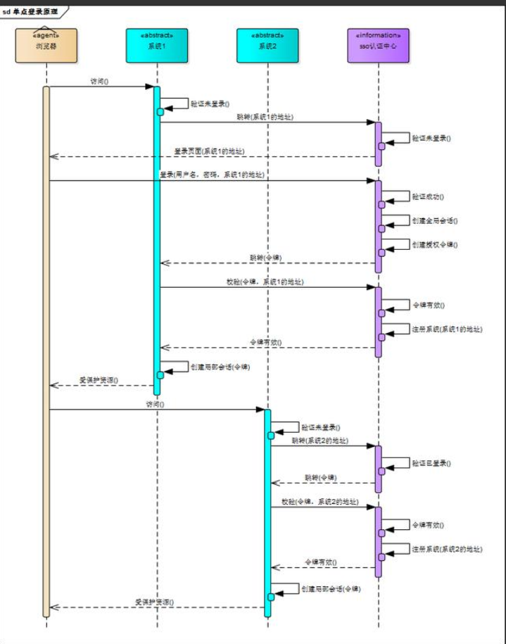

>   cookie、session、token 区别  见   ：MD-Book\知识点概念梳理\token和cookie和session.md

*    通过上面的文章 我们知道了 cookie+session 结合的痛点 就是服务器扩展支持不友好，需要使用单独的session id服务器或者是session id复制

*   因此技术趋势都是使用token的基础上进行实现。

## 是什么

​	在一个多系统共存的环境下，用户在一处登录后，就不用在其他系统中登录，也就是用户的一次登录能得到其他所有系统的信任。例如像阿里巴巴这样的网站，在网站的背后是成百上千的子系统，用户一次操作或交易可能涉及到几十个子系统的协作，如果每个子系统都需要用户认证，不仅用户会疯掉，各子系统也会为这种重复认证授权的逻辑搞疯掉。

## 实现方式

### 实现方式一  cookie+token

1.  用户第一次登录父系统以及其他子系统时，监测携带token 没有则登录
2.  登录时需要到父系统进行 token 验证以及客户端 token存储到cookie
3.  登录后请求父系统以及子系统时 携带token 进行校验

>   即所有系统公用 token令牌 

### 实现方式二  认证中心

1.  建立一个认证中心的子系统  专门处理 用户登录认证业务
2.  用户第一次登录子系统(任意) 监测携带token 没有则登录
3.  登录时发送登录请求携带用户ID和密匙到认证中心 加密后得到 token令牌。然后客户端存储到cookie
4.  再次访问其他子系统时请求头携带token ，然后子系统将请求转到认证中心 校验 ，成功后访问，否则登陆
5.  退出时在认证中心删除token即可

### 实现方式三  网关

*   使用网关的统一鉴权与token认证[请求拦截]
*   与认证中心类似，只不过流程不一样

1.  请求首先到网关进行认证，没有则登录
2.  登录时验证token 以及处理得到令牌
3.  再次访问 网关 认证 如果成功则跳转到具体服务

>   以上方式针对单点登录，第三方登录大概也是如此，第三方服务 看做一个子系统即可

### 详细解释

1.  单点登录

    1.  有一个独立的认证中心，只有认证中心才能接受用户的用户名和密码等信息进行认证，其他系统不提供登录入口，只接受认证中心的间接授权。间接授权通过令牌实现，当用户提供的用户名和密码通过认证中心认证后，认证中心会创建授权令牌，在接下来的跳转过程中，授权令牌作为参数发送给各个子系统，子系统拿到令牌即得到了授权，然后创建局部会话。

    2.  示例：

        

        下面对上图进行解释：

        1.  当用户还没进行用户登录的时候
            1.  用户去访问系统1的保护资源 ，系统1检测到用户还没登录，跳转至SSO认证中心，SSO认证中心也发现用户没有登录，就跳转到用户至认证中心的登录页面
            2.  用户在登录页面提交用户相应信息后，认证中心会校验用户信息，如果用户信息正确的话认证中心就会创建与该用户的全局会话（全局会话过期的时候，用户就需要重新登录了。全局会话中存的信息可能有令牌，用户信息，及该在各个系统的一些情况），同时创建授权令牌，然后进行下一步，否则认证中心给出提示（用户信息有误），待用户再次点击登录的时候，再一次进行校验用户信息
            3.  认证中心带着令牌跳转到用户最初请求的地址（系统1），系统1拿到令牌后去SSO认证中心校验令牌是否有效，SSO认证中心校验令牌，若该令牌有效则进行下一步
            4.  注册系统1，然后系统1使用该令牌创建和用户的局部会话（若局部会话过期，跳转至SSO认证中心，SSO认证中心发现用户已经登录，然后执行第3步），返回受保护资源
        2.  用户已经通过认证中心的认证后
            用户访问系统2的保护资源，系统2发现用户未登录，跳转至SSO认证中心，SSO认证中心发现用户已经登录，就会带着令牌跳转回系统2，系统2拿到令牌后去SSO认证中心校验令牌是否有效，SSO认证中心返回有效，注册系统2，系统2使用该令牌创建与用户的局部会话，返回受保护资源。
        3.  如果系统1的局部会话存在的话，当用户去访问系统1的保护资源时，就直接返回保护资源，不需要去认证中心验证了

