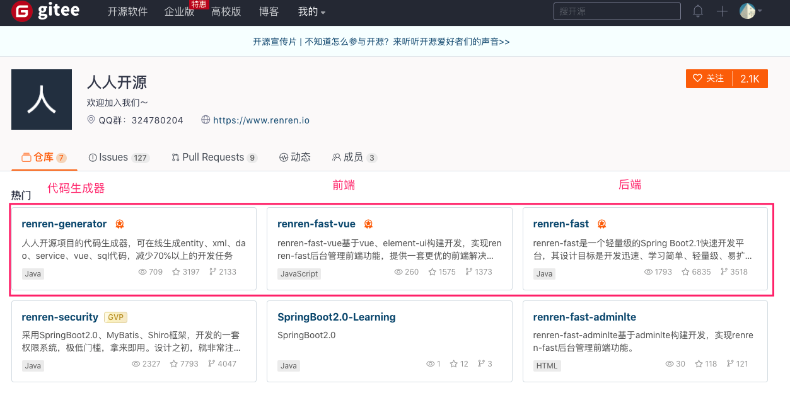
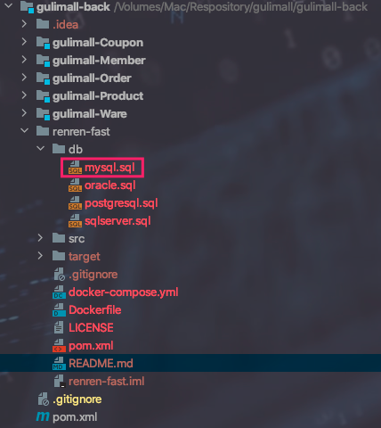
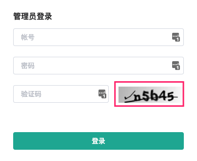
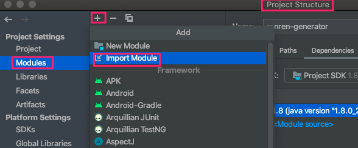
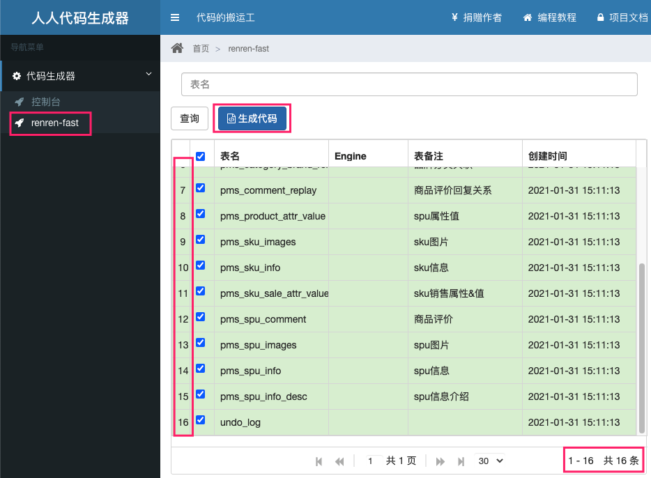
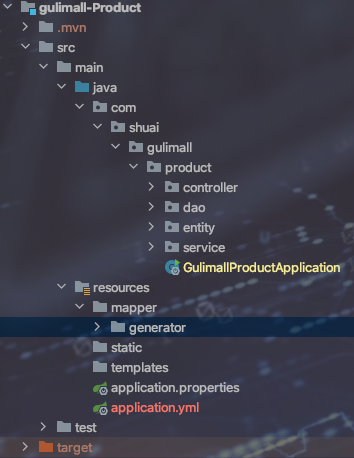
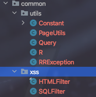

## 服务器准备

> 这里就不多做赘述了，虚拟机网络配置可参考：MD-Book/软件安装问题/VirtualBox中Centos网络设置.md


## 服务器安装Docker以及Docker安装常用软件

可参考 ：MD-Book/Docker/


## gitee初始化项目


> 我是打算将gulimall仓库作为前后端项目存放的目录，在gulimall中创建gulimall-back做后端微服务开发，gulimall-font-end做前端项目目录，在gulimall-font-end中再创建admin-vue做后端管理，shop-vue做前端访问。


## gulimall-back微服务环境搭建

| 数据库       | 微服务           | 名称             |
| ------------ | ---------------- | ---------------- |
| gulimall_pms | gulimall-Product | 商品系统         |
| gulimall_oms | gulimall-Order   | 订单系统         |
| gulimall_sms | gulimall-Coupon  | 优惠券\|营销系统 |
| gulimall_ums | gulimall-Member  | 用户系统         |
| gulimall_wms | gulimall-Ware    | 库存\|仓储系统   |

1. idea打开gulimall-back
2. 新建gulimall-product(商品服务)  --  ==所有新建的文件都先不要加入到git中==


3. 新建仓储服务(ware)、订单服务(order)、优惠券服务(coupon)、用户服务(member)  同上。

4. gulimall-back做聚合项目(root项目)

	* Gulimall-back目录下新建pom.xml文件

	* 写入如下内容

		```xml
		<?xml version="1.0" encoding="UTF-8"?>
		<project xmlns="http://maven.apache.org/POM/4.0.0" xmlns:xsi="http://www.w3.org/2001/XMLSchema-instance"
		         xsi:schemaLocation="http://maven.apache.org/POM/4.0.0 https://maven.apache.org/xsd/maven-4.0.0.xsd">
		    <modelVersion>4.0.0</modelVersion>
		    <groupId>com.shuai.gulimall</groupId>
		    <artifactId>gulimall</artifactId>
		    <version>0.0.1-SNAPSHOT</version>
		    <name>gulimall</name>
		    <description>聚合服务</description>
		    <packaging>pom</packaging>
		
		    <modules>
		        <module>gulimall-Product</module>
		        <module>gulimall-Order</module>
		        <module>gulimall-Ware</module>
		        <module>gulimall-Coupon</module>
		        <module>gulimall-Member</module>
		    </modules>
		
		</project>
		```

	* Maven添加父项目的pom文件

		

	* 结果验证

		

		


5. gitignore文件整理 


6. 切换到分支进行开发

	> 由于直接使用主分支master已进行了提交。切换分支。mac台式机使用mac分支进行提交。win笔记本日后再新建win分支进行提交

	```bash
	 /Volumes/Mac/Respository/gulimall   master  git branch
	 /Volumes/Mac/Respository/gulimall   master  git branch mac
	 /Volumes/Mac/Respository/gulimall   master  git checkout mac
	Switched to branch 'mac'
	 /Volumes/Mac/Respository/gulimall   mac  git status
	On branch mac
	nothing to commit, working tree clean
	 /Volumes/Mac/Respository/gulimall   mac  git pull origin master
	From gitee.com:gadeGG/gulimall
	 * branch            master     -> FETCH_HEAD
	Already up to date.
	```

7. 在gulimall目录下新建db/init目录存放数据文件

	


## 使用Nexus作为Maven私服

> 本来想着在root项目聚合Maven依赖，统一管理jar包。回头一想，因为每个服务都可做单体应用，因此就要做到绝对的解耦。所以还是在每个微服务pom文件中添加配置吧。

```bash
   <distributionManagement>
        <!--  快照  -->
        <snapshotRepository>
            <id>nexus-aliyun</id>
            <url>http://localhost:8081/repository/Maven-Aliyun-Snapshot/</url>
        </snapshotRepository>
        <!--  发布版本  -->
        <repository>
            <id>nexus-aliyun</id>
            <url>http://localhost:8081/repository/Maven-Aliyun-Releases/</url>
        </repository>
    </distributionManagement>

    <!-- 可以不加，如果想要使用其他的仓库则而不是Maven配置文件中的仓库则添加 -->
    <repositories>
        <repository>
            <id>nexus</id>
            <name>test</name>
            <url>http://localhost:8081/repository/Maven-Aliyun-Group/</url>
        </repository>
    </repositories>
```


> Nexus使用 可参考 ：MD-Book/Nexus/第一章-介绍.md


## 数据库准备

1. 启动虚拟机 - Docker-Mysql
2. 新建gulimall_oms、gulimall_pms、gulimall_sms、gulimall_ums、gulimall_wms数据库


3. 将如上数据文件导入到对应的数据库中

4. 数据库文件提交

	```bash
	# 远程仓库必须创建mac分支
	git checkout mac
	git add .
	git commit . -m '提交gulimall数据库初始化文件'
	git push origin mac
	# mac 分支同步到主分支
	git checkout master
	git merge mac
	git push origin master
	```

	

## 人人开源项目搭建后台管理系统

1. 下载人人开源前后端项目



2. 将renren-fast放入到gulimall-back中



3. 新建gulimall_admin数据库并导入上图中mysql.sql

4. root项目pom文件加入renren-fast子模块

	```xml
	<module>renren-fast</module>
	```

5. 修改pom文件版本与其他微服务保持一致

	```xml
	<parent>
			<groupId>org.springframework.boot</groupId>
			<artifactId>spring-boot-starter-parent</artifactId>
			<version>2.3.7.RELEASE</version>
		</parent>
	
	```

6. 项目pom文件导入

	```xml
	<!--  删除项目中的远程仓库相关配置  -->
	<!--  删除项目中的远程仓库相关配置  -->
	<distributionManagement>
	  <!--  快照  -->
	  <snapshotRepository>
	    <id>nexus-aliyun</id>
	    <url>http://localhost:8081/repository/Maven-Aliyun-Snapshot/</url>
	  </snapshotRepository>
	  <!--  发布版本  -->
	  <repository>
	    <id>nexus-aliyun</id>
	    <url>http://localhost:8081/repository/Maven-Aliyun-Releases/</url>
	  </repository>
	</distributionManagement>
	
	<!-- 可以不加，如果想要使用其他的仓库则而不是Maven配置文件中的仓库则添加 -->
	<repositories>
	  <repository>
	    <id>nexus</id>
	    <name>test</name>
	    <url>http://localhost:8081/repository/Maven-Aliyun-Group/</url>
	  </repository>
	</repositories>
	```

	

7. 修改application-dev.yml文件中数据库地址

	```bash
	jdbc:mysql://192.168.124.3:3306/gulimall_admin?useUnicode=true&characterEncoding=UTF-8&serverTimezone=Asia/Shanghai
	```


## 人人开源项目 - - 前端

```bash
#检查接口 : static/config/index.js
http://localhost:8080/renren-fast
#安装
npm install 
#运行
npm run serve
```



> 测试通过


## 人人开源项目 - - 代码生成器

0. renren-generator放入gulimall-back中 ：如果没有识别重新导入下



1. root项目 pom 文件加入

	```xml
	<module>renren-generator</module>
	```

2. 项目pom文件导入

	```xml
	<!--  删除项目中的远程仓库相关配置  -->
	<distributionManagement>
	  <!--  快照  -->
	  <snapshotRepository>
	    <id>nexus-aliyun</id>
	    <url>http://localhost:8081/repository/Maven-Aliyun-Snapshot/</url>
	  </snapshotRepository>
	  <!--  发布版本  -->
	  <repository>
	    <id>nexus-aliyun</id>
	    <url>http://localhost:8081/repository/Maven-Aliyun-Releases/</url>
	  </repository>
	</distributionManagement>
	
	<!-- 可以不加，如果想要使用其他的仓库则而不是Maven配置文件中的仓库则添加 -->
	<repositories>
	  <repository>
	    <id>nexus</id>
	    <name>test</name>
	    <url>http://localhost:8081/repository/Maven-Aliyun-Group/</url>
	  </repository>
	</repositories>
	```

3. 修改pom文件版本与其他微服务保持一致

	```xml
	<parent>
			<groupId>org.springframework.boot</groupId>
			<artifactId>spring-boot-starter-parent</artifactId>
			<version>2.3.7.RELEASE</version>
		</parent>
	```

	


## gulimall_pms数据库逆向生成 

> 这里使用jeecg表单生成器更快速一点 感觉

* 修改数据库 : application.yml

	```yaml
	url: jdbc:mysql://192.168.124.3:3306/gulimall_pms?		useUnicode=true&characterEncoding=UTF-8&useSSL=false&serverTimezone=Asia/Shanghai
	username: root
	password: root
	```

* 修改代码生成器配置信息

  ```properties
  #微服务新建时必须是com.shuai.gulimall.XXX
  mainPath=com.shuai.gulimall
  # package + moduleName  构成微服务根目录
  #包名
  package=com.shuai.gulimall              
  moduleName=product
  #作者
  author=shuai
  #Email
  email=shuai@gmail.com
  #表前缀(类名不会包含表前缀)
  tablePrefix=pms_
  ```

* 运行逆向工程

* http://localhost:80



* 将生成的代码**java目录**替换到`product微服务`中以及`mapper目录`放入到`product微服务`resources目录下



* 生成的代码很多公共类、依赖、工具类报错，新建`gulimall-Common`微服务存放这些东西

  * root项目pom文件加入`gulimall-Common`模块

  * 加入公共依赖和nexus依赖如下：

    ```xml
    <?xml version="1.0" encoding="UTF-8"?>
    <project xmlns="http://maven.apache.org/POM/4.0.0" xmlns:xsi="http://www.w3.org/2001/XMLSchema-instance"
             xsi:schemaLocation="http://maven.apache.org/POM/4.0.0 https://maven.apache.org/xsd/maven-4.0.0.xsd">
        <modelVersion>4.0.0</modelVersion>
        <groupId>com.shuai.gulimall</groupId>
        <artifactId>gulimall-common</artifactId>
        <version>0.0.1-SNAPSHOT</version>
        <name>gulimall-Common</name>
        <description>各个微服务公共的依赖、bean、工具类</description>
    
    
        <properties>
            <java.version>1.8</java.version>
            <project.build.sourceEncoding>UTF-8</project.build.sourceEncoding>
            <project.reporting.outputEncoding>UTF-8</project.reporting.outputEncoding>
            <spring-boot.version>2.3.7.RELEASE</spring-boot.version>
            <spring-cloud.version>Hoxton.SR4</spring-cloud.version>
            <servlet-version>2.5</servlet-version>
            <mysql-version>8.0.16</mysql-version>
            <commons-lang-version>2.6</commons-lang-version>
            <httpcomponents-vresion>4.4.12</httpcomponents-vresion>
            <lombok-version>1.18.8</lombok-version>
            <mybatis-version>3.2.0</mybatis-version>
            <junit-version>4.13</junit-version>
        </properties>
    
        <dependencies>
            <!-- 数据库 -->
            <dependency>
                <groupId>com.baomidou</groupId>
                <artifactId>mybatis-plus-boot-starter</artifactId>
                <version>${mybatis-version}</version>
            </dependency>
            <!-- 我数据库版本为5.7 官方给定解释:mysql包8.0和5.0都适配数据库5.7-->
            <dependency>
                <groupId>mysql</groupId>
                <artifactId>mysql-connector-java</artifactId>
                <version>${mysql-version}</version>
            </dependency>
    
    
    
            <!-- 网络  -->
            <!-- https://mvnrepository.com/artifact/org.apache.httpcomponents/httpcore -->
            <dependency>
                <groupId>org.apache.httpcomponents</groupId>
                <artifactId>httpcore</artifactId>
                <version>${httpcomponents-vresion}</version>
            </dependency>
            <dependency>
                <groupId>javax.servlet</groupId>
                <artifactId>servlet-api</artifactId>
                <version>${servlet-version}</version>
                <scope>provided</scope>
            </dependency>
            <dependency>
                <groupId>commons-lang</groupId>
                <artifactId>commons-lang</artifactId>
                <version>${commons-lang-version}</version>
            </dependency>
    
    
            <!-- 工具类 -->
            <dependency>
                <groupId>org.projectlombok</groupId>
                <artifactId>lombok</artifactId>
                <version>${lombok-version}</version>
            </dependency>
    
            <!-- 测试 -->
            <dependency>
                <groupId>org.springframework.boot</groupId>
                <artifactId>spring-boot-starter-test</artifactId>
                <version>${spring-boot.version}</version>
    <!--            <scope>test</scope>-->
            </dependency>
            <dependency>
                <groupId>junit</groupId>
                <artifactId>junit</artifactId>
                <version>${junit-version}</version>
                <!--            <scope>test</scope>-->
            </dependency>
    
    
            <!--热部署-->
            <dependency>
                <groupId>org.springframework.boot</groupId>
                <artifactId>spring-boot-devtools</artifactId>
                <optional>true</optional> <!-- 可选 -->
                <version>${spring-boot.version}</version>
            </dependency>
    
            <!--        &lt;!&ndash;服务注册发现&ndash;&gt;-->
            <!--        <dependency>-->
            <!--            <groupId>com.alibaba.cloud</groupId>-->
            <!--            <artifactId>spring-cloud-starter-alibaba-nacos-discovery</artifactId>-->
            <!--        </dependency>-->
            <!--        &lt;!&ndash;服务配置中心&ndash;&gt;-->
            <!--        <dependency>-->
            <!--            <groupId>com.alibaba.cloud</groupId>-->
            <!--            <artifactId>spring-cloud-starter-alibaba-nacos-config</artifactId>-->
            <!--        </dependency>-->
        </dependencies>
    
        <dependencyManagement>
            <dependencies>
                <dependency>
                    <groupId>org.springframework.boot</groupId>
                    <artifactId>spring-boot-dependencies</artifactId>
                    <version>${spring-boot.version}</version>
                    <type>pom</type>
                    <scope>import</scope>
                </dependency>
                <dependency>
                    <groupId>org.springframework.cloud</groupId>
                    <artifactId>spring-cloud-dependencies</artifactId>
                    <version>${spring-cloud.version}</version>
                    <type>pom</type>
                    <scope>import</scope>
                </dependency>
            </dependencies>
        </dependencyManagement>
    
        <build>
            <plugins>
                <plugin>
                    <groupId>org.apache.maven.plugins</groupId>
                    <artifactId>maven-compiler-plugin</artifactId>
                    <version>3.8.1</version>
                    <configuration>
                        <source>1.8</source>
                        <target>1.8</target>
                        <encoding>UTF-8</encoding>
                    </configuration>
                </plugin>
                <plugin>
                    <groupId>org.springframework.boot</groupId>
                    <artifactId>spring-boot-maven-plugin</artifactId>
                    <version>2.3.7.RELEASE</version>
                    <configuration>
                        <mainClass>com.shuai.gulimall.common.GulimallCommonApplication</mainClass>
                    </configuration>
                    <executions>
                        <execution>
                            <id>repackage</id>
                            <goals>
                                <goal>repackage</goal>
                            </goals>
                        </execution>
                    </executions>
                </plugin>
            </plugins>
        </build>
    
        <distributionManagement>
            <!--  快照  -->
            <snapshotRepository>
                <id>nexus-aliyun</id>
                <url>http://localhost:8081/repository/Maven-Aliyun-Snapshot/</url>
            </snapshotRepository>
            <!--  发布版本  -->
            <repository>
                <id>nexus-aliyun</id>
                <url>http://localhost:8081/repository/Maven-Aliyun-Releases/</url>
            </repository>
        </distributionManagement>
    
        <!-- 可以不加，如果想要使用其他的仓库则而不是Maven配置文件中的仓库则添加 -->
        <repositories>
            <repository>
                <id>nexus</id>
                <name>test</name>
                <url>http://localhost:8081/repository/Maven-Aliyun-Group/</url>
            </repository>
        </repositories>
    
    </project>
    
    ```

  * 加入工具类

  	

  * 将 renren-generator/src/main/resources/template/Controller.java.vm 每个方法注解 @RequirePermissions注释：解决生成controller中注解报错。再重新生成后替换controller。因为权限验证我们使用的是springcloud组件

  > * 这三块【依赖、工具类、公共类】直接使用该项目中的 、`renren-fast`和`renren-generator`模块即可。真费劲。下次这块直接使用jeecg 表单生成算了。
  > * 生成的代码中可能存在依赖错误以及mapper文件中实体类路径错误，很烦。

  > 其它微服务依次生成。并且依次使用如下 整合Mybatis-Plus   来验证是否成功

### 整合Mybatis-Plus - - 以Product服务举例

2. 导入公共服务依赖 -> `gulimall-Product`

	```xml
	<dependency>
	  <groupId>com.shuai.gulimall</groupId>
	  <artifactId>gulimall-common</artifactId>
	  <version>0.0.1-SNAPSHOT</version>
	</dependency>
	```

	

3. 配置连接信息 -> `gulimall-Product`

	```yaml
	# gulimall-Product 新建application.yml
	# DataSource Config
	spring:
	  datasource:
	    url: jdbc:mysql://192.168.124.3:3306/gulimall_pms?useUnicode=true&characterEncoding=UTF-8
	    username: root
	    password: root
	    driver-class-name: com.mysql.jdbc.Driver
	```

4. 启动类扫描mapper接口

	```java
	//1. 新增扫描
	@MapperScan("com.shuai.gulimall.product.dao")
	@SpringBootApplication
	public class GulimallProductApplication {
	    public static void main(String[] args) {
	        SpringApplication.run(GulimallProductApplication.class, args);
	    }
	}
	```

5. 配置mybatis 映射文件路径

	```yaml
	# gulimall-Product 下application.yml
	# DataSource Config
spring:
	  datasource:
	    url: jdbc:mysql://192.168.124.3:3306/gulimall_pms?useUnicode=true&characterEncoding=UTF-8
	    username: root
	    password: root
	    driver-class-name: com.mysql.jdbc.Driver
	mybatis-plus:
	  mapper-locations: classpath:/mapper/**/*.xml
	  global-config:
	    db-config:
	      id-type: auto
	```
	
5. 测试

	```java
	@RunWith(SpringRunner.class)
	@SpringBootTest
	class GulimallProductApplicationTests {
	
	    @Autowired
	    BrandService brandService;
	
	    @Test
	    void save() {
	        BrandEntity brandEntity = new BrandEntity();
	        brandEntity.setName("华为");
	        brandService.save(brandEntity);
	        System.out.println("保存成功 ~~~");
	    }
	
	    @Test
	    void select() {
	        brandService.list().forEach(x ->{
	            System.out.println(x.toString());
	        });
	    }
	
	}
	```

	


