## 服务器准备

> 这里就不多做赘述了，虚拟机网络配置可参考：MD-Book/软件安装问题/VirtualBox中Centos网络设置.md


## 服务器安装Docker以及Docker安装常用软件

可参考 ：MD-Book/Docker/


## gitee初始化项目

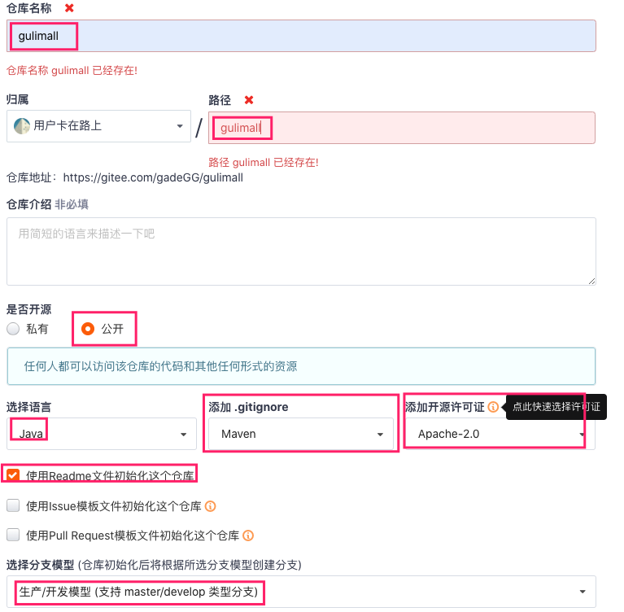


> 我是打算将gulimall仓库作为前后端项目存放的目录，在gulimall中创建gulimall-back做后端微服务开发，gulimall-font-end做前端项目目录，在gulimall-font-end中再创建admin-vue做后端管理，shop-vue做前端访问。

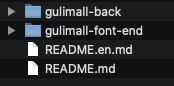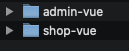


## gulimall-back微服务环境搭建

1. idea打开gulimall-back
2. 新建gulimall-product(商品服务)  --  ==所有新建的文件都先不要加入到git中==

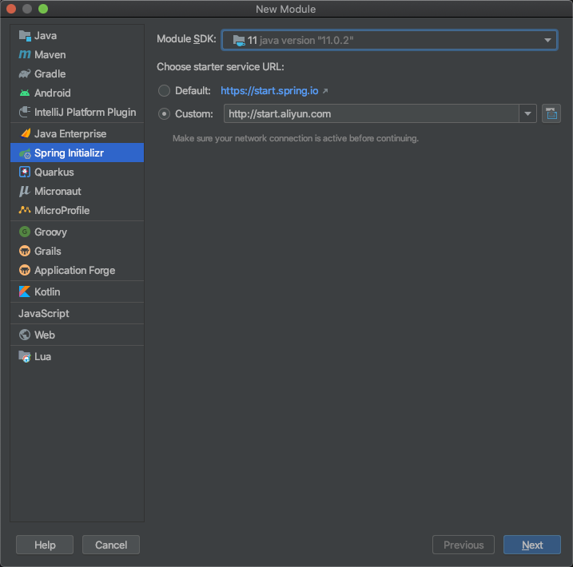

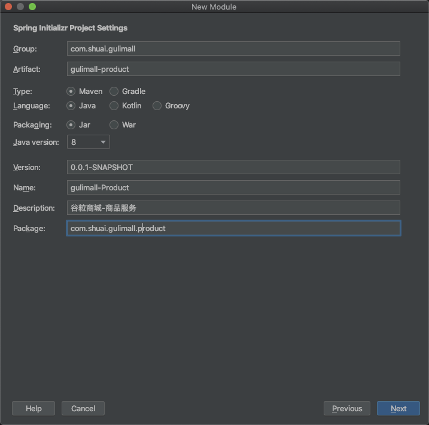

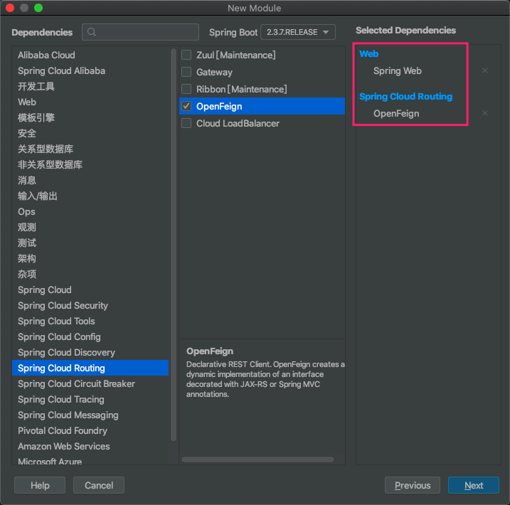

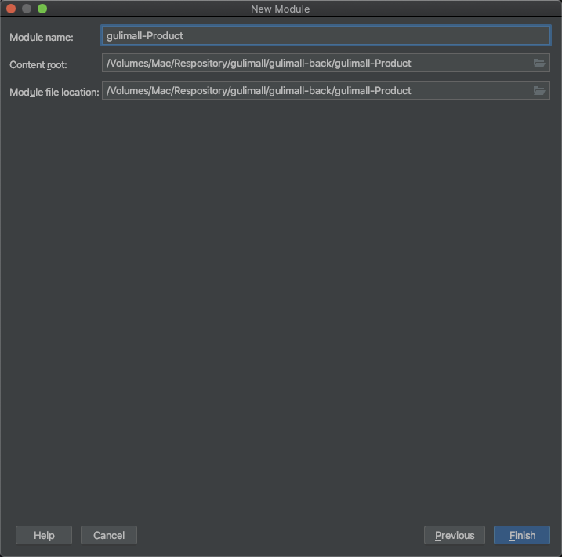

3. 新建仓储服务(ware)、订单服务(order)、优惠券服务(coupon)、用户服务(member)  同上。

4. gulimall-back做聚合项目(root项目)

	* Gulimall-back目录下新建pom.xml文件

	* 写入如下内容

		```xml
		<?xml version="1.0" encoding="UTF-8"?>
		<project xmlns="http://maven.apache.org/POM/4.0.0" xmlns:xsi="http://www.w3.org/2001/XMLSchema-instance"
		         xsi:schemaLocation="http://maven.apache.org/POM/4.0.0 https://maven.apache.org/xsd/maven-4.0.0.xsd">
		    <modelVersion>4.0.0</modelVersion>
		    <groupId>com.shuai.gulimall</groupId>
		    <artifactId>gulimall</artifactId>
		    <version>0.0.1-SNAPSHOT</version>
		    <name>gulimall</name>
		    <description>聚合服务</description>
		    <packaging>pom</packaging>
		
		    <modules>
		        <module>gulimall-Product</module>
		        <module>gulimall-Order</module>
		        <module>gulimall-Ware</module>
		        <module>gulimall-Coupon</module>
		        <module>gulimall-Member</module>
		    </modules>
		
		</project>
		```

	* Maven添加父项目的pom文件

		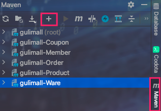

	* 结果验证

		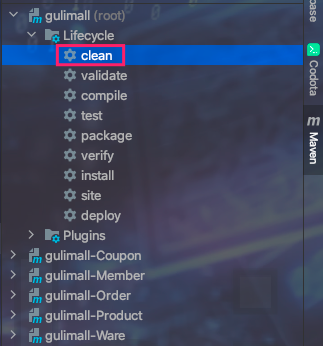

		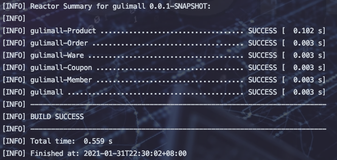


5. gitignore文件整理 

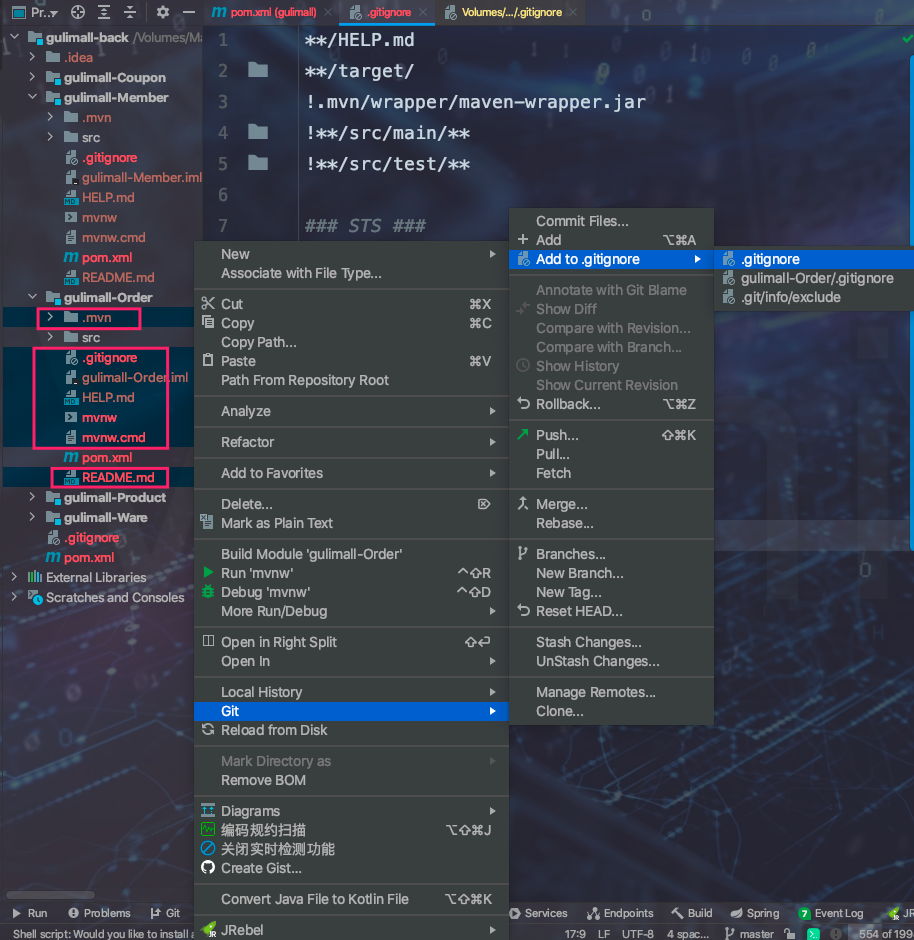


6. 切换到分支进行开发

	> 由于直接使用主分支master已进行了提交。切换分支。mac台式机使用mac分支进行提交。win笔记本日后再新建win分支进行提交

	```bash
	 /Volumes/Mac/Respository/gulimall   master  git branch
	 /Volumes/Mac/Respository/gulimall   master  git branch mac
	 /Volumes/Mac/Respository/gulimall   master  git checkout mac
	Switched to branch 'mac'
	 /Volumes/Mac/Respository/gulimall   mac  git status
	On branch mac
	nothing to commit, working tree clean
	 /Volumes/Mac/Respository/gulimall   mac  git pull origin master
	From gitee.com:gadeGG/gulimall
	 * branch            master     -> FETCH_HEAD
	Already up to date.
	```

7. 在gulimall目录下新建db/init目录存放数据文件

	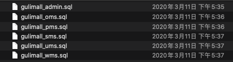


## 使用Nexus作为Maven私服

> 本来想着在root项目聚合Maven依赖，统一管理jar包。回头一想，因为每个服务都可做单体应用，因此就要做到绝对的解耦。所以还是在每个微服务pom文件中添加配置吧。

```bash
   <distributionManagement>
        <!--  快照  -->
        <snapshotRepository>
            <id>nexus-aliyun</id>
            <url>http://localhost:8081/repository/Maven-Aliyun-Snapshot/</url>
        </snapshotRepository>
        <!--  发布版本  -->
        <repository>
            <id>nexus-aliyun</id>
            <url>http://localhost:8081/repository/Maven-Aliyun-Releases/</url>
        </repository>
    </distributionManagement>

    <!-- 可以不加，如果想要使用其他的仓库则而不是Maven配置文件中的仓库则添加 -->
    <repositories>
        <repository>
            <id>nexus</id>
            <name>test</name>
            <url>http://localhost:8081/repository/Maven-Aliyun-Group/</url>
        </repository>
    </repositories>
```


> Nexus使用 可参考 ：MD-Book/Nexus/第一章-介绍.md


## 数据库准备

1. 启动虚拟机 - Docker-Mysql
2. 新建gulimall_oms、gulimall_pms、gulimall_sms、gulimall_ums、gulimall_wms数据库

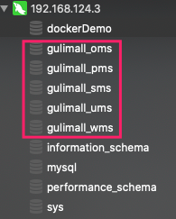

3. 将如上数据文件导入到对应的数据库中

4. 数据库文件提交

	```bash
	# 远程仓库必须创建mac分支
	git checkout mac
	git add .
	git commit . -m '提交gulimall数据库初始化文件'
	git push origin mac
	# mac 分支同步到主分支
	git checkout master
	git merge mac
	git push origin master
	```

	

## 人人开源搭建后台管理系统

