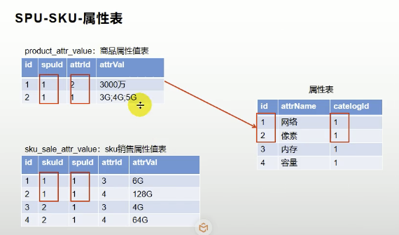

## SPU & SKU

SPU 和 SKU 总体来讲就是类与对象的关系，主要用于构建 商品基本属性和销售属性,从而设计产品属性价格等数据结构。例如：手机产品下有很多型号手机，手机就为SPU 不同的品牌就是SKU，三星手机如果为SPU，则不同子型号的三星手机就为SKU。每个手机都有基本属性【所有手机都拥有的属性网络、cpu、屏幕等】也有一些销售属性【能决定价格的属性不同的型号对应的颜色、内存、性能】  基本属性也加SPU，销售属性叫SKU。总的来说SPU和SKU能代表的东西很多，其主要目的就是将千奇百怪的商品进行属性层次分组，然后不同的组合显示的内容以及价格不同。类似于Java设计模式中的装饰模式





* 商品属性值表中有两个spu 且都为1，假如代表荣耀手机，则荣耀手机有两个基本属性（网络、图像）
* 荣耀手机为1的基本属性对应两个sku为1、2。且sku为1 、2的销售属性下有（内存和容量），不同的sku对应不同的价格


## 属性分组

### 前端

```vue
# src/views/modules/product/attrgroup.vue
<template>
<el-row :gutter="20">
  <el-col :span="6">
    <category @tree-node-click="treenodeclick"></category>
  </el-col>
  <el-col :span="18">
    <div class="mod-config">
      <el-form :inline="true" :model="dataForm" @keyup.enter.native="getDataList()">
        <el-form-item>
          <el-input v-model="dataForm.key" placeholder="参数名" clearable></el-input>
        </el-form-item>
        <el-form-item>
          <el-button @click="getDataList()">查询</el-button>
          <el-button type="success" @click="getAllDataList()">查询全部</el-button>
          <el-button v-if="isAuth('product:attrgroup:save')" type="primary" @click="addOrUpdateHandle()">新增</el-button>
          <el-button v-if="isAuth('product:attrgroup:delete')" type="danger" @click="deleteHandle()" :disabled="dataListSelections.length <= 0">批量删除</el-button>
        </el-form-item>
      </el-form>
      <el-table :data="dataList" border v-loading="dataListLoading" @selection-change="selectionChangeHandle" style="width: 100%;">
        <el-table-column type="selection" header-align="center" align="center" width="50"></el-table-column>
        <el-table-column prop="attrGroupId" header-align="center" align="center" label="分组id"></el-table-column>
        <el-table-column prop="attrGroupName" header-align="center" align="center" label="组名"></el-table-column>
        <el-table-column prop="sort" header-align="center" align="center" label="排序"></el-table-column>
        <el-table-column prop="descript" header-align="center" align="center" label="描述"></el-table-column>
        <el-table-column prop="icon" header-align="center" align="center" label="组图标"></el-table-column>
        <el-table-column prop="categoryId" header-align="center" align="center" label="所属分类id"></el-table-column>
        <el-table-column fixed="right" header-align="center" align="center" width="150" label="操作">
          <template slot-scope="scope">
            <el-button type="text" size="small" @click="relationHandle(scope.row.attrGroupId)">关联</el-button>
            <el-button type="text" size="small" @click="addOrUpdateHandle(scope.row.attrGroupId)">修改</el-button>
            <el-button type="text" size="small" @click="deleteHandle(scope.row.attrGroupId)">删除</el-button>
          </template>
        </el-table-column>
      </el-table>
      <el-pagination @size-change="sizeChangeHandle" @current-change="currentChangeHandle" :current-page="pageIndex" :page-sizes="[10, 20, 50, 100]" :page-size="pageSize" :total="totalPage" layout="total, sizes, prev, pager, next, jumper"></el-pagination>
      <!-- 弹窗, 新增 / 修改 -->
      <add-or-update v-if="addOrUpdateVisible" ref="addOrUpdate" @refreshDataList="getDataList"></add-or-update>
      <!-- 修改关联关系 -->
      <relation-update v-if="relationVisible" ref="relationUpdate" @refreshData="getDataList"></relation-update>
    </div>
  </el-col>
</el-row>
</template>

<script>
/**
 * 父子组件传递数据
 * 1)、子组件给父组件传递数据，事件机制；
 *    子组件给父组件发送一个事件，携带上数据。
 * // this.$emit("事件名",携带的数据...)
 */
import Category from "../common/category";
import AddOrUpdate from "./attrgroup-add-or-update";
import RelationUpdate from "./attr-group-relation";
import {
  AttrGroupListApi,
  AttrGroupDeleteApi
} from "@/api/product/attrgroup.js"

import { WarningConfirm, SuccessMessage } from "@/utils/message.js";

export default {
  components: { Category, AddOrUpdate, RelationUpdate },
  props: {},
  data() {
    return {
      catId: 0,
      dataForm: {
        key: ""
      },
      dataList: [],
      pageIndex: 1,
      pageSize: 10,
      totalPage: 0,
      dataListLoading: false,
      dataListSelections: [],
      addOrUpdateVisible: false,
      relationVisible: false
    };
  },
  activated() {
    this.getDataList();
  },
  methods: {
    //处理分组与属性的关联
    relationHandle(groupId) {
      this.relationVisible = true;
      this.$nextTick(() => {
        this.$refs.relationUpdate.init(groupId);
      });
    },
    //感知树节点被点击
    treenodeclick(data, node, component) {
      if (node.level == 3) {
        this.catId = data.catId;
        this.getDataList(); //重新查询
      }
    },
    getAllDataList() {
      this.catId = 0;
      this.getDataList();
    },
    // 获取数据列表
    getDataList() {
      this.dataListLoading = true;
      AttrGroupListApi(this.catId, {
        page: this.pageIndex,
        limit: this.pageSize,
        key: this.dataForm.key
      }).then((data) => {
        console.log(data);
        this.dataList = data.data.page.list || [];
        this.totalPage = data.data.page.totalCount || 0;
        this.dataListLoading = false;
      });
    },
    // 每页数
    sizeChangeHandle(val) {
      this.pageSize = val;
      this.pageIndex = 1;
      this.getDataList();
    },
    // 当前页
    currentChangeHandle(val) {
      this.pageIndex = val;
      this.getDataList();
    },
    // 多选
    selectionChangeHandle(val) {
      this.dataListSelections = val;
    },
    // 新增 / 修改
    addOrUpdateHandle(id) {
      this.addOrUpdateVisible = true;
      this.$nextTick(() => {
        this.$refs.addOrUpdate.init(id);
      });
    },
    // 删除
    deleteHandle(id) {
      var ids = id ? [id] :
        this.dataListSelections.map(item => {
          return item.attrGroupId;
        });

      WarningConfirm(() => {
        AttrGroupDeleteApi(ids).then(data => {
          SuccessMessage("删除成功", () => {
            this.getDataList();
          });
        });
      }, `确定对[id=${ids.join(",")}]进行[${id ? "删除" : "批量删除"}]操作?`);
    }
  }
}
</script>

<style>
</style>

```

```javascript
# src/api/product/attrgroup.js
import request from "@/utils/httpRequest"
const BASE_URL = "/product/attrgroup"
/**
 * 17、获取分类下所有分组&关联属性
 * @param {Number} categoryId  三级分类id
 */
export function AttrGroupCategoryWithAttrApi(categoryId) {
  return request({
    url: request.adornUrl(`${BASE_URL}/${categoryId}/withattr`),
    method: "get",
    params: request.adornParams({}, true)
  })
}


export function AttrGroupListApi(categoryId , params){
  return request({
      url:  request.adornUrl( `${BASE_URL}/list/${categoryId}`) ,
      method: "get",
      params : request.adornParams(params , false )
  })
}
export function AttrGroupInfoApi(attrgroupId){
  return request({
      url:  request.adornUrl( `${BASE_URL}/info/${attrgroupId}`) ,
      method: "get"
  })
}
export function AttrGroupDeleteApi(ids) {
  return request({
    url: request.adornUrl(`${BASE_URL}/delte`),
    method: "delete",
    data: request.adornData(ids, false)
  })
}

export function AttrGroupSaveApi(data) {
  return request({
    url: request.adornUrl(`${BASE_URL}/save`),
    method: "post",
    data: request.adornData(data, false)
  })
}
export function AttrGroupUpdateApi(data) {
  return request({
    url: request.adornUrl(`${BASE_URL}/update`),
    method: "put",
    data: request.adornData(data, false)
  })
}

// ====== 关联关系api=====

/**
 * 删除属性与属性分组的关系
 *
 * @param {Array} ids
 */
export function AttrAttrGroupRelationDeleteApi(ids) {
  return request({
    url: request.adornUrl(`${BASE_URL}/attr/relation/delte`),
    method: "delete",
    data: request.adornData(ids, false)
  })
}
export function AttrAttrGroupRelationSaveApi(data) {
  return request({
    url: request.adornUrl(`${BASE_URL}/attr/relation`),
    method: "post",
    data: request.adornData(data, false)
  })
}
/**
 * 获取已关联的分组信息
 * @param {*} attrgroupId
 */
export function AttrAttrGroupRelationListApi(attrgroupId) {
  return request({
    url: request.adornUrl(`${BASE_URL}/${attrgroupId}/attr/relation`),
    method: "get"
  })
}
/**
 * 获取未关联的分组信息
 * @param {*} attrgroupId
 */
export function AttrAttrGroupNoRelationListApi(attrgroupId , params) {
  return request({
    url: request.adornUrl(`${BASE_URL}/${attrgroupId}/noattr/relation`),
    method: "get",
    params: request.adornParams(params)
  })
}

```

```vue
# src/views/modules/product/attrgroup-add-or-update.vue
<template>
<el-dialog :title="!dataForm.id ? '新增' : '修改'" :close-on-click-modal="false" :visible.sync="visible" @closed="dialogClose">
  <el-form :model="dataForm" :rules="dataRule" ref="dataForm" @keyup.enter.native="dataFormSubmit()" label-width="120px">
    <el-form-item label="组名" prop="attrGroupName">
      <el-input v-model="dataForm.attrGroupName" placeholder="组名"></el-input>
    </el-form-item>
    <el-form-item label="排序" prop="sort">
      <el-input v-model="dataForm.sort" placeholder="排序"></el-input>
    </el-form-item>
    <el-form-item label="描述" prop="descript">
      <el-input v-model="dataForm.descript" placeholder="描述"></el-input>
    </el-form-item>
    <el-form-item label="组图标" prop="icon">
      <el-input v-model="dataForm.icon" placeholder="组图标"></el-input>
    </el-form-item>
    <el-form-item label="所属分类" prop="categoryPath">
      <!-- <el-input v-model="dataForm.catelogId" placeholder="所属分类id"></el-input> @change="handleChange" -->
      <!-- <el-cascader filterable placeholder="试试搜索：手机" v-model="categoryPath" :options="categorys"  :props="props"></el-cascader> -->
      <!-- :catelogPath="categoryPath"自定义绑定的属性，可以给子组件传值 -->
      <category-cascader :catelogPath.sync="categoryPath"></category-cascader>
    </el-form-item>
  </el-form>
  <span slot="footer" class="dialog-footer">
    <el-button @click="visible = false">取消</el-button>
    <el-button type="primary" @click="dataFormSubmit()">确定</el-button>
  </span>
</el-dialog>
</template>

<script>
import {
  AttrGroupListApi,
  AttrGroupDeleteApi
} from "@/api/product/attrgroup.js"
import { WarningConfirm, SuccessMessage } from "@/utils/message.js";
import { CategoryListTreeApi } from '@/api/product/category.js';
import { 
AttrGroupInfoApi , AttrGroupSaveApi,AttrGroupUpdateApi } from "@/api/product/attrgroup.js"

import CategoryCascader from "../common/category-cascader";
export default {
  data() {
    return {
      props: {
        value: "catId",
        label: "name",
        children: "children"
      },
      visible: false,
      categorys: [],
      categoryPath: [],
      dataForm: {
        attrGroupId: 0,
        attrGroupName: "",
        sort: "",
        descript: "",
        icon: "",
        categoryId: 0
      },
      dataRule: {
        attrGroupName: [
          { required: true, message: "组名不能为空", trigger: "blur" }
        ],
        sort: [{ required: true, message: "排序不能为空", trigger: "blur" }],
        descript: [
          { required: true, message: "描述不能为空", trigger: "blur" }
        ],
        icon: [{ required: true, message: "组图标不能为空", trigger: "blur" }],
        catelogId: [
          { required: true, message: "所属分类id不能为空", trigger: "blur" }
        ]
      }
    };
  },
  components: { CategoryCascader },
  methods: {
    dialogClose() {
      this.categoryPath = [];
    },
    getCategorys() {
      CategoryListTreeApi().then((data) => {
        this.categorys = data.data;
      });
    },
    init(id) {
      this.dataForm.attrGroupId = id || 0;
      this.visible = true;
      this.$nextTick(() => {
        this.$refs["dataForm"].resetFields();
        if (this.dataForm.attrGroupId) {
          AttrGroupInfoApi(this.dataForm.attrGroupId).then((data) => {
            data = data.data;
            this.dataForm.attrGroupName = data.attrGroupName;
            this.dataForm.sort = data.sort;
            this.dataForm.descript = data.descript;
            this.dataForm.icon = data.icon;
            this.dataForm.categoryId = data.categoryId;
            //查出catelogId的完整路径
            this.categoryPath = data.categoryPath;
          });
        }
      });
    },
    // 表单提交
    dataFormSubmit() {
      this.$refs["dataForm"].validate(valid => {
        if (valid) {
          let data = {
            attrGroupId: this.dataForm.attrGroupId || undefined,
            attrGroupName: this.dataForm.attrGroupName,
            sort: this.dataForm.sort,
            descript: this.dataForm.descript,
            icon: this.dataForm.icon,
            categoryId: this.categoryPath[this.categoryPath.length - 1]
          }

          let flag = false;
          let text = "";
          if (this.dataForm.attrGroupId) {
            AttrGroupUpdateApi(data).then(data => {
              flag = true;
              text = "修改成功"
            })
          } else {
            AttrGroupSaveApi(data).then(data => {
              flag = true;
              text = "添加成功";
            })
          }
          if (flag) {
            SuccessMessage(text);
            this.visible = false;
            this.$emit("refreshDataList");
          }
        }
      })
    }
  },
  created() {
    this.getCategorys();
  }
};
</script>

```

```vue
# src/views/modules/product/attr-group-relation.vue
<template>
<div>
  <el-dialog :close-on-click-modal="false" :visible.sync="visible" @closed="dialogClose" width="60%">
    <el-dialog width="40%" title="选择属性" :visible.sync="innerVisible" append-to-body>
      <div>
        <el-form :inline="true" :model="dataForm" @keyup.enter.native="getDataList()">
          <el-form-item>
            <el-input v-model="dataForm.key" placeholder="参数名" clearable></el-input>
          </el-form-item>
          <el-form-item>
            <el-button @click="getDataList()">查询</el-button>
          </el-form-item>
        </el-form>
        <el-table :data="dataList" border v-loading="dataListLoading" @selection-change="innerSelectionChangeHandle" style="width: 100%;">
          <el-table-column type="selection" header-align="center" align="center"></el-table-column>
          <el-table-column prop="attrId" header-align="center" align="center" label="属性id"></el-table-column>
          <el-table-column prop="attrName" header-align="center" align="center" label="属性名"></el-table-column>
          <el-table-column prop="icon" header-align="center" align="center" label="属性图标"></el-table-column>
          <el-table-column prop="valueSelect" header-align="center" align="center" label="可选值列表"></el-table-column>
        </el-table>

        <div class="line-20"></div>
        <el-pagination @size-change="sizeChangeHandle" @current-change="currentChangeHandle" :current-page="pageIndex" :page-sizes="[10, 20, 50, 100]" :page-size="pageSize" :total="totalPage" layout="total, sizes, prev, pager, next, jumper"></el-pagination>
      </div>
      <div slot="footer" class="dialog-footer">
        <el-button @click="innerVisible = false">取 消</el-button>
        <el-button type="primary" @click="submitAddRealtion">确认新增</el-button>
      </div>
    </el-dialog>
    <el-row>
      <el-col :span="24">
        <el-button type="primary" @click="addRelation">新建关联</el-button>
        <el-button type="danger" @click="batchDeleteRelation" :disabled="dataListSelections.length <= 0">批量删除</el-button>
        <!-- 距离  -->
        <div class="line-20"></div>

        <el-table :data="relationAttrs" style="width: 100%" @selection-change="selectionChangeHandle" border>
          <el-table-column type="selection" header-align="center" align="center" width="50"></el-table-column>
          <el-table-column prop="attrId" label="#"></el-table-column>
          <el-table-column prop="attrName" label="属性名"></el-table-column>
          <el-table-column prop="valueSelect" label="可选值">
            <template slot-scope="scope">
              <el-tooltip placement="top">
                <div slot="content">
                  <span v-for="(i,index) in scope.row.valueSelect.split(';')" :key="index">
                    {{i}}
                    <br />
                  </span>
                </div>
                <el-tag>{{scope.row.valueSelect.split(";")[0]+" ..."}}</el-tag>
              </el-tooltip>
            </template>
          </el-table-column>
          <el-table-column fixed="right" header-align="center" align="center" label="操作">
            <template slot-scope="scope">
              <el-button type="text" size="small" @click="relationRemove(scope.row.attrId)">移除</el-button>
            </template>
          </el-table-column>
        </el-table>
      </el-col>
    </el-row>
  </el-dialog>
</div>
</template>

<script>
//这里可以导入其他文件（比如：组件，工具js，第三方插件js，json文件，图片文件等等）
//例如：import 《组件名称》 from '《组件路径》';

import { WarningConfirm, SuccessMessage } from "@/utils/message.js";
import {
  AttrAttrGroupRelationDeleteApi,AttrAttrGroupRelationSaveApi,
  AttrAttrGroupRelationListApi, AttrAttrGroupNoRelationListApi
}
from "@/api/product/attrgroup.js"

export default {

  //import引入的组件需要注入到对象中才能使用
  components: {},
  props: {},
  data() {
    //这里存放数据
    return {
      attrGroupId: 0,
      visible: false,
      innerVisible: false,
      relationAttrs: [],
      dataListSelections: [],
      dataForm: {
        key: ""
      },
      dataList: [],
      pageIndex: 1,
      pageSize: 10,
      totalPage: 0,
      dataListLoading: false,
      innerdataListSelections: []
    };
  },
  //计算属性 类似于data概念
  computed: {},
  //监控data中的数据变化
  watch: {},
  //方法集合
  methods: {
    selectionChangeHandle(val) {
      this.dataListSelections = val;
    },
    innerSelectionChangeHandle(val) {
      this.innerdataListSelections = val;
    },
    addRelation() {
      this.getDataList();
      this.innerVisible = true;
    },
    batchDeleteRelation(val) {
      let postData = []; //  去调用id删除 即可
      this.dataListSelections.forEach(item => {
        postData.push({ attrId: item.attrId, attrGroupId: this.attrGroupId });
      });
      WarningConfirm(() => {
        AttrAttrGroupRelationDeleteApi(postData).then((data) => {
          SuccessMessage("移除成功")
          this.init(this.attrGroupId);
        })
      }, `确定移除关联关系吗?`);

    },
    //移除关联
    relationRemove(attrId) {
      WarningConfirm(() => {
        AttrAttrGroupRelationDeleteApi([{ attrId, attrGroupId: this.attrGroupId }]).then((data) => {
          SuccessMessage("移除成功")
          this.init(this.attrGroupId);
        })
      }, `确定移除关联关系吗?`);
    },
    submitAddRealtion() {
      this.innerVisible = false;
      //准备数据
      console.log("准备新增的数据", this.innerdataListSelections);
      if (this.innerdataListSelections.length > 0) {
        let postData = [];
        this.innerdataListSelections.forEach(item => {
          postData.push({ attrId: item.attrId, attrGroupId: this.attrGroupId });
        });
        AttrAttrGroupRelationSaveApi(postData).then((data) => {
          SuccessMessage("新增关联成功")
          this.$emit("refreshData");
          this.init(this.attrGroupId);
        });
      }
    },
    init(id) {
      this.attrGroupId = id || 0;
      this.visible = true;
      AttrAttrGroupRelationListApi(this.attrGroupId).then((data) => {
        this.relationAttrs = data.data;
      });
    },
    dialogClose() {},

    //========
    // 获取数据列表
    getDataList() {
      this.dataListLoading = true;
      AttrAttrGroupNoRelationListApi(this.attrGroupId, {
        page: this.pageIndex,
        limit: this.pageSize,
        key: this.dataForm.key
      }).then((data) => {
        data = data.data;
        this.dataList = data.list || [];
        this.totalPage = data.totalCount || 0;
        this.dataListLoading = false;
      });
    },
    // 每页数
    sizeChangeHandle(val) {
      this.pageSize = val;
      this.pageIndex = 1;
      this.getDataList();
    },
    // 当前页
    currentChangeHandle(val) {
      this.pageIndex = val;
      this.getDataList();
    }
  }
};
</script>

<style scoped>
</style>

```

```vue
# src/views/modules/common/category.vue
<template>
<div>
  <el-input placeholder="输入关键字进行过滤" v-model="filterText"></el-input>
  <div class="line-20"></div>
  <el-tree :data="menus" :props="defaultProps" node-key="catId" ref="menuTree" @node-click="nodeclick" :filter-node-method="filterNode" :highlight-current="true"></el-tree>
</div>
</template>

<script>
//这里可以导入其他文件（比如：组件，工具js，第三方插件js，json文件，图片文件等等）
//例如：import 《组件名称》 from '《组件路径》';
import {CategoryListTreeApi} from '@/api/product/category.js';
export default {
  //import引入的组件需要注入到对象中才能使用
  components: {},
  props: {},
  data() {
    //这里存放数据
    return {
      filterText: "",
      menus: [],
      expandedKey: [],
      defaultProps: {
        children: "children",
        label: "name"
      }
    };
  },
  //计算属性 类似于data概念
  computed: {},
  //监控data中的数据变化
  watch: {
    filterText(val) {
      this.$refs.menuTree.filter(val);
    }
  },
  //方法集合
  methods: {
    //树节点过滤
    filterNode(value, data) {
      if (!value) return true;
      return data.name.indexOf(value) !== -1;
    },
    getMenus() {
      CategoryListTreeApi().then((data) => {
        console.dir(data)
        this.menus = data.data.data;
      });
    },
    nodeclick(data, node, component) {
      console.log("子组件category的节点被点击", data, node, component);
      //向父组件发送事件；
      this.$emit("tree-node-click", data, node, component);
    }
  },
  //生命周期 - 创建完成（可以访问当前this实例）
  created() {
    this.getMenus();
  },
  //生命周期 - 挂载完成（可以访问DOM元素）
  mounted() {},
  beforeCreate() {}, //生命周期 - 创建之前
  beforeMount() {}, //生命周期 - 挂载之前
  beforeUpdate() {}, //生命周期 - 更新之前
  updated() {}, //生命周期 - 更新之后
  beforeDestroy() {}, //生命周期 - 销毁之前
  destroyed() {}, //生命周期 - 销毁完成
  activated() {} //如果页面有keep-alive缓存功能，这个函数会触发
};
</script>

<style scoped>

</style>

```


### 后端


