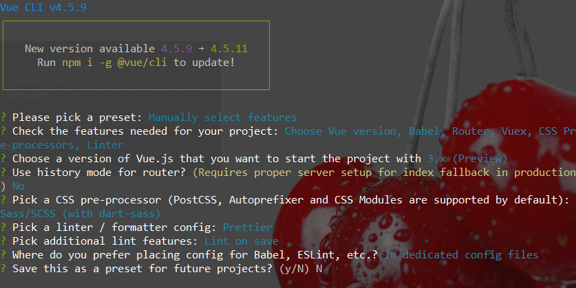
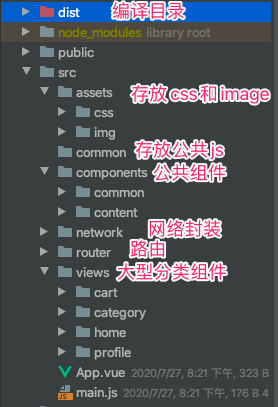
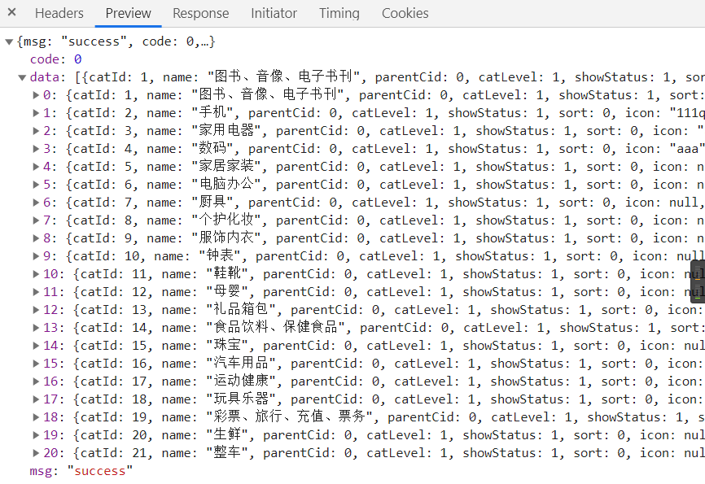

>   该文件所有内容均为 测试 前端对外访问界面      renren-fast-vue 做管理员界面

## 安装webpack和vue-cli

```bash
npm install webpack -g
npm install webpack-cli -g
```

```bash
npm install -g @vue/cli-init
```


## vue-cli4初始化项目

1.  初始化项目

    ```bash
    #卸载vue
    npm uninstall -g @vue/cli
    #重装vue
    npm install -g @vue/cli
    ```

    ```bash
    #我这里vue脚手架版本为4.5.9
    vue create shop-vue
    ```

2.  


## 整合Element-ui

1.  下载

    ```bash
    # vue4版本需要 element-plus
    cd shop-vue
    vue add element-plus
    ```

2.  main.js写入如下内容

    ```javascript
    import ElementPlus from 'element-plus'
    import 'element-plus/lib/theme-chalk/index.css'
    
    createApp(App)
    .use(store)
      .use(router)
      .use(ElementPlus)
      .mount("#app");
    ```




## 三级分类显示

`gulimall-Product`服务

```java
# CategoryController
/**
     * 按树形结构显示三级分类
     */
@RequestMapping("/listTree")
public R listTree(@RequestParam Map<String, Object> params) {
    List<CategoryEntity> entities = categoryService.listWithTree();

    return R.ok().put("data", entities);
}
```

```java
#CategoryServiceImpl
@Override
public List<CategoryEntity> listWithTree() {
    //todo 查出所有分类
    List<CategoryEntity> entities = baseMapper.selectList(null);

    //todo 查询所有一级分类
    List<CategoryEntity> level1Menus = entities.stream()
        .filter(categoryEntity -> categoryEntity.getParentCid() == 0)
        .map(ele -> {
            ele.setChildren(getChildrens(ele,entities));
            return ele;
        })
        .sorted((menu1,menu2) -> (menu1.getSort() == null ? 0:menu1.getSort()) - (menu2.getSort()==null ? 0:menu2.getSort()))
        .collect(Collectors.toList());

    //todo 树状分类
    return level1Menus;
}

// 递归查找所有菜单的子菜单
public List<CategoryEntity> getChildrens(CategoryEntity root , List<CategoryEntity> all){
    List<CategoryEntity> children = all.stream()
        .filter(categoryEntity -> categoryEntity.getParentCid() == root.getCatId())
        .map(ele -> {
            ele.setChildren(getChildrens(ele, all));
            return ele;
        })
        .sorted((menu1,menu2) -> (menu1.getSort() == null ? 0:menu1.getSort()) - (menu2.getSort()==null ? 0:menu2.getSort()))
        .collect(Collectors.toList());

    return children;
}

```

```java
#CategoryEntity
@TableField(exist=false)
private List<CategoryEntity> children;
```



