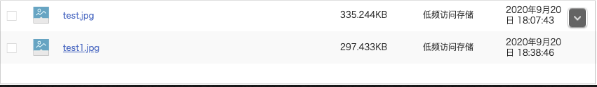

## 人人逆向工程反向vue代码

将src/components/upload 下三个封装后的文件拷贝进项目

修改multiUpload.vue中地址 为Bucket 域名


`前端vue代码`

1.  将逆向生成的 brand.vue  和 brand-add-or-update.vue  拷贝到  src/views/modules/product目录下

2.  封装js

    ```javascript
    # src/api/product/brand.js
    
    import request from "@/utils/httpRequest"
    const BASE_URL = "/product/brand"
    
    /**
     * 品牌列表
     * @param {*} params
     */
    export function BrandListApi(params){
      return request({
          url:  request.adornUrl( `${BASE_URL}/list`) ,
          method: "get",
          params : request.adornParams(params , false )
      })
    }
    export function BrandInfoApi(brandId){
      return request({
          url:  request.adornUrl( `${BASE_URL}/info/${brandId}`) ,
          method: "get"
      })
    }
    /**
     * 修改品牌状态
     * @param {*} data
     */
    export function BrandUpdateStatusApi(data) {
      return request({
        url: request.adornUrl(`${BASE_URL}/update/status`),
        method: "put",
        data: request.adornData(data, false)
      })
    }
    /**
     * 删除品牌
     * @param {Array} data
     */
    export function BrandDeleteApi(data) {
      return request({
        url: request.adornUrl(`${BASE_URL}/save`),
        method: "delete",
        data: request.adornData(data, false)
      })
    }
    ```

    ```javascript
    # src/api/product/categoryBrandRelation.js
    import request from "@/utils/httpRequest"
    const BASE_URL = "/product/categorybrandrelation"
    
    export function CategoryBrandRelationSaveApi(data) {
      return request({
        url: request.adornUrl(`${BASE_URL}/info/${categoryId}`),
        method: "get",
        data: request.adornData(data, false)
      })
    }
    export function CategoryBrandRelationDeleteApi(data) {
      return request({
        url: request.adornUrl(`${BASE_URL}/delete`),
        method: "delete",
        data: request.adornData(data, false)
      })
    }
    export function CategoryBrandRelationCategoryListApi(brandId) {
      return request({
        url: request.adornUrl(`${BASE_URL}/category/list`),
        method: "get",
        params: request.adornParams({ brandId })
      })
    }
    
    export function CategoryBrandRelationCategoryBrandListApi(categoryId) {
      return request({
        url: request.adornUrl(`${BASE_URL}/brands/list`),
        method: "get",
        params: request.adonParams({ categoryId })
      })
    }
    ```


2.  暂时关闭renren-vue前台项目的权限校验

    ```javascript
    # src/utils/index.js
    export function isAuth (key) {
      return true;
      // return JSON.parse(sessionStorage.getItem('permissions') || '[]').indexOf(key) !== -1 || false
    }
    ```

3.  封装上传代码

    ```vue
    #src/components/upload/singleUpload.vue
    <template>
    <div>
      <el-upload  :action="dataObj.host" :data="dataObj" list-type="picture" :multiple="false" :show-file-list="showFileList" :file-list="fileList" :before-upload="beforeUpload" :on-remove="handleRemove" :on-success="handleUploadSuccess" :on-preview="handlePreview">
        <el-button size="small" type="primary">点击上传</el-button>
        <div slot="tip" class="el-upload__tip">只能上传jpg/png文件，且不超过10MB</div>
      </el-upload>
      <el-dialog :visible.sync="dialogVisible">
        
      </el-dialog>
    </div>
    </template>
    
    <script>
    import { policy } from './policy'
    import { getUUID } from '@/utils'
    
    export default {
      name: 'singleUpload',
      props: {
        value: String
      },
      computed: {
        imageUrl() {
          return this.value;
        },
        imageName() {
          if (this.value != null && this.value !== '') {
            return this.value.substr(this.value.lastIndexOf("/") + 1);
          } else {
            return null;
          }
        },
        fileList() {
          return [{
            name: this.imageName,
            url: this.imageUrl
          }]
        },
        showFileList: {
          get: function () {
            return this.value !== null && this.value !== '' && this.value !== undefined;
          },
          set: function (newValue) {}
        }
      },
      data() {
        return {
          dataObj: {
            policy: '',
            signature: '',
            key: '',
            ossaccessKeyId: '',
            dir: '',
            host: 'gulimall-shuai.oss-cn-beijing.aliyuncs.com',
            // callback:'',
          },
          dialogVisible: false
        };
      },
      methods: {
        emitInput(val) {
          this.$emit('input', val)
        },
        handleRemove(file, fileList) {
          this.emitInput('');
        },
        handlePreview(file) {
          this.dialogVisible = true;
        },
        beforeUpload(file) {
          let _self = this;
          return new Promise((resolve, reject) => {
            console.log("获取签名后的数据 > >")
            policy().then(response => {
              _self.dataObj.policy = response.data.data.policy;
              _self.dataObj.signature = response.data.data.signature;
              _self.dataObj.ossaccessKeyId = response.data.data.accessid;
              _self.dataObj.key = response.data.data.dir + '/' + getUUID() + '_${filename}';
              _self.dataObj.dir = response.data.data.dir;
              _self.dataObj.host = response.data.data.host;
              resolve(true)
            }).catch(err => {
              reject(false)
            })
          })
        },
        handleUploadSuccess(res, file) {
          console.log("上传成功...")
          this.showFileList = true;
          this.fileList.pop();
          this.fileList.push({ name: file.name, url: this.dataObj.host + '/' + this.dataObj.key.replace("${filename}", file.name) });
          this.emitInput(this.fileList[0].url);
        }
      }
    }
    </script>
    
    <style>
    
    </style>
    ```

    ```vue
    #src/components/upload/multiUpload.vue
    <template>
    <div>
      <el-upload :action="dataObj.host"  :data="dataObj" list-type="picture-card" :file-list="fileList" :before-upload="beforeUpload" :on-remove="handleRemove" :on-success="handleUploadSuccess" :on-preview="handlePreview" :limit="maxCount" :on-exceed="handleExceed">
        <i class="el-icon-plus"></i>
      </el-upload>
      <el-dialog :visible.sync="dialogVisible">
        
      </el-dialog>
    </div>
    </template>
    
    <script>
    import { policy } from "./policy";
    import { getUUID } from '@/utils'
    export default {
      name: "multiUpload",
      props: {
        //图片属性数组
        value: Array,
        //最大上传图片数量
        maxCount: {
          type: Number,
          default: 30
        }
      },
      data() {
        return {
          dataObj: {
            policy: "",
            signature: "",
            key: "",
            ossaccessKeyId: "",
            dir: "",
            host: "gulimall-shuai.oss-cn-beijing.aliyuncs.com",
            uuid: ""
          },
          dialogVisible: false,
          dialogImageUrl: null
        };
      },
      computed: {
        fileList() {
          let fileList = [];
          for (let i = 0; i < this.value.length; i++) {
            fileList.push({ url: this.value[i] });
          }
    
          return fileList;
        }
      },
      mounted() {},
      methods: {
        emitInput(fileList) {
          let value = [];
          for (let i = 0; i < fileList.length; i++) {
            value.push(fileList[i].url);
          }
          this.$emit("input", value);
        },
        handleRemove(file, fileList) {
          this.emitInput(fileList);
        },
        handlePreview(file) {
          this.dialogVisible = true;
          this.dialogImageUrl = file.url;
        },
        beforeUpload(file) {
          let _self = this;
          return new Promise((resolve, reject) => {
            policy()
              .then(response => {
                console.log(response) ;
                console.log("这是什么${filename}");
                _self.dataObj.policy = response.data.policy;
                _self.dataObj.signature = response.data.signature;
                _self.dataObj.ossaccessKeyId = response.data.accessid;
                _self.dataObj.key = response.data.dir + "/" + getUUID() + "_${filename}";
                _self.dataObj.dir = response.data.dir;
                _self.dataObj.host = response.data.host;
                resolve(true);
              })
              .catch(err => {
                console.log("出错了...", err)
                reject(false);
              });
          });
        },
        handleUploadSuccess(res, file) {
          this.fileList.push({
            name: file.name,
            // url: this.dataObj.host + "/" + this.dataObj.dir + "/" + file.name； 替换${filename}为真正的文件名
            url: this.dataObj.host + "/" + this.dataObj.key.replace("${filename}", file.name)
          });
          this.emitInput(this.fileList);
        },
        handleExceed(files, fileList) {
          this.$message({
            message: "最多只能上传" + this.maxCount + "张图片",
            type: "warning",
            duration: 1000
          });
        }
      }
    };
    </script>
    
    <style>
    </style>
    
    ```

    ```javascript
    # src/components/upload/policy.js
    import http from '@/utils/httpRequest.js'
    export function policy() {
       return  new Promise((resolve,reject)=>{
            http({
                url: http.adornUrl("/thirdparty/oss/policy"),
                method: "get"
            }).then((data) => {
                console.log(data)
                resolve(data);
            })
        });
    }
    ```

    


`后端代码`


## 重点 -  图片 - 云存储

>   因为这里涉及到多个服务，如果仅仅将图片、视频等资源存放在某一个服务下，则其他服务就存在找不到的风险，因此使用一个公共服务器进行存储。


>   这里使用  云存储作为 文件存储服务器


`详情参考` ：MD-Book\Spring Cloud Alibaba\第五章-阿里云存储OSS.md

>   因为 第五章-阿里云存储OSS.md 是之前的笔记，现在为了回炉重造，因此重新做整合 OSS 笔记


## Spring Cloud整合 Aliyun Spring Boot OSS

> 上面都是使用的阿里云提供的 OSS-SDK最原始的sdk 。需要配置好多东西。
>
> 这里以  `gulimall-Product` 微服务 演示

1. 加入依赖

    ```xml
    <dependencyManagement>
        <dependencies>
            <dependency>
                <groupId>com.alibaba.cloud</groupId>
                <artifactId>aliyun-spring-boot-dependencies</artifactId>
                <version>1.0.0</version>
                <type>pom</type>
                <scope>import</scope>
            </dependency>
        </dependencies>
    </dependencyManagement>
    <dependency>
         <groupId>com.alibaba.cloud</groupId>
         <artifactId>aliyun-oss-spring-boot-starter</artifactId>
    </dependency>
    ```


​	

2.  Nacos配置中心  

    >   配置文件 之前已全部整合到了 配置中心 因此 在 Nacos 中新建 oss.yml 配置文件，并在bootstrap.properties 中新增配置集

    *   新增配置集 oss.yml

    

    ```yaml
    alibaba:
      cloud:
        #用户登录名称 gulimall-new@1170427993785276.onaliyun.com
        #AccessKey ID LTAI4FzRdEuN34dQA9QLnTcs
        #AccessKey Secret E9HzBswmUvtqsQSOeebCe0N2xYwKZ3
        access-key: LTAI4FzRdEuN34dQA9QLnTcs
        secret-key: E9HzBswmUvtqsQSOeebCe0N2xYwKZ3
        oss:
          endpoint: oss-cn-beijing.aliyuncs.com
    ```

    

    *   bootstrap.properties 中新增配置集 

        ```properties
        spring.cloud.nacos.config.ext-config[4].data-id=oss.yml
        spring.cloud.nacos.config.ext-config[4].group=dev
        spring.cloud.nacos.config.ext-config[4].refresh=true
        ```
    
    
    
3. 测试

    ```java
    @RunWith(SpringRunner.class)
    @SpringBootTest
    public class Client {
        @Autowired
        OSSClient ossClient;//注入阿里云存储 对象
        /*
         * TODO <p> 测试阿里云文件上传功能</p>
         * @author mac
         * @date 2020/9/20 5:49 下午
         * @param null
         * @return
         * @see #
         */
        @Test
        public void testUpload() throws FileNotFoundException {
    //        // Endpoint以杭州为例，其它Region请按实际情况填写。 endpoint 为Bucket 的外网访问地址
    //        String endpoint = "oss-cn-beijing.aliyuncs.com";
    //         // 阿里云主账号AccessKey拥有所有API的访问权限，风险很高。强烈建议您创建并使用RAM账号进行API访问或日常运维，请登录 https://ram.console.aliyun.com 创建RAM账号。
    //        String accessKeyId = "LTAI4G6NvVQoR4ErbYKVabCW";
    //        String accessKeySecret = "O7sRW85fwf25tkuWmf9QvbpE8EaRX1";
    
            // 创建OSSClient实例。
    //        OSS ossClient = new OSSClientBuilder().build(endpoint, accessKeyId, accessKeySecret);
    
            // 上传文件流。
            InputStream inputStream = new FileInputStream("C:\\Users\\gao17\\Pictures\\1.jpg");
            ossClient.putObject("gulimall-shuai", "test3.jpg", inputStream);
    
            // 关闭OSSClient。
            ossClient.shutdown();
    
            System.out.println("上传完成");
        }
    }
    ```

    

4. 

5. 


## 新建微服务 gulimall-third-party

1.  root项目中添加 新加的微服务模块

2.  pom文件中填入 `gulimall-Common`服务依赖 引入 服务注册发现依赖包

    ```xml
    <properties>
    	<!-- 保持一致 -->
        <spring-boot.version>2.3.7.RELEASE</spring-boot.version>
        <spring-cloud.version>Hoxton.SR9</spring-cloud.version>
    </properties>
    
    <dependencyManagement>
        <dependencies>
            <dependency>
                <groupId>com.alibaba.cloud</groupId>
                <artifactId>aliyun-spring-boot-dependencies</artifactId>
                <version>1.0.0</version>
                <type>pom</type>
                <scope>import</scope>
            </dependency>
            <dependency>
                <groupId>org.springframework.cloud</groupId>
                <artifactId>spring-cloud-dependencies</artifactId>
                <version>${spring-cloud.version}</version>
                <type>pom</type>
                <scope>import</scope>
            </dependency>
            <dependency>
                <groupId>org.springframework.boot</groupId>
                <artifactId>spring-boot-dependencies</artifactId>
                <version>${spring-boot.version}</version>
                <type>pom</type>
                <scope>import</scope>
            </dependency>
            <dependency>
                <groupId>org.springframework.boot</groupId>
                <artifactId>spring-boot-starter-web</artifactId>
            </dependency>
        </dependencies>
    </dependencyManagement>
    
    <dependency>
        <groupId>com.shuai.gulimall</groupId>
        <artifactId>gulimall-common</artifactId>
        <version>0.0.1-SNAPSHOT</version>
        <exclusions>
            <exclusion>
                <groupId>com.baomidou</groupId>
                <artifactId>mybatis-plus-boot-starter</artifactId>
            </exclusion>
        </exclusions>
    </dependency>
    <dependency>
        <groupId>com.alibaba.cloud</groupId>
        <artifactId>aliyun-oss-spring-boot-starter</artifactId>
    </dependency>
    ```

    

3.  nacos 新建 命名空间

    

4.  克隆 Product 命名空间 配置文件到 Third-Party 下  一定要包含 oss.yml文件 否则新建一个。

    

4.  修改配置文件中项目名和端口号(9006)

5.  新建bootstrap.properties 配置 nacos配置集

    ```properties
    # 指定服务名称
    spring.application.name=gulimall-Third-Party
    # 指定配置中心IP
    spring.cloud.nacos.config.server-addr=127.0.0.1:8848
    # 指定命名空间
    spring.cloud.nacos.config.namespace=0a2adf3c-8ea7-4bd7-97a7-00d60286869a
    # 指定分组
    #spring.cloud.nacos.config.group=dev
    # 指定配置文件类型
    #spring.cloud.nacos.config.file-extension=yml
    # 加载多个配置集
    # 配置文件
    spring.cloud.nacos.config.ext-config[0].data-id=oss.yml
    # 分组
    spring.cloud.nacos.config.ext-config[0].group=dev
    # 是否刷新
    spring.cloud.nacos.config.ext-config[0].refresh=true
    
    
    spring.cloud.nacos.config.ext-config[1].data-id=spring.yml
    spring.cloud.nacos.config.ext-config[1].group=dev
    spring.cloud.nacos.config.ext-config[1].refresh=true
    ```

6.  开启服务的注册发现

    ```java
    @EnableDiscoveryClient
    @SpringBootApplication
    public class GulimallThirdPartyApplication {
    
        public static void main(String[] args) {
            SpringApplication.run(GulimallThirdPartyApplication.class, args);
        }
    
    }
    ```

8.  测试

    ```java
    @RunWith(SpringRunner.class)
    @SpringBootTest
    public class Client {
        @Autowired
        OSSClient ossClient;//注入阿里云存储 对象
        /*
         * TODO <p> 测试阿里云文件上传功能</p>
         * @author mac
         * @date 2020/9/20 5:49 下午
         * @param null
         * @return
         * @see #
         */
        @Test
        public void testUpload() throws FileNotFoundException {
    //        // Endpoint以杭州为例，其它Region请按实际情况填写。 endpoint 为Bucket 的外网访问地址
    //        String endpoint = "oss-cn-beijing.aliyuncs.com";
    //         // 阿里云主账号AccessKey拥有所有API的访问权限，风险很高。强烈建议您创建并使用RAM账号进行API访问或日常运维，请登录 https://ram.console.aliyun.com 创建RAM账号。
    //        String accessKeyId = "LTAI4G6NvVQoR4ErbYKVabCW";
    //        String accessKeySecret = "O7sRW85fwf25tkuWmf9QvbpE8EaRX1";
    
            // 创建OSSClient实例。
    //        OSS ossClient = new OSSClientBuilder().build(endpoint, accessKeyId, accessKeySecret);
    
            // 上传文件流。
            InputStream inputStream = new FileInputStream("C:\\Users\\gao17\\Pictures\\1.jpg");
            ossClient.putObject("gulimall-shuai", "test66.jpg", inputStream);
    
            // 关闭OSSClient。
            ossClient.shutdown();
    
            System.out.println("上传完成");
        }
    }
    ```

    


## 服务端签名后直传

>   在`gulimall-Third-Party`服务基础上改造


1.  新增OssController ：提供签名

    ```java
    package com.shuai.gulimall.thirdparty.controller;
    /**
     * TODO:<p>  <p/>
     *
     * @Author mac
     * @Date 2020/9/20 10:20 下午
     * @Version V1.0
     **/
    @RestController
    @RequestMapping("/oss")
    public class OssController {
    
        @Autowired
        OSS ossClient;
    
        @Value("${alibaba.cloud.oss.endpoint}")
        private String endpoint;
    
        @Value("${alibaba.cloud.oss.bucket}")
        private String bucket;
    
        @Value("${alibaba.cloud.access-key}")
        private String accessId;
    
    
        @RequestMapping("/listTree")
        public R listTree(@RequestParam Map<String, Object> params) {
            return R.ok().put("data", "entities");
        }
    
        @RequestMapping("/policy")
        public R policy() {
            String host = "https://" + bucket + "." + endpoint; // host的格式为 bucketname.endpoint
            // callbackUrl为 上传回调服务器的URL，请将下面的IP和Port配置为您自己的真实信息。
    //        String callbackUrl = "http://88.88.88.88:8888";
    
            String format = new SimpleDateFormat("yyyy-MM-dd").format(new Date());
    
            String dir = format + "/"; // 用户上传文件时指定的前缀。每次上传文件都生成一个目录存放文件
    
            // 创建OSSClient实例。
    //        OSS ossClient = new OSSClientBuilder().build(endpoint, accessId, accessKey);
            Map<String, String> respMap = null;
            try {
                long expireTime = 30;
                long expireEndTime = System.currentTimeMillis() + expireTime * 1000;
                Date expiration = new Date(expireEndTime);
                // PostObject请求最大可支持的文件大小为5 GB，即CONTENT_LENGTH_RANGE为5*1024*1024*1024。
                PolicyConditions policyConds = new PolicyConditions();
                policyConds.addConditionItem(PolicyConditions.COND_CONTENT_LENGTH_RANGE, 0, 1048576000);
                policyConds.addConditionItem(MatchMode.StartWith, PolicyConditions.COND_KEY, dir);
    
                String postPolicy = ossClient.generatePostPolicy(expiration, policyConds);
                byte[] binaryData = postPolicy.getBytes("utf-8");
                String encodedPolicy = BinaryUtil.toBase64String(binaryData);
                String postSignature = ossClient.calculatePostSignature(postPolicy);
    
                respMap = new LinkedHashMap<String, String>();
                respMap.put("accessid", accessId);
                respMap.put("policy", encodedPolicy);
                respMap.put("signature", postSignature);
                respMap.put("dir", dir);
                respMap.put("host", host);
                respMap.put("expire", String.valueOf(expireEndTime / 1000));
                // respMap.put("expire", formatISO8601Date(expiration));
    
            } catch (Exception e) {
                // Assert.fail(e.getMessage());
                System.out.println(e.getMessage());
            } finally {
                ossClient.shutdown();
            }
            return R.ok().put("data", respMap);
        }
    
    }
    ```
    
2.  配置文件

   ```yaml
   alibaba:
     cloud:
       #用户登录名称 gulimall-new@1170427993785276.onaliyun.com
       #AccessKey ID LTAI4FzRdEuN34dQA9QLnTcs
       #AccessKey Secret E9HzBswmUvtqsQSOeebCe0N2xYwKZ3
       access-key: LTAI4FzRdEuN34dQA9QLnTcs
       secret-key: E9HzBswmUvtqsQSOeebCe0N2xYwKZ3
       oss:
         endpoint: oss-cn-beijing.aliyuncs.com
   ```

   

3.  测试

   

   >   Osscontroller返回的内容就是我们日后要发给云存储服务器的签名  然后带着签名以及文件上传到云存储

4.  `gulimall-Gateway`新增 `gulimall-Third-Party`路径映射

    ```yaml
          - id: third_party_route # 第三方服务
            uri: lb://gulimall-Third-Party
            predicates:
              - Path=/api/thirdparty/**   #路由规则
            filters:
              - RewritePath=/api/thirdparty/(?<segment>.*),/$\{segment}  # 路径重写
    ```

5.  重启网关服务  验证通过网关是否成功

    

    >   /api/thirdparty  为路由匹配规则   segment  为具体请求 - 对应controller中请求

6.  前后台联调  ： 跨域问题

    >   从我们 88 网关服务器  post 阿里云 不同源

7.  阿里云开启跨域


## 前后端数据校验

### 前端校验

```vue
<el-form :rules="dataRule"></el-form>
```

```vue
return{
	dataRule: {
        name: [{ required: true, message: "品牌名不能为空", trigger: "blur" }],
        logo: [
          { required: true, message: "品牌logo地址不能为空", trigger: "blur" }
        ],
        descript: [
          { required: true, message: "介绍不能为空", trigger: "blur" }
        ],
        showStatus: [{
          required: true,
          message: "显示状态[0-不显示；1-显示]不能为空",
          trigger: "blur"
        }],
        firstLetter: [{
          validator: (rule, value, callback) => {
            if (value == "") {
              callback(new Error("首字母必须填写"));
            } else if (!/^[a-zA-Z]$/.test(value)) {
              callback(new Error("首字母必须a-z或者A-Z之间"));
            } else {
              callback();
            }
          },
          trigger: "blur"
        }],
        sort: [{
          validator: (rule, value, callback) => {
            if (value === "") {
              callback(new Error("排序字段必须填写"));
            } else if (!Number.isInteger(value) || value < 0) {
              callback(new Error("排序必须是一个大于等于0的整数"));
            } else {
              callback();
            }
          },
          trigger: "blur"
        }]
      }
    };
  },
}
```


### 后端校验

>   参考 ：MD-Book\SpringBoot\Web开发\第四章-Spring Boot参数校验Validation入门.md   <font color=ff00aa>添加 BindingResult 获取实体类校验错误信息</font>

1.  导包

    ```xml
    <properties>
        <validation.version>2.0.1.Final</validation.version>
    </properties>
    <!-- 参数校验 -->
    <dependency>
        <groupId>javax.validation</groupId>
        <artifactId>validation-api</artifactId>
        <version>${validation.version}</version>
    </dependency>
    <dependency>
        <groupId>org.hibernate.validator</groupId>
        <artifactId>hibernate-validator</artifactId>
    </dependency>
    ```

    

2.  标注校验注解 @Valid

    ```java
    #存库前进行实体类校验
    @RequestMapping("/save")
    public R save(@Valid @RequestBody BrandEntity brand) {
        brandService.save(brand);
    
        return R.ok();
    }
    ```

3.  实体类校验规则

    ```java
    @Data
    @TableName("pms_brand")
    public class BrandEntity implements Serializable {
        private static final long serialVersionUID = 1L;
    
        /**
         * 品牌id
         */
        @TableId
        private Long brandId;
        /**
         * 品牌名
         */
        @NotBlank(message = "品牌名必须提交")
        private String name;
        /**
         * 品牌logo地址
         */
        @NotEmpty
        @URL(message = "品牌地址必须是一个URL")
        private String logo;
        /**
         * 介绍
         */
        private String descript;
        /**
         * 显示状态[0-不显示；1-显示]
         */
        @NotNull
        private Integer showStatus;
        /**
         * 检索首字母
         */
        //自定义校验规则，必须匹配正则表达式
        @NotEmpty
        @Pattern(regexp = "^[a-zA-Z]$",message = "检索首字母必须是一个字母")
        private String firstLetter;
        /**
         * 排序
         */
        @NotNull
        @Min(value = 0,message = "给定排序必须大于0")
        private Integer sort;
    
    }
    ```

    

4.  获取校验错误信息并返回前台

    ```java
        @RequestMapping("/save")
        public R save(@Valid @RequestBody BrandEntity brand , BindingResult bindingResult) {
            // 1. BindingResult 获取实体类所有的校验错误信息 全部返回
            if (bindingResult.hasErrors()){
                Map<String,String> map = new HashMap<>();
    
                //2. 获取校验错误提示
                bindingResult.getFieldErrors().forEach((item) ->{
                    //错误提示信息
                    String mess = item.getDefaultMessage();
                    //获取错误的属性名称
                    String field = item.getField();
                    map.put(field,mess);
                });
                return R.error(400,"提交的数据不合法~").put("data",map);
            }else {
                brandService.save(brand);
            }
    
            return R.ok();
        }
    ```


### 分组校验

`引言 : `

​	基于后端校验后，我们发现一个问题 ： 因为我们的 校验规则是加在实体类上的，并且 **更新**和**新增** 操作对应的校验规则不一致怎么办。即 一个实体类一个字段 如何 对应多套校验逻辑

eg：新增对应的 主键ID 必须为空，自增  而更新对应的 主键ID 必须不为空

`解决 :`

​	分组校验，即每个分组下的校验规则处理一种校验逻辑。多套校验逻辑使用多个分组即可


`流程：`

1. `gulimall-Common`新增 分组接口

	```java
	package com.shuai.gulimall.common.vaild;
	
	public interface AddGroup {
	}
	```

	```java
	package com.shuai.gulimall.common.vaild;
	
	public interface UpdateGroup {
	}
	```

2. 实体类校验字段添加分组

	```java
	@Data
	@TableName("pms_brand")
	public class BrandEntity implements Serializable {
	    private static final long serialVersionUID = 1L;
	
	    /**
	     * 品牌id
	     */
	    @TableId
	    @Null(message = "新增操作 主键ID必须为空 用于自增",groups = AddGroup.class)
	    @NotNull(message = "更新操作 主键ID必须不能为空",groups = UpdateGroup.class)
	    private Long brandId;
	    /**
	     * 品牌名
	     * 添加 ：必须要
	     * 更新 ：可以没有
	     */
	    @NotBlank(message = "品牌名必须提交",groups = {AddGroup.class})
	    private String name;
	    /**
	     * 品牌logo地址
	     * 添加 ：不为空，并且为URL格式
	     * 更新 ：可以为空，有则校验格式，没有则不校验格式
	     */
	    @NotEmpty(groups = AddGroup.class)
	    @URL(message = "品牌地址必须是一个URL",groups = {AddGroup.class,UpdateGroup.class})
	    private String logo;
	    /**
	     * 介绍 : 不做校验
	     */
	    private String descript;
	    /**
	     * 显示状态[0-不显示；1-显示]
	     * 添加 ：不为空
	     * 更新 ：不做校验
	     */
	    @NotNull(message = "显示状态必须提交",groups = {AddGroup.class})
	    private Integer showStatus;
	    /**
	     * 检索首字母
	     * 添加 ：不为空，并且自定义校验规则
	     * 更新 ：可以为空，不为空下必须符合正则
	     */
	    //自定义校验规则，必须匹配正则表达式
	    @NotEmpty(groups = AddGroup.class)
	    @Pattern(regexp = "^[a-zA-Z]$",message = "检索首字母必须是一个字母",groups = {AddGroup.class,UpdateGroup.class})
	    private String firstLetter;
	    /**
	     * 排序
	     * 添加 ：不为空，并且 大于 0
	     * 更新 ：可以为空，不为空下必须大于0
	     */
	    @NotNull(groups = AddGroup.class)
	    @Min(value = 0,message = "给定排序必须大于0",groups = {AddGroup.class,UpdateGroup.class})
	    private Integer sort;
	
	}
	```

3. Controller 指定校验分组

	```java
	//@Validated 指定校验规则分组 如果指定了分组，则实体类中没有添加分组的校验规则 不生效   而如果@Validated没有指定分组，则实体类中字段没有添加分组的校验规则  生效
	// 即我们可以通过 Controller 指定分组情况 和 不分组 来达到校验不同的情况
	
	    /**
	     * 保存
	     */
	    @RequestMapping("/save")
	    public R save(@Validated(value = {AddGroup.class}) @RequestBody BrandEntity brand /** BindingResult bindingResult **/) {
	//        // 1. BindingResult 获取实体类所有的校验错误信息 全部返回
	//        if (bindingResult.hasErrors()){
	//            Map<String,String> map = new HashMap<>();
	//
	//            //2. 获取校验错误提示
	//            bindingResult.getFieldErrors().forEach((item) ->{
	//                //错误提示信息
	//                String mess = item.getDefaultMessage();
	//                //获取错误的属性名称
	//                String field = item.getField();
	//                map.put(field,mess);
	//            });
	//            return R.error(400,"提交的数据不合法~").put("data",map);
	//        }else {
	//            brandService.save(brand);
	//        }
	        // 主业务逻辑，异常校验等作为 切面
	        brandService.save(brand);
	        return R.ok();
	    }
	
	    /**
	     * 修改
	     */
	    @RequestMapping("/update")
	    public R update(@Validated(value = {UpdateGroup.class}) @RequestBody BrandEntity brand) {
	        brandService.updateById(brand);
	
	        return R.ok();
	    }
	
	    /**
	     * 删除
	     */
	    @RequestMapping("/delete")
	    public R delete(@Validated(value = {UpdateGroup.class}) @RequestBody Long[] brandIds) {
	        brandService.removeByIds(Arrays.asList(brandIds));
	
	        return R.ok();
	    }
	```

	

### 自定义校验注解

`引言：`
	有一些情况，官方给定的注解并不能满足我们的需求，比如我要求实体类字段showStatus只能是0和1，我们又改如何处理呢？ 因此我们需要自定义注解


`流程:`

1. 创建自定义注解

	```java
	@Documented
	//指定校验器  todo 4. 指定自定义校验器
	@Constraint(validatedBy = {ListValueConstraintValidator.class})
	// 作用对象类型
	@Target({ElementType.METHOD, ElementType.FIELD, ElementType.ANNOTATION_TYPE, ElementType.CONSTRUCTOR, ElementType.PARAMETER, ElementType.TYPE_USE})
	//时机
	@Retention(RetentionPolicy.RUNTIME)
	public @interface ListValue {
	    //todo 1. 如何编写？  必须拥有三个属性 消息，分组，负载  以及元信息
	    //todo 3. 自定义编写 消息提示 配置文件
	    String message() default "{showStatus.message}";
	
	    Class<?>[] groups() default {};
	
	    Class<? extends Payload>[] payload() default {};
	
	    //todo 2. 新增自定义集合，用以传参
	    int[] vals() default {};
	}
	```

2. 消息配置文件

	```properties
	# ValidationMessages.properties gulimall-Product/src/main/resources/ValidationMessages.properties
	showStatus.message = 参数必须提交指定的值
	```

3. 自定义校验器

	```java
	// 第一个参数为 注解，第二个为 注解字段类型
	public class ListValueConstraintValidator implements ConstraintValidator<ListValue,Integer> {
	    private Set<Integer> set = new HashSet<>();
	
	    //初始化
	    @Override
	    public void initialize(ListValue constraintAnnotation) {
	        //获取注解给定参数值
	        int[] vals = constraintAnnotation.vals();
	        for (int val : vals) {
	            this.set.add(val);
	        }
	    }
	    /*
	     * TODO <p> 判断是否校验成功</p>
	     * @param integer 需要校验得值，即用户传过来的值，而constraintAnnotation为我们注解指定的值
	     * @param constraintValidatorContext    上下文
	     * @return boolean
	     */
	    @Override
	    public boolean isValid(Integer integer, ConstraintValidatorContext constraintValidatorContext) {
	        return this.set.contains(integer);
	    }
	}
	
	```

4. 测试

	

5. 乱码

	

	

	> 如果还存在乱码，则删除文件重新创建，重新写入中文即可。

	​	

## 全局异常返回

`引言:`

​	上面我们使用了 **参数校验** 和 **BindingResult 异常信息** 做到了下发数据时的信息校验并且返回校验错误的字段及信息。但是这样有一个缺点，当然 **参数校验** 本身并没有问题，问题出自 **BindingResult异常信息**，如果我们使用 **BindingResult** 来获取 校验异常信息，那么就会导致 ==主业务代码中掺杂了 系统业务，并且每个主业务代码中都要有这个系统业务代码造成代码冗余== 因此基于 Spring AOP 思想，我们必须解耦。


`解决:`

​	将系统业务代码 作为切面，切入到主业务代码中，新增**全局异常拦截处理类**【以后所有的异常都要抛出去，代码中只处理正确的逻辑】。这样势必会导致**全局异常拦截处理类**很庞大。错误信息和混乱。


`优化:`

​	 新增 状态码，通过不同的状态码 表示不同的 错误状态信息。针对每一种异常情况返回错误信息。


### 切面 前

1. 实体类

	```java
	@Data
	@TableName("pms_brand")
	public class BrandEntity implements Serializable {
	    private static final long serialVersionUID = 1L;
	
	    /**
	     * 品牌id
	     */
	    @TableId
	    private Long brandId;
	    /**
	     * 品牌名
	     */
	    @NotBlank(message = "品牌名必须提交")
	    private String name;
	    /**
	     * 品牌logo地址
	     */
	    @NotEmpty
	    @URL(message = "品牌地址必须是一个URL")
	    private String logo;
	    /**
	     * 介绍
	     */
	    private String descript;
	    /**
	     * 显示状态[0-不显示；1-显示]
	     */
	    @NotEmpty
	    private Integer showStatus;
	    /**
	     * 检索首字母
	     */
	    //自定义校验规则，必须匹配正则表达式
	    @NotEmpty
	    @Pattern(regexp = "^[a-zA-Z]$",message = "检索首字母必须是一个字母")
	    private String firstLetter;
	    /**
	     * 排序
	     */
	    @NotNull
	    @Min(value = 0,message = "给定排序必须大于0")
	    private Integer sort;
	
	}
	```

2. Controller

	```java
	@RequestMapping("/save")
	    public R save(@Valid @RequestBody BrandEntity brand , BindingResult bindingResult) {
	        // 1. BindingResult 获取实体类所有的校验错误信息 全部返回
	        if (bindingResult.hasErrors()){
	            Map<String,String> map = new HashMap<>();
	
	            //2. 获取校验错误提示
	            bindingResult.getFieldErrors().forEach((item) ->{
	                //错误提示信息
	                String mess = item.getDefaultMessage();
	                //获取错误的属性名称
	                String field = item.getField();
	                map.put(field,mess);
	            });
	            return R.error(400,"提交的数据不合法~").put("data",map);
	        }else {
	            brandService.save(brand);
	        }
	
	        return R.ok();
	    }
	```


### 切面 后

1. 实体类 参数校验不变

2. `gulimall-Common`新增 枚举类 【参考最后的状态码设定】

	```java
	public enum BizCodeEnume {
	    /*参数校验异常*/
	    VAILD_EXCEPTION(2000000900,"参数校验异常"),
	    /*位置异常*/
	    ENKNOW_EXCEPTION(2000000800,"位置异常");
	
	    private Integer code;
	    private String msg;
	    BizCodeEnume(Integer code,String msg){
	        this.code = code;
	        this.msg = msg;
	    }
	
	    public Integer getCode() {
	        return code;
	    }
	
	    public String getMsg() {
	        return msg;
	    }
	}
	```

3. `gulimall-Product`新增 **异常拦截处理类**【其他服务类似】

	```java
	@Slf4j
	//@ResponseBody
	//@ControllerAdvice(basePackages = "com.shuai.gulimall.product.controller")
	@RestControllerAdvice(basePackages = "com.shuai.gulimall.product.controller")
	public class GulimallExceptionControllerAdvice {
	
	    /* 异常处理 - 数据校验错误 */
	    @ExceptionHandler(value = MethodArgumentNotValidException.class)
	    public R handleVaildException(MethodArgumentNotValidException e){
	        log.error("数据校验错误 {} , 异常类型为 {} ", e.getMessage(),e.getClass());
	
	        //错误信息
	        Map<String,String> map = new HashMap<>();
	        BindingResult bindingResult = e.getBindingResult();
	
	        //2. 获取校验错误提示
	        bindingResult.getFieldErrors().forEach((item) ->{
	            //错误提示信息
	            String mess = item.getDefaultMessage();
	            //获取错误的属性名称
	            String field = item.getField();
	            map.put(field,mess);
	        });
	        return R.error(BizCodeEnume.VAILD_EXCEPTION.getCode(),BizCodeEnume.VAILD_EXCEPTION.getMsg()).put("data",map);
	    }
	
	
	    /* 公共异常处理 ： 针对具体异常没有匹配到则走这个异常 */
	    @ExceptionHandler(Throwable.class)
	    public R handleException(Throwable e){
	        log.error("未知错误 {}", e.getMessage());
	        return R.error(BizCodeEnume.ENKNOW_EXCEPTION.getCode(),BizCodeEnume.ENKNOW_EXCEPTION.getMsg());
	    }
	
	}
	```

4. Controller

	```java
	    @RequestMapping("/save")
	    public R save(@Valid @RequestBody BrandEntity brand ,/** BindingResult bindingResult **/) {
	//        // 1. BindingResult 获取实体类所有的校验错误信息 全部返回
	//        if (bindingResult.hasErrors()){
	//            Map<String,String> map = new HashMap<>();
	//
	//            //2. 获取校验错误提示
	//            bindingResult.getFieldErrors().forEach((item) ->{
	//                //错误提示信息
	//                String mess = item.getDefaultMessage();
	//                //获取错误的属性名称
	//                String field = item.getField();
	//                map.put(field,mess);
	//            });
	//            return R.error(400,"提交的数据不合法~").put("data",map);
	//        }else {
	//            brandService.save(brand);
	//        }
	        // 主业务逻辑，异常校验等作为 切面
	        brandService.save(brand);
	        return R.ok();
	    }
	```

5. 测试

	


## 状态码设定

```java
/**
 * 服务异常
 *
 * 参考 https://www.kancloud.cn/onebase/ob/484204 文章
 *
 * 一共 10 位，分成四段
 *
 * 第一段，1 位，类型
 *      1 - 业务级别异常
 *      2 - 系统级别异常
 * 第二段，3 位，系统类型
 *      001 - 用户系统
 *      002 - 商品系统
 *      003 - 订单系统
 *      004 - 支付系统
 *      005 - 优惠劵系统
 *      ... - ...
 * 第三段，3 位，模块
 *      不限制规则。
 *      一般建议，每个系统里面，可能有多个模块，可以再去做分段。以用户系统为例子：
 *          001 - OAuth2 模块
 *          002 - User 模块
 *          003 - MobileCode 模块
 * 第四段，3 位，错误码
 *       不限制规则。
 *       一般建议，每个模块自增。
 */
```


`eg:`

```java
/**
 * 一共 10 位，分成四段
 *
 * 第一段，1 位，类型
 *      1 - 业务级别异常
 *      2 - 系统级别异常
 * 第二段，3 位，系统类型
 *      000 - 所有系统通用
 *      001 - 商品系统      Product
 *      002 - 订单系统      Order
 *      003 - 优惠券系统    Coupon
 *      004 - 用户系统      Member
 *      005 - 库存系统      Ware
 *      ... - ...
 * 第三段，3 位，模块
 *      商品系统
 *          通用    : 000
 *          品牌管理 ：001
            SKU信息 ：002

 * 第四段，3 位，错误码
 *      1XX：协议相关信息提示
 *         100 ：继续
 *         101：切换协议
 *      2XX：表示请求成功
 *         200 :success ,请求成功
 *         201 ：以创建
 *         202 ：以接受
 *         204 ：无内容
 *      3XX：表示重定向
 *         301 ：永久重定向 浏览器的url已经更新，为了保持搜索排名，会在旧的url上设置返回的状态码，这时浏览器需要重新发送一个HTTP请求，到服务器返回新的地址。
 *         302 ：临时重定向 如果客户端发出非GET、HEAD请求后，收到服务端的302状态码，那么就不能自动的向新URI发送重复请求，除非得到用户的确认。
 *         303 ：临时重定向 对于POST请求，303表示请求已经被处理，客户端可以接着使用GET方法去请求Location里的URI.
 *         304 ：文档内容未改变
 *         305 ：使用代理
 *         307 ：临时重定向，部分浏览器不能识别。对于POST请求，307表示请求还没有被处理，客户端应该向Location里的URI重新发起POST请求，307仅在POST方法的重定向上有用处。
 *      4XX：客户端错误
 *         400 ：请求无效 原因：前端提交数据的字段名称和字段类型与后台的实体没有保持一致，前端提交到后台的数据应该是json字符串类型，但是前端没有将对象JSON.stringify转化成字符串。
 *         401 ：当前请求需要用户验证
 *         403： 服务器已经得到请求但是拒绝执行
 *         404 ：not found 没找到
 *      5XX：服务器端错误
 *         500 ：内部服务器错误。
 *         501 ：不支持当前某些功能。
 *         502 ：网关错误
 *         503 ：服务器不可用
 *         504 ：网关超时
 *         505：http版本不支持
 */
```
