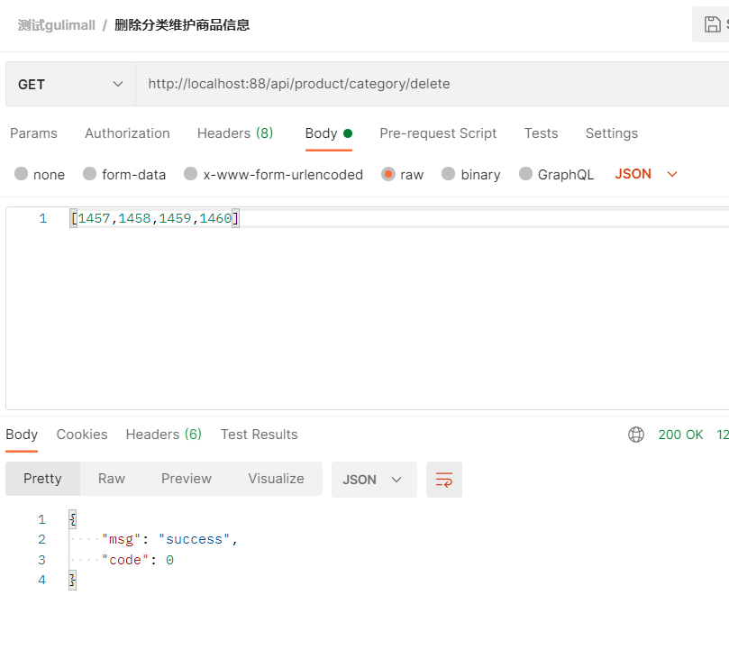

## renren-fast-vue 菜单规则

*   菜单URL  :  product/category 
    *   在src/views/modules下新建product目录。
    *   在src/views/modules/product 下新建category.vue
    *   访问路径为 http://localhost:8001/#/product-category


## 菜单栏导入

在 gulimall_admin 中导入数据表 sys_menu 表  db/init/sys_menus.sql


## 网关调整

>   <font color=ff00aa>当前情况：</font> 
>
>   *   目前已整合了renren-fast 以及renren-fast-vue 实现用户登录以及菜单栏，欠缺每个菜单栏内容显示以及操作。
>   *   七个微服务环境已整合完毕，所有微服务均已使用注册到 nacos 服务中心。并使用配置中心 集合管理各个服务的配置文件
>   *   已整合 网关 欠缺 微服务在网关中配置。

*   前端所有项目请求都交给 `网关`
*   前端所有请求都要携带api

`实现步骤:`

1.  renren-fast-vue 中 static/config/index.js中 修改基本请求地址为网关

    ```javascript
    window.SITE_CONFIG['baseUrl'] = 'http://localhost:88/api';
    ```

2.  网关 服务中application.yml中新增映射处理

    ```yml
    - id: admin_router
      uri: lb://renren-fast    #lb:负载均衡处理   renren-fast服务名称
      predicates:
       	- Path=/api/**     # The Path Route Predicate Factory   -- 将/api请求下所有请求都先暂时转到renren-fast       
    ```

3.  验证码404

    ```bash
    # 请求路径
    http://localhost:88/api/captcha.jpg
    # 后台项目正确访问的路径
    http://localhost:8080/renren-fast/captcha.jpg
    # 解决办法  使用 网关- -过滤器 重写映射路劲
    ```

    *   修改网关映射文件 application.yml

        ```yaml
        - id: admin_router
        	uri: lb://renren-fast    #lb:负载均衡处理   renren-fast服务名称  
        	predicates:
        		- Path=/api/**     # The Path Route Predicate Factory   -- 将/api请求下所有请求都先暂时转到renren-fast
        # 请求路径  http://localhost:88/api/captcha.jpg   # 后台项目正确访问的路径 http://localhost:8080/renren-fast/captcha.jpg
        	filters:			# The RewritePath GatewayFilter Factory
        		- RewritePath=/api(?<segment>/?.*), /renren-fast/$\{segment}
        ```

    

4.  登录时 由于需要从 88端口 请求 8080端口中服务 不符合同源策略 需要跨域

    >   浏览器解决跨域 CORS相关内容可参考 MD-Book\解决方案\跨域.md
    
5.  在网关服务中心添加请求拦截

    ```java
    @Configuration
    public class GulimallCorsConfiguration {
        @Bean
        public CorsWebFilter corsWebFilter(){
            UrlBasedCorsConfigurationSource source = new UrlBasedCorsConfigurationSource();
            CorsConfiguration corsConfiguration = new CorsConfiguration();
    
            //1. 配置跨域
            corsConfiguration.addAllowedHeader("*");
            corsConfiguration.addAllowedMethod("*");
            corsConfiguration.addAllowedOrigin("*");
            corsConfiguration.setAllowCredentials(true);
            source.registerCorsConfiguration("/**",corsConfiguration);
    
            return new CorsWebFilter(source);
        }
    }
    ```

6.  注释掉renren-fast项目中  CorsConfig 类中跨域配置


## 全局逻辑删除

>   参考MybatisPlus  ：MD-Book\MyBatis-Plus\第三章-高级功能.md

1. 使用字段来标识删除没删除。例如使用 表字段 show_status 值1和0来表示逻辑删除

2. 在配置文件中 mybatis-plus中配置

    ```yaml
    mybatis-plus:
      global-config:
        db-config:
          logic-delete-field: flag  # 全局逻辑删除的实体字段名(since 3.3.0,配置后可以忽略不配置步骤2)
          logic-delete-value: 1 # 逻辑已删除值(默认为 1)
          logic-not-delete-value: 0 # 逻辑未删除值(默认为 0)
    ```

3. 实体类添加注解

    ```java
    /**
     * 是否显示[0-不显示，1显示]  如果某张表与全局配显示逻辑不一样则可以使用
     * value delval 来进行单独配置
     */
    @TableLogic(value = "1",delval = "0")
    private Integer showStatus;
    ```

    

4. 测试


5.  结果





