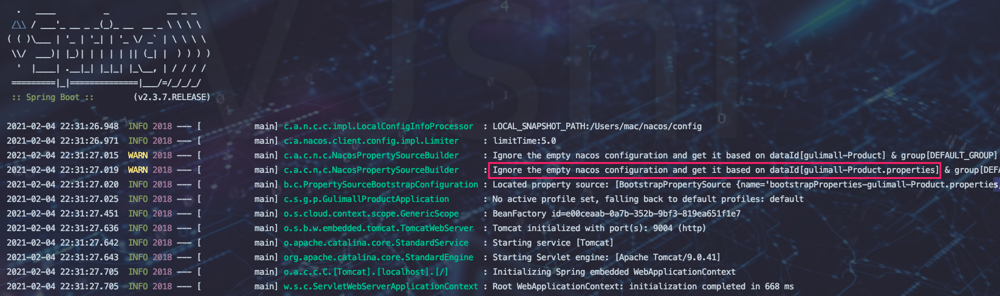
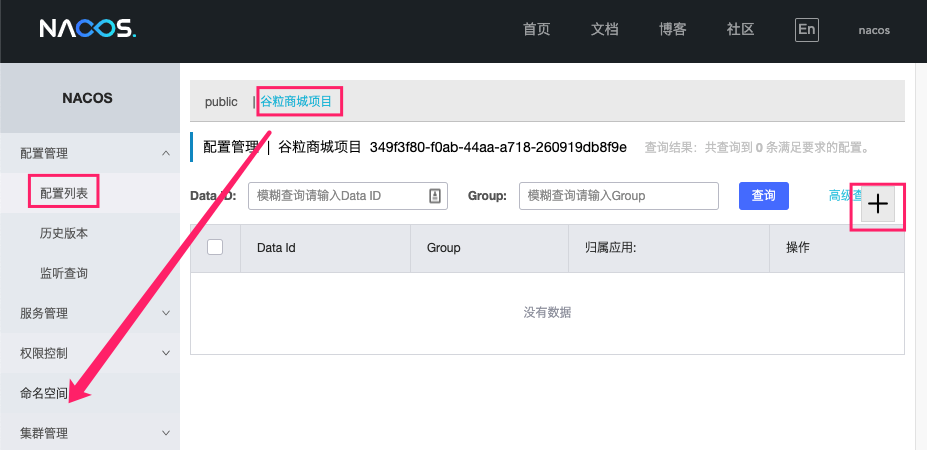
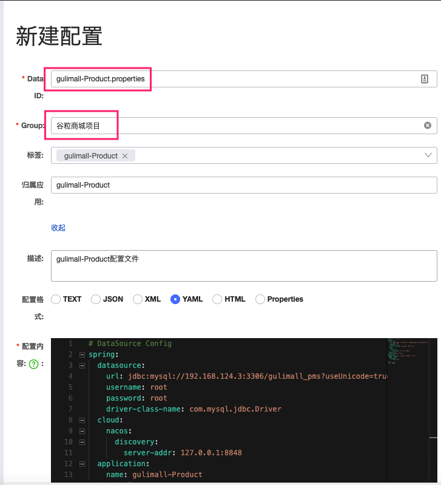
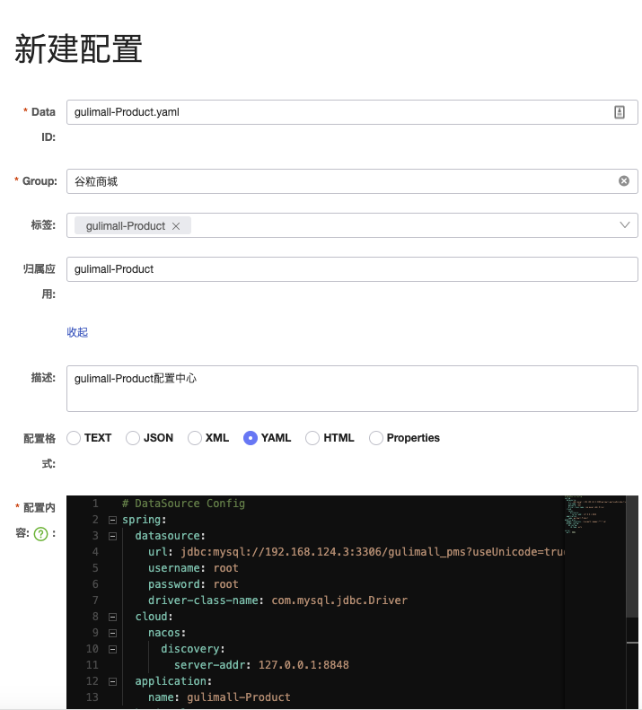
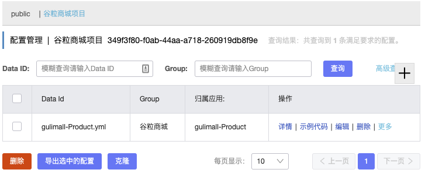

## Spring Cloud

在第三章我们已经实现了：

* 基于Maven的五个Spring Boot 模块项目
* 整合Nexus包管理中心
* 五个Spring Boot 模块与MybatisPlus的整合

> 微服务 : 
>
> ①  项目将不同的业务分为不同或者相同的单体Spring Boot项目.
>
> ②  为管理多个不同的或者相同的单体Spring Boot项目应运而生的一套技术解决方案|技术生态 
>
> > 因此接下来我们需要做的是 ： 整合Spring Cloud技术方案来管理 众多的单体项目。


| 技术     | 作用                   | 落地者              |
| -------- | ---------------------- | ------------------- |
| Nacos    | 注册中心               | SpringCloud Alibaba |
| Nacos    | 配置中心               | SpringCloud Alibaba |
| Ribbon   | 负载均衡               | SpringCloud         |
| Feign    | 服务远程调用(HTTP)     | SpringCloud         |
| Sentinel | 服务限流 - 降级 - 熔断 | SpringCloud Alibaba |
| Gateway  | API网关                | SpringCloud         |
| Sleuth   | 调用链监控             | SpringCloud         |
| Seata    | 分布式事务解决方案     | SpringCloud Alibaba |


## 版本选择

**大版本映射**

| **Spring Boot Version**                | **Spring Cloud Alibaba Version** | **Spring Cloud Version** |
| -------------------------------------- | -------------------------------- | ------------------------ |
| 2.4.X.RELEASE                          |                                  | 2020.0.x aka Ilford      |
| 2.2 \| 2.3.RELEASE (Starting with SR5) | 2.2.5.RELEASE                    | Spring Cloud Hoxton      |
| 2.1.X.RELEASE                          | 2.1.0.RELEASE                    | Spring Cloud Greenwich   |
| 2.0.X.RELEASE                          | 2.0.0.RELEASE                    | Spring Cloud Finchley    |
| 1.5.X.RELEASE                          | 2.0.0.RELEASE                    | Spring Cloud Edgware     |

我这里SpringBoot版本为==2.3.7.RELEASE== 所以SpringCloud版本选择==Spring Cloud Hoxton SR9==

因为SpringCloud Alibaba 官网给定最新版SpringBoot 2.3.2的匹配版本为==2.2.5.RELEASE==。因此这里使用2.2.5

> 阿里巴巴官网 : https://github.com/alibaba/spring-cloud-alibaba/wiki/%E7%89%88%E6%9C%AC%E8%AF%B4%E6%98%8E


## gulimall-Common控制SpringBoot、SpringCloud、SpringCloudAlibaba版本

> 一些基础依赖或者功能都放入到Common服务中。

1. `gulimall-Common`服务pom中引入

	```xml
	<dependencyManagement>
	  <dependencies>
	    <dependency>
	      <groupId>org.springframework.boot</groupId>
	      <artifactId>spring-boot-dependencies</artifactId>
	      <version>${spring.boot.version}</version>
	      <type>pom</type>
	      <scope>import</scope>
	    </dependency>
	    <dependency>
	      <groupId>org.springframework.cloud</groupId>
	      <artifactId>spring-cloud-dependencies</artifactId>
	      <version>${spring.cloud.version}</version>
	      <type>pom</type>
	      <scope>import</scope>
	    </dependency>
	    <dependency>
	      <groupId>com.alibaba.cloud</groupId>
	      <artifactId>spring-cloud-alibaba-dependencies</artifactId>
	      <version>${spring.cloud.alibaba.version}</version>
	      <type>pom</type>
	      <scope>import</scope>
	    </dependency>
	  </dependencies>
	</dependencyManagement>
	```

	

## 整合SpringCloud Alibaba - - Nacos注册发现

1. `gulimall-Common服务`中引入Nacos注册发现依赖。

	```xml
	<!--服务注册发现-->
	<dependency>
	  <groupId>com.alibaba.cloud</groupId>
	  <artifactId>spring-cloud-starter-alibaba-nacos-discovery</artifactId>
	</dependency>
	```

2. 下载并启动Nacos 具体参考：MD-Book/Spring Cloud Alibaba/第一章-Nacos注册发现(Eureka服务注册发现).md

3. `gulimall-Coupon服务`yml中配置Nacos Server地址

	```yaml
	# Nacos 服务地址
	spring:  
	  cloud:
	    nacos:
	      discovery:
	        server-addr: 127.0.0.1:8848
	# 配置服务启动端口 我这里五个微服务依次为9001、9002、9003、9004、9005 注释掉每个微服务，application.properties文件中端口配置        
	server:
	  port: 9001       
	```

	> #这里使用`gulimall-Coupon服务`做演示。其他微服务(除Common)一样处理  1. 导包(Common基础包)   2. 配置yml   3. 注解开启

	> 使用阿里巴巴代理生成SpringBoot项目时候会默认生成application.properties文件，并且该文件中默认配置了项目名和端口号，删除该文件在yml文件中配置项目名和端口号
	>
	> ```yaml
	> spring:	
	> 	application:
	>   	name: 项目名
	> server:
	>   port: 端口号    	
	> ```

4. 开启服务注册发现 ==@EnableDiscoveryClient==

	```java
	@EnableDiscoveryClient
	@SpringBootApplication
	public class GulimallCouponApplication {
	    public static void main(String[] args) {
	        SpringApplication.run(GulimallCouponApplication.class, args);
	    }
	}
	```

5. 测试

	* 启动Nacos

		```bash
		sh startup.sh -m standalone
		```

	* 启动 演示服务 `gulimall-Coupon`

	* 浏览器访问 http://localhost:8848/nacos/#/login   用户名和密码默认为 ：nacos

	

	


## 整合SpringCloud  - - Feign远程调用

`效果:`

在`gulimall-Coupon服务`中调用`gulimall-Product服务`中的接口

> 需要在`gulimall-Coupon服务`中加入openFeign依赖。即A调用B 需要在A中加入openFeign依赖。


1. `gulimall-Coupon服务 `- - ==服务调用者==  中引入Feign远程调用依赖。

	```xml
	<!--远程调用-->
	<dependency>
	  <groupId>org.springframework.cloud</groupId>
	  <artifactId>spring-cloud-starter-openfeign</artifactId>
	</dependency>
	```

2. `gulimall-Product服务` - - ==服务提供者== 提供接口

	```java
	@RestController
	@RequestMapping("/brand")
	public class BrandController {
	    @Autowired
	    private BrandService brandService;
	
	    /**
	     * 远程调用接口  - -  测试
	     */
	    @RequestMapping("/feignTest")
	    public R feignTest(){
	        return R.ok().put("data", brandService.list());
	    }
	}
	```

	> <font color=ff00aa>注意：</font>这里可以参考jeecg-cloud平台，在 `gulimall-Product服务`项目中在新建两个模块，一个只负责提供服务之间的接口请求调用，另一个负责具体功能的实现

3. `gulimall-Coupon服务 `- - ==服务调用者==  编写接口(负责调用提供方方法) 

	```java
	package com.shuai.gulimall.coupon.feign;
	/**
	 * TODO:<p> 远程调用接口 - 负责调用 gulimall-Product服务中的方法 <p/>
	 *
	 * @package: com.shuai.gulimall.coupon.feign
	 * @Author mac
	 * @Date 2021/2/3 10:51 下午
	 * @Version V1.0
	 **/
	//todo 1. 向springCloud声明远程调用的 服务提供方  （这里必须是注册在Nacos中的服务名称 ：因为它会从Nacos中获取）
	@FeignClient("gulimall-Product")
	public interface ProductFeign {
	    //todo 2. 复制方法签名  （这里必须是完整签名 /brand/feignTest）
	    @RequestMapping("/brand/feignTest")
	    public R feignTest();
	}
	```

4. `gulimall-Coupon服务 `- - ==服务调用者==  开启远程调用功能

	```java
	@EnableFeignClients(basePackages = "com.shuai.gulimall.coupon.feign")
	@EnableDiscoveryClient
	@SpringBootApplication
	public class GulimallCouponApplication {
	    public static void main(String[] args) {
	        SpringApplication.run(GulimallCouponApplication.class, args);
	    }
	}
	```

	> 远程调用大多实现是在  ==服务调用者== 来进行配置的。==服务提供方== 只需要提供方法即可

5. 测试

	* Test

		```java
		@SpringBootTest
		class GulimallCouponApplicationTests {
		    @Autowired
		    ProductFeign productFeign;
		
		    @Test
		    public void feignTest(){
		      System.out.println(productFeign.feignTest().get("data"));
		    }
		}
		```

	* 结果

		```bash
		[{brandId=9, name=华为, logo=https://gulimall-hello.oss-cn-beijing.aliyuncs.com/2019-11-18/de2426bd-a689-41d0-865a-d45d1afa7cde_huawei.png, descript=华为, showStatus=1, firstLetter=H, sort=1}, {brandId=10, name=小米, logo=https://gulimall-hello.oss-cn-beijing.aliyuncs.com/2019-11-18/1f9e6968-cf92-462e-869a-4c2331a4113f_xiaomi.png, descript=小米, showStatus=1, firstLetter=M, sort=1}, {brandId=11, name=oppo, logo=https://gulimall-hello.oss-cn-beijing.aliyuncs.com/2019-11-18/5c8303f2-8b0c-4a5b-89a6-86513133d758_oppo.png, descript=oppo, showStatus=1, firstLetter=O, sort=1}, {brandId=12, name=Apple, logo=https://gulimall-hello.oss-cn-beijing.aliyuncs.com/2019-11-18/819bb0b1-3ed8-4072-8304-78811a289781_apple.png, descript=苹果, showStatus=1, firstLetter=A, sort=1}, {brandId=13, name=华为, logo=null, descript=null, showStatus=null, firstLetter=null, sort=null}]
		```

		

## 整合SpringCloud  - - Nacos配置中心


1. 导包

	> 每个服务都会用到`注册发现`与`配置中心`,放到`gulimall-Common`中

	```xml
	 <!--服务配置中心-->
	<dependency>
	    <groupId>com.alibaba.cloud</groupId>
	    <artifactId>spring-cloud-starter-alibaba-nacos-config</artifactId>
	</dependency>
	```

2. `gulimall-Product`中新建==bootstrap.yml==文件

	```properties
	# 优先级  bootstrap.yml > application.properties > application.yml
	# 应用名称
	spring.application.name=gulimall-Product
	# 配置中心服务地址
	spring.cloud.nacos.config.server-addr=127.0.0.1:8848
	```

3. 启动 

	> 如下图 ：服务在启动时会去服务配置中心中获取gulimall-Product.properties配置文件进行加载。因此我们需要在配置中心服务器中新建配置文件并写入配置即可。




4. 配置中心 新建配置文件 并将之前yml配置文件中内容写入

	> 删除application.yml中配置内容后进行测试。






5. ==问题==

	>项目启动时默认会从  Nacos配置中心  中加载 `项目名.properties`文件。如上是有问题的，因为默认加载properties文件，但是我在properties文件中存放的是yaml格式的内容。
	>
	>因此需要在bootstrap.yml中指定 加载配置文件以及格式

	* 新建配置文件 gulimall-Product.yml  并将之前yml配置文件中内容写入

	

	


6. 启动项目测试数据库是否连接成功

