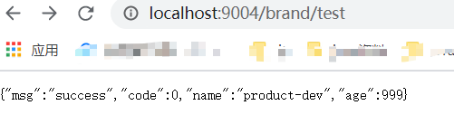

## Spring Cloud

在第三章我们已经实现了：

* 基于Maven的五个Spring Boot 模块项目
* 整合Nexus包管理中心
* 五个Spring Boot 模块与MybatisPlus的整合

> 微服务 : 
>
> ①  项目将不同的业务分为不同或者相同的单体Spring Boot项目.
>
> ②  为管理多个不同的或者相同的单体Spring Boot项目应运而生的一套技术解决方案|技术生态 
>
> > 因此接下来我们需要做的是 ： 整合Spring Cloud技术方案来管理 众多的单体项目。


| 技术     | 作用                   | 落地者              |
| -------- | ---------------------- | ------------------- |
| Nacos    | 注册中心               | SpringCloud Alibaba |
| Nacos    | 配置中心               | SpringCloud Alibaba |
| Ribbon   | 负载均衡               | SpringCloud         |
| Feign    | 服务远程调用(HTTP)     | SpringCloud         |
| Sentinel | 服务限流 - 降级 - 熔断 | SpringCloud Alibaba |
| Gateway  | API网关                | SpringCloud         |
| Sleuth   | 调用链监控             | SpringCloud         |
| Seata    | 分布式事务解决方案     | SpringCloud Alibaba |


## 版本选择

**大版本映射**

| **Spring Boot Version**                | **Spring Cloud Alibaba Version** | **Spring Cloud Version** |
| -------------------------------------- | -------------------------------- | ------------------------ |
| 2.4.X.RELEASE                          |                                  | 2020.0.x aka Ilford      |
| 2.2 \| 2.3.RELEASE (Starting with SR5) | 2.2.5.RELEASE                    | Spring Cloud Hoxton      |
| 2.1.X.RELEASE                          | 2.1.0.RELEASE                    | Spring Cloud Greenwich   |
| 2.0.X.RELEASE                          | 2.0.0.RELEASE                    | Spring Cloud Finchley    |
| 1.5.X.RELEASE                          | 2.0.0.RELEASE                    | Spring Cloud Edgware     |

我这里SpringBoot版本为==2.3.7.RELEASE== 所以SpringCloud版本选择==Spring Cloud Hoxton SR9==

因为SpringCloud Alibaba 官网给定最新版SpringBoot 2.3.2的匹配版本为==2.2.5.RELEASE==。因此这里使用2.2.5

> 阿里巴巴官网 : https://github.com/alibaba/spring-cloud-alibaba/wiki/%E7%89%88%E6%9C%AC%E8%AF%B4%E6%98%8E


## gulimall-Common控制SpringBoot、SpringCloud、SpringCloudAlibaba版本

> 一些基础依赖或者功能都放入到Common服务中。

1. `gulimall-Common`服务pom中引入

	```xml
	<dependencyManagement>
	  <dependencies>
	    <dependency>
	      <groupId>org.springframework.boot</groupId>
	      <artifactId>spring-boot-dependencies</artifactId>
	      <version>${spring.boot.version}</version>
	      <type>pom</type>
	      <scope>import</scope>
	    </dependency>
	    <dependency>
	      <groupId>org.springframework.cloud</groupId>
	      <artifactId>spring-cloud-dependencies</artifactId>
	      <version>${spring.cloud.version}</version>
	      <type>pom</type>
	      <scope>import</scope>
	    </dependency>
	    <dependency>
	      <groupId>com.alibaba.cloud</groupId>
	      <artifactId>spring-cloud-alibaba-dependencies</artifactId>
	      <version>${spring.cloud.alibaba.version}</version>
	      <type>pom</type>
	      <scope>import</scope>
	    </dependency>
	  </dependencies>
	</dependencyManagement>
	```

	

## 整合SpringCloud Alibaba - - Nacos注册发现

1. `gulimall-Common服务`中引入Nacos注册发现依赖。

	```xml
	<!--服务注册发现-->
	<dependency>
	  <groupId>com.alibaba.cloud</groupId>
	  <artifactId>spring-cloud-starter-alibaba-nacos-discovery</artifactId>
	</dependency>
	```

2. 下载并启动Nacos 具体参考：MD-Book/Spring Cloud Alibaba/第一章-Nacos注册发现(Eureka服务注册发现).md

3. `gulimall-Coupon服务`yml中配置Nacos Server地址

	```yaml
	# Nacos 服务地址
	spring:  
	  cloud:
	    nacos:
	      discovery:
	        server-addr: 127.0.0.1:8848
	# 配置服务启动端口 我这里五个微服务依次为9001、9002、9003、9004、9005 注释掉每个微服务，application.properties文件中端口配置        
	server:
	  port: 9001       
	```

	> #这里使用`gulimall-Coupon服务`做演示。其他微服务(除Common)一样处理  1. 导包(Common基础包)   2. 配置yml   3. 注解开启

	> 使用阿里巴巴代理生成SpringBoot项目时候会默认生成application.properties文件，并且该文件中默认配置了项目名和端口号，删除该文件在yml文件中配置项目名和端口号
	>
	> ```yaml
	> spring:	
	> 	application:
	>   	name: 项目名
	> server:
	>   port: 端口号    	
	> ```

4. 开启服务注册发现 ==@EnableDiscoveryClient==

	```java
	@EnableDiscoveryClient
	@SpringBootApplication
	public class GulimallCouponApplication {
	    public static void main(String[] args) {
	        SpringApplication.run(GulimallCouponApplication.class, args);
	    }
	}
	```

5. 测试

	* 启动Nacos

		```bash
		sh startup.sh -m standalone
		```

	* 启动 演示服务 `gulimall-Coupon`

	* 浏览器访问 http://localhost:8848/nacos/#/login   用户名和密码默认为 ：nacos

	

	


## 整合SpringCloud  - - Feign远程调用

`效果:`

在`gulimall-Coupon服务`中调用`gulimall-Product服务`中的接口

> 需要在`gulimall-Coupon服务`中加入openFeign依赖。即A调用B 需要在A中加入openFeign依赖。


1. `gulimall-Coupon服务 `- - ==服务调用者==  中引入Feign远程调用依赖。

	```xml
	<!--远程调用-->
	<dependency>
	  <groupId>org.springframework.cloud</groupId>
	  <artifactId>spring-cloud-starter-openfeign</artifactId>
	</dependency>
	```

2. `gulimall-Product服务` - - ==服务提供者== 提供接口

	```java
	@RestController
	@RequestMapping("/brand")
	public class BrandController {
	    @Autowired
	    private BrandService brandService;
	
	    /**
	     * 远程调用接口  - -  测试
	     */
	    @RequestMapping("/feignTest")
	    public R feignTest(){
	        return R.ok().put("data", brandService.list());
	    }
	}
	```

	> <font color=ff00aa>注意：</font>这里可以参考jeecg-cloud平台，在 `gulimall-Product服务`项目中在新建两个模块，一个只负责提供服务之间的接口请求调用，另一个负责具体功能的实现

3. `gulimall-Coupon服务 `- - ==服务调用者==  编写接口(负责调用提供方方法) 

	```java
	package com.shuai.gulimall.coupon.feign;
	/**
	 * TODO:<p> 远程调用接口 - 负责调用 gulimall-Product服务中的方法 <p/>
	 *
	 * @package: com.shuai.gulimall.coupon.feign
	 * @Author mac
	 * @Date 2021/2/3 10:51 下午
	 * @Version V1.0
	 **/
	//todo 1. 向springCloud声明远程调用的 服务提供方  （这里必须是注册在Nacos中的服务名称 ：因为它会从Nacos中获取）
	@FeignClient("gulimall-Product")
	public interface ProductFeign {
	    //todo 2. 复制方法签名  （这里必须是完整签名 /brand/feignTest）
	    @RequestMapping("/brand/feignTest")
	    public R feignTest();
	}
	```

4. `gulimall-Coupon服务 `- - ==服务调用者==  开启远程调用功能

	```java
	@EnableFeignClients(basePackages = "com.shuai.gulimall.coupon.feign")
	@EnableDiscoveryClient
	@SpringBootApplication
	public class GulimallCouponApplication {
	    public static void main(String[] args) {
	        SpringApplication.run(GulimallCouponApplication.class, args);
	    }
	}
	```

	> 远程调用大多实现是在  ==服务调用者== 来进行配置的。==服务提供方== 只需要提供方法即可

5. 测试

	* Test

		```java
		@SpringBootTest
		class GulimallCouponApplicationTests {
		    @Autowired
		    ProductFeign productFeign;
		
		    @Test
		    public void feignTest(){
		      System.out.println(productFeign.feignTest().get("data"));
		    }
		}
		```

	* 结果

		```bash
		[{brandId=9, name=华为, logo=https://gulimall-hello.oss-cn-beijing.aliyuncs.com/2019-11-18/de2426bd-a689-41d0-865a-d45d1afa7cde_huawei.png, descript=华为, showStatus=1, firstLetter=H, sort=1}, {brandId=10, name=小米, logo=https://gulimall-hello.oss-cn-beijing.aliyuncs.com/2019-11-18/1f9e6968-cf92-462e-869a-4c2331a4113f_xiaomi.png, descript=小米, showStatus=1, firstLetter=M, sort=1}, {brandId=11, name=oppo, logo=https://gulimall-hello.oss-cn-beijing.aliyuncs.com/2019-11-18/5c8303f2-8b0c-4a5b-89a6-86513133d758_oppo.png, descript=oppo, showStatus=1, firstLetter=O, sort=1}, {brandId=12, name=Apple, logo=https://gulimall-hello.oss-cn-beijing.aliyuncs.com/2019-11-18/819bb0b1-3ed8-4072-8304-78811a289781_apple.png, descript=苹果, showStatus=1, firstLetter=A, sort=1}, {brandId=13, name=华为, logo=null, descript=null, showStatus=null, firstLetter=null, sort=null}]
		```

		

## 整合SpringCloud  - - Nacos配置中心

>   目标 ： 在Nacos中修改配置文件可以达到项目中同步修改，不需要重新部署项目

1. 导包

	> 每个服务都会用到`注册发现`与`配置中心`,放到`gulimall-Common`中

	```xml
	 <!--服务配置中心-->
	<dependency>
	    <groupId>com.alibaba.cloud</groupId>
	    <artifactId>spring-cloud-starter-alibaba-nacos-config</artifactId>
	</dependency>
	```

### 简单使用

>   这里使用 ==gulimall-Product==进行测试。

1.  application.properties中写入

    ```properties
    product.name=kaka
    product.age=999
    ```

2.  **.controller类中写入

    ```java
    @Value("${product.name}")
    private String name;
    @Value("${product.age}")
    private Integer age;
    
    @RequestMapping("/test")
    public R test(){
        return R.ok().put("name", name).put("age",age);
    }
    ```

3.  测试


### 配置中心-简单使用

1.  Nacos中新建配置文件


2.  将application.properties内容拷贝到此配置文件中

3.  新建bootstrap.properties

    ```bash
    # bootstrap级别高于application配置文件。告知服务去配置中心加载配置文件
    # 指定服务名称
    spring.application.name=gulimall-Product
    # 指定配置中心IP
    spring.cloud.nacos.config.server-addr=127.0.0.1:8848
    # 指定分组
    # spring.cloud.nacos.config.namespace=gulimall-Product
    ```

4.  测试


>   这个时候访问配置中心中的配置文件是可以了，但是还没有达到修改配置文件后项目配置实时修改的目的。
>
>   在需要实时刷新配置的类添加注解   @RefreshScope   并且优先使用配置中心的配置文件


### 配置中心-命名空间 | 分组

>   用作配置文件隔离、分组。例如每个项目使用一个命名空间。每个服务使用一个命名空间。或者基于 生产环境、测试环境、上线环境进行分组
>
>   我这里使用规则是 每个微服务创建一个命名空间。然后在每个命名空间创建三个分组 dev 、test 、prop

*   修改  bootstrap.properties

```properties
# 指定服务名称
spring.application.name=gulimall-Product
# 指定配置中心IP
spring.cloud.nacos.config.server-addr=127.0.0.1:8848
# 指定命名空间
spring.cloud.nacos.config.namespace=a6a0e177-7c9b-4e2a-9cb9-e41023b23312
# 指定分组
spring.cloud.nacos.config.group=dev
# 指定配置文件类型
spring.cloud.nacos.config.file-extension=properties
```


*   测试




### 加载多个配置集

>   上面我们使用了多个命名空间，且每个空间下有三个分组。但是这种情况使我们把每个服务下的所有配置信息都放到了一个配置文件中进行加载。我们又如何在一个微服务中一个分组中使用多个配置文件呢？

1.  新建多个配置集

    ```yaml
    #datasource.yml
    spring:
      datasource:
        url: jdbc:mysql://192.168.124.3:3306/gulimall_pms?useUnicode=true&characterEncoding=UTF-8
        username: root
        password: root
        driver-class-name: com.mysql.jdbc.Driver
    ```

    ```yaml
    # mybatis.yml
    mybatis-plus:
      mapper-locations: classpath:/mapper/**/*.xml
      global-config:
        db-config:
          id-type: auto
    ```

    ```yaml
    # spring.yml
    spring:
      cloud:
        nacos:
          discovery:
            server-addr: 127.0.0.1:8848
      application:
        name: gulimall-Product
    
    server:
      port: 9004
    ```

2.  修改bootstrap.properties

    ```properties
    # 指定服务名称
    spring.application.name=gulimall-Product
    # 指定配置中心IP
    spring.cloud.nacos.config.server-addr=127.0.0.1:8848
    # 指定命名空间
    spring.cloud.nacos.config.namespace=a6a0e177-7c9b-4e2a-9cb9-e41023b23312
    # 指定分组
    #spring.cloud.nacos.config.group=dev
    # 指定配置文件类型
    #spring.cloud.nacos.config.file-extension=properties
    
    # 加载多个配置集
    # 配置文件
    spring.cloud.nacos.config.ext-config[0].data-id=mybatis.yml
    # 分组
    spring.cloud.nacos.config.ext-config[0].group=dev
    # 是否刷新
    spring.cloud.nacos.config.ext-config[0].refresh=true
    
    spring.cloud.nacos.config.ext-config[1].data-id=datasource.yml
    spring.cloud.nacos.config.ext-config[1].group=dev
    spring.cloud.nacos.config.ext-config[1].refresh=true
    
    spring.cloud.nacos.config.ext-config[2].data-id=spring.yml
    spring.cloud.nacos.config.ext-config[2].group=dev
    spring.cloud.nacos.config.ext-config[2].refresh=true
    ```

3.  测试


### 项目调整

1.  删除application.yml 、application.properties配置文件。

2.  bootstrap.properties 内容如下

    ```properties
    
    # 指定服务名称
    spring.application.name=gulimall-Product
    # 指定配置中心IP
    spring.cloud.nacos.config.server-addr=127.0.0.1:8848
    # 指定命名空间
    spring.cloud.nacos.config.namespace=a6a0e177-7c9b-4e2a-9cb9-e41023b23312
    # 指定分组
    #spring.cloud.nacos.config.group=dev
    # 指定配置文件类型
    #spring.cloud.nacos.config.file-extension=properties
    
    # 加载多个配置集
    # 配置文件
    spring.cloud.nacos.config.ext-config[0].data-id=mybatis.yml
    # 分组
    spring.cloud.nacos.config.ext-config[0].group=dev
    # 是否刷新
    spring.cloud.nacos.config.ext-config[0].refresh=true
    
    spring.cloud.nacos.config.ext-config[1].data-id=datasource.yml
    spring.cloud.nacos.config.ext-config[1].group=dev
    spring.cloud.nacos.config.ext-config[1].refresh=true
    
    spring.cloud.nacos.config.ext-config[2].data-id=spring.yml
    spring.cloud.nacos.config.ext-config[2].group=dev
    spring.cloud.nacos.config.ext-config[2].refresh=true
    
    # 测试
    spring.cloud.nacos.config.ext-config[3].data-id=other.yml
    spring.cloud.nacos.config.ext-config[3].group=test
    spring.cloud.nacos.config.ext-config[3].refresh=true
    ```

3.  其他四个微服务一样处理


## 整合SpringCloud- - Gateway网关

>   API网关是一个服务器，是系统的唯一入口。从面向对象设计的角度看，它与外观模式类似。API网关封装了系统内部架构，为每个客户端提供一个定制的API。它可能还具有其它职责，如身份验证、监控、负载均衡、缓存、请求分片与管理、静态响应处理。API网关方式的核心要点是，所有的客户端和消费端都通过统一的网关接入微服务，在网关层处理所有的非业务功能。通常，网关也是提供REST/HTTP的访问

网关应当具备以下功能：

-   性能：API高可用，负载均衡，容错机制。
-   安全：权限身份认证、脱敏，流量清洗，后端签名（保证全链路可信调用）,黑名单（非法调用的限制）。
-   日志：日志记录（spainid,traceid）一旦涉及分布式，全链路跟踪必不可少。
-   缓存：数据缓存。
-   监控：记录请求响应数据，api耗时分析，性能监控。
-   限流：流量控制，错峰流控，可以定义多种限流规则。
-   灰度：线上灰度部署，可以减小风险。
-   路由：动态路由规则。


`概念`

**Route** ： 路由是网关的基本组件。它由ID、目标URI、谓词集合和过滤器集合定义。如果聚合谓词为true，则匹配路由

**Predicate** ： This is a Java 8 Function Predicate

**Filter** ： 是GatewayFilter的一个实例，在这里，可以在发送下游请求之前或之后修改请求和响应

`流程`

!

>   客户端向Spring Cloud Gateway发出请求。如果Gateway Handler Mapping确定请求与路由匹配，则将其发送给Gateway Web Handler。这个Handler运行通过特定于请求的过滤器链发送请求。过滤器可以在发送代理请求之前或之后执行逻辑。执行所有的“pre”过滤逻辑，然后发出代理请求，最后执行“post”过滤逻辑。
>
>   >   其中路由和过滤器有很多种，可以适配不同的请求以及处理不同的逻辑。具体可参考：


`流程`

1.  新建`gulimall-Gateway`服务

2.  加入`gulimall-Common`

3.  加入nexus依赖和gateway依赖

    ```xml
    <dependency>
        <groupId>org.springframework.cloud</groupId>
        <artifactId>spring-cloud-starter-gateway</artifactId>
    </dependency>
    ```

4.  root项目中加入`gulimall-Gateway模块`

5.  启动类加入 @EnableDiscoveryClient 注解

6.  服务配置Nacos服务注册中心地址

    *   新建命名空间 ==Gateway==

    *   添加三个分组配置文件 gulimall-Gateway.yml

        ```yaml
        spring:
          cloud:
            nacos:
              discovery:
                server-addr: 127.0.0.1:8848
          application:
            name: gulimall-Gateway
        
        server:
          port: 88
        ```

    *   新建bootstrap.properties配置文件并填写

        ```properties
        # 指定服务名称
        spring.application.name=gulimall-Gateway
        # 指定配置中心IP
        spring.cloud.nacos.config.server-addr=127.0.0.1:8848
        # 指定命名空间
        spring.cloud.nacos.config.namespace=c3bc7f76-0870-4464-acbd-5f7b043c3333
        # 指定分组
        spring.cloud.nacos.config.group=dev
        # 指定配置文件类型
        spring.cloud.nacos.config.file-extension=yml
        ```

7.  排除网关中mybatis自动配置

    >   在引入common包是有mybatis包，springboot会自动引入mybatis相关配置，因此会报错，所以在网关服务中心排除掉mybatis自动

    ```java
    # 启动类中添加参数
    @SpringBootApplication(exclude = DataSourceAutoConfiguration.class)
    ```

