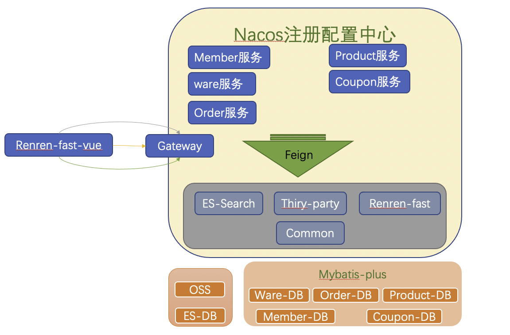
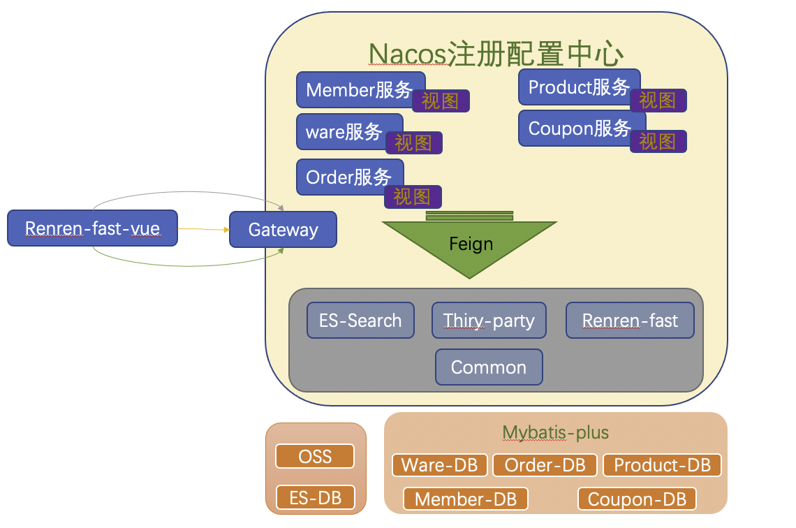
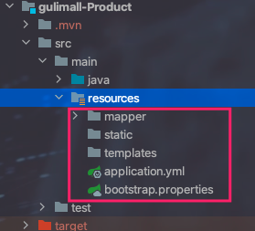
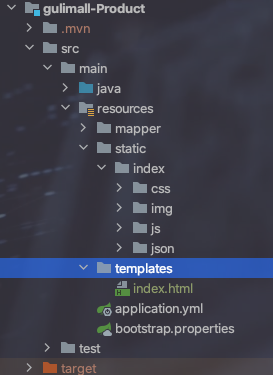
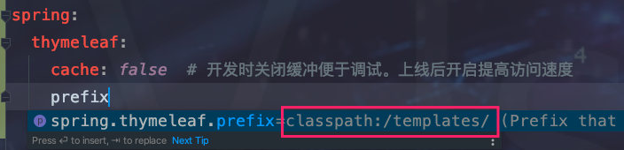
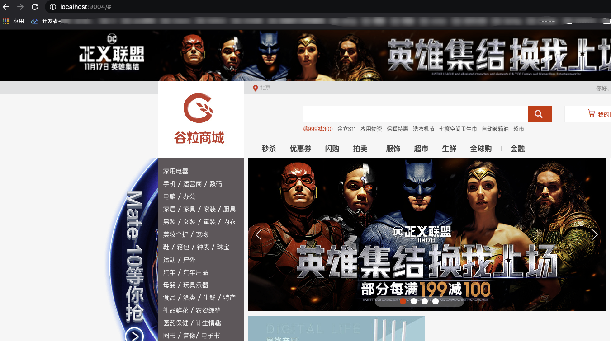
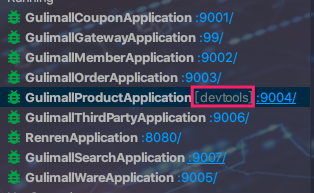
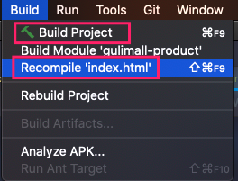

`引言:`

​	在基础篇中也涉及到了前端开发，并且使用的是renren-fast-vue进行二次快速开发。下面是目前的项目架构。




> 目前整个项目中缺少 前端项目。这个前端项目并不是之前的后台管理项目，而是面向用户的前端项目。
>
> 1. 首先能想到的是 新建一个前端工程，类似于后台管理项目renren-fast-vue这种。 这样做的好处就是前后端分离。更容易实现动静分离。
> 2. 再有一种就是，我们目前各个微服务可以一个个单体部署开发以及维护。也可以将前端项目中分为各个模块【即静态文件直接放到每个服务中，构成一个小的springboot项目】，对应每个微服务。如下图：




## 整合前端项目 - Thymeleaf

`模板引擎`

* JSP ：早些年比较主流的模板引擎。jsp文件，浏览器不可直接打开。
* Thymeleaf ：springboot 官方推荐，html页面，浏览器可直接打开。

`前后端分离`

> 近些年趋势，框架有vue、regular等。主要使用UI组件库。将vue项目打包后生成静态html、js等文件。每个vue文件都会生成一个js文件。

### 以`gulimall-Product`整合Thymeleaf举例

1. 导入依赖

	```xml
	<!-- 模板引擎 -->
	<dependency>
	  <groupId>org.springframework.boot</groupId>
	  <artifactId>spring-boot-starter-thymeleaf</artifactId>
	</dependency>
	```

2. 导入静态资源文件

	

	> 其中static 文件夹存放前端静态文件。template存放首页等html页面。

	

3. SpringBoot中配置Thymeleaf

	```xml
	spring:
	  thymeleaf:
	    cache: false  # 开发时关闭缓冲便于调试。上线后开启提高访问速度
	```

	

	```java
	public class ThymeleafProperties {
	    private static final Charset DEFAULT_ENCODING;
	    public static final String DEFAULT_PREFIX = "classpath:/templates/";
	  	public static final String DEFAULT_SUFFIX = ".html";
	}
	```

	> <font color=ff00aa>SpringBoot 默认访问thymeleaf前缀为 classpath:/templates/ 后缀为.html   这也就是为什么要将index.html放到templates下的原因。</font>

	

4. 新建包web 处理页面跳转以及自己服务下的页面对应的后台逻辑

5. 启动 访问端口 

	

	> 之所以能放到是因为springboot为我们做了类路径下index.html默认访问
	>
	> SpringBoot 默认访问首页机制
	>
	> ```java
	> // WebMvcAutoConfiguration.java
	> 
	> private Optional<Resource> getWelcomePage() {
	>   String[] locations = WebMvcAutoConfiguration.getResourceLocations(this.resourceProperties.getStaticLocations());
	>   return Arrays.stream(locations).map(this::getIndexHtml).filter(this::isReadable).findFirst();
	> }
	> 
	> private Resource getIndexHtml(String location) {
	>   return this.resourceLoader.getResource(location + "index.html");
	> }
	> 
	> private static final String[] CLASSPATH_RESOURCE_LOCATIONS = new String[]{"classpath:/META-INF/resources/", "classpath:/resources/", "classpath:/static/", "classpath:/public/"};
	> ```


## `gulimall-Product`首页编写

* 上面我们 访问首页路径为 location:9004 ,但是我们需要实现location:9004/index.html 也能跳转到首页
* 上面静态数据都是死数据，我们需要查询并填充


`后端`

* 一级菜单栏一级首页访问

	```java
	//package com.shuai.gulimall.product.web;
	@Controller
	public class IndexController {
	
	    @Autowired
	    private CategoryService categoryService;
	
	    @GetMapping({"/","/index.html"})
	    public String indexPage(Model model){
	        //todo 1.查出所有的一级分类
	        List<CategoryEntity> categoryEntities = categoryService.getLeave1Categorys();
	
	
	        model.addAttribute("categorys", categoryEntities);
	        //"classpath:/templates/";  ".html";
	        return "index";
	    }
	
	}
	```

	```java
	@Override
	public List<CategoryEntity> getLeave1Categorys() {
	  List<CategoryEntity> categoryEntities = baseMapper.selectList(new QueryWrapper<CategoryEntity>().eq("parent_cid", 0));
	  return categoryEntities;
	}
	```

* 二级三级菜单栏数据编写

	```java
	@GetMapping("/index/catalog.json")
	@ResponseBody //将返回的值以json格式的数据返回
	public Map<String,List<Category2Vo>> categoryJson() {
	  return categoryService.getCategoryJson();
	}
	```

	```java
	@Override
	public Map<String, List<Category2Vo>> getCategoryJson() {
	  // 一级分类
	  // TODO 遍历了两次
	  List<CategoryEntity> allCategory = this.baseMapper.selectList(null);
	  return findCategoryJson(allCategory, 0L);
	}
	private Map<String, List<Category2Vo>> findCategoryJson(List<CategoryEntity> allCateGory, Long parentCategoryId) {
	  return allCateGory.stream()
	    .filter(category -> {
	      return category.getParentCid() == parentCategoryId;
	    })
	    .collect(Collectors.toMap(k -> k.getCatId().toString(), v -> {
	      // 2 级
	      return allCateGory.stream()
	        .filter(level2 -> {
	          return level2.getParentCid() == v.getCatId() ;
	        })
	        .map(level2 -> {
	          Category2Vo category2Vo = new Category2Vo();
	          category2Vo.setId(level2.getCatId().toString());
	          category2Vo.setCategory1Id(v.getCatId().toString());
	          category2Vo.setName(level2.getName());
	          // 三级分类
	          List<Category3Vo> collect = allCateGory.stream()
	            .filter(level3 -> {
	              return level3.getParentCid() == level2.getCatId() ;
	            }).map(level3 -> {
	            Category3Vo category3Vo = new Category3Vo();
	            category3Vo.setCategory2Id(level2.getCatId().toString());
	            category3Vo.setId(level3.getCatId().toString());
	            category3Vo.setName(level3.getName());
	            return category3Vo;
	          }).collect(Collectors.toList());
	          category2Vo.setCategory3List(collect);
	          return category2Vo;
	        }).collect(Collectors.toList());
	    }));
	
	}
	```

	


`前端 html中使用thymeleaf`

> https://www.thymeleaf.org/documentation.html

1. index.html引入命名空间

	```html
	<html xmlns:th="http://www.thymeleaf.org">
	```

2. 一级菜单栏   删除之前假数据，使用模板引擎提供的标签语法填充数据

	```html
	 <ul>
	   <li th:each="category :${ categories }">
	     <a href="static/#" class="header_main_left_a" ctg-data="3" th:attr="ctg-data=${category.catId}"   ><b th:text="${category.name}">家用电器</b></a>
	   </li>
	</ul>
	```

3. 二级三级菜单栏   前端使用ajax请求本地json文件来获取之后的数据进行开发。我们只需要修改请求为后台请求地址然后返回对应json文件格式的数据即可

	```js
	 $.getJSON("index/catalog.json",function (data) {}
	```

	


## `gulimall-Product`热部署

1. 引入依赖devtools

	```xml
	<!-- 热部署 -->
	<dependency>
	  <groupId>org.springframework.boot</groupId>
	  <artifactId>spring-boot-devtools</artifactId>
	  <optional>true</optional>
	</dependency>
	```

2. 调试模式启动项目

	

3. 重新编译

	

	> 如果只改动了一个文件 则可以选择下面的红框选项