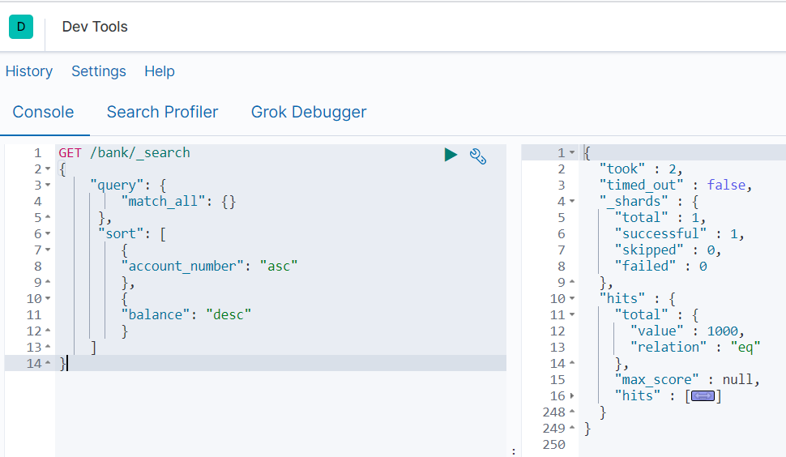

## 进阶使用

>   保存官方给定示例数据 ： https://github.com/elastic/elasticsearch/edit/master/docs/src/test/resources/accounts.json


ES 支持两种基本方式检索：

-   一个是通过使用 `REST request URI` 发送搜索参数(`uri+检索参数`)
-   另一个是通过使用 `REST requestbody` 来发送它们(`uri+请求体`)  也叫 `Query DSL`

### 1、检索信息

一切检索从_search开始

*   查询多个类型

    ```bash
    GET /twitter/tweet,user/_search?q=user:kimchy
    ```

*   查询多个索引

    ```bash
    GET /kimchy,elasticsearch/tweet/_search?q=tag:wow
    ```

*   查询所有索引/所有索引所有类型 : `_all`

    ```bash
    # 查询所有索引所有类型数据
    GET /_all/_search?q=type:ui-metric
    GET /_search
    ```

*   请求URL中参数(排序、limit、超时时间等等)可参考：https://www.elastic.co/guide/en/elasticsearch/reference/6.0/search-uri-request.html

`uri+检索参数`:

| 请求或返回                                | 解释                                                     |
| ----------------------------------------- | -------------------------------------------------------- |
| GET bank/_search                          | 检索 bank 下所有信息,包括 type 和 docs                   |
| GET /bank/_search?q=age:36 AND gender:"M" | 请求参数方式检索                                         |
| 响应结果解释：                            |                                                          |
| took                                      | Elasticsearch执行搜索的时间(臺秒)                        |
| time_out                                  | 告诉我们搜索是否超时                                     |
| _shards                                   | 告诉我们多少个分片被搜索了,以及统计了成功/失败的搜索分片 |
| hits                                      | 搜索结果                                                 |
| hits.total                                | 搜索结果                                                 |
| hits.hits                                 | 实际的搜索结果数组(默认为前10的文档)                     |
| sort                                      | 结果的排序 key (键) (没有则按 score 排序)                |
| score 和 max_score                        | 相关性得分和最高得分(全文检索用)                         |


### 2、 Query DSL

>   请求体中参数(大小、偏移量、超时、缓存等)可参考 ：https://www.elastic.co/guide/en/elasticsearch/reference/6.0/search-request-body.html

```bash
GET /bank/_search
{
    "query": {
        "match_all": {}
     },
     "sort": [
        {
        "account_number": "asc"
        },
        {
        "balance": "desc"
        }
    ]
}
```

