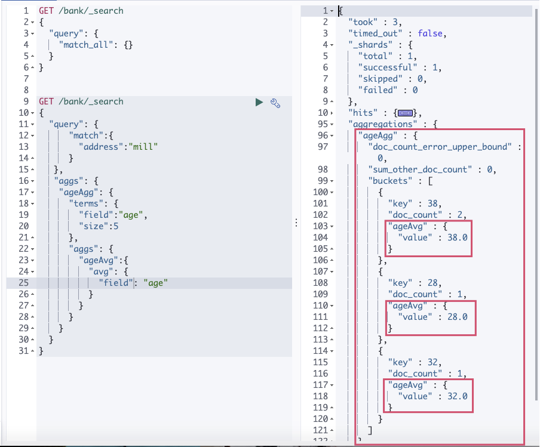

## 进阶使用

>   保存官方给定示例数据 ： https://github.com/elastic/elasticsearch/edit/master/docs/src/test/resources/accounts.json


ES 支持两种基本方式检索：

-   一个是通过使用 `REST request URI` 发送搜索参数(`uri+检索参数`)
-   另一个是通过使用 `REST requestbody` 来发送它们(`uri+请求体`)  也叫 `Query DSL`

## 1、检索信息

一切检索从_search开始

*   查询多个类型

    ```bash
    GET /twitter/tweet,user/_search?q=user:kimchy
    ```

*   查询多个索引

    ```bash
    GET /kimchy,elasticsearch/tweet/_search?q=tag:wow
    ```

*   查询所有索引/所有索引所有类型 : `_all`

    ```bash
    # 查询所有索引所有类型数据
    GET /_all/_search?q=type:ui-metric
    GET /_search
    ```

*   请求URL中参数(排序、limit、超时时间等等)可参考：https://www.elastic.co/guide/en/elasticsearch/reference/6.0/search-uri-request.html

`uri+检索参数`:

| 请求或返回                                | 解释                                                     |
| ----------------------------------------- | -------------------------------------------------------- |
| GET bank/_search                          | 检索 bank 下所有信息,包括 type 和 docs                   |
| GET /bank/_search?q=age:36 AND gender:"M" | 请求参数方式检索                                         |
| 响应结果解释：                            |                                                          |
| took                                      | Elasticsearch执行搜索的时间(臺秒)                        |
| time_out                                  | 告诉我们搜索是否超时                                     |
| _shards                                   | 告诉我们多少个分片被搜索了,以及统计了成功/失败的搜索分片 |
| hits                                      | 搜索结果                                                 |
| hits.total                                | 搜索结果                                                 |
| hits.hits                                 | 实际的搜索结果数组(默认为前10的文档)                     |
| sort                                      | 结果的排序 key (键) (没有则按 score 排序)                |
| score 和 max_score                        | 相关性得分和最高得分(全文检索用)                         |


## 2、 Query DSL

>   请求体中参数(大小、偏移量、超时、缓存等)可参考 ：https://www.elastic.co/guide/en/elasticsearch/reference/6.0/search-request-body.html>

> * 只要是文本内容默认都会分词，除非查询时指定不分词
>
> * 每个文本属性都会有一个keyword属性用于精确匹配

* 单条件查询

	```bash
	# 单条件查询   match_all、match、match_phrase、multi_match在query中只能只用一个
	GET /bank/_search
	{																							#查询体
	    "query": {
	        "match_all": {},											#查询所有
	        "match":{															#模糊查询(分词匹配) -- 倒排索引  --  相关性得分 
	        	"address":"mill"										 
	        },
	        "match_phrase":{											#全词匹配(不进行分词) 和 "match":{"address.keyword":"mill lane"}效果一样
	        	"address":"mill lane"								
	        },
	        "multi_match":{												#多个字段匹配，多个字段为  或  符合一个就可以 （字段会进行分词匹配）
	        	"query":"mill movico",							#字段中address 或者 city 任意包含mill或者movico则返回
	        	"fields":["address","city"]					
	        },
	     },
	     "sort": [																#排序
	        {
	        "account_number": "asc"
	        },
	        {
	        "balance": "desc"
	        }
	    ],
	    "from":5,   															#偏移量
	    "size":10,																#查询数据容量，这两个可用作分页
	    "_source":["age","gender"]													#筛选返回数据
	}
	```

* 多条件查询

	```bash
	#多条件查询
	GET /bank/_search
	{																							
	    "query": {
	        "bool":{																#多条件查询
	        	"must":[															#全部满足匹配条件
	        		{"match":{
	        			"gender":"M"
	        		}},
	        		{"match":{
	        			"address":"mill"
	        		}}
	        	],
	        	"must_not":{													#全部不要满足匹配条件
	        		{"match":{
	        			"age":18
	        		}}
	        	},
	        	"should"{															#有没有此查询条件都可以，相关性得分最低
	        		{"match":{
	        			"lastname":"wallace"
	        		}}
	        	}
	        }
	     }
	}
	
	#非文本字段使用term   不会分词，查询准确
	#文本检索使用match		文本会进行分词
	```

* 过滤

	```bash
	#过滤
	GET /bank/_search
	{																							
	    "query": {
	      "match":{
	     	 "age":{
	     	 		"gte":18,
	     	 		"lte":30
	     	 }
	      }
	     }
	}
	```

	

* 聚合 

	> 从数据中分组和提取数据  类似于SQL中的 group by 和cont等。先使用数据查询后对查询到的数据进行聚合处理
	>
	> 聚合类型：https://www.elastic.co/guide/en/elasticsearch/reference/current/getting-started-aggregations.html

	`示例:`

	* 多个聚合操作同一个查询数据集

	```bash
	# 聚合ageAgg和聚合ageAvg同操作query查询后的数据集
	GET /bank/_search
	{																		
	  "query": {
	      "match":{
	      	"address":"mill"										
	      }
	   },
	   "aggs": {
	    "ageAgg": {															# 为此聚合自定义名称
	      "terms": { 														# 聚合操作类型 ： 分组
	        "field":"age",
	        "size":5
	      } 
	    },
	    "ageAvg":{															# 为此聚合自定义名称
	      "avg": {															# 聚合操作类型 ： 平均值
	        "field": "age"
	      }
	    }
	  }
	}
	```

	

	* 聚合操作聚合后的数据

		```bash
		# 聚合ageAgg操作query查询后的数据集,而聚合ageAvg操作ageAgg聚合后的数据
		GET /bank/_search
		{																		
		  "query": {
		      "match":{
		      	"address":"mill"										
		      }
		   },
		   "aggs": {
		    "ageAgg": {														
		      "terms": { 													
		        "field":"age",
		        "size":5
		      },
		      "aggs": {
		        "ageAvg":{															
		          "avg": {															
		            "field": "age"
		          }
		        }
		      }
		    }
		  }
		}
		```

		


* 映射

	> 类似于数据库中字段类型，ES7之后移除了类型，因此索引下直接就是文档。
	>
	> 第一次我们村  官方给定 数据时  并没有指定类型，因为ES默认会识别数据中字段类型(数字lang，字符串 text)
	>
	> 字段类型：https://www.elastic.co/guide/en/elasticsearch/reference/current/mapping-fields.html
	>
	> 字段参数(例如控制字段是否能被检索) ： https://www.elastic.co/guide/en/elasticsearch/reference/current/mapping-params.html

	* 查看映射

		```bash
		GET /索引/_mapping
		```

		

	* 创建索引并编写映射

		```bash
		PUT /my-index
		{
		  "mappings": {
		    "properties": {
		      "age":    { "type": "integer" },  
		      "email":  { "type": "keyword"  }, 
		      "name":   { "type": "text"  }     
		    }
		  }
		}
		```

		

	* 添加索引映射

		```bash
		PUT /my-index/_mapping
		{
		  "properties": {
		    "newFiele": {
		      "type": "keyword",
		      "index": false													#映射字段参数：是否用以被检索
		    }
		  }
		}
		```

		

	* 更新映射

		> 不能修改映射，否则之前的数据类型都会发生变化。如果非要修改映射则只能通过   新建索引   添加映射  数据迁移

		* 创建新索引

			```basn
			PUB /newbank
			```

		* 复制旧索引的映射并修改

			```bash
			# 将age、balance、gender 添加keyword属性，修改为精确匹配。
			# 将address、firstname、lastname去掉keyword属性，修改为全局匹配
			```

		* 数据迁移

			`格式:`

			```bash
			#ES7版本之后
			POST _reindex
			{
			  "source": {
			    "index": "my-index-000001"
			  },
			  "dest": {
			    "index": "my-new-index-000001"
			  }
			}
			#ES6及之前
			POST _reindex
			{
			  "source": {
			    "index": "my-index-000001",
			    "type":"tweet"
			  },
			  "dest": {
			    "index": "my-new-index-000001"
			  }
			}
			```

		

