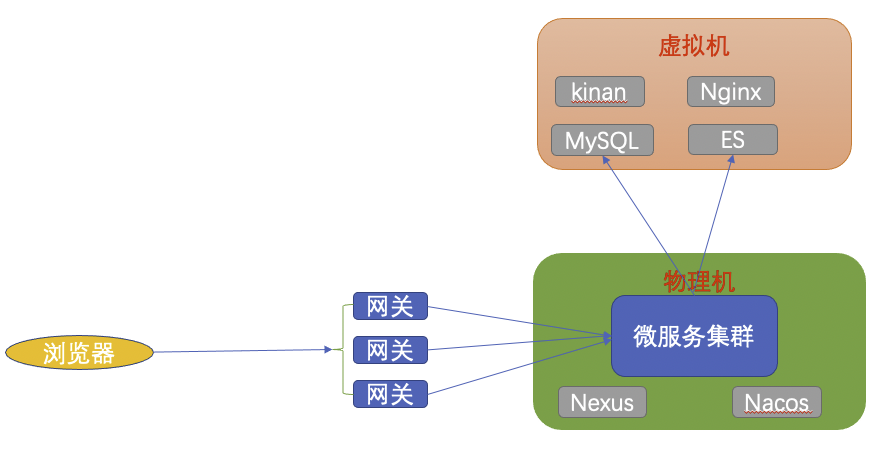
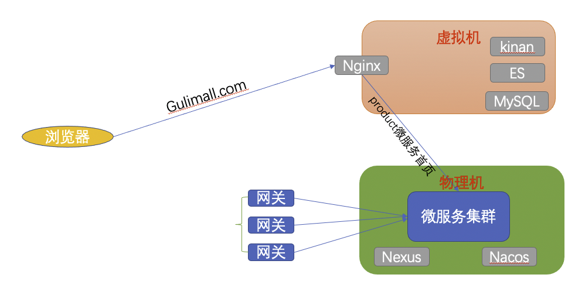
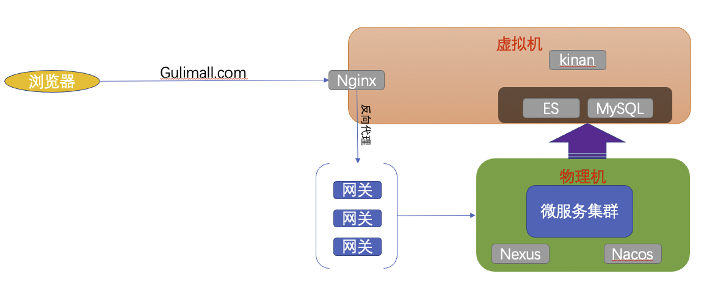
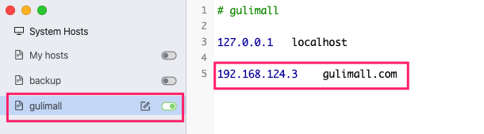
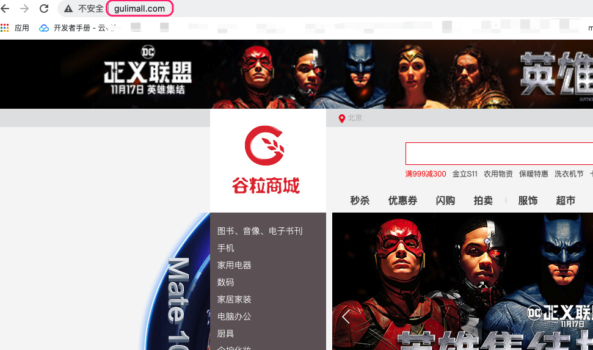

`当前访问环境`

* nginx、es、kibana、MySQL部署在虚拟机中
* nexus、nacos、项目网关等都部署物理机

`当前访问流程`




`域名访问环境-基础版`



* > 缺点 ： 
	>
	> * 没有经过网关，对以后的限流鉴权等造成了麻烦，也不符合网关处理所有请求的设计理念。
	> * nginx中配置的都是固定IP，如果以后是集群并且IP经常概念，很麻烦。并且也抛弃了nacos服务注册中心的设计理念。


`域名访问环境-进阶版`




## 实现流程  ：域名访问环境-基础版

1. 修改物理机host

	

2. Nginx将gulimall.com域名的请求反向代理到物理机访问`gulimall-Product`服务中的首页

	* docker镜像中安装vim 可参考 ：MD-Book/Docker/Docker操作/Docker安装vim以及更换源.md

	* 修改Nginx配置

		```bash
		docker exec -it nginx /bin/bash
		cd /etc/nginx/conf.d/
		cp default.conf gulimall.conf
		vim gulimall.conf 
		cat gulimall.conf 
		```

		```bash
		server {
		    listen       80;
		    listen  [::]:80;
		    server_name  gulimall.com;
		
		    #charset koi8-r;
		    #access_log  /var/log/nginx/host.access.log  main;
		
		    location / {
		        proxy_pass http://192.168.124.8:9004;  #本机IP地址以及Product微服务端口 
		    }
		
		    #error_page  404              /404.html;
		
		    # redirect server error pages to the static page /50x.html
		    #
		    error_page   500 502 503 504  /50x.html;
		    location = /50x.html {
		        root   /usr/share/nginx/html;
		    }
		}
		```

		```bash
		exit
		docker restart nginx
		```

3. 物理机访问测试

	


## 实现流程  ：域名访问环境-进阶版

1. Nginx http块中配置服务器组  --  **集群实现**

	```bash
	vim nginx.conf   #这里在虚拟机中配置和docker容器中配置都行。可参考 MD-Book/Docker/第九章-Docker安装Nginx.md
	```

	```bash
	http {
	    include       /etc/nginx/mime.types;
	    default_type  application/octet-stream;
	
	    log_format  main  '$remote_addr - $remote_user [$time_local] "$request" '
	                      '$status $body_bytes_sent "$http_referer" '
	                      '"$http_user_agent" "$http_x_forwarded_for"';
	
	    access_log  /var/log/nginx/access.log  main;
	
	    sendfile        on;
	    #tcp_nopush     on;
	
	    keepalive_timeout  65;
	
	    #gzip  on;
	    #### 配置服务器组
	    upstream gulimall{
	        server 192.168.124.8:99; #如果有多个网关 则配置多个server即可
	    }   
	
	    include /etc/nginx/conf.d/*.conf;
	}
	```

2. gulimall.conf 访问服务器组 集群 即可。

	```bash
	server {
	    listen       80;
	    listen  [::]:80;
	    server_name  gulimall.com;
	
	    #charset koi8-r;
	    #access_log  /var/log/nginx/host.access.log  main;
	
	    location / {
	        #proxy_pass http://192.168.124.8:9004;   
	        proxy_pass http://gulimall;
	    }
	}
	```

3. 网关配置路由规则

	```xml
	# 放在最后
	- id: gulimall_host_route # 域名映射
	  uri: lb://gulimall-Product
	  predicates:
	  	- Host=**.gulimall.com   #gulimall.com域名下所有的请求
	```

4. nginx  gulimall.conf新增携带host配置

	```bash
	#gulimall.conf     nginx 将请求转发到网关时会丢掉很多东西包括Host以及cookie等。导致网关在收到反向代理请求后无法处理无host的请求
	server {
	    listen       80;
	    listen  [::]:80;
	    server_name  gulimall.com;
	
	    #charset koi8-r;
	    #access_log  /var/log/nginx/host.access.log  main;
	
	    location / {
	        #proxy_pass http://192.168.124.8:9004;   
	        proxy_set_header Host $host;
	        proxy_pass http://gulimall;
	    }
	}
	```

	

5. 重启测试

	```bash
	docker restart nginx
	```

	

