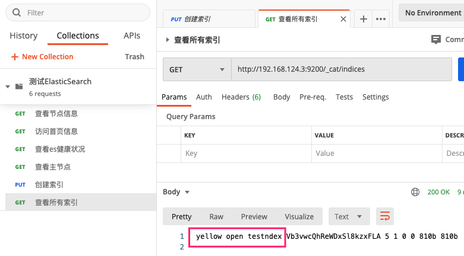
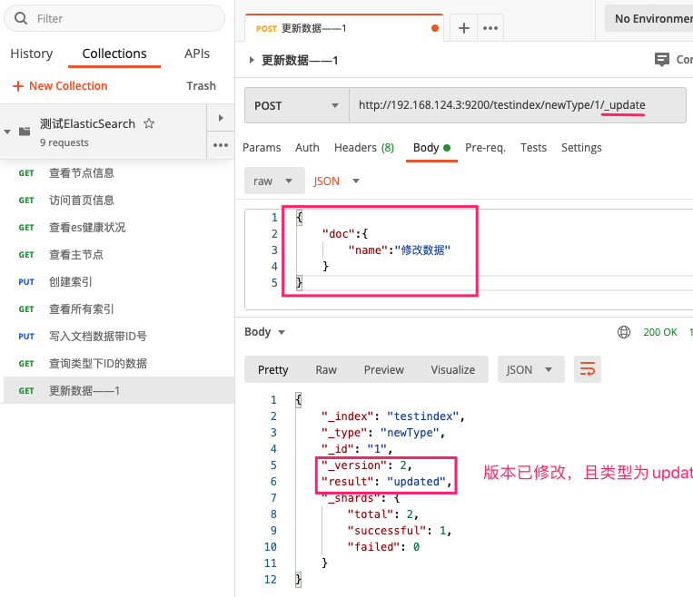

## Docker安装ElasticSearch和kibana

1. 拉取

	```bash
	docker pull elasticsearch:7.4.2
	docker pull kibana:7.4.2
	```

2. ElasticSearch数据卷

	```bash
	# 1. 在宿主机中创建配置文件以及数据文件
	mkdir -p /root/elasticsearch/config
	mkdir -p /root/elasticsearch/data
	# 2. 写入内容 :后面一定要有空格
	echo "http.host: 0.0.0.0" >> /root/elasticsearch/config/elasticsearch.yml
	# 3. 数据挂载
	docker run --privileged=true -p 9200:9200 -p 9300:9300 -e "discovery.type=single-node" -e ES_JAVA_OPTS="-Xms512m -Xmx512m" -v /root/elasticsearch/config/elasticsearch.yml:/usr/share/elasticsearch/config/elasticsearch.yml -v /root/elasticsearch/data:/usr/share/elasticsearch/data -v /root/elasticsearch/plugins:/usr/share/elasticsearch/plugins -d --name es elasticsearch:7.4.2
	```

3. 修改宿主机es目录权限

	```bash
	chmod -R 777 /root/elasticsearch/
	```

4. 访问 宿主机IP:9200

	


5. 使用postman测试ElasticSearch

	

	


6. 安装kibana可视化工具

	```bash
	# 这里的192.168.124.3切换为自己宿主机的IP地址。
	docker run --name kibana -e ELASTICSEARCH_HOSTS=http://192.168.124.3:9200 -p 5601:5601 -d kibana:7.4.2
	```

7. 访问 192.168.124.3:5610

	

	


## 初步检索

### 1、_cat

* GET /_cat/nodes  ：查看所有节点
* GET /_cat/health  ：查看es健康状况 
* GET /_cat/master ：查看主节点
* GET /_cat/indices ：查看所有索引(数据库)


### 2、创建一个索引(数据库)

```bash
# 索引名称不能有大写
PUT http://ip地址:9200/索引名称
```


### 3、写入文档(表中数据)

```bash
#如果ID号没有则随机生成一个
PUT|POST http://ip地址:9200/索引名称/类型名称/ID号
```

* 写入带ID号的数据


> * 带ID添加数据且没有同ID数据为新增，否则为更新
> * 不带ID添加数据随机生成ID，为新增
> * PUT和POST均可在类型中添加数据，但是PUT必须带ID否则报错，而POST可以不带


### 4、查询文档

```bash
GET http://ip地址:9200/索引名称/类型名称/ID号
```

* 查询到

	

	> 可能是我ES版本太低了，这里字段应该还包括
	>
	> 1. _seq_no:并发控制字段，用来做乐观锁
	> 2. _primary_term : 同上，主分片重新分配，如重启就会变化

* 没有查询到

	


### 5、更新文档

* 方式一：带update

	```bash
	POST http://ip地址:9200/索引名称/类型名称/ID号/_update
	{
		"doc":{
			"name":"修改数据"
		}
	}
	```

	* 第一次修改

		

	* 第二次修改

		

	> 即多次更新如果源数据没有发生变化则version不会变化，且result变为noop

* 方式二

	```bash
	POST http://ip地址:9200/索引名称/类型名称/ID号
	{
		"doc":"修改数据"
	}
	```

	> 多次修改后 _version  每次都增加  而result始终都是update  。即执行多少次则更新多少次

* 方式四

	```bash
	PUT http://ip地址:9200/索引名称/类型名称/ID号/_update
	{
		"doc":{
			"name":"修改数据"
		}
	}
	或者
	PUT http://ip地址:9200/索引名称/类型名称/ID号
	{
		"doc":"修改数据"
	}
	```


#### 新增属性

```bash
PUT http://ip地址:9200/索引名称/类型名称/ID号/_update
{
	"doc":{
		"name":"修改数据",
		"age":45
	}
}
或者
PUT http://ip地址:9200/索引名称/类型名称/ID号
{
	"doc":"修改数据",
	"age":45
}
```

> 将PUT换成POST	效果一样

#### 乐观锁

> 利用上面讲道的两个字段 ==_seq_no==和==_primary_term== ，数据有修改时就会变化。

更新数据是携带  ==?if_seq_no=1&if_primary_term=1==   

```bash
#这里的两个 1 应该为查出来的值
PUT http://ip地址:9200/索引名称/类型名称/ID号?if_seq_no=1&if_primary_term=1
{
	"doc":"修改数据",
	"age":45
}
```


### 6、删除文档&索引

```bash
#删除文档
DELETE http://ip地址:9200/索引名称/类型名称/ID号
#删除索引
DELETE http://ip地址:9200/索引名称
```


### 7、bulk批量API

```bash
POST http://ip地址:9200/索引名称/类型名称/_bulk
{"index":{"_id":"1"}}
{"name":"upup"}
{"index":{"_id":"2"}}
```


