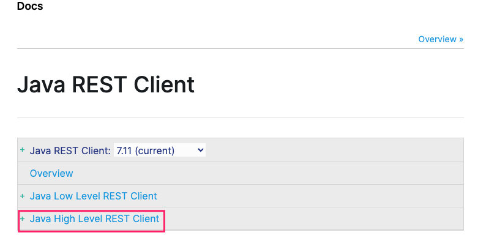

## 操作方式

1. 9300端口 ：TCP长连接 

	* spring-data-elasticsearch:transport-api.jar

		> springboot版本不同，transport-api.jar 包也不同，不能全适配ES
		>
		> ES 7.X已经不建议使用，ES 8以后要废弃 。和type同命运

2. 9200端口 ：HTTP

	* JestClient ：非官网、更新慢
	* RestTemplate ：模拟发送HTTP请求，但是ES很多操作都需要自己封装，麻烦，更别说 DSL了。
	* HttpClient : 同上
	* ElasticSearch-Rest-Client ： 官网提供的RestClient ，封装了ES操作，API层次分明、版本完全适配


> ElasticSearch-Rest-Client 官网 中给定有低阶和高阶版本，高阶相对于低阶，犹如 mybatis和jdbc一样。https://www.elastic.co/guide/en/elasticsearch/client/java-rest/current/java-rest-high.html 如下图





## SpringBoot整合ElasticSearch

1. 新建`gulimall-Search`微服务

2. root项目中添加 该微服务模块

3. pom文件中新增

	```xml
	<properties>
	  <spring-cloud.version>Hoxton.SR9</spring-cloud.version>
	  <!-- 修改 spring boot 自动依赖版本 和你安装的版本保持一致  如果Maven依赖版本冲突不好解决，直接使用7.6.2也可以-->
	  <elasticsearch.version>7.4.2</elasticsearch.version>
	</properties>
	
	 <!-- ElasticSearch -->
	<dependency>
	  <groupId>org.elasticsearch.client</groupId>
	  <artifactId>elasticsearch-rest-high-level-client</artifactId>
	  <version>7.4.2</version>
	</dependency>
	<dependency>
	  <groupId>com.shuai.gulimall</groupId>
	  <artifactId>gulimall-common</artifactId>
	  <version>0.0.1-SNAPSHOT</version>
	</dependency>
	
	<dependencyManagement>
	  <dependencies>
	    <dependency>
	      <groupId>org.springframework.cloud</groupId>
	      <artifactId>spring-cloud-dependencies</artifactId>
	      <version>${spring-cloud.version}</version>
	      <type>pom</type>
	      <scope>import</scope>
	    </dependency>
	    <dependency>
	      <groupId>org.springframework.boot</groupId>
	      <artifactId>spring-boot-dependencies</artifactId>
	      <version>${spring-boot.version}</version>
	      <type>pom</type>
	      <scope>import</scope>
	    </dependency>
	  </dependencies>
	</dependencyManagement>
	
	<distributionManagement>
	  <!--  快照  -->
	  <snapshotRepository>
	    <id>nexus-aliyun</id>
	    <url>http://localhost:8081/repository/Maven-Aliyun-Snapshot/</url>
	  </snapshotRepository>
	  <!--  发布版本  -->
	  <repository>
	    <id>nexus-aliyun</id>
	    <url>http://localhost:8081/repository/Maven-Aliyun-Releases/</url>
	  </repository>
	</distributionManagement>
	
	<!-- 可以不加，如果想要使用其他的仓库则而不是Maven配置文件中的仓库则添加 -->
	<repositories>
	  <repository>
	    <id>nexus</id>
	    <name>test</name>
	    <url>http://localhost:8081/repository/Maven-Aliyun-Group/</url>
	  </repository>
	</repositories>
	```

4. 编写配置类 注入 esClient  类似于MongoDBClient和RedisClient

  ```java
  // package com.shuai.gulimall.search.config;
  
  @Configuration
  public class GulimallElasticsearchConfig {
          /* 请求配置项 */
      public static final RequestOptions COMMON_OPTIONS;
  
      static {
          RequestOptions.Builder builder = RequestOptions.DEFAULT.toBuilder();
  //        builder.addHeader("Authorization", "Bearer " + TOKEN);
  //        builder.setHttpAsyncResponseConsumerFactory(
  //                new HttpAsyncResponseConsumerFactory
  //                        .HeapBufferedResponseConsumerFactory(30 * 1024 * 1024 * 1024));
          COMMON_OPTIONS = builder.build();
      }
      @Bean
      public RestHighLevelClient esRestClient(){
          RestHighLevelClient client = new RestHighLevelClient(
                  RestClient.builder(
  //                        new HttpHost("localhost", 9200, "http"),  只有一个es 没有集群，以后有集群可以配置多个es
                          new HttpHost("172.18.2.79", 9200, "http")));
          return client;
      }
  }
  ```

5. 加入到Necos服务注册中心

	* 配置文件

		```properties
		# 应用名称
		spring.application.name=gulimall-Search
		
		# 指定配置中心IP
		spring.cloud.nacos.config.server-addr=127.0.0.1:8848
		
		# 应用服务 WEB 访问端口
		server.port=9007
		```

	* 启动类添加开关

		```java
		@EnableDiscoveryClient
		//不需要 数据源操作，导入common服务中带了数据源，因此需要排除掉，否则启动报错
		@SpringBootApplication(exclude = DataSourceAutoConfiguration.class)
		```

	

6. 测试

	```java
	@RunWith(SpringRunner.class)
	@SpringBootTest
	class GulimallSearchApplicationTests {
	
	    @Autowired
	    RestHighLevelClient esClient;
	
	    @Test
	    void contextLoads() {
	        System.out.println(esClient);
	    }
	
	}
	```


## RestHighLevelClient - API 操作流程

### 1、配置请求配置项 

> 比如es 有安全访问机制，因此需要对所有的请求头添加配置信息

> https://www.elastic.co/guide/en/elasticsearch/client/java-rest/current/java-rest-low-usage-requests.html#java-rest-low-usage-request-options

* 配置类中添加

	```java
	// src/main/java/com/shuai/gulimall/search/config/GulimallElasticsearchConfig.java
	/* 请求配置项 */
	public static final RequestOptions COMMON_OPTIONS;
	static {
	  RequestOptions.Builder builder = RequestOptions.DEFAULT.toBuilder();
	  //        builder.addHeader("Authorization", "Bearer " + TOKEN);
	  //        builder.setHttpAsyncResponseConsumerFactory(
	  //                new HttpAsyncResponseConsumerFactory
	  //                        .HeapBufferedResponseConsumerFactory(30 * 1024 * 1024 * 1024));
	  COMMON_OPTIONS = builder.build();
	}
	```


### 2、操作 API 

> https://www.elastic.co/guide/en/elasticsearch/client/java-rest/current/java-rest-high-supported-apis.html


* 索引存储|更新

	`方式:`

	1. ```java
		IndexRequest request = new IndexRequest("posts"); // 索引
		request.id("1"); // id 
		String jsonString = "{" +   //数据
		        "\"user\":\"kimchy\"," +
		        "\"postDate\":\"2013-01-30\"," +
		        "\"message\":\"trying out Elasticsearch\"" +
		        "}";
		request.source(jsonString, XContentType.JSON); 
		```

	2. ```java
		Map<String, Object> jsonMap = new HashMap<>();
		jsonMap.put("user", "kimchy");
		jsonMap.put("postDate", new Date());
		jsonMap.put("message", "trying out Elasticsearch");
		IndexRequest indexRequest = new IndexRequest("posts")
		    .id("1").source(jsonMap); 
		```

	3. ```java
		XContentBuilder builder = XContentFactory.jsonBuilder();
		builder.startObject();
		{
		    builder.field("user", "kimchy");
		    builder.timeField("postDate", new Date());
		    builder.field("message", "trying out Elasticsearch");
		}
		builder.endObject();
		IndexRequest indexRequest = new IndexRequest("posts")
		    .id("1").source(builder);  
		```

	4. ```java
		IndexRequest indexRequest = new IndexRequest("posts")
		    .id("1")
		    .source("user", "kimchy",
		        "postDate", new Date(),
		        "message", "trying out Elasticsearch"); 
		```

	

	`测试:`

	```java
/*
	     * TODO <p> 操作es --  新增数据 </p>
	     * @author mac
	     * @date 2021/3/7 11:08 下午
	     * @return void
	     */
	@Test
	public void esIndexTest() throws IOException {
	    //todo 1. 创建 索引
	    IndexRequest indexRequest = new IndexRequest("users");
	    //todo 2. 创建数据ID
	    indexRequest.id("1");
	    //todo 3. 构造数据内容
	    User user = new User("测试 -- es新增数据","男",45);
	    String jsonString = JSON.toJSONString(user);
	    indexRequest.source(jsonString, XContentType.JSON);
	
	    //todo 4. 执行操作  第二个参数为 请求头配置项
	    IndexResponse index = esClient.index(indexRequest, GulimallElasticsearchConfig.COMMON_OPTIONS);
	
	    //todo 5.获取相应数据
	    System.out.println(index);
	}
	```
	
	
	
	
	
* 数据查询 DSL

    

    >   上图中有四个根操作 ①query  ②名称为ageAgg的terms  ③ 名称为ageAvg的 avg 。API中为每个根操作都有工具类

```java
 
/*
     * @Author No1.shuai
     * @Description //TODO 查询操作
     * @Date 19:45 19:45
     **/
@Test
public void esSearch() throws IOException {
    // todo 1.构建检索请求
    SearchRequest request =new SearchRequest();
    // todo 2.指定索引
    request.indices("bank");
    // todo 3.指定DSL
    SearchSourceBuilder builder = new SearchSourceBuilder();
    // query根操作 工具类-- QueryBuilders   执行操作  match  对应的方法为 matchQuery
    builder.query(QueryBuilders.matchQuery("address","mill"));
    // 按照年龄的值进行分组|聚合
    //aggs根操作  工具类 AggregationBuilders   执行操作  terms  对应的方法 terms
    TermsAggregationBuilder aggAge = AggregationBuilders.terms("aggAge").field("age").size(10);
    builder.aggregation(aggAge);
    // 求平均值
    //aggs根操作  工具类AggregationBuilders   执行从挨揍   avg   对应的方法avg
    AvgAggregationBuilder balanceAvg = AggregationBuilders.avg("balanceAvg").field("age");
    builder.aggregation(balanceAvg);
    System.out.println("检索条件："+builder.toString());
    request.source(builder);
    // todo 4.解析结果
    SearchResponse response = esClient.search(request, GulimallElasticsearchConfig.COMMON_OPTIONS);
    System.out.println("全部的数据："+response.toString());
    // 解析结果数据  --  源数据
    SearchHits hits = response.getHits();// 最外层hit
    SearchHit[] searchHits = hits.getHits();// 命中hit数据
    for (SearchHit hit : searchHits) {
        //数据封装  可以利用在线转换工具
        String sourceAsString = hit.getSourceAsString();
        System.out.println(sourceAsString);
        Account account = JSON.parseObject(sourceAsString, Account.class);
        System.out.println(account.toString());
    }
    // 解析结果数据  --  分析数据【即聚合、平均值】
    Aggregations aggregations = response.getAggregations();
    Terms aggAge1 = aggregations.get("aggAge");
    aggAge1.getBuckets().forEach(x ->{
        String keyAsString = x.getKeyAsString();
        System.out.println("年龄："+keyAsString);
    });
    Avg balanceAvg1 = aggregations.get("balanceAvg");
    System.out.println(balanceAvg1.getValue());
}
```

>   返回的数据  以及  检索条件和上图一致