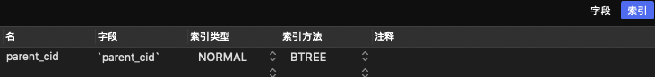
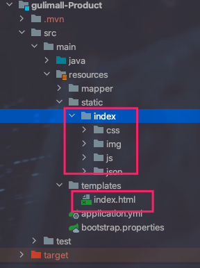
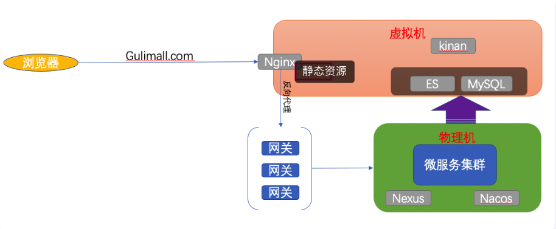
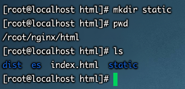
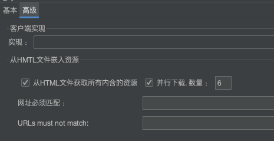
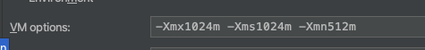

## 性能测试总结

* 中间件越多，性能损失越大，大都浪费在了中间件之间网络交互
* 设备层面：提高网络带宽、使用优质的网线网卡等设备
* 业务：DB（MySQL优化、查询字段新增索引）、模板的渲染速度（thymeleaf开启缓存等）、静态资源处理(静态资源处理势必会造成占掉tomcat的一些线程去处理)->动静分离
* jvm ：频繁的YGC 尤其是频繁的FGC 


> 核心提速的地方应该在 数据库优化、模板渲染优化、静态资源处理优化、Tomcat优化


## 性能优化

### 1、MySQL优化

1. 查询大量数据时，给查询字段添加索引

	```java
	baseMapper.selectList(new QueryWrapper<CategoryEntity>().eq("parent_cid", 0));
	```

	


### 2、模板渲染

1. Thymeleaf开启缓存

	```yaml
	spring:
	  thymeleaf:
	    cache: false  # 开发时关闭缓冲便于调试。上线后开启提高访问速度
	```

	


### 3、动静分离

> 以 `gulimall-Product`举例

`背景`

​	我们之前微服务整合前端的时候，静态文件是这样存放的。






`过程`

1. nginx 新建 static目录(存放静态文件)

	

2. 拷贝index目录到nginx - static下

	```bash
	mv index/* /root/nginx/html/static/
	```

3. 修改首页中静态资源路径

	

	

	

4. Nginx 路径配置

	> 浏览器所有的静态资源请求在NGINX中进行拦截处理

	```bash
	server {
	    listen       80;
	    listen  [::]:80;
	    server_name  gulimall.com;
	
	    #charset koi8-r;
	    #access_log  /var/log/nginx/host.access.log  main;
			
			# 之前在讲negix的时候，如果为root 则会将映射路径拼接到字符串后面，即拦截到/static/的路径则跳转到 /usr/share/nginx/html/static下面
	    location /static/ {
	        root /usr/share/nginx/html;
	    }
	
	    location / {
	        #proxy_pass http://192.168.124.8:9004;   
	        proxy_pass http://gulimall;
	        proxy_set_header Host $host;
	        #proxy_pass http://gulimall;
	    }
	}
	```

5. jmeter 开启 静态文件压测

	

	> 动静分离前后进行对比。这里就不测试了


### 4、JVM优化

> 对于项目而言，频繁的GC的原因就是内存不够用了。因此调大内存。可以减少GC的次数

* -Xmx1024m  : 最大内存为1024m
* -Xms1024m  : 最小内存为1024m
* -Xmn512m   ：新生代对象调整为512m，不进行频繁的YGC，也就不会导致频繁的FGC  




### 5、业务优化 （提升很大）

1. 多线程
2. 一次请求频繁查询数据库|设备  修改为   一次请求 一次读取数据库，然后从所有的数据中进行筛选。
3. 很多固定的数据可以放到内存中。比如一些映射表之类的。

