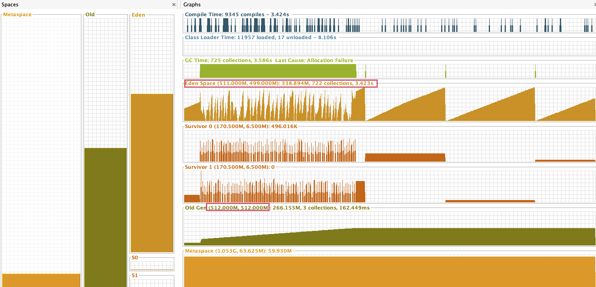

## docker安装Redis

参考 ： Mac/Respository/MD-Book/Docker/第八章-Docker安装Redis.md


## SpringBoot整合Redis

> 上面给的链接 中 文档已经包含了 springboot整合Redis，为了gulimall完整性，还是写出来吧。使用`gulimall-Product`示例

1. 导入依赖

	```xml
	<!-- Redis -->
	<dependency>
	  <groupId>org.springframework.boot</groupId>
	  <artifactId>spring-boot-starter-data-redis</artifactId>
	</dependency>
	```

2. nacos配置中心 Product分组中新增

	

	

3. 配置文件加入配置集

	```xml
	spring.cloud.nacos.config.ext-config[5].data-id=redis.yml
	spring.cloud.nacos.config.ext-config[5].group=dev
	spring.cloud.nacos.config.ext-config[5].refresh=true
	```

	

4. 测试

	```java
	@RunWith(SpringRunner.class)
	@SpringBootTest
	public class Client {
	    @Autowired
	    StringRedisTemplate stringRedisTemplate;
	
	    @Test
	    public void testRedis(){
	        ValueOperations<String, String> operations = stringRedisTemplate.opsForValue();
	        //存入
	        operations.set("hello", "world"+ UuidUtils.generateUuid());
	        //获取
	        String hello = operations.get("hello");
	        System.out.println(hello);
	
	    }
	}
	```

	

## 二级分类数据使用 缓存

```java

 @Autowired
private StringRedisTemplate stringRedisTemplate;
//从缓存中查询 Redis
@Override
public Map<String, List<Category2Vo>> getCategoryJsonFromRedis() {
  // todo 1. 从缓存中读取
  String categoryJson = stringRedisTemplate.opsForValue().get("categoryJson");
  if (StringUtils.isEmpty(categoryJson)){
    // todo 2. 从DB中读取
    Map<String, List<Category2Vo>> categoryJsonFromDb = getCategoryJsonFromDb();
    // todo 3. 存入缓存中  key value 建议都为json 跨语言跨品台
    String s = JSON.toJSONString(categoryJsonFromDb);
    stringRedisTemplate.opsForValue().set("categoryJson", s);
    return categoryJsonFromDb;
  }
  Map<String, List<Category2Vo>> restult = JSON.parseObject(categoryJson, new TypeReference<Map<String, List<Category2Vo>>>() {});

  return restult;
}
```

> 修改以后只要第一次回去稍微有点慢，之后的数据获取非常的快。进行压力测试


### 压力测试




> 每秒处理2600多个请求。很强悍。查看jvm分析器。GC的次数因为调大内存的缘故，GC共耗时3.5s


### Redis 堆外内存溢出（OutOfDirectMemoryError） 问题

`原因:`

​	springboot2.0以后默认使用Lettuce作为操作Redis的客户端,他使用netty进行网络通信,Lettuce的bug导致netty堆外内存溢出。我们项目刚开始的时候使用 -Xmx100m 设置为堆内存。netty如果没有指定堆外内存，默认使用-Xmx100m。

`解决方案`

1. -Dio.netty.maxDirectMemory 只去调大堆外内存。
2. 升级Lettuce客户端(根本上任然没有解决)
3. 切换Redis客户端不使用lettuce转为Jedis


`解决3`

```xml
<!-- Redis 不使用lettuce客户端转为jedis-->
<dependency>
    <groupId>org.springframework.boot</groupId>
    <artifactId>spring-boot-starter-data-redis</artifactId>
    <exclusions>
        <exclusion>
            <groupId>io.lettuce</groupId>
            <artifactId>lettuce-core</artifactId>
        </exclusion>
    </exclusions>
</dependency>
<dependency>
    <groupId>redis.clients</groupId>
    <artifactId>jedis</artifactId>
</dependency>
```


## 缓存 三大金刚

### 缓存穿透

>  指查询一个**一定不存在的数据**，由于缓存是不命中，将去查询数据库，但是 数据库也无此记录，我们没有将这次查询的null写入缓存，这将导致这个不 存在的数据每次请求都要到存储层去查询，失去了缓存的意义，相当于没做缓存

```java
public Map<String, List<Category2Vo>> getCategoryJson() {
    // todo 1. 从缓存中读取
    String categoryJson = stringRedisTemplate.opsForValue().get("categoryJson");
    if (StringUtils.isEmpty(categoryJson)){
        // todo 2. 从DB中读取
        Map<String, List<Category2Vo>> categoryJsonFromDb = getCategoryJsonFromDb();
        // todo 3. 存入缓存中  key value 建议都为json 跨语言跨品台
        String s = JSON.toJSONString(categoryJsonFromDb);
        if (!StringUtils.isEmpty(s)){
            stringRedisTemplate.opsForValue().set("categoryJson", s);
        }
        return categoryJsonFromDb;
    }
    Map<String, List<Category2Vo>> restult = JSON.parseObject(categoryJson, new TypeReference<Map<String, List<Category2Vo>>>() {});

    return restult;
}
```

> 触发条件 
>
> * 数据库一定查询不到此数据
> * 为空的值不做缓存处理


`解决`

> 根本原因在于查询为空的数据不做缓存。因此 做null处理并设置短暂存活时间即可

```java
// todo 3. 存入缓存中  key value 建议都为json 跨语言跨品台
String s = JSON.toJSONString(categoryJsonFromDb);
if (!StringUtils.isEmpty(s)){
   stringRedisTemplate.opsForValue().set("categoryJson", s);
}else {
   stringRedisTemplate.opsForValue().set("categoryJson", s,10, TimeUnit.SECONDS);
}
```


### 缓存雪崩

> 缓存雪崩是指在我们设置缓存时大量的key采用了相同的过期时间， 导致缓存在某一时刻同时失效，这个时候大量的请求全部转发到DB，DB瞬时 压力过重雪崩

`解决`

> 根本原因在于，设置了大量的相同过期时间的key，导致大量读取该key的请求读取了db。可以再原有的失效时间基础上增加一个随机值，比如1-5**分钟随机**，这 样每一个缓存的过期时间的重复率就会降低，就很难引发集体 失效的事件。

```java
stringRedisTemplate.opsForValue().set("categoryJson", s,10+ new Random().nextInt(5), TimeUnit.SECONDS);
```


### 缓存击穿

> 一个超级热点的key 刚好在大量请求来临时失效。导致查询数据库。这个是一个非常热点的key对应大量请求。而缓存雪崩是 大量相同的key造成了大量的请求落到了db


`解决`

> 对查库操作进行  **加锁处理** 即一百万的查库操作。先让一个线程去查库，如果查到了则存入缓存然后返回。之后所有的请求全部直接返回缓存中读取的数据，不进行查库


## 本地锁

```java
//从数据库中查询
public Map<String, List<Category2Vo>> getCategoryJsonFromDb() {
  synchronized (this){
    //todo 首先查看缓存中是否有，有则返回没有则查库
    String categoryJson = stringRedisTemplate.opsForValue().get("categoryJson");
    if (!StringUtils.isEmpty(categoryJson)){
      //todo 缓存中有值则直接返回
      Map<String, List<Category2Vo>> restult = JSON.parseObject(categoryJson, new TypeReference<Map<String, List<Category2Vo>>>() {});
      return restult;
    }
    List<CategoryEntity> allCategory = this.baseMapper.selectList(null);
    System.out.println("查询了数据库 。。。。");
    return findCategoryJson(allCategory, 0L);
  }
}
```

> `本地锁和本地缓存`类似，因为在IOC容器中默认对象都是单例的，即synchronized 和 lock只能对当前jvm中的线程有效。但是在集群情况下，有多少个  服务  则会有多少个服务的线程同时访问数据库，虽不致命，但不合理。


> 黑框表示锁，我们应该在数据彻底生效后再放开锁，如果将结果放入缓存放在锁后面，因为放入缓存也需要时间。这样就会产生时间差，导致部分线程查缓存时并没与查到。然后再来从db中获取数据。


### idea 拷贝服务配置实现服务集群---测试分布式下锁情况


## 分布式锁

> 本地锁由于锁不住分布式服务。因此需要分布式锁，分布式锁和分布式缓存类似。使用公共的东西即可。Redis刚好提供了分布式锁这一机制，命令 ：`set key value NX`  该命令只允许操作key不存在的情况，如果key存在则设置失败。下面四个会话中只有一个会返回true


### 分布式锁演进  --  阶段一 【死锁】


```java
    //从缓存中查询 Redis
    @Override
    public Map<String, List<Category2Vo>> getCategoryJson() {
        // todo 1. 从缓存中读取
        String categoryJson = stringRedisTemplate.opsForValue().get("categoryJson");
        if (StringUtils.isEmpty(categoryJson)){
            // todo 2. 从DB中读取
            Map<String, List<Category2Vo>> categoryJsonFromDb = getCategoryJsonFromDbWithRedis();
            // todo 3. 存入缓存中  key value 建议都为json 跨语言跨品台
            String s = JSON.toJSONString(categoryJsonFromDb);
            if (!StringUtils.isEmpty(s)){
                stringRedisTemplate.opsForValue().set("categoryJson", s);
            }else {
                stringRedisTemplate.opsForValue().set("categoryJson", s,10+ new Random().nextInt(5), TimeUnit.SECONDS);
            }
            return categoryJsonFromDb;
        }
        Map<String, List<Category2Vo>> restult = JSON.parseObject(categoryJson, new TypeReference<Map<String, List<Category2Vo>>>() {});

        return restult;
    } 
//从数据库中查询并上锁，放置缓存击穿
    public Map<String, List<Category2Vo>> getCategoryJsonFromDbWithRedis() throws InterruptedException {
        // todo 分布式锁，去redis占坑
        Boolean lock = redisTemplate.opsForValue().setIfAbsent("lock", "111");
        if (lock){
            // todo 占锁成功，执行操作
            //todo 首先查看缓存中是否有，有则返回没有则查库
            String categoryJson = stringRedisTemplate.opsForValue().get("categoryJson");
            if (!StringUtils.isEmpty(categoryJson)){
                //todo 缓存中有值则直接返回
                Map<String, List<Category2Vo>> restult = JSON.parseObject(categoryJson, new TypeReference<Map<String, List<Category2Vo>>>() {});
                return restult;
            }
            List<CategoryEntity> allCategory = this.baseMapper.selectList(null);
            // 从DB中获取
            Map<String, List<Category2Vo>> json = findCategoryJson(allCategory, 0L);
            //todo 删除锁 否则之后的线程无法获取到数据
            redisTemplate.delete("lock");
            return json;
        }else{
            // todo 没有抢占到锁，继续查询知道抢到锁 判断是查库还是查redis  自旋
            Thread.sleep(500);
            return getCategoryJsonFromDbWithRedis();
        }
    }
```

> <font color=ff0aa>问题 ： </font> 如果一个线程设置锁 lock 后，服务器突然断电 还没有进行到 删除锁操作，此时服务器再次重启，项目再次访问则已经在redis中设置了锁，所有的线程都无法访问，即`死锁`


### 分布式锁演进  --  阶段二  【业务代码超时并大于锁失效时间】

> 死锁出现的根本原因就是 设置了锁 由于外界原因或者程序原因造成添加的锁没有得到即使释放。


`解决方法`

* 设置锁的时候 添加 失效时间

	```java
	// todo 占锁成功，执行操作
	// 添加失效时间
	redisTemplate.expire("lock", 30, TimeUnit.SECONDS);
	//todo 首先查看缓存中是否有，有则返回没有则查库
	```

	

* 可以使用原子操作。要么加锁解锁。要么就不加。

	```java
	// todo 分布式锁，去redis占坑
	// Boolean lock = redisTemplate.opsForValue().setIfAbsent("lock", "111");
	// todo 原子操作  上锁和添加失效时间  ： 只要上锁了，它一定会释放。
	Boolean lock = redisTemplate.opsForValue().setIfAbsent("lock", "111",30,TimeUnit.SECONDS);
	```

	

`致命问题`

>  如果我们的查库操作后才进行删除锁操作 而如果查库操作大于30s 即锁失效时间，这个时候自己的锁已经过期了，其他的线程抢到了锁，但是这个线程却删除了他人的锁。就会引发其他的线程突然访问DB，如下代码

```java
//从数据库中查询并上锁，放置缓存击穿
    public Map<String, List<Category2Vo>> getCategoryJsonFromDbWithRedis() throws InterruptedException {
        // todo 分布式锁，去redis占坑
//        Boolean lock = redisTemplate.opsForValue().setIfAbsent("lock", "111");
        // todo 原子操作  上锁和添加失效时间  ： 只要上锁了，它一定会释放。
        Boolean lock = redisTemplate.opsForValue().setIfAbsent("lock", "111",30,TimeUnit.SECONDS);
        if (lock){
            // todo 占锁成功，执行操作
            // 添加失效时间
//            redisTemplate.expire("lock", 30, TimeUnit.SECONDS);
            //todo 首先查看缓存中是否有，有则返回没有则查库
            String categoryJson = stringRedisTemplate.opsForValue().get("categoryJson");
            if (!StringUtils.isEmpty(categoryJson)){
                //todo 缓存中有值则直接返回
                Map<String, List<Category2Vo>> restult = JSON.parseObject(categoryJson, new TypeReference<Map<String, List<Category2Vo>>>() {});
                return restult;
            }
            List<CategoryEntity> allCategory = this.baseMapper.selectList(null);
            // 从DB中获取
            Map<String, List<Category2Vo>> json = findCategoryJson(allCategory, 0L);
            //todo 删除锁 否则之后的线程无法获取到数据
            redisTemplate.delete("lock");
            return json;
        }else{
            // todo 没有抢占到锁，继续查询知道抢到锁 判断是查库还是查redis  自旋
            Thread.sleep(500);
            return getCategoryJsonFromDbWithRedis();
        }
    }
```


### 分布式锁演进  --  阶段三  【解锁非原子性】

> 我们在删除锁的时候，从下发命令给Redis 然后Redis 删除key 的途中 这个线程的锁过期了，那么其他的线程就会抢到锁，但是这个线程删除的锁 是 其他线程的。


`解决办法：`

每个线程上锁的值修改为UUID，删除锁的时候判断是否为自己线程的UUID值。


```java
//从数据库中查询并上锁，放置缓存击穿
    public Map<String, List<Category2Vo>> getCategoryJsonFromDbWithRedis() throws InterruptedException {
        // todo 生成UUID
        String uuid = UuidUtils.generateUuid();
        // todo 分布式锁，去redis占坑
//        Boolean lock = redisTemplate.opsForValue().setIfAbsent("lock", "111");
        // todo 原子操作  上锁和添加失效时间和UUID  ： 只要上锁了，它一定会释放。
        Boolean lock = redisTemplate.opsForValue().setIfAbsent("lock", uuid,30,TimeUnit.SECONDS);
        if (lock){
            // todo 占锁成功，执行操作
            // 添加失效时间
//            redisTemplate.expire("lock", 30, TimeUnit.SECONDS);
            //todo 首先查看缓存中是否有，有则返回没有则查库
            String categoryJson = stringRedisTemplate.opsForValue().get("categoryJson");
            if (!StringUtils.isEmpty(categoryJson)){
                //todo 缓存中有值则直接返回
                Map<String, List<Category2Vo>> restult = JSON.parseObject(categoryJson, new TypeReference<Map<String, List<Category2Vo>>>() {});
                return restult;
            }
            List<CategoryEntity> allCategory = this.baseMapper.selectList(null);
            // 从DB中获取
            Map<String, List<Category2Vo>> json = findCategoryJson(allCategory, 0L);
            // 判断是否是自己的uuid
            String lock1 = stringRedisTemplate.opsForValue().get("lock");
            if (lock1.equals(uuid)){
                //todo 删除锁 否则之后的线程无法获取到数据
                redisTemplate.delete("lock");
            }
            return json;
        }else{
            // todo 没有抢占到锁，继续查询知道抢到锁 判断是查库还是查redis  自旋
            Thread.sleep(500);
            return getCategoryJsonFromDbWithRedis();
        }
    }

```


`问题`

删除锁的时候，其实分为两步 ①查询lock的值  ②比较后删除，  如果第一步查询出是自己的uuid，然后去删除。但是在删除的网络途中 锁 又失效了成了别人的了，还是删除了别人的。


`解决`

删除锁的时候原子性


### 分布式锁演进  --  阶段四  【完美形态，解锁上锁都是原子操作】

> 需要使用到 Redis+lua脚本

```java
//            // todo 判断是否是自己的uuid
//            String lock1 = stringRedisTemplate.opsForValue().get("lock");
//            if (lock1.equals(uuid)){
//                //todo 删除锁 否则之后的线程无法获取到数据
//                redisTemplate.delete("lock");
//            }
            // todo lua+redis 原子操作  删除锁
            RedisScript redisScript =
                    RedisScript.of("local tmp = redis.call('get', KEYS[1])\n" +
                                    "if tmp == false then\n" +
                                    "   redis.call('set',KEYS[1],KEYS[2])\n" +
                                    "   return 1\n" +
                                    "end\n" +
                                    "return 0\n",
                            Long.class);
            List<String> list = new ArrayList<>();
            list.add("lock");
            Long execute = (Long) redisTemplate.execute(redisScript, list, uuid);
            
```

整个代码

```java
//从缓存中查询 Redis
    @Override
    public Map<String, List<Category2Vo>> getCategoryJson() throws InterruptedException {
        // todo 1. 从缓存中读取
        String categoryJson = stringRedisTemplate.opsForValue().get("categoryJson");
        if (StringUtils.isEmpty(categoryJson)){
            // todo 2. 从DB中读取
            Map<String, List<Category2Vo>> categoryJsonFromDb = getCategoryJsonFromDbWithRedis();
            // todo 3. 存入缓存中  key value 建议都为json 跨语言跨品台
            String s = JSON.toJSONString(categoryJsonFromDb);
            if (!StringUtils.isEmpty(s)){
                stringRedisTemplate.opsForValue().set("categoryJson", s);
            }else {
                stringRedisTemplate.opsForValue().set("categoryJson", s,10+ new Random().nextInt(5), TimeUnit.SECONDS);
            }
            return categoryJsonFromDb;
        }
        Map<String, List<Category2Vo>> restult = JSON.parseObject(categoryJson, new TypeReference<Map<String, List<Category2Vo>>>() {});

        return restult;
    }

    //从数据库中查询并上锁，放置缓存击穿
    public Map<String, List<Category2Vo>> getCategoryJsonFromDbWithRedis() throws InterruptedException {
        // todo 生成UUID
        String uuid = UuidUtils.generateUuid();
        // todo 分布式锁，去redis占坑
//        Boolean lock = redisTemplate.opsForValue().setIfAbsent("lock", "111");
        // todo 原子操作  上锁和添加失效时间和UUID  ： 只要上锁了，它一定会释放。
        Boolean lock = redisTemplate.opsForValue().setIfAbsent("lock", uuid,30,TimeUnit.SECONDS);
        if (lock){
            // todo 占锁成功，执行操作
            // 添加失效时间
//            redisTemplate.expire("lock", 30, TimeUnit.SECONDS);
            //todo 首先查看缓存中是否有，有则返回没有则查库
            String categoryJson = stringRedisTemplate.opsForValue().get("categoryJson");
            if (!StringUtils.isEmpty(categoryJson)){
                //todo 缓存中有值则直接返回
                Map<String, List<Category2Vo>> restult = JSON.parseObject(categoryJson, new TypeReference<Map<String, List<Category2Vo>>>() {});
                return restult;
            }
            Map<String, List<Category2Vo>> json ;
            try {
                List<CategoryEntity> allCategory = this.baseMapper.selectList(null);
                // 从DB中获取
                json = findCategoryJson(allCategory, 0L);
//            // todo 判断是否是自己的uuid
//            String lock1 = stringRedisTemplate.opsForValue().get("lock");
//            if (lock1.equals(uuid)){
//                //todo 删除锁 否则之后的线程无法获取到数据
//                redisTemplate.delete("lock");
//            }
            }finally {
                // todo lua+redis 原子操作  删除锁
                RedisScript redisScript =
                        RedisScript.of("local tmp = redis.call('get', KEYS[1])\n" +
                                        "if tmp == false then\n" +
                                        "   redis.call('set',KEYS[1],KEYS[2])\n" +
                                        "   return 1\n" +
                                        "end\n" +
                                        "return 0\n",
                                Long.class);
                List<String> list = new ArrayList<>();
                list.add("lock");
                Long execute = (Long) redisTemplate.execute(redisScript, list, uuid);
            }
            return json;
        }else{
            // todo 没有抢占到锁，继续查询知道抢到锁 判断是查库还是查redis  自旋
            Thread.sleep(500);
            return getCategoryJsonFromDbWithRedis();
        }
    }
```

