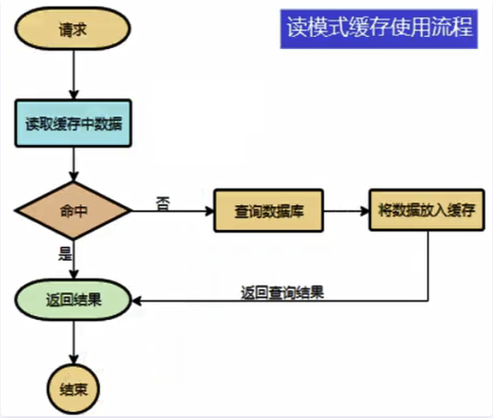
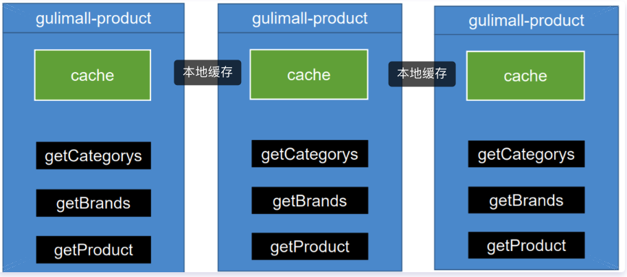
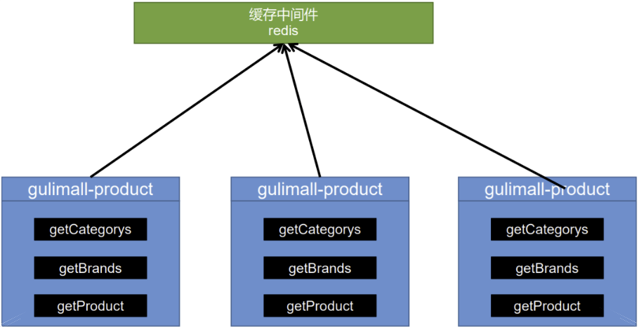

`引言:`
上一章我们讲到性能优化的五个点。还有一个提升性能的点 缓存  是提升性能的大杀器。

## 为什么使用缓存

为了提高系统性能，将部分数据放入缓存中，加速访问。而db承担数据持久化的工作，当然这里的数据是有要求的，并不是所有的数据都适合做缓存

当然这里的缓存一般都使用内存做媒介，在Java中可以使用全局map、静态类等，当然也可以是Redis等。

## 哪些数据适合存入缓存

- 及时性、数据一致性要求不高的。比如订单成交、购买火车票结果通知、商品上架等等。一致性下面会讲到触发条件

- 访问量大且更新频率不高的数据(读多、写少)

## 缓存使用流程

## 缓存类型

### 本地缓存

* 自己实现的 全局 Map
* 框架
	* ehcache
	* GuavaCache
	* Caffeine等

`特点:`

​	本地缓存无论利用那种实现方式都存在一个致命的问题。**都是进程内，即在集群情况下就会吃瘪，类似于数据库集群，会出现数据一致性问题**

`数据一致性`

> 比如是服务集群：
>
> * 如果有一个请求过来 ，服务A缓存中没有数据则查库然后存入缓存。下一个请求到了服务B 则还得重新读取一遍。虽有瑕疵，问题不大
> * 如果有一个请求过来，服务A修改了缓存中的数据那么其他服务集群中并没有得到同步，则会发生数据一致性问题
>
> 因此集群中千万不要使用本地缓存

### 缓存中间件

* Redis
* MemCached

`特点:`

​	因为作为一个单独的技术支持，并不依赖于项目中的jvm，可以作为服务集群通用服务支持，并不会存在数据一致性问题

> 缓存中key  --  value    建议都使用 json字符串。因为json字符串跨语言跨品台

