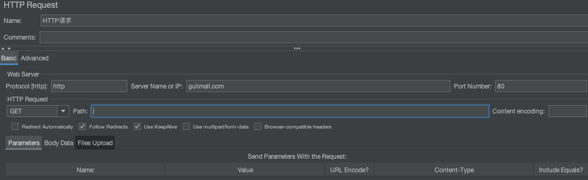
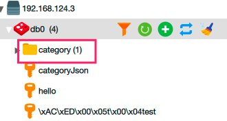
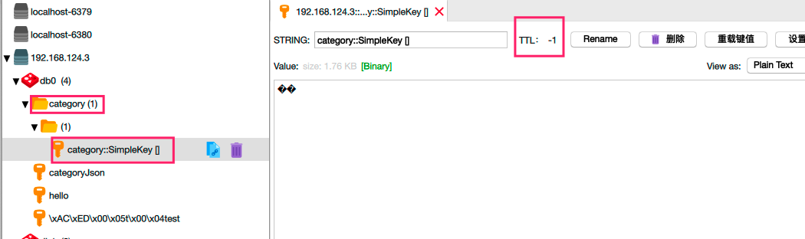
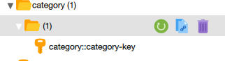
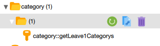
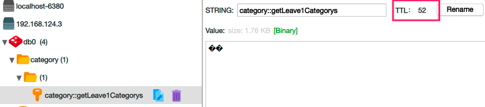
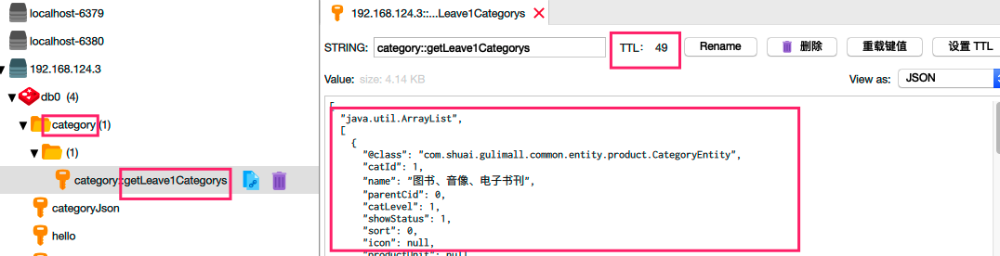
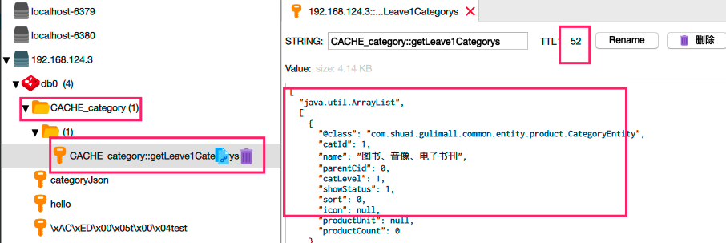

`引言:`

 1.  我们优化我们的项目。使用了①开启thymeleaf缓存、②jvm调大堆内存空间，减少GC次数、③优化代码减少和DB交互次数、④动静分离、⑤使用缓存。其中**最有性价比的就是⑤**

 2.  在引入 **缓存**时我们碰到了选择【本地缓存、分布式缓存】，必须是分布式缓存。于是我们引入了Redis，好家伙，麻烦来了。三大金刚 ==缓存穿透==、==缓存雪崩==、==缓存击穿==。

	* 缓存穿透   因为大量查询不存在于缓存的key，导致全部去查DB，因此只需要将空值存入缓存中并设置过期时间。
	* 缓存雪崩   因为大量的key同时间过期，导致大量请求访问DB，因此 给每个key设置不同的过期时间，即基准时间+随机数
	* 缓存击穿   因为热点key 肯定会过期，导致在过期刹那百万访问都查询了DB。因此 查库前设置并发锁，当所有的招用尽的时候，百万并发只能有一个请求进行访问数据库，并存入缓存。

	3. 为了兜底数据库，我们查库前引入了锁，我们又碰到了选择【本地锁、分布式锁】,那必须是分布式锁，本地锁我们还要在加锁解锁需要原子操作（应对防止死锁、业务时间过长解除其他线程锁），但是我们使用Redis来实现锁机制，又要使用lua脚本去配合。因此我们引入了Redis官方推荐的锁框架  --  redisson

	4. Redisson 是真好用啊，几行代码就解决了我们之前复杂的操作。最重要的是，还提供了很多的锁，方便我们应付不同的业务场景。还有一个特有意思的点，Redisson解决死锁 ： key加入了过期时间。

	解决业务超时以及解除其他线程锁 ： 看门狗 -- 自动续期。

	5. Spring 又为我们提供了Spring-cache  方便我们整合各种缓存。类似于日志门面|jdbc 等等。并且他提供了基于注解的缓存。~~~


## Spring-Cache 整合

`注解：`

| 注解           | 说明                                                         | 级别 |
| -------------- | ------------------------------------------------------------ | ---- |
| @Cacheable     | 主要针对方法配置，能够根据方法的请求参数对其结果进行缓存     | 方法 |
| @CacheEvict    | 清空缓存（失效模式）                                         | 方法 |
| @CachePut      | 保证方法被调用，又希望结果被缓存。（双写模式）               | 方法 |
| @EnableCaching | 开启基于注解的缓存                                           | 类   |
| @CacheConfig   | 共享的缓存配置                                               | 类   |
| @Caching       | 组合多个缓存注解                                             |      |
| Cache          | 缓存接口，定义缓存操作。实现有：RedisCache、EhCacheCache、 ConcurrentMapCache等 |      |
| CacheManager   | 缓存管理器，管理各种缓存（Cache）组件                        |      |
| keyGenerator   | 缓存数据时key生成策略                                        |      |
| serialize      | 缓存数据时value序列化策略                                    |      |


`流程:`

1. 引入依赖

	```xml
	 <!-- Redis 不使用lettuce客户端转为jedis-->
	<dependency>
	  <groupId>org.springframework.boot</groupId>
	  <artifactId>spring-boot-starter-cache</artifactId>
	</dependency>
	<dependency>
	  <groupId>org.springframework.boot</groupId>
	  <artifactId>spring-boot-starter-data-redis</artifactId>
	  <exclusions>
	    <exclusion>
	      <groupId>io.lettuce</groupId>
	      <artifactId>lettuce-core</artifactId>
	    </exclusion>
	  </exclusions>
	</dependency>
	<dependency>
	  <groupId>redis.clients</groupId>
	  <artifactId>jedis</artifactId>
	</dependency>
	<!-- 分布式锁框架 -->
	<dependency>
	  <groupId>org.redisson</groupId>
	  <artifactId>redisson</artifactId>
	  <version>3.12.0</version>
	</dependency>
	```

2. 加入配置

	```yaml
	spring:
	  cache:
	    type: redis
	```

	

3. 开启缓存功能

	```java
	@EnableCaching
	```

4. 方法开启 缓存 @Cacheable

	```java
	 @Override
	@Cacheable(value = {"category"})//todo 每一个缓存的数据我们都需要指定要放到哪个名字下的缓存，【缓存分区，按照业务类型分区】
	//todo 代表当前方法需要缓存，并将该方法的结果放入到缓存中，如果方法中没有则需要调用方法，如果方法中有则方法都不用调用，直接从缓存中获取
	public List<CategoryEntity> getLeave1Categorys() {
	  List<CategoryEntity> categoryEntities = baseMapper.selectList(new QueryWrapper<CategoryEntity>().eq("parent_cid", 0));
	  return categoryEntities;
	}
	```

5. 测试

	

	

	> 为毛，读了两次啊，确实我用网页测试的时候就读取了一次DB，其余都走了缓存，但是在高并发下，有点问题呐

	


## Spring-Cache key的默认生成规则

> https://docs.spring.io/spring-framework/docs/5.2.14.BUILD-SNAPSHOT/spring-framework-reference/integration.html#cache



* 如果缓存击中，方法不用调用
* key默认自动生成，缓存名字：：SimpleKey [] 自动生成的key值
* 缓存的value的值，默认使用jdk序列化机制，序列化后存入到value
* 默认过期时间  不过期。


`自定义内容`

* 自定义生成的缓存key
* 自定义key存活时间
* value数据为json格式


`自定义解决` 使用 注解属性进行配置

| @Cacheable/@CachePut/@CacheEvict 主要的参数 |                                                              |                                                              |
| ------------------------------------------- | ------------------------------------------------------------ | ------------------------------------------------------------ |
| value                                       | 缓存的名称，在 spring 配置文件中定义，必须指定 至少一个      | 例如： @Cacheable(value=”mycache”) 或者@Cacheable(value={”cache1”,”cache2”} |
| key                                         | 缓存的 key，可以为空，如果指定要按照 SpEL 表达 式编写，如果不指定，则缺省按照方法的所有参数 进行组合 | 例如： @Cacheable(value=”testcache”,key=”#userName”)         |
| condition                                   | 缓存的条件，可以为空，使用 SpEL 编写，返回 true 或者 false，只有为 true 才进行缓存/清除缓存，在 调用方法之前之后都能判断 | 例如： @Cacheable(value=”testcache”,condition=”#userNam e.length()>2”) |
| allEntries (@CacheEvict )                   | 是否清空所有缓存内容，缺省为 false，如果指定为 true，则方法调用后将立即清空所有缓存 | 例如： @CachEvict(value=”testcache”,allEntries=true)         |
| beforeInvocation (@CacheEvict)              | 是否在方法执行前就清空，缺省为 false，如果指定 为 true，则在方法还没有执行的时候就清空缓存， 缺省情况下，如果方法执行抛出异常，则不会清空 缓存 | 例如： @CachEvict(value=”testcache”， beforeInvocation=true) |
| unless (@CachePut) (@Cacheable)             | 用于否决缓存的，不像condition，该表达式只在方 法执行之后判断，此时可以拿到返回值result进行判 断。条件为true不会缓存，fasle才缓存 | 例如： @Cacheable(value=”testcache”,unless=”#result == null”) |

* 自定义key

	```java
	@Cacheable(value = {"category"},key = "'category-key'")//指定key为字符串
	```

	

	```java
	@Override
	@Cacheable(value = {"category"},key = "#root.methodName") // 指定方法名，更多用法参考 https://docs.spring.io/spring-framework/docs/5.2.14.BUILD-SNAPSHOT/spring-framework-reference/integration.html#cache-spel-context
	//@Cacheable(value = {"category"},key = "'category-key'")//todo 每一个缓存的数据我们都需要指定要放到哪个名字下的缓存，【缓存分区，按照业务类型分区】
	public List<CategoryEntity> getLeave1Categorys() {
	  log.error("访问了getLeave1Categorys 方法，从数据库中获取 ~~ ");
	  List<CategoryEntity> categoryEntities = baseMapper.selectList(new QueryWrapper<CategoryEntity>().eq("parent_cid", 0));
	  return categoryEntities;
	}
	```

	

	

* 自定义存活时间

	```xml
	spring:
	  cache:
	    redis:
	      time-to-live: 60000   # 单位为ms
	```

	

	


* 使用json序列化值

	```java
	/**
	 * TODO:<p> 使用json序列化值 <p/>
	 *
	 * @package: com.shuai.gulimall.product.config
	 * @Author mac
	 * @Date 2021/3/18 10:23 下午
	 * @Version V1.0
	 **/
	//一定要添加此默认配置文件，否则 DDL不生效
	@EnableConfigurationProperties(CacheProperties.class)
	@Configuration
	@EnableCaching
	public class MyCacheConfig {
	    @Bean
	    RedisCacheConfiguration redisCacheConfiguration(CacheProperties cacheProperties){
	        RedisCacheConfiguration config = RedisCacheConfiguration.defaultCacheConfig();
	
	        config = config.serializeKeysWith(RedisSerializationContext.SerializationPair.fromSerializer(new StringRedisSerializer()));
	        config = config.serializeValuesWith(RedisSerializationContext.SerializationPair.fromSerializer(new GenericJackson2JsonRedisSerializer()));
	
	        // 将配置文件中的所有配置重新配置，使其生效
	        CacheProperties.Redis redisProperties = cacheProperties.getRedis();
	        if (redisProperties.getTimeToLive() != null) {
	            config = config.entryTtl(redisProperties.getTimeToLive());
	        }
	
	        if (redisProperties.getKeyPrefix() != null) {
	            config = config.prefixCacheNameWith(redisProperties.getKeyPrefix());
	        }
	
	        if (!redisProperties.isCacheNullValues()) {
	            config = config.disableCachingNullValues();
	        }
	
	        if (!redisProperties.isUseKeyPrefix()) {
	            config = config.disableKeyPrefix();
	        }
	
	        return config;
	
	    }
	}
	```

	


### 其他的一些自定义配置

```yaml
spring:
  cache:
    redis:
      key-prefix: CACHE_  #表示此为缓存数据，用以区分其他数据
      use-key-prefix: true  #是否开启前缀
      cache-null-values: true  # 是否允许空值 ，即方法返回空值也会被缓存，用以解决缓存穿透问题
      
```




## Spring Cache 失效模式

即 删除缓存，使用 `解决数据一致性手段之 失效模式` 一般也不用双写模式，太麻烦了,即我们在更新缓存对应数据库数据时候，直接删除缓存即可。


```java
@GetMapping("/deleteCache")
@CacheEvict(value = "category",key = "'getLeave1Categorys'")
public void deleCache(){
  System.out.println("删除缓存 ~~~");
}
```


## Spring-Cache 不足

* 读模式[读DB]

	* 缓存穿透 

		```yaml
		spring:
		  cache:
		    redis:
		      cache-null-values: true  # 是否允许空值 ，即方法返回空值也会被缓存，用以解决缓存穿透问题
		```

	* 缓存击穿

		```yaml
		# 默认 无加锁.
		# 只有 @Cacheable 注解提供了sync 属性,即加锁[本地锁], 本地锁其实足够了,本地锁的话,你顶多有几十个服务集群,因此也就查几十次DB而已，完全没有问题。其他注解例如解锁等就没有此属性了。
		```

	* 缓存雪崩

		```yaml
		spring:
		  cache:
		    redis:
		      time-to-live: 60000  #加上随机时间、或者使用分组指定时间
		```

* 写模式[写DB]

	* 读写加锁
	* 引入canal，感知MySQL的更新去更新数据库
	* 读多写多、直接去数据库查询


`总结`

* 常规数据【读多写少、及时性、一致性要求不高的数据】完全可以使用Spring Cache
* 特殊数据【即写模式情况，还要做缓存】 引入其他框架 canal、或者使用其他锁来实现。


## 没有解决的问题

* 没有自动续期 业务超时指定存活时间怎么办？
* 每个key指定不同的时间
* 高并发单服务下，发现多次读取了数据库


## spring cache 为每个key指定存活时间

没有必要，我么可以使用 @Cacheable(value = {"product5"},key = "#root.methodName") 进行分组，即 product5指定这组key都为5分钟。设置多个分组即可

1. 在配置文件中创建各个分组

	```xml
	initCaches.key1 = 10s
	initCaches.key2 = 20s
	```

2. 使用分组

	```java
	@Cacheable(value = {"key1"},key = "#root.methodName")
	```

	


## Spring Cache 自动续期

没有提供，网上冲浪去吧。


## Spring Cache 高并发单服务下多次读取DB

默认无加锁，即你一个服务，任然会有多次读取数据库存在。

猜想 可以使用 Spring Cache + Redisson 解决


## 序列化反序列化坑

`背景`

service实现类中 返回值为  **List<PcapIf> **  其为 org.jnetpcap包下实体类，该类绝了，<font color=ff00aa>只有get方法，没有set方法。也没有 implement Serialization </font>


### 序列化实现类

*   OxmSerializer

    >   以xml格式存储（**但还是String类型~**），解析起来也比较复杂，效率也比较低。因此几乎没有人再使用此方式了

*   JdkSerializationRedisSerializer

    >   RestTemplate类**默认的**序列化方式。
    >
    >   *   存储对象必须实现java.io.Serializable
    >   *   二进制看不懂
    >   *   占用大量内存空间

*   StringRedisSerializer

    >   是StringRedisTemplate默认的序列化方式，key和value都会采用此方式进行序列化，是被推荐使用的，对开发者友好，轻量级，效率也比较高。

*   GenericToStringSerializer

    >   需要调用者给传一个对象到字符串互转的Converter（相当于转换为字符串的操作交给转换器去做），个人觉得使用起来其比较麻烦，还不如直接用字符串呢。所以不太推荐使用

*   Jackson2JsonRedisSerializer

    >   把一个对象以Json的形式存储，效率高且对调用者友好
    >
    >   *   需要传入存储类型参数，不能全局使用，使用一次则设置一次。
    >   *   不需要在存储数据中心额外添加类型信息(包名)即可反序列化成功
    >   *   序列化 泛型的List数据 List<UserToken> 反序列化报错  java.util.LinkedHashMap cannot be cast to com.com.baisq.model.UserToken。解决办法为：序列化存储时，转成JSON字符串  JSON.toJSONString(userToken)

*   GenericJackson2JsonRedisSerializer

    >   基本和上面的Jackson2JsonRedisSerializer功能差不多，使用方式也差不多。
    >
    >   *   序列化后数据额外添加了类型信息(包名)
    >   *   序列化 泛型的List数据 List<UserToken> 反序列化正常，因为它指定了包名。
    >   *   序列化类必须包含 set 和 get。否则报错Unrecognized field “xxx”   网上推荐GenericFastJsonRedisSerializer ，但是我这仍然不行。


`总结`

*   弄没辙了，最后修改了 service实现类的返回值。

*   key 使用 StringRedisSerializer  value 使用 GenericJackson2JsonRedisSerializer


`配置如下`

```java
@Configuration
public class RedisConfig {
    @Autowired
    private RedisConnectionFactory factory;

    @Bean
    public RedisTemplate<String, Object> redisTemplate() {
        RedisTemplate<String, Object> redisTemplate = new RedisTemplate<>();
        redisTemplate.setKeySerializer(new StringRedisSerializer());
        redisTemplate.setHashKeySerializer(new StringRedisSerializer());
        redisTemplate.setHashValueSerializer(new GenericJackson2JsonRedisSerializer());
        redisTemplate.setValueSerializer(new GenericJackson2JsonRedisSerializer());
        redisTemplate.setConnectionFactory(factory);
        
        return redisTemplate;
    }
}   
```


```java
/**
 * @program: renren-fast
 * @description: Spring-Cache 序列化存储配置--不使用jdk序列化
 * @author: NO.Shuai
 * @create: 2021-04-01 17:52
 */
@Configuration
@EnableCaching
@EnableConfigurationProperties(CacheProperties.class)
public class CacheConfig {
    @Bean
    RedisCacheConfiguration redisCacheConfiguration(CacheProperties cacheProperties) {
        RedisCacheConfiguration config = RedisCacheConfiguration.defaultCacheConfig();

        config = config.serializeKeysWith(RedisSerializationContext.SerializationPair.fromSerializer(new StringRedisSerializer()));
        config = config.serializeValuesWith(RedisSerializationContext.SerializationPair.fromSerializer(new GenericJackson2JsonRedisSerializer()));

//        Jackson2JsonRedisSerializer<Object> jackson2JsonRedisSerializer = new Jackson2JsonRedisSerializer<>(Object.class);
//        ObjectMapper om = new ObjectMapper();
//        om.activateDefaultTyping(om.getPolymorphicTypeValidator(), ObjectMapper.DefaultTyping.NON_FINAL);
//        jackson2JsonRedisSerializer.setObjectMapper(om);

//        config = config.serializeValuesWith(RedisSerializationContext.SerializationPair.fromSerializer(jackson2JsonRedisSerializer));
        // 将配置文件中的所有配置重新配置，使其生效
        CacheProperties.Redis redisProperties = cacheProperties.getRedis();
        if (redisProperties.getTimeToLive() != null) {
            config = config.entryTtl(redisProperties.getTimeToLive());
        }

        if (redisProperties.getKeyPrefix() != null) {
            config = config.prefixKeysWith(redisProperties.getKeyPrefix());
        }

        if (!redisProperties.isCacheNullValues()) {
            config = config.disableCachingNullValues();
        }

        if (!redisProperties.isUseKeyPrefix()) {
            config = config.disableKeyPrefix();
        }

        return config;
    }
}    
```

